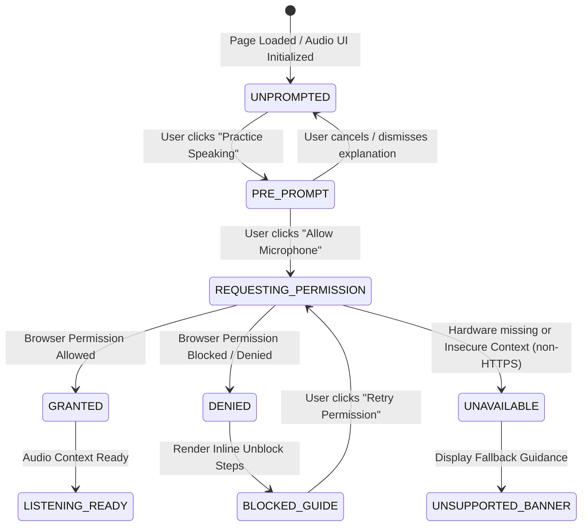
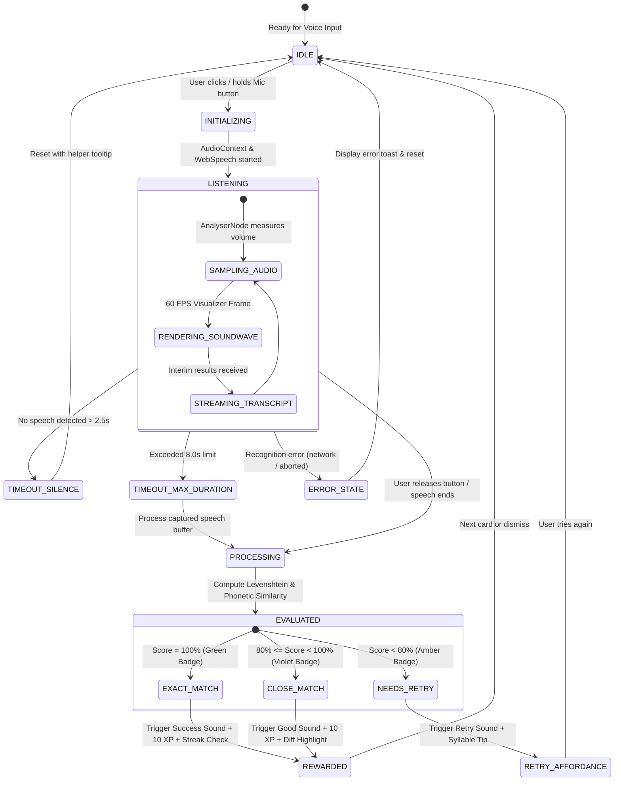
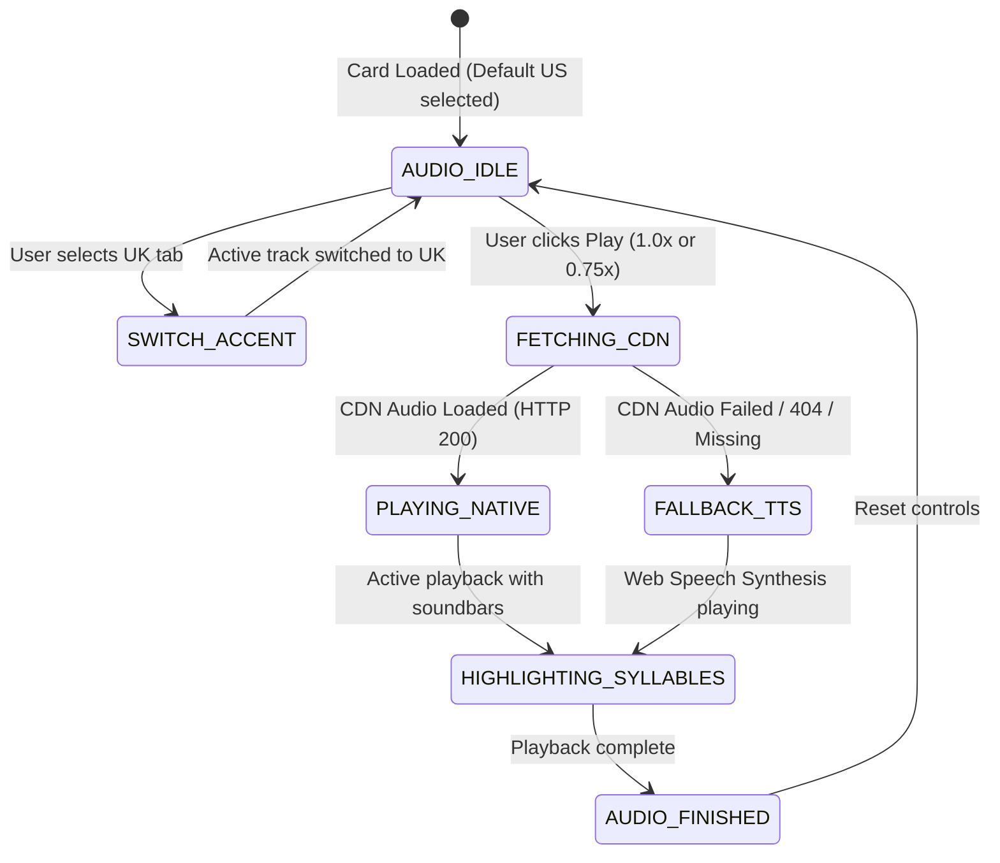
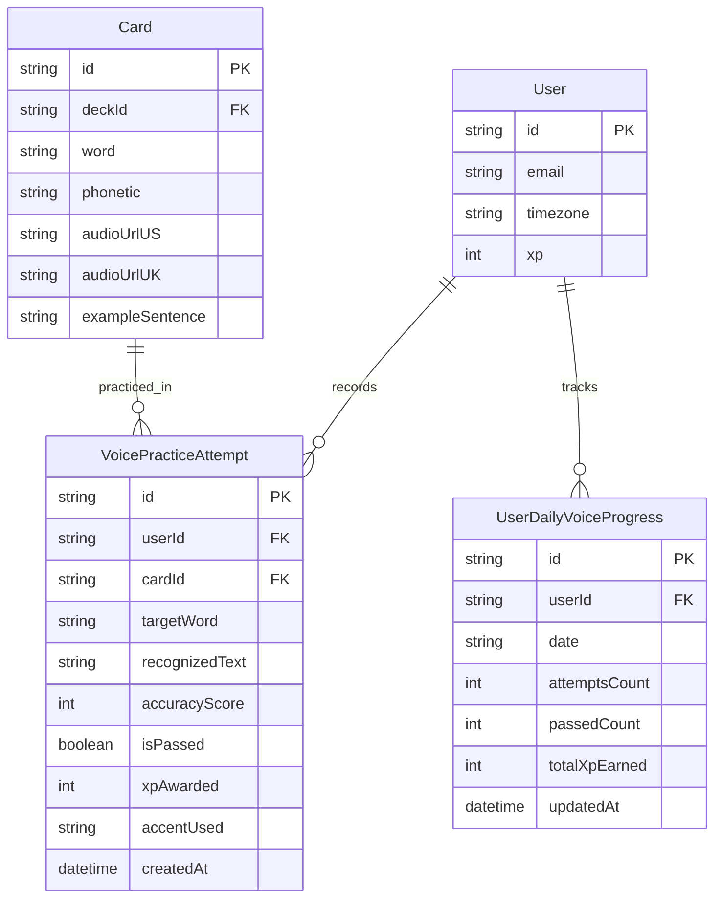

# Domain Model: Speech Recognition & Pronunciation Assessment (EPIC-08)

- **Feature**: Speech Recognition & Pronunciation Assessment (`speech-pronunciation-assessment`)
- **Date**: 2026-08-21
- **Status**: COMPLETE

---

## 1. RBAC Matrix

| Role                        | Play Audio (US/UK) | Toggle Slow Speed (0.75x) | Practice Mic Pronunciation           | Earn Voice XP (+10 XP) | Advance Daily Streak   | View Aggregated Voice Stats |
| --------------------------- | ------------------ | ------------------------- | ------------------------------------ | ---------------------- | ---------------------- | --------------------------- |
| **Guest / Unauthenticated** | Yes (Public cards) | Yes                       | Yes (Up to 3 trial attempts/session) | No (Requires login)    | No (Requires login)    | No                          |
| **Authenticated Learner**   | Yes (All cards)    | Yes                       | Yes (Unlimited attempts)             | Yes (Max 500 XP/day)   | Yes ($\ge 1$ pass/day) | Yes (Personal stats)        |
| **System Admin**            | Yes                | Yes                       | Yes                                  | Yes                    | Yes                    | Yes (System-wide telemetry) |

---

## 2. State Machines & Entity Lifecycles

### 2.1 Microphone Permission Lifecycle



### 2.2 Voice Practice & Pronunciation Assessment Lifecycle



### 2.3 Native Reference Audio & Playback Lifecycle



---

## 3. Business Rules & Algorithms

```markdown
### BR-VOICE-001: Speech Recognition Engine Initialization

The client-side voice recognition engine MUST initialize via standard Web Speech API (`SpeechRecognition` or `webkitSpeechRecognition`).

- `continuous = false` (captures single utterance per attempt).
- `interimResults = true` (enables live transcript preview during speech).
- `maxAlternatives = 3` (captures alternative phonetic transcriptions).
- `lang = 'en-US'` (or `'en-GB'` when UK accent practice is toggled).

### BR-VOICE-002: Normalized String & Phonetic Similarity Formula

Similarity between target word/sentence ($T$) and spoken transcript ($S$) is calculated as:

1. Punctuation removal: strip `[.,!?;:'"()-_/]` and excess whitespace.
2. Case folding: convert all characters to lowercase.
3. Levenshtein Distance $L(T, S)$ computed at character level.
4. Accuracy Score formula:
   $$\text{Score}(T, S) = \max\left(0, \left(1 - \frac{L(T, S)}{\max(|T|, |S|)}\right) \times 100\%\right)$$
5. Homophone & Number Equivalence: Common number words ("one" <-> "1", "two" <-> "2") and known phonetic homophones evaluate to $100\%$ if they match the contextual dictionary.

### BR-VOICE-003: Pronunciation Assessment Grading Tiers

- **Tier 1: EXACT MATCH (Score = 100%)**: Spoken text matches target text identically. Badge: Emerald Green (`#10B981`), Awards $+10\text{ XP}$, Plays success chime.
- **Tier 2: CLOSE MATCH (80% <= Score < 100%)**: Minor consonant/vowel variation or single character typo. Badge: Royal Violet (`#8B5CF6`), Awards $+10\text{ XP}$, Plays encouraging chime, highlights mismatched characters in amber.
- **Tier 3: NEEDS RETRY (Score < 80%)**: Inaccurate pronunciation or misrecognized word. Badge: Warm Amber (`#F59E0B`), Awards $0\text{ XP}$, Plays soft retry chime, displays syllable stress hints and slow audio CTA.

### BR-VOICE-004: Token & Syllable Accuracy Breakdown

For multi-word phrases or sentences, scoring breaks down per word:

- Each word receives an individual match status (`correct`, `close`, `incorrect`).
- Word tokens in the UI are individually colored (Green for correct, Amber for close, Red/Gray for missing or mispronounced).
- Tapping an individual word plays isolated native audio or synthesizes that specific word.

### BR-VOICE-005: Gamification XP & Streak Credit

- Successfully passing a pronunciation check ($\ge 80\%$) awards $+10\text{ XP}$ to authenticated learners.
- A user can only earn $+10\text{ XP}$ once per unique card per study session (repeated passes on the same card in the same session grant $0\text{ XP}$ but display visual feedback).
- Achieving $\ge 1$ passed pronunciation check qualifies as an active study event, advancing the user's Daily Streak.

### BR-VOICE-006: Anti-Abuse Daily Voice XP Cap & Submission Rate Limits

- **Daily Voice XP Cap**: A user can earn a maximum of $500\text{ XP}$ per calendar day (50 unique cards) from voice pronunciation checks. Any attempts past the cap grant score feedback and streak qualification, but `xpAwarded = 0`.
- **Submission Debounce & Cooldown**: Minimum $1500\text{ms}$ cooldown between consecutive voice check evaluations. Rapid automated submissions within $<1500\text{ms}$ are rejected with HTTP 429.
- **Server Verification**: The backend verifies user identity, daily cap threshold, card existence, and reasonable string scoring bounds before crediting XP.

### BR-VOICE-007: Dual Accent Native Audio CDN Hierarchy

- Each card stores `audioUrlUS` (General American) and `audioUrlUK` (British RP).
- Default active tab is `US` unless overridden in user preference settings.
- If the requested accent CDN URL is missing or returns 404, player transparently triggers `BR-VOICE-008`.

### BR-VOICE-008: Web Speech Synthesis Fallback Resolution

When CDN audio files fail to load or are unpopulated:

- The system invokes `window.speechSynthesis` with `SpeechSynthesisUtterance`.
- Voice matching priority:
  1. Native high-quality system voice matching `en-US` or `en-GB` (e.g. Google US English, Samantha, Daniel, Microsoft George).
  2. Any available English locale voice (`en-*`).
- Playback rate matches current speed setting ($1.0\text{x}$ or $0.75\text{x}$).

### BR-VOICE-009: Slow Playback Rate (0.75x) with Pitch Preservation

When Slow Speed is toggled:

- HTML5 `Audio` element `playbackRate` is set to `0.75`.
- `audioElement.preservesPitch = true` (and `mozPreservesPitch`, `webkitPreservesPitch`) is explicitly enforced to maintain natural vocal timbre without robotic pitch deepening.

### BR-VOICE-010: Interactive IPA Syllable Segmentation

- Target phonetic strings (e.g. `/ˈel.ɪ.kwənt/` or `[ˈkɑːm.pəs]`) are parsed into distinct syllable tokens split on dots (`.`), hyphens, or stress markers (`ˈ`, `ˌ`).
- Primary stress (`ˈ`) and secondary stress (`ˌ`) syllables are tagged with visual accent markers (bold violet outline).
- Tapping a syllable chip isolates that syllable and speaks it aloud via speech synthesis.

### BR-VOICE-011: Microphone Permission & Security Context

- Microphone API calls require a secure HTTPS origin (`window.isSecureContext === true`) or `localhost` during development.
- If permission is denied (`NotAllowedError` / `PermissionDeniedError`), the system MUST display a non-modal inline troubleshooting banner with step-by-step unblock instructions for Chrome, Safari, and Edge.

### BR-VOICE-012: Privacy & Zero Server Audio Retention Guarantee

- Raw audio streams from `getUserMedia` MUST NOT be uploaded to any server.
- Audio analysis is strictly processed in the client browser's memory and released immediately upon speech recognition completion (`stream.getTracks().forEach(t => t.stop())`).

### BR-VOICE-013: Real-Time Audio Visualizer Sampling

- Web Audio `AudioContext` connects to `MediaStreamSource` -> `AnalyserNode` (`fftSize = 64` or `128`).
- Real-time RMS (Root Mean Square) volume level is computed at 60 FPS.
- 5 to 7 dynamic soundwave bars animate height ($4\text{px}$ to $32\text{px}$) proportionally to mic input amplitude.

### BR-VOICE-014: Silence and Maximum Duration Timeouts

- **Silence Timeout**: If no speech input is detected after mic activation for $2500\text{ms}$, recording stops automatically with an encouraging helper message ("Didn't catch that. Please speak aloud!").
- **Max Utterance Timeout**: Recording hard-caps at $8000\text{ms}$ (8.0s) for single words / short sentences to prevent hung browser audio contexts.

### BR-VOICE-015: Multi-Card Pronunciation Session Streak Qualification

- Completing at least 1 successful pronunciation assessment ($\ge 80\%$) triggers `POST /api/v1/streaks/record-activity` with activity type `PRONUNCIATION_PRACTICE`, ensuring voice practice fully qualifies for daily streak preservation.
```

---

## 4. Anti-Abuse Mechanism Matrix

| Vector                          | Potential Abuse                                                          | Mitigation Rule                                                                                                                                               | Enforcement Level              |
| ------------------------------- | ------------------------------------------------------------------------ | ------------------------------------------------------------------------------------------------------------------------------------------------------------- | ------------------------------ |
| **Scripted XP Farming**         | Bot sends automated HTTP requests claiming $+10\text{ XP}$ repeatedly.   | `BR-VOICE-006`: Server verifies daily voice XP cap ($500\text{ XP/day}$), checks rate limit ($1500\text{ms}$ cooldown), and requires valid authenticated JWT. | Server-side API guard          |
| **Rapid Double-Clicking**       | Learner spams mic button or submit button to trigger multiple XP awards. | Client-side button disablement during active processing + unique card ID deduplication per session.                                                           | Client + DB unique constraint  |
| **Pre-recorded / Silent Audio** | User clicks mic and stays silent hoping for free credit.                 | `BR-VOICE-003` & `BR-VOICE-014`: Zero transcript results in $0\%$ score, requiring $\ge 80\%$ for XP.                                                         | Client STT + Server Validation |
| **Timezone Manipulation**       | Changing device clock to bypass daily 500 XP cap.                        | Backend date evaluated against user's stored IANA timezone using server clock.                                                                                | Server-side Date Engine        |

---

## 5. Entity Relationship & Data Model (Prisma Sketch)



### Data Deletion & Retention Policy

- `VoicePracticeAttempt`: Stored as user learning analytics; soft-deleted if user deletes account; retained for 90 days for aggregate accuracy telemetry, then anonymized.
- Privacy: No audio recordings exist to retain or delete.

---

## 6. UX States & Non-Functional Requirements

### 6.1 UX State Matrix

- **Empty State**: Mic button in resting state (`#ffffff` background, 1px `#e5e5e5` border, obsidian mic icon, label "Tap to speak").
- **Active Listening State**: Mic button expands with Purple Flame glow (`box-shadow: 0 0 16px rgba(139,92,246,0.3)`), 5 animated sound bars dancing to voice volume, live interim transcript preview in `JetBrains Mono`.
- **Evaluating State**: Smooth spinner inside button ($<50\text{ms}$) with subtle pulse.
- **Score Results Modal/Card**:
  - Green / Exact Match: `#10B981` border, light mint background (`#ECFDF5`), checkmark icon, "+10 XP" electric violet pill badge.
  - Violet / Close Match: `#8B5CF6` border, soft violet background (`#F5F3FF`), letter-diff highlight showing exact spelling vs spoken transcription.
  - Amber / Needs Retry: `#F59E0B` border, warm amber background (`#FFFBEB`), "Try Again" obsidian black pill CTA, slow playback shortcut prompt.
- **Permission Denied / Error State**: Inline friendly notice card with browser-specific unblock icon and step-by-step guidance.

### 6.2 Non-Functional Requirements (NFR)

- **NFR-PERF-01**: Audio sampling loop runs strictly via `requestAnimationFrame` with negligible CPU impact ($<2\%$ CPU on mobile).
- **NFR-PERF-02**: Scoring and visual diff calculation execution time $< 15\text{ms}$.
- **NFR-A11Y-01**: Complete compliance with WCAG 2.1 AA. All buttons exceed $40\times40\text{px}$ touch targets. Dynamic score results announced via `aria-live="polite"`.
- **NFR-SEC-01**: Enforced HTTPS origin check. Zero external telemetry leaks of voice data.
- **NFR-OBS-01**: Aggregated client error telemetry logged for WebSpeech error types (`not-allowed`, `no-speech`, `audio-capture`, `network`) to track cross-browser health.
