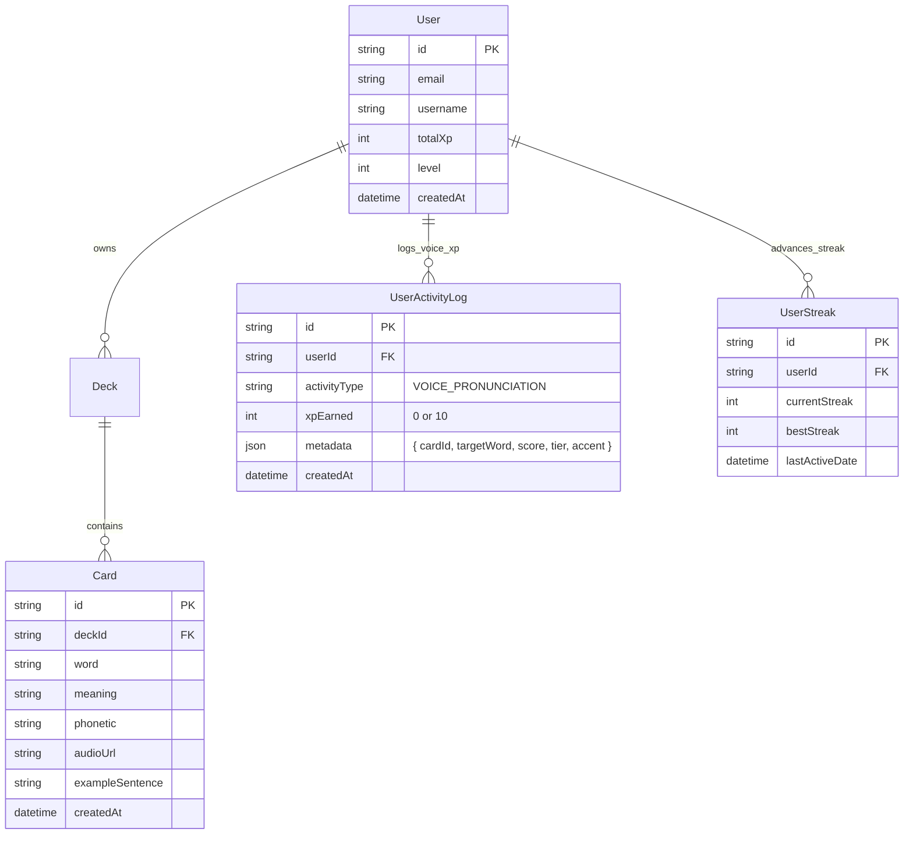
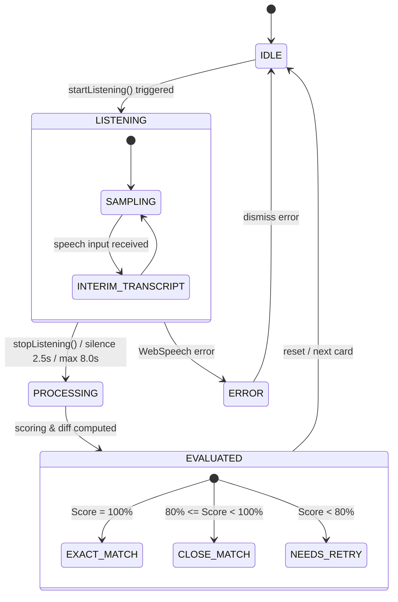

# Data Model: Speech Recognition & Pronunciation Assessment

**Feature**: `speech-pronunciation-assessment`  
**Epic**: EPIC-08 (Speech Recognition & Pronunciation Assessment)  
**Date**: 2026-08-21  
**Status**: COMPLETE

---

## 1. Entity-Relationship Model (Prisma & Database Schema)

The pronunciation practice engine operates with zero server audio storage. Database interactions are focused on reading card vocabulary data and recording gamification XP and streak logs.



### Database Invariants & Storage Rules

| Table                | Column / Rule    | Behavior                                                                                                                   |
| :------------------- | :--------------- | :------------------------------------------------------------------------------------------------------------------------- |
| `cards`              | `audioUrl`       | Primary CDN audio link (General American default). Dual accent support allows URL parameterization or metadata resolution. |
| `cards`              | `phonetic`       | IPA phonetic string (e.g. `"/ˈel.ɪ.kwənt/"`), parsed client-side into interactive syllables.                               |
| `user_activity_logs` | `activityType`   | Set to `'VOICE_PRONUNCIATION'` when awarding voice XP.                                                                     |
| `user_activity_logs` | `metadata`       | Encodes `{ cardId, targetWord, accuracyScore, tier, accent }` for learning analytics without retaining audio.              |
| `user_streaks`       | `lastActiveDate` | Updated to current UTC date upon passing voice check ($\ge 80\%$), keeping the streak alive.                               |

---

## 2. Shared TypeScript DTO Contracts (`packages/shared-types`)

These contracts reside in `packages/shared-types/src/practice.ts` for end-to-end type safety between `apps/api` and `apps/web`.

### 2.1 Voice Practice Enums & Types

```typescript
export type VoiceAccentLocale = "en-US" | "en-GB";

export type VoiceAssessmentTier = "EXACT" | "CLOSE" | "RETRY";

export type VoiceDiffSpanType = "MATCH" | "MISSING" | "EXTRA" | "WRONG";

export interface VoiceDiffSpan {
  char: string;
  type: VoiceDiffSpanType;
}

export interface IpaSyllableToken {
  id: string;
  syllable: string;
  isPrimaryStress: boolean;
  isSecondaryStress: boolean;
  rawText: string;
}
```

### 2.2 Voice Practice Submission & Result DTOs

```typescript
export interface VoicePracticeSubmissionDto {
  cardId: string;
  targetWord: string;
  spokenTranscript: string;
  accuracyScore: number; // 0 to 100
  accent: VoiceAccentLocale; // 'en-US' | 'en-GB'
  timeSpentMs?: number;
}

export interface VoicePracticeResultDto {
  isPassed: boolean; // true if score >= 80
  accuracyScore: number;
  tier: VoiceAssessmentTier; // 'EXACT' | 'CLOSE' | 'RETRY'
  xpAwarded: number; // 0 or 10
  isDailyCapped: boolean; // true if hit 500 XP/day cap
  streakAdvanced: boolean; // true if updated daily streak
  diffSpans: VoiceDiffSpan[];
  feedbackMessage: string;
}
```

### 2.3 Audio Hook State Interfaces

```typescript
export type MicPermissionState =
  | "UNPROMPTED"
  | "PRE_PROMPT"
  | "REQUESTING"
  | "GRANTED"
  | "DENIED"
  | "UNAVAILABLE";

export type VoicePracticeState =
  "IDLE" | "LISTENING" | "PROCESSING" | "EVALUATED" | "ERROR";

export interface UseSpeechRecognitionReturn {
  isListening: boolean;
  transcript: string;
  interimTranscript: string;
  error: string | null;
  permissionState: MicPermissionState;
  isSupported: boolean;
  startListening: (accent?: VoiceAccentLocale) => Promise<void>;
  stopListening: () => void;
  resetTranscript: () => void;
}

export interface UseAudioVisualizerReturn {
  isSampling: boolean;
  volumeBars: number[]; // 5 to 7 normalized values [0.0 .. 1.0]
  currentRms: number;
  startSampling: (stream: MediaStream) => void;
  stopSampling: () => void;
}

export interface UseAudioSynthesizerReturn {
  isSpeaking: boolean;
  speakText: (text: string, accent?: VoiceAccentLocale, rate?: number) => void;
  stopSpeaking: () => void;
  availableVoices: SpeechSynthesisVoice[];
}
```

---

## 3. Validation Rules & Invariants

| Field / Object         | Rule / Constraint                                                                                           | Error Behavior                          |
| :--------------------- | :---------------------------------------------------------------------------------------------------------- | :-------------------------------------- |
| `cardId`               | Must be a valid UUID pointing to an existing card in PostgreSQL.                                            | `404 Not Found`                         |
| `targetWord`           | Non-empty string, trimmed, $\le 100$ characters.                                                            | `400 Bad Request`                       |
| `spokenTranscript`     | String $\le 200$ characters.                                                                                | `400 Bad Request`                       |
| `accuracyScore`        | Integer $0 \le \text{score} \le 100$. Backend recalculates Levenshtein to ensure accuracy within $\pm 5\%$. | Backend computes canonical score        |
| `accent`               | Must be either `'en-US'` or `'en-GB'`.                                                                      | Default to `'en-US'`                    |
| `timeSpentMs`          | Integer $\ge 0$.                                                                                            | Defaults to $0$                         |
| **Daily Voice XP Cap** | Max $500\text{ XP/day}$ aggregated from `UserActivityLog`.                                                  | `xpAwarded = 0`, `isDailyCapped = true` |
| **Debounce Cooldown**  | $\ge 1500\text{ms}$ between consecutive submissions from the same user.                                     | `429 Too Many Requests`                 |

---

## 4. State Transitions & Lifecycle

### 4.1 Voice Practice State Transitions



### 4.2 Spaced Repetition Isolation Guarantee

- **Principle**: Pronunciation practice is an active vocal training drill and oral recall exercise, NOT an SM-2 flashcard interval review.
- **Invariant**: No columns in `user_card_progress` (`interval`, `easeFactor`, `repetitions`, `nextReviewDate`) are mutated by the voice submission endpoint.
- **SRS Cleanliness**: Spaced repetition schedules remain 100% isolated and mathematically sound.
