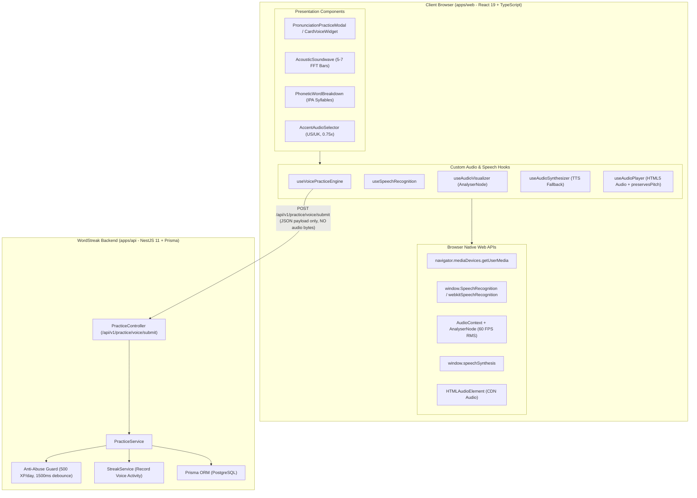
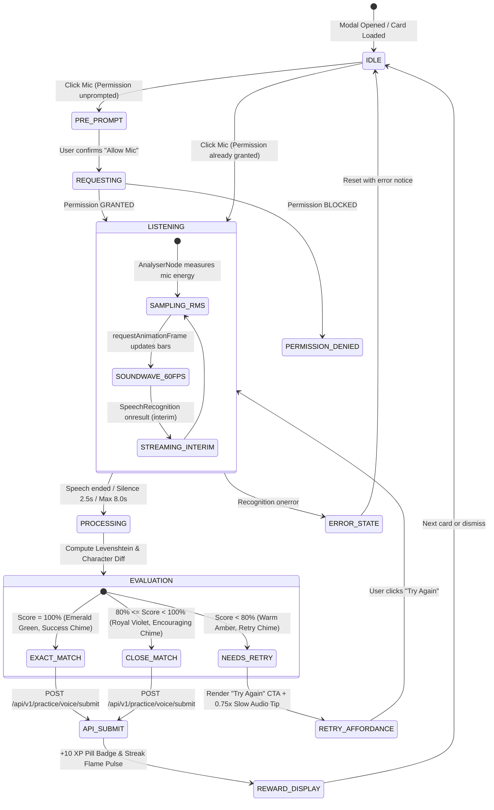

# Implementation Plan: Speech Recognition & Pronunciation Assessment

**Feature Branch**: `feat/speech-pronunciation-assessment`  
**Feature Slug**: `speech-pronunciation-assessment`  
**Date**: 2026-08-21  
**Spec**: [Feature Specification](spec.md)  
**Epic**: EPIC-08 (Speech Recognition & Pronunciation Assessment)

---

## 1. Technical Architecture Summary

The Speech Recognition & Pronunciation Assessment feature introduces a 100% client-side Web Audio and Web Speech processing engine paired with backend XP reward validation and streak tracking.



---

## 2. Technical Context & Constraints

| Parameter                     | Value                                                                                                            | Reference / Rationale                                         |
| :---------------------------- | :--------------------------------------------------------------------------------------------------------------- | :------------------------------------------------------------ |
| **Monorepo Architecture**     | React 19 (Vite) + NestJS 11 + `@wordstreak/shared-types`                                                         | WordStreak Standard Monorepo                                  |
| **Audio Processing**          | 100% Client-Side Web Audio API (`AudioContext`, `AnalyserNode`)                                                  | Privacy by design; zero server audio storage                  |
| **Speech-to-Text**            | Browser Native `SpeechRecognition` / `webkitSpeechRecognition`                                                   | Zero external API latency, zero paid third-party dependencies |
| **Speech Synthesis Fallback** | `window.speechSynthesis` (`en-US`, `en-GB`)                                                                      | Transparent fallback when CDN audio files are missing         |
| **Slow Playback Speed**       | `playbackRate = 0.75` with `preservesPitch = true`                                                               | Prevents robotic pitch deepening on slow audio                |
| **Scoring Algorithm**         | Normalized Levenshtein + character distance + phonetic equivalences                                              | Exact (100%), Close (80–99%), Needs Retry (<80%)              |
| **Gamification & Rewards**    | $+10\text{ XP}$ per passing card ($\ge 80\%$), capped at $500\text{ XP/day}$                                     | Anti-abuse limit; 1500ms cooldown                             |
| **Streak Qualification**      | $\ge 1$ passing voice attempt counts as daily study activity                                                     | Preserves and advances the Electric Violet Streak             |
| **Design System Tokens**      | Pure white `#ffffff` canvas, 1px `#e5e5e5` border, Obsidian `#000000` pill CTAs, Nunito / Inter / JetBrains Mono | `apps/web/DESIGN.md` & `apps/web/MEMORY.md`                   |

---

## 3. Constitution & Quality Gate Compliance

- **Strict TypeScript**: Full type coverage in `packages/shared-types/src/practice.ts` with zero `any` usage.
- **Privacy Guarantee**: No microphone stream or PCM audio buffer is ever transmitted over network requests. Volatile memory is purged immediately on utterance end.
- **TDD (Red-Green-Refactor)**: Comprehensive unit tests for custom hooks (`useSpeechRecognition.spec.ts`, `useAudioVisualizer.spec.ts`, `useVoicePracticeEngine.spec.ts`), scoring algorithms, and NestJS service endpoints before implementation.
- **Performance Budget**: Audio sampling loop operates at 60 FPS via `requestAnimationFrame` using $<2\%$ CPU; scoring execution $<15\text{ms}$; API submission response P95 $<150\text{ms}$.
- **Accessibility**: Meets WCAG 2.1 AA with keyboard navigation (`Space` to record, `R` to replay, `S` for slow speed) and `aria-live` score announcements.

---

## 4. Component Tree & State Management

```text
apps/web/src/features/practice/
├── components/
│   ├── PronunciationPracticeModal.tsx      # Main practice studio dialog
│   ├── PronunciationPracticeModal.spec.tsx # Modal tests
│   ├── AcousticSoundwave.tsx               # 5-7 bar dynamic volume visualizer
│   ├── AcousticSoundwave.spec.tsx          # Soundwave render tests
│   ├── PhoneticWordBreakdown.tsx           # Interactive IPA syllable chips
│   ├── PhoneticWordBreakdown.spec.tsx      # Syllable stress & click tests
│   ├── AccentAudioSelector.tsx             # Dual US/UK player + 0.75x speed toggle
│   ├── AccentAudioSelector.spec.tsx        # Accent selector tests
│   ├── PronunciationScoreBadge.tsx         # Exact / Close / Retry status pill
│   ├── PronunciationScoreBadge.spec.tsx    # Badge color & tier tests
│   └── MicPermissionBanner.tsx             # Inline permission troubleshooting
├── hooks/
│   ├── useSpeechRecognition.ts             # Web Speech STT lifecycle & watchdogs
│   ├── useSpeechRecognition.spec.ts        # Mocked speech recognition tests
│   ├── useAudioVisualizer.ts               # AnalyserNode RMS audio loop
│   ├── useAudioVisualizer.spec.ts          # FFT sampling tests
│   ├── useAudioSynthesizer.ts              # SpeechSynthesis fallback hook
│   ├── useAudioSynthesizer.spec.ts         # TTS voice matching tests
│   ├── useVoicePracticeEngine.ts           # State machine & scoring coordinator
│   └── useVoicePracticeEngine.spec.ts      # Scoring & XP coordination tests
├── utils/
│   ├── pronunciationScorer.ts              # Levenshtein distance & diff algorithm
│   ├── pronunciationScorer.spec.ts         # Scoring unit tests
│   ├── ipaSyllableParser.ts                # IPA stress and dot segmentation parser
│   └── ipaSyllableParser.spec.ts           # Syllable parser tests
└── services/
    └── voicePracticeService.ts             # API client for /api/v1/practice/voice/submit
```

---

## 5. State Machine & Execution Flow



---

## 6. Backend Integration & Anti-Abuse Guard

### API Endpoint Specification

- **Path**: `POST /api/v1/practice/voice/submit`
- **Guards**: `JwtAuthGuard` (optional for guests to test scoring without XP, authenticated for XP)
- **Request Body**:
  ```json
  {
    "cardId": "c4b12a89-32e1-4b10-928d-192837465019",
    "targetWord": "eloquent",
    "spokenTranscript": "eloquent",
    "accuracyScore": 100,
    "accent": "en-US",
    "timeSpentMs": 1420
  }
  ```
- **Response Body**:
  ```json
  {
    "success": true,
    "data": {
      "isPassed": true,
      "accuracyScore": 100,
      "tier": "EXACT",
      "xpAwarded": 10,
      "isDailyCapped": false,
      "streakAdvanced": true,
      "diffSpans": [
        { "char": "e", "type": "MATCH" },
        { "char": "l", "type": "MATCH" },
        { "char": "o", "type": "MATCH" },
        { "char": "q", "type": "MATCH" },
        { "char": "u", "type": "MATCH" },
        { "char": "e", "type": "MATCH" },
        { "char": "n", "type": "MATCH" },
        { "char": "t", "type": "MATCH" }
      ]
    },
    "message": "Voice pronunciation evaluated successfully"
  }
  ```

### Anti-Abuse Logic in `PracticeService`:

1. **Daily Cap**: Verifies total XP earned today via `UserActivityLog` where `activityType IN ('PRACTICE_QUIZ', 'VOICE_PRONUNCIATION')`. If `todayXp >= 500`, awards `xpAwarded = 0` with `isDailyCapped = true`.
2. **Rate Limiting / Cooldown**: 1500ms cooldown per user ID between consecutive submissions. Submissions within $<1500\text{ms}$ return HTTP 429.
3. **Plausibility Bounds**: Backend recalculates normalized Levenshtein distance on `(targetWord, spokenTranscript)`. If claimed `accuracyScore` differs by $>5\%$, backend recalculates the canonical score to prevent forged client claims.
4. **Streak Recording**: If user is authenticated and `isPassed === true`, triggers `UserStreak` update and logs `UserActivityLog` with `activityType: 'VOICE_PRONUNCIATION'`.

---

## 7. Audio Synthesis & Playback Pipeline

### 1. Dual-Accent Hierarchy

- Card model fields: `audioUrlUS` and `audioUrlUK`.
- Fallback sequence:
  1. Primary: Load native MP3 from CDN (`audioUrlUS` / `audioUrlUK`).
  2. If 404 / network failure / unpopulated: `useAudioSynthesizer` triggers `window.speechSynthesis` with matching voice locale (`en-US` or `en-GB`).
  3. Speed multiplier: `0.75x` or `1.0x` passed directly to `SpeechSynthesisUtterance.rate` or `HTMLAudioElement.playbackRate`.
  4. HTML5 Audio pitch preservation: `audio.preservesPitch = true`, `audio.webkitPreservesPitch = true`, `audio.mozPreservesPitch = true`.

### 2. IPA Syllable Segmentation Engine

- Algorithm: `ipaSyllableParser.ts` splits IPA string by `.`, `-`, or spaces.
- Identifies stress marks:
  - `ˈ` (Primary Stress): marks syllable as `isPrimaryStress: true`.
  - `ˌ` (Secondary Stress): marks syllable as `isSecondaryStress: true`.
- Tapping a syllable passes the phoneme token to `useAudioSynthesizer.speakText(syllable)` for isolated playback.
