# Implementation Tasks: Speech Recognition & Pronunciation Assessment

**Feature**: `speech-pronunciation-assessment`  
**Branch**: `feat/speech-pronunciation-assessment`  
**Epic**: EPIC-08 (Speech Recognition & Pronunciation Assessment)  
**Date**: 2026-08-21  
**Spec**: [Feature Specification](spec.md) | **Plan**: [Technical Plan](plan.md)

---

## 1. Task Dependency & Execution Graph

```mermaid
flowchart TD
    subgraph Phase1 ["Phase 1: Setup & Shared Contracts"]
        T001["T001: Define voice practice types in packages/shared-types"]
        T002["T002: Build shared-types package"]
    end

    subgraph Phase2 ["Phase 2: Foundational Infrastructure"]
        T003["T003 [P]: Create pronunciation scoring utility in apps/web"]
        T004["T004 [P]: Unit test pronunciation scoring utility"]
        T005["T005 [P]: Create submit voice DTOs in apps/api"]
        T006["T006: Implement voice submission & anti-abuse in PracticeService"]
        T007["T007: Expose POST /api/v1/practice/voice/submit in PracticeController"]
        T008["T008: Unit & integration test PracticeService voice submit"]
    end

    subgraph Phase3 ["Phase 3: US-VOICE-01 Voice Recognition & Pronunciation Scoring (P1)"]
        T009["T009 [P] [US1]: Test useSpeechRecognition hook"]
        T010["T010 [US1]: Implement useSpeechRecognition hook"]
        T011["T011 [P] [US1]: Test useAudioVisualizer hook"]
        T012["T012 [US1]: Implement useAudioVisualizer hook"]
        T013["T013 [P] [US1]: Test AcousticSoundwave component"]
        T014["T014 [US1]: Implement AcousticSoundwave component"]
        T015["T015 [P] [US1]: Test PronunciationScoreBadge component"]
        T016["T016 [US1]: Implement PronunciationScoreBadge component"]
        T017["T017 [P] [US1]: Test useVoicePracticeEngine hook"]
        T018["T018 [US1]: Implement useVoicePracticeEngine hook"]
        T019["T019 [P] [US1]: Test PronunciationPracticeModal component"]
        T020["T020 [US1]: Implement PronunciationPracticeModal component"]
        T021["T021 [US1]: Implement MicPermissionBanner inline unblock component"]
    end

    subgraph Phase4 ["Phase 4: US-VOICE-02 Native Audio & Pronunciation Guide (P2)"]
        T022["T022 [P] [US2]: Test IPA syllable parser utility"]
        T023["T023 [US2]: Implement ipaSyllableParser utility"]
        T024["T024 [P] [US2]: Test useAudioSynthesizer hook"]
        T025["T025 [US2]: Implement useAudioSynthesizer fallback hook"]
        T026["T026 [P] [US2]: Test AccentAudioSelector component"]
        T027["T027 [US2]: Implement AccentAudioSelector component (US/UK, 0.75x)"]
        T028["T028 [P] [US2]: Test PhoneticWordBreakdown component"]
        T029["T029 [US2]: Implement PhoneticWordBreakdown syllable chips"]
    end

    subgraph Phase5 ["Phase 5: Polish & Integration"]
        T030["T030 [P]: Integrate voice practice CTA into Flashcard & Quiz views"]
        T031["T031 [P]: Implement keyboard shortcuts (Space, R, S) in practice modal"]
        T032["T032 [P]: Accessibility audit (WCAG AA aria-live announcements)"]
        T033["T033: Full monorepo verification & quality gate check"]
    end

    Phase1 --> Phase2
    Phase2 --> Phase3
    Phase2 --> Phase4
    Phase3 --> Phase5
    Phase4 --> Phase5
```

---

## 2. Phase 1: Setup & Shared Contracts

- [x] T001 Define voice practice DTOs, enums, and hook contracts in `packages/shared-types/src/practice.ts`
- [x] T002 Build and verify shared types package with `pnpm --filter @wordstreak/shared-types build`

---

## 3. Phase 2: Foundational Infrastructure

- [x] T003 [P] Create pronunciation scoring and character diff utility in `apps/web/src/features/practice/utils/pronunciationScorer.ts`
- [x] T004 [P] Write unit tests for pronunciation scoring utility in `apps/web/src/features/practice/utils/pronunciationScorer.spec.ts`
- [x] T005 [P] Create `SubmitVoicePracticeDto` validation class in `apps/api/src/modules/practice/dto/submit-voice.dto.ts`
- [x] T006 Implement voice submission evaluation, 500 XP daily cap, and streak recording in `apps/api/src/modules/practice/practice.service.ts`
- [x] T007 Expose `POST /api/v1/practice/voice/submit` endpoint with rate limiting in `apps/api/src/modules/practice/practice.controller.ts`
- [x] T008 Write unit and controller tests for voice practice submission in `apps/api/src/modules/practice/practice.service.spec.ts` and `apps/api/src/modules/practice/practice.controller.spec.ts`

---

## 4. Phase 3: User Story 1 (US-VOICE-01) - Voice Recognition & Pronunciation Assessment (Priority: P1)

**Story Goal**: Allow learners to speak target words into their microphone, observe live 60 FPS soundwave bars, receive instant Levenshtein accuracy grading, and earn $+10\text{ XP}$ with streak credit.

**Independent Test**: Mount `PronunciationPracticeModal`, start mic recording, speak target word, verify volume meter movement, observe score tier badge, and confirm XP claim API response.

- [x] T009 [P] [US1] Write unit tests for Web Speech Recognition lifecycle and watchdog timers in `apps/web/src/features/practice/hooks/useSpeechRecognition.spec.ts`
- [x] T010 [US1] Implement `useSpeechRecognition` hook with silence/max duration timeouts in `apps/web/src/features/practice/hooks/useSpeechRecognition.ts`
- [x] T011 [P] [US1] Write unit tests for Web Audio `AnalyserNode` frequency volume sampling in `apps/web/src/features/practice/hooks/useAudioVisualizer.spec.ts`
- [x] T012 [US1] Implement `useAudioVisualizer` 60 FPS RMS sampling hook in `apps/web/src/features/practice/hooks/useAudioVisualizer.ts`
- [x] T013 [P] [US1] Write component tests for 5–7 bar soundwave rendering in `apps/web/src/features/practice/components/AcousticSoundwave.spec.tsx`
- [x] T014 [US1] Implement `AcousticSoundwave` dynamic bar visualizer in `apps/web/src/features/practice/components/AcousticSoundwave.tsx`
- [x] T015 [P] [US1] Write component tests for score status badges in `apps/web/src/features/practice/components/PronunciationScoreBadge.spec.tsx`
- [x] T016 [US1] Implement `PronunciationScoreBadge` (Exact `#10B981`, Close `#8B5CF6`, Retry `#F59E0B`) in `apps/web/src/features/practice/components/PronunciationScoreBadge.tsx`
- [x] T017 [P] [US1] Write unit tests for voice practice state coordinator in `apps/web/src/features/practice/hooks/useVoicePracticeEngine.spec.ts`
- [x] T018 [US1] Implement `useVoicePracticeEngine` state machine & API client in `apps/web/src/features/practice/hooks/useVoicePracticeEngine.ts`
- [x] T019 [P] [US1] Write integration tests for pronunciation modal dialog in `apps/web/src/features/practice/components/PronunciationPracticeModal.spec.tsx`
- [x] T020 [US1] Implement `PronunciationPracticeModal` studio dialog in `apps/web/src/features/practice/components/PronunciationPracticeModal.tsx`
- [x] T021 [US1] Implement `MicPermissionBanner` inline unblock guidance component in `apps/web/src/features/practice/components/MicPermissionBanner.tsx`

---

## 5. Phase 4: User Story 2 (US-VOICE-02) - Native Audio Playback & Pronunciation Guide (Priority: P2)

**Story Goal**: Provide dual-accent US/UK native audio playback, 0.75x slow speed with pitch preservation (`preservesPitch = true`), transparent Web Speech Synthesis fallback, and interactive IPA syllable segmentation with stress badges.

**Independent Test**: Load card in modal, toggle US/UK accents, click 0.75x speed, verify smooth playback without pitch distortion, click individual IPA syllables, and confirm isolated audio playback.

- [x] T022 [P] [US2] Write unit tests for IPA stress and syllable parsing in `apps/web/src/features/practice/utils/ipaSyllableParser.spec.ts`
- [x] T023 [US2] Implement `ipaSyllableParser` regex parser in `apps/web/src/features/practice/utils/ipaSyllableParser.ts`
- [x] T024 [P] [US2] Write unit tests for Web Speech Synthesis fallback hook in `apps/web/src/features/practice/hooks/useAudioSynthesizer.spec.ts`
- [x] T025 [US2] Implement `useAudioSynthesizer` fallback hook with locale voice matching in `apps/web/src/features/practice/hooks/useAudioSynthesizer.ts`
- [x] T026 [P] [US2] Write component tests for dual accent audio player in `apps/web/src/features/practice/components/AccentAudioSelector.spec.tsx`
- [x] T027 [US2] Implement `AccentAudioSelector` with US/UK tabs and 0.75x pitch-preserved slow toggle in `apps/web/src/features/practice/components/AccentAudioSelector.tsx`
- [x] T028 [P] [US2] Write component tests for interactive IPA syllable breakdown in `apps/web/src/features/practice/components/PhoneticWordBreakdown.spec.tsx`
- [x] T029 [US2] Implement `PhoneticWordBreakdown` clickable syllable chip list in `apps/web/src/features/practice/components/PhoneticWordBreakdown.tsx`

---

## 6. Phase 5: Polish & Cross-Cutting Concerns

- [x] T030 [P] Embed "Practice Speaking" trigger button into Flashcard views (`ReviewSessionPage.tsx`, `FlashcardReviewCard.tsx`, `DeckDetailPage.tsx`, `CardItemCard.tsx`, `CardDataTable.tsx`, and `QuizSetupModal.tsx`)
- [x] T031 [P] Implement global keyboard shortcuts (`Space` to record/stop, `R` to replay native audio, `S` to toggle slow speed, `Escape` to close) in `apps/web/src/features/practice/components/PronunciationPracticeModal.tsx`
- [x] T032 [P] Perform accessibility audit adding `aria-live="polite"` score updates and keyboard focus management in `apps/web/src/features/practice/components/PronunciationPracticeModal.tsx`
- [x] T033 Run full monorepo build, linting, and automated test suite (`pnpm --filter shared-types build && pnpm --filter api test && pnpm --filter web test`)

---

## 7. Parallel Execution Opportunities

- **Backend & Shared Contracts**: `T003`, `T004`, `T005` can be executed concurrently after `T001` and `T002`.
- **Frontend Hooks & Utilities**: `T009` / `T010` (Web Speech), `T011` / `T012` (Audio Visualizer), and `T022` / `T023` (IPA Parser) can be developed in parallel as they have no overlapping dependencies.
- **Frontend Components**: `T013` / `T014` (`AcousticSoundwave`), `T015` / `T016` (`PronunciationScoreBadge`), `T026` / `T027` (`AccentAudioSelector`), and `T028` / `T029` (`PhoneticWordBreakdown`) can be developed simultaneously before assembling into `PronunciationPracticeModal` (`T019` / `T020`).
