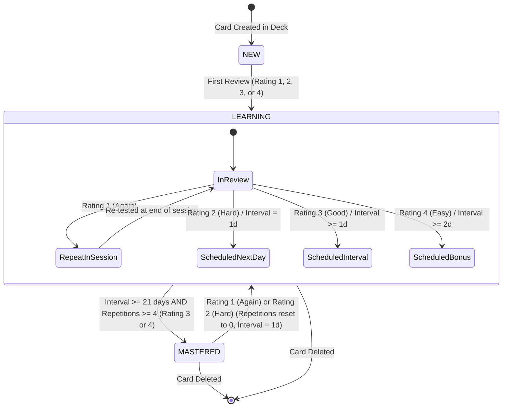
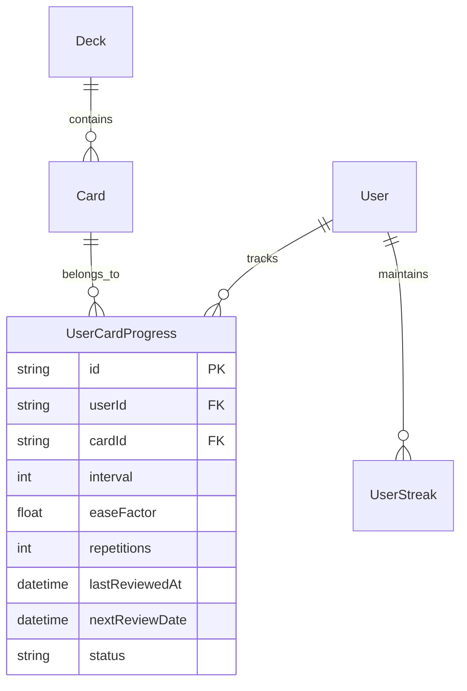

# Domain Model: Spaced Repetition System (SRS Review)

## 1. RBAC Matrix

| Role                        |   Fetch Due Queue   | Submit Card Rating  |   Reset Progress    | View Community Cards |
| :-------------------------- | :-----------------: | :-----------------: | :-----------------: | :------------------: |
| **Guest / Anonymous**       |      ❌ (401)       |      ❌ (401)       |      ❌ (401)       |       ❌ (401)       |
| **Learner (Authenticated)** | ✅ (Own cards only) | ✅ (Own cards only) | ✅ (Own cards only) |          ❌          |
| **System Admin**            |      ✅ (All)       |         ✅          |         ✅          |          ✅          |

- **Ownership Rule**: User can only read and mutate `UserCardProgress` records where `userId == req.user.id`.

---

## 2. State Machine & Entity Lifecycle

---

## 3. Business Rules & Algorithms

### **BR-SRS-001: SM-2 Ease Factor Calculation**

- Formula:
  $$EF' = EF + (0.1 - (5 - q) \times (0.08 + (5 - q) \times 0.02))$$
- Constraint: $EF' = \max(1.3, EF')$.
- Default $EF$ for new cards: `2.5`.

### **BR-SRS-002: SM-2 Repetition and Interval Calculation**

- For Rating $q \in \{1, 2\}$ (`Again`, `Hard`):
  - $n' = 0$
  - $I' = 1$ day
- For Rating $q \in \{3, 4\}$ (`Good`, `Easy`):
  - $n' = n + 1$
  - If $n' = 1$: $I' = 1$ day
  - If $n' = 2$: $I' = 6$ days (or $I' = 4$ days for Good, $7$ days for Easy)
  - If $n' > 2$:
    - For $q = 3$ (Good): $I' = \text{round}(I \times EF')$
    - For $q = 4$ (Easy): $I' = \text{round}(I \times EF' \times 1.3)$ (1.3x Easy Bonus)

### **BR-SRS-003: Due Queue Scheduling & Sorting**

- Query Filter: `userId == current_user.id`, `deck.isArchived == false`, AND:
  - Overdue/Due today: `nextReviewDate <= CURRENT_TIMESTAMP` OR
  - New cards: `status == 'NEW'` (limited to `dailyGoal - newCardsReviewedToday`).
- Ordering Priority:
  1. Overdue (`nextReviewDate < today_start`) ASC
  2. Due today (`today_start <= nextReviewDate <= today_end`) ASC
  3. New cards (`status == 'NEW'`) by `createdAt` ASC.

### **BR-SRS-004: Anti-Abuse & Rate Limiting**

- Submitting review for the same card multiple times within < 2 seconds is rejected (idempotency token / minimum review timestamp guard).
- Streak increments require genuine session completion or minimum 5 reviewed cards per calendar day.

### **BR-SRS-005: Card Status Transitions**

- `status` is set to:
  - `NEW` if `repetitions == 0` and `lastReviewedAt == null`.
  - `LEARNING` if `interval < 21` or `repetitions < 4`.
  - `MASTERED` if `interval >= 21` AND `repetitions >= 4`.

---

## 4. Workflows & Edge Cases

### Happy Path: Daily Review Flow

1. User clicks "Start Review" from Dashboard or Deck Detail page.
2. System fetches up to 50 due cards (`GET /api/v1/reviews/due?deckId=...`).
3. Card front is shown (Word, IPA, Audio play button).
4. User presses `Space` or clicks "Show Answer" -> 3D flip to back face.
5. User selects rating `1`..`4` via keyboard or button click.
6. Backend records rating atomically via `POST /api/v1/reviews/submit`.
7. If rating was `1` (`Again`), card is pushed to the back of the local session queue.
8. When queue is empty, Session Summary dialog displays performance metrics.

### Edge Cases & Negative Scenarios

- **Network Drop mid-session**: Because each card submits immediately, progress up to the drop is fully saved. Reconnecting resumes the remaining queue.
- **Empty Due Queue**: If user has 0 cards due, UI displays celebratory empty state ("All caught up! 🎉") with option to explore other decks or practice ahead.
- **Concurrent Tabs**: If user reviews the same card in two tabs, optimistic lock/timestamp comparison prevents corrupting repetition count.

---

## 5. ERD & Data Boundaries

- **Cascade Policy**: When a `Card` or `User` is deleted, its `UserCardProgress` records are deleted via `onDelete: Cascade`.

---

## 6. UX States & Non-Functional Requirements

- **Accessibility (WCAG 2.1 AA)**:
  - Full keyboard control: `Space` (flip), `1`/`2`/`3`/`4` (rating), `R` (replay audio), `Esc` (exit review with confirmation).
  - ARIA live region for screen readers announcing word and flip state.
- **Visual Design Compliance (`apps/web/DESIGN.md`)**:
  - Canvas: `#ffffff` with 1px borders (`#e5e5e5`).
  - Rating pills: Obsidian `#000000` text with distinct hover cues.
  - Mascot Purple Flame animation on milestone/completion.
- **Performance Target**:
  - Backend `/api/v1/reviews/due` latency < 50ms.
  - Review submit mutation < 40ms.
