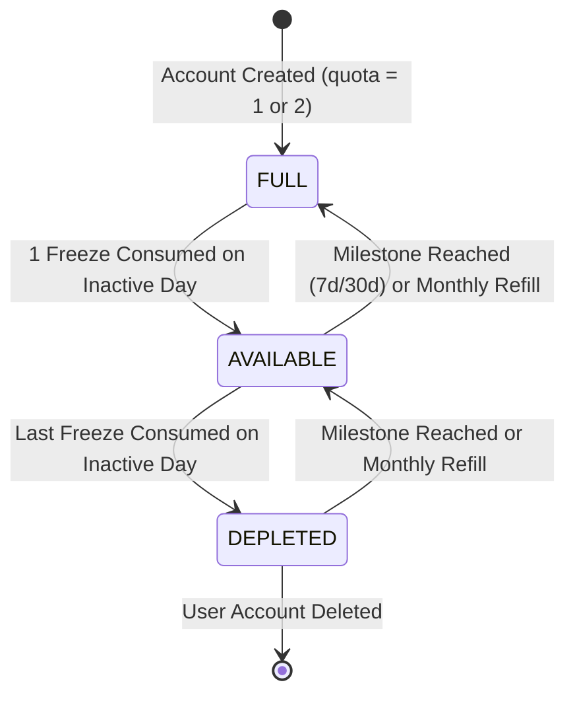
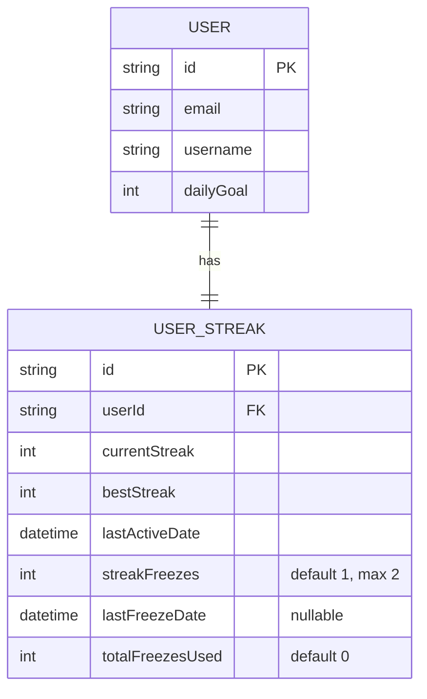

# Domain Model: Streak Freeze Protection Mechanic (US-GAME-02)

## 1. RBAC Matrix

| Role                  | View Freeze Balance | Auto-Consume Freeze | Earn Milestone Freeze | Reset / Adjust (Admin) |
| :-------------------- | :-----------------: | :-----------------: | :-------------------: | :--------------------: |
| **Guest / Anonymous** |         ❌          |         ❌          |          ❌           |           ❌           |
| **Learner (Member)**  |    ✅ (Own Only)    |   ✅ (Automatic)    |    ✅ (Automatic)     |           ❌           |
| **System / Service**  |         ✅          |         ✅          |          ✅           |           ✅           |

- **Ownership Boundary**: Users can only view and mutate their own streak freeze balance. All freeze calculations are scoped to `userId` from authenticated JWT.

---

## 2. State Machine & Entity Lifecycle

### State Transitions

1. **`ACCOUNT_INITIALIZED`**:
   - Initial State: `AVAILABLE` (with `streakFreezes = 1`, `totalFreezesUsed = 0`).
2. **`LAZY_AUTO_CONSUMPTION`** (Triggered on `getStreak` or `recordActivity` when $\Delta d \ge 2$):
   - Condition 1: Missed 1 day ($\Delta d = 2$) & `streakFreezes >= 1` $\rightarrow$ `streakFreezes -= 1`, `totalFreezesUsed += 1`, `lastFreezeDate = now`, `lastActiveDate = yesterdayStr`. Streak is maintained!
   - Condition 2: Missed 2 days ($\Delta d = 3$) & `streakFreezes == 2` $\rightarrow$ `streakFreezes -= 2`, `totalFreezesUsed += 2`, `lastFreezeDate = now`, `lastActiveDate = yesterdayStr`. Streak is maintained!
   - Condition 3: Missed days exceed available freezes ($\Delta d > \text{streakFreezes} + 1$) $\rightarrow$ `streakFreezes` unaffected or consumed, `currentStreak = 0` (or 1 on recordActivity).
3. **`MILESTONE_AWARD`** (Triggered when `currentStreak` reaches 7 or 30):
   - If `streakFreezes < MAX_STREAK_FREEZES (2)`: `streakFreezes += 1`.
4. **`MONTHLY_REFILL`** (Triggered on first activity of a new calendar month):
   - If `streakFreezes < MAX_STREAK_FREEZES (2)`: `streakFreezes = min(2, streakFreezes + 1)`.

---

## 3. Business Rules & Anti-Abuse Pass

- **BR-FREEZE-001 (Max Quota)**: A user's freeze balance cannot exceed 2 (`MAX_STREAK_FREEZES = 2`).
- **BR-FREEZE-002 (Default Initial Quota)**: Every user account is initialized with `1` default freeze (`@default(1)`).
- **BR-FREEZE-003 (Protection Scope)**: 1 freeze protects exactly 1 missed calendar day within the user's local timezone.
- **BR-FREEZE-004 (Lazy Evaluation Algorithm)**:
  - Calculate calendar day difference: $\Delta d = \text{daysBetween}(\text{lastActiveDate}, \text{todayStr}, \text{timezone})$.
  - If $\Delta d == 0$: Active today (`isActiveToday = true, isPendingToday = false`).
  - If $\Delta d == 1$: Intact from yesterday (`isActiveToday = false, isPendingToday = true`).
  - If $2 \le \Delta d \le \text{streakFreezes} + 1$:
    - $\text{consumed} = \Delta d - 1$.
    - Deduct `streakFreezes -= consumed`.
    - Update `totalFreezesUsed += consumed`.
    - Set `lastFreezeDate = now`.
    - Effective `currentStreak` remains intact.
    - Flag response: `wasProtectedByFreeze = true`, `freezesUsed = consumed`.
  - If $\Delta d > \text{streakFreezes} + 1$:
    - Effective `currentStreak = 0` (broken streak).
- **BR-FREEZE-005 (Milestone Replenishment)**:
  - When `currentStreak` reaches exactly `7` or `30`, system automatically awards +1 freeze up to the max cap of 2.
  - _Anti-Abuse_: Milestone rewards are triggered only on the exact streak increment step and tracked to prevent re-triggering upon repeated reviews within the same calendar day.
- **BR-FREEZE-006 (Anti-Abuse & Idempotency)**:
  - All freeze deductions and rewards are performed in atomic database transactions.
  - Repeated `getStreak` calls within the same day are idempotent; freeze is deducted only once for the missed day gap.

---

## 4. Workflows & Edge Cases

### Happy Path 1: User misses yesterday, visits dashboard today with 1 freeze

1. Frontend calls `GET /api/v1/streaks?timezone=Asia/Ho_Chi_Minh`.
2. Backend computes $\Delta d = 2$. User has `streakFreezes = 1`.
3. Backend atomically decrements freeze to `0`, sets `wasProtectedByFreeze = true`, updates `lastActiveDate` virtual bridge, and returns current streak intact.
4. Dashboard displays the ice shield animation and alert: _"Your 5-day streak was protected by Streak Freeze! 🧊 0 freezes remaining."_

### Happy Path 2: User completes review after being saved by freeze

1. User submits flashcard review via `POST /api/v1/streaks/activity`.
2. Backend validates activity today, increments `currentStreak` to `6`.
3. Celebration modal acknowledges continued streak.

### Edge Case: User misses 3 days with only 1 freeze

1. $\Delta d = 4$, but `streakFreezes = 1`.
2. $4 > 1 + 1 = 2$.
3. Streak cannot be bridged $\rightarrow$ `currentStreak` resets to 0 (or 1 upon submitting a new review). Freeze is preserved or remains unchanged since the streak was not bridgeable.

---

## 5. ERD & Data Boundaries

- **Deletion Policy**: Cascade delete when `User` is deleted (`onDelete: Cascade`).
- **Data Privacy**: Streak freeze counters contain no PII.

---

## 6. UX & Non-Functional Requirements

- **Design System Tokens (`DESIGN.md`, `MEMORY.md`)**:
  - Ice Frost Accent: `#06B6D4` / `#0891B2` (Cyan-500/600) with clean 1px hairline border `#e5e5e5`.
  - Obsidian CTA Pills: `#000000` (`rounded-full`).
  - Stable Outer Anchor Hover Physics on the Streak/Freeze Widget.
  - Zero unrequested neon blurs or multi-color slop gradients.
- **Accessibility**: WCAG 2.1 AA compliant. Color contrast $\ge 4.5:1$, full keyboard focus trapping on Freeze alert modals, screen reader announcements on freeze consumption.
- **Observability**: Structured logger logs `[StreakService] User ${userId} consumed ${count} streak freeze(s). Streak preserved at ${streak}`.
- **Performance**: Sub-25ms response time overhead for freeze evaluation.
