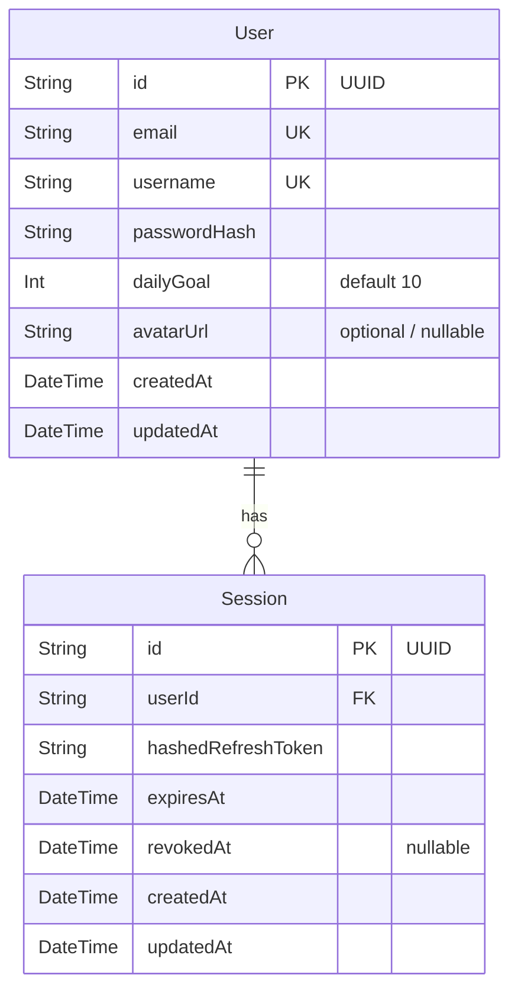

# Domain Model: User Profile & Daily Goal Settings (US-AUTH-04)

- **Feature Slug**: `user-profile-settings`
- **Protocol**: Bounded Task
- **Date**: 2026-08-17

---

## 1. RBAC Matrix

| Role                        | View Own Profile | Update Own Profile (dailyGoal, avatarUrl) | Change Own Password | Manage Other Users |
| :-------------------------- | :--------------: | :---------------------------------------: | :-----------------: | :----------------: |
| **Guest / Anonymous**       |     ❌ (401)     |                 ❌ (401)                  |      ❌ (401)       |      ❌ (401)      |
| **Learner (Authenticated)** |     ✅ (200)     |                 ✅ (200)                  |      ✅ (200)       |      ❌ (403)      |
| **Admin**                   |     ✅ (200)     |                 ✅ (200)                  |      ✅ (200)       |    Future scope    |

---

## 2. Business Rules & Algorithms

- **`BR-PROFILE-001` (Daily Goal Range)**:
  - `dailyGoal` must be an integer between 1 and 100 inclusive.
  - Recommended UI preset chips: `5` (Casual), `10` (Standard / Default), `20` (Accelerated), `30` (Intensive), `50` (Mastery).

- **`BR-PROFILE-002` (Avatar Customization)**:
  - `avatarUrl` is a string up to 500 characters, representing either a curated preset identifier (`preset:cosmos-1`, etc.) or a valid `https://` image URL.
  - If null or empty, the frontend displays the default letter avatar generated from `username`.

- **`BR-PROFILE-003` (Password Strength & Validation)**:
  - `currentPassword` must match the user's current hashed password verified via Argon2.
  - `newPassword` must be at least 8 characters long, contain at least 1 letter and 1 digit, and cannot be identical to `currentPassword`.

- **`BR-PROFILE-004` (Session Invalidation on Password Change)**:
  - Upon successful password change, all active sessions belonging to the user (`Session.userId = user.id`) _except_ the current session (`Session.id != currentSessionId`) are immediately revoked by setting `revokedAt = new Date()`.

- **`BR-PROFILE-005` (Sanitized Profile Response)**:
  - Profile queries (`GET /api/v1/users/profile`) and update responses must NEVER return `passwordHash`. Response DTO includes: `id`, `email`, `username`, `dailyGoal`, `avatarUrl`, `createdAt`, `updatedAt`.

---

## 3. Workflows & Edge Cases

### Happy Path 1: Update Daily Goal & Avatar

1. User clicks avatar in Navbar -> Selects "Settings / Profile".
2. User chooses Daily Goal (e.g. 20 cards) or selects a new Avatar preset.
3. User clicks "Save Changes".
4. Client sends `PATCH /api/v1/users/profile` with payload `{ dailyGoal: 20, avatarUrl: "preset:cosmos-2" }`.
5. Backend validates, updates database, and returns updated sanitized profile.
6. Client updates Zustand auth store and displays success toast.

### Happy Path 2: Change Password

1. User switches to "Security" tab in Settings Modal.
2. User enters `currentPassword`, `newPassword`, `confirmPassword`.
3. User clicks "Update Password".
4. Client sends `POST /api/v1/users/change-password` (or `PATCH /api/v1/users/password`).
5. Backend verifies `currentPassword`, hashes `newPassword`, updates user record, and revokes other sessions in DB.
6. Backend returns `{ message: "Password updated successfully" }`.
7. Client clears password form fields and displays success notification.

### Edge Cases & Failure Handling

- **EC-01 (Incorrect Current Password)**: Backend returns `400 Bad Request` with message "Current password is incorrect".
- **EC-02 (Password Mismatch / Weak Password)**: Client performs instant validation; backend rejects with `400 Bad Request` if invalid.
- **EC-03 (Expired Access Token during update)**: Client Axios interceptor triggers silent token refresh; retry request seamlessly.
- **EC-04 (Invalid Daily Goal range < 1 or > 100)**: Backend rejects with `400 Bad Request`.

---

## 4. Entity & Data Model Changes

---

## 5. UX States & Non-Functional Requirements

- **UX States**:
  - _Loading_: Button spinner and disabled inputs during submission to prevent duplicate clicks.
  - _Success_: Visual green banner / toast alert with automatic auto-dismiss.
  - _Error_: Red alert inline above fields or toast notification with actionable error message.
- **Accessibility**: Keyboard accessible modal (`Esc` to close, `Tab` focus trap), ARIA labels on tab triggers and form fields.
- **Performance**: Instant client store update; API latency < 80ms.
