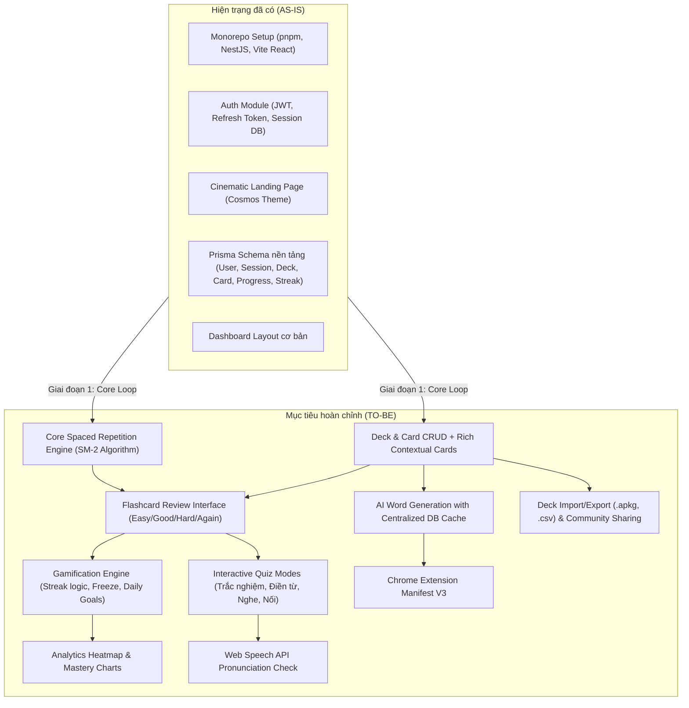

# 📋 WordStreak — Product Backlog, Business Requirements & Execution Roadmap

> **Phiên bản:** 1.0.0  
> **Vai trò:** Senior Business Analyst (BA) & Product Owner (PO)  
> **Trạng thái tài liệu:** Tài liệu sống (Living Document) — Sử dụng để theo dõi tiến độ và đánh dấu hoàn thành  
> **Ký hiệu trạng thái:**
>
> - `[x]` **Hoàn thành (Done)** — Đã hoàn thiện code, test và hoạt động ổn định.
> - `[/]` **Đang triển khai (In Progress)** — Đang phát triển hoặc đang trong giai đoạn thiết kế/spec.
> - `[ ]` **Chưa triển khai (To Do / Backlog)** — Đã có đặc tả nghiệp vụ, sẵn sàng lên kế hoạch sprint.
> - `[!]` **Bị chặn / Cần làm rõ (Blocked / Review Needed)** — Phụ thuộc module khác hoặc cần quyết định kiến trúc/nghiệp vụ.
> - `[~]` **Dự kiến dài hạn (Deferred / Future Phase)** — Nghiệp vụ giai đoạn sau (Phase 3 & 4).

---

## 📑 Mục lục

1. [Tầm nhìn sản phẩm & Đối tượng người dùng (Product Vision & Personas)](#1-tầm-nhìn-sản-phẩm--đối-tượng-người-dùng)
2. [Phân tích hiện trạng AS-IS vs TO-BE (Gap Analysis)](#2-phân-tích-hiện-trạng-as-is-vs-to-be)
3. [Bảng ma trận ưu tiên MoSCoW & RICE](#3-bảng-ma-trận-ưu-tiên-moscow--rice)
4. [Phân rã nghiệp vụ chi tiết & Checklist công việc (Epics & Backlog Tracking)](#4-phân-rã-nghiệp-vụ-chi-tiết--checklist-công-việc)
   - [Epic 1: Authentication & User Profile](#epic-01-authentication--user-profile-xác-thực--quản-lý-người-dùng)
   - [Epic 2: Deck & Vocabulary Card Management](#epic-02-deck--vocabulary-card-management-quản-lý-bộ-từ--thẻ-từ-vựng)
   - [Epic 3: Spaced Repetition System (SRS Engine - SM-2)](#epic-03-spaced-repetition-system-srs-engine---sm-2)
   - [Epic 4: Multi-format Practice & Quiz Modes](#epic-04-multi-format-practice--quiz-modes-đa-dạng-chế-độ-ôn-luyện)
   - [Epic 5: Gamification, Streaks & Daily Habits](#epic-05-gamification-streaks--daily-habits-game-hóa--thói-quen)
   - [Epic 6: Learning Analytics & Retention Dashboard](#epic-06-learning-analytics--retention-dashboard-thống-kê--báo-cáo)
   - [Epic 7: AI-Assisted Vocabulary Generator & Caching](#epic-07-ai-assisted-vocabulary-generator--caching-tự-động-hóa-ai)
   - [Epic 8: Speech Recognition & Pronunciation Assessment](#epic-08-speech-recognition--pronunciation-luyện-phát-âm-ai)
   - [Epic 9: Import/Export, Community & Ecosystem](#epic-09-importexport-community--ecosystem-hệ-sinh-thái)
   - [Epic 10: Multi-language & Internationalization (i18n)](#epic-10-multi-language--internationalization-i18n-đa-ngôn-ngữ-anhviệt)
5. [Lộ trình phát hành theo Giai đoạn & Sprint (Release Roadmap)](#5-lộ-trình-phát-hành-theo-giai-đoạn--sprint)
6. [Quy chuẩn định nghĩa hoàn thành (Definition of Done - DoD)](#6-quy-chuẩn-định-nghĩa-hoàn-thành-definition-of-done)

---

## 1. Tầm nhìn sản phẩm & Đối tượng người dùng

### 1.1. Tầm nhìn (Product Vision)

**WordStreak** là nền tảng học và củng cố từ vựng tiếng Anh cá nhân hóa thế hệ mới. Ứng dụng giải quyết triệt để vấn đề "học trước quên sau" bằng sự kết hợp giữa:

1. **Thuật toán Spaced Repetition (SM-2 / FSRS)** mô phỏng đường cong quên tự nhiên của não bộ.
2. **Contextual Flashcards** (Từ vựng giàu ngữ cảnh: IPA audio, ví dụ thực tế, collocations, hình ảnh, mẹo ghi nhớ).
3. **AI Automation** giúp tạo dữ liệu từ vựng tự động chỉ với 1 cú click (kèm cơ chế caching tối ưu chi phí).
4. **Gamification & Habit Building** (Streak, Streak Freeze, Heatmap, Daily Goals) tạo động lực học tập mỗi ngày.

### 1.2. Chân dung người dùng mục tiêu (User Personas)

- **Persona A - Alex (Luyện thi chứng chỉ IELTS/TOEIC/TOEFL):** Cần học 10-30 từ học thuật mỗi ngày theo chủ đề, cần nhớ chuẩn nghĩa trong ngữ cảnh và collocations đi kèm.
- **Persona B - Minh (Người đi làm bận rộn):** Có ít thời gian (10-15 phút/ngày), cần app nhắc nhở ôn tập đúng lúc, có cơ chế bảo vệ chuỗi học (Streak Freeze) khi tăng ca.
- **Persona C - Linh (Người đọc báo/xem video tiếng Anh thường xuyên):** Thấy từ mới khi lướt web và muốn lưu ngay vào bộ từ cá nhân thông qua Extension mà không phải mở app thủ công.

---

## 2. Phân tích hiện trạng AS-IS vs TO-BE



---

## 3. Bảng ma trận ưu tiên MoSCoW & RICE

| Mã Epic     | Nghiệp vụ / Tính năng                            |  Phân loại MoSCoW   | RICE Score |    Mức ưu tiên     |   Sprint khuyến nghị    |
| :---------- | :----------------------------------------------- | :-----------------: | :--------: | :----------------: | :---------------------: |
| **EPIC-01** | Authentication, Sessions & Profile               |    **Must Have**    |    9.0     | **P0 (Critical)**  | Sprint 1 _(Hoàn thành)_ |
| **EPIC-02** | Deck & Card Management (CRUD + Context)          |    **Must Have**    |    9.5     | **P0 (Critical)**  |        Sprint 2         |
| **EPIC-03** | SRS Engine (SM-2) & Flashcard Review Flow        |    **Must Have**    |    10.0    | **P0 (Core USP)**  |        Sprint 2         |
| **EPIC-04** | Quiz Modes: Trắc nghiệm & Điền vào chỗ trống     |    **Must Have**    |    8.5     |   **P0 (High)**    |        Sprint 3         |
| **EPIC-05** | Streak Tracking, Daily Goal & Streak Freeze      |    **Must Have**    |    8.8     | **P0 (Retention)** |        Sprint 3         |
| **EPIC-06** | Learning Analytics & GitHub-style Heatmap        |   **Should Have**   |    7.8     |   **P1 (High)**    |        Sprint 4         |
| **EPIC-07** | AI Flashcard Auto-fill & Shared DB Cache         |   **Should Have**   |    8.2     |   **P1 (High)**    |        Sprint 4         |
| **EPIC-04** | Quiz Modes: Luyện nghe (Audio) & Nối từ          |   **Should Have**   |    7.0     |  **P1 (Medium)**   |        Sprint 5         |
| **EPIC-08** | Luyện phát âm (Voice Recognition via Web Speech) |   **Could Have**    |    6.2     |  **P2 (Medium)**   |        Sprint 5         |
| **EPIC-09** | Import/Export Anki (.apkg) & CSV                 |   **Could Have**    |    6.5     |  **P2 (Medium)**   |        Sprint 6         |
| **EPIC-09** | Community Deck Sharing (Public/Clone Deck)       |   **Could Have**    |    6.0     |  **P2 (Medium)**   |        Sprint 6         |
| **EPIC-10** | Multi-language & i18n (Tiếng Anh & Tiếng Việt)   |   **Should Have**   |    8.0     |   **P1 (High)**    |        Sprint 6         |
| **EPIC-09** | Chrome Extension (Highlight to Save Deck)        | **Won't Have (v1)** |    5.5     |  **P3 (Phase 4)**  |        Sprint 7         |
| **EPIC-09** | PWA & Offline Study Mode                         | **Won't Have (v1)** |    5.0     |  **P3 (Phase 4)**  |        Sprint 7         |

---

## 4. Phân rã nghiệp vụ chi tiết & Checklist công việc

### EPIC 01: Authentication & User Profile (Xác thực & Quản lý người dùng)

_Mục tiêu: Đảm bảo bảo mật tài khoản người dùng, phiên đăng nhập đa thiết bị và lưu trữ cấu hình cá nhân hóa._

- [x] **US-AUTH-01: Đăng ký tài khoản mới (Sign Up)**
  - **AC:** Người dùng cung cấp `username`, `email`, `password`. Mật khẩu được hash an toàn (Argon2/Bcrypt). Không trùng email/username.
  - **Tasks:**
    - [x] Backend: Endpoint `POST /api/v1/auth/register` + validation DTO.
    - [x] Frontend: Form đăng ký với validation client-side và feedback lỗi trực quan.
- [x] **US-AUTH-02: Đăng nhập & Quản lý phiên (Sign In & Session Management)**
  - **AC:** Cấp phát Access Token (JWT) ngắn hạn và Refresh Token dài hạn lưu trong bảng `Session`. Tự động gia hạn khi Access Token hết hạn.
  - **Tasks:**
    - [x] Backend: Endpoint `POST /api/v1/auth/login`, `POST /api/v1/auth/refresh`, `POST /api/v1/auth/logout`.
    - [x] Frontend: Lưu token bảo mật, Axios/Fetch Interceptor tự động refresh token, Zustand `useAuthStore`.
- [x] **US-AUTH-03: Bảo vệ tuyến đường & Điều hướng (Route Protection & Guards)**
  - **AC:** Chỉ user đã xác thực mới được vào Dashboard/Study; nếu chưa đăng nhập điều hướng về `/login`.
  - **Tasks:**
    - [x] Backend: `JwtAuthGuard` bảo vệ các private endpoint.
    - [x] Frontend: Component `ProtectedRoute` bọc các route `/dashboard`, `/decks`, `/review`.
- [x] **US-AUTH-04: Cài đặt hồ sơ & Mục tiêu học tập hàng ngày (Profile & Daily Goal)**
  - **AC:** Người dùng có thể cập nhật `dailyGoal` (mặc định 10 từ, tùy chọn 5/10/20/30/50 từ), đổi avatar (Cosmos presets & URL), đổi mật khẩu (kèm tự động đăng xuất các thiết bị khác).
  - **Tasks:**
    - [x] Backend: `GET /api/v1/users/profile`, `PATCH /api/v1/users/profile` (update dailyGoal, avatarUrl), `POST /api/v1/users/change-password`.
    - [x] Frontend: Trang Profile Modal/Settings (`SettingsModal`) 3 tabs cho phép chỉnh sửa mục tiêu học tập, chọn Cosmos Avatar, và đổi mật khẩu an toàn.

---

### EPIC 02: Deck & Vocabulary Card Management (Quản lý Bộ từ & Thẻ từ vựng)

_Mục tiêu: Cho phép người dùng tự tạo, phân loại theo chủ đề và quản lý thẻ từ vựng với đầy đủ ngữ cảnh phong phú._

- [x] **US-DECK-01: Tạo và quản lý Bộ từ vựng (Deck CRUD)**
  - **AC:** Người dùng có thể tạo Deck mới (Title, Description, Color/Icon tag, IsPublic). Xem danh sách deck cá nhân, sửa thông tin, lưu trữ/khôi phục, xóa deck (kèm cảnh báo xóa cascade cards).
  - **Tasks:**
    - [x] Backend: Module `decks` (Controller, Service, Repository) — `GET /api/v1/decks`, `POST /api/v1/decks`, `GET /api/v1/decks/:id`, `PATCH /api/v1/decks/:id`, `PATCH /api/v1/decks/:id/archive`, `PATCH /api/v1/decks/:id/restore`, `DELETE /api/v1/decks/:id`.
    - [x] Frontend: Trang `DecksListPage` (`/decks`, danh sách deck dạng lưới, số lượng từ, thanh tiến độ, bộ lọc active/archived), `CreateDeckModal`, `EditDeckModal`, `DeleteDeckConfirmModal`.
- [x] **US-CARD-01: Tạo thẻ từ vựng giàu ngữ cảnh (Contextual Card Creation)**
  - **AC:** Thẻ gồm các trường: Word, Meaning (Tiếng Việt/Tiếng Anh), Phonetic (IPA), Audio URL, Example Sentence (kèm dịch nghĩa), Collocations, Mnemonic (ghi chú mẹo nhớ), Image URL.
  - **Tasks:**
    - [x] Backend: Module `cards` — `POST /api/v1/decks/:deckId/cards`, `GET /api/v1/decks/:deckId/cards`, `PATCH /api/v1/cards/:id`, `DELETE /api/v1/cards/:id`. Tự động khởi tạo bản ghi `UserCardProgress` (trạng thái `NEW`).
    - [x] Frontend: `AddCardModal` / `CardEditorForm` với rich fields (gợi ý từ loại, phát âm thử audio, xem trước flashcard 3D, lưu và thêm từ tiếp).
- [x] **US-CARD-02: Quản lý danh sách thẻ trong Bộ từ (Card Table & Search/Filter)**
  - **AC:** Tìm kiếm từ theo từ khóa, lọc theo trạng thái (New / Learning / Mastered), phân trang (Pagination/Infinite Scroll), hành động hàng loạt (Bulk Delete/Move).
  - **Tasks:**
    - [x] Backend: Query tối ưu với index trên `deckId` và `word`, hỗ trợ pagination `page`, `limit`, `search`, `status`, endpoint bulk action.
    - [x] Frontend: `DeckDetailPage` chứa danh sách từ dạng Table/Card List (Dual View Mode), tìm kiếm nhanh, lọc trạng thái, thanh công cụ bulk actions.

---

### EPIC 03: Spaced Repetition System (SRS Engine - SM-2)

_Mục tiêu: Xây dựng trái tim của ứng dụng — tính toán lịch ôn tập tối ưu để chuyển hóa từ vựng từ trí nhớ ngắn hạn sang dài hạn._

- [x] **US-SRS-01: Thuật toán tính toán chu kỳ lặp SuperMemo-2 (SM-2 Engine)**
  - **AC:** Xử lý 4 mức đánh giá:
    - Rating 1 (`Again` / Quên): `Repetitions = 0`, `Interval = 1 ngày`, giảm Ease Factor ($EF$).
    - Rating 2 (`Hard` / Khó): `Repetitions = 0`, `Interval = 1 ngày`, giảm mạnh $EF$.
    - Rating 3 (`Good` / Nhớ tốt): `Repetitions += 1`, $I(1)=1d, I(2)=6d, I(n)=I(n-1) \times EF'$.
    - Rating 4 (`Easy` / Quá dễ): `Repetitions += 1`, tăng Ease Factor ($EF$), tính khoảng cách nhảy vọt.
    - Đảm bảo $EF \ge 1.3$. Cập nhật `nextReviewDate = now + Interval`.
  - **Tasks:**
    - [x] Đặc tả thuật toán và mã giả TS tại `docs/algorithms/supermemo-2.md`.
    - [x] Backend: `SrsService` độc lập với 100% unit test coverage cho tất cả các nhánh rating.
- [x] **US-SRS-02: Truy vấn danh sách thẻ đến hạn ôn tập (Due Review Queue)**
  - **AC:** Lấy danh sách thẻ có `nextReviewDate <= CURRENT_TIMESTAMP` và các thẻ `NEW` theo giới hạn `dailyGoal` của user. Sắp xếp ưu tiên: Thẻ đến hạn quá lâu -> Thẻ đến hạn hôm nay -> Thẻ mới.
  - **Tasks:**
    - [x] Backend: Endpoint `GET /api/v1/reviews/due?deckId=...` (hỗ trợ ôn theo deck hoặc toàn bộ deck).
    - [x] Backend: Endpoint `POST /api/v1/reviews/submit` nhận `{ cardId, rating }` -> tính SM-2 -> cập nhật DB -> cập nhật streak.
- [x] **US-SRS-03: Giao diện lật thẻ ôn tập thông minh (Flashcard Review UI)**
  - **AC:** Giao diện 3D lật mặt trước (Word + IPA + Audio button) và mặt sau (Meaning, Example Sentence, Collocations, Mnemonic). Phím tắt bàn phím: Space (lật thẻ), 1 (Again), 2 (Hard), 3 (Good), 4 (Easy).
  - **Tasks:**
    - [x] Frontend: `ReviewSessionPage` với animation lật thẻ mượt mà (Framer Motion / CSS 3D flip).
    - [x] Frontend: Tự động phát âm thanh khi lật thẻ (tùy chọn trong cài đặt). Hiển thị thanh tiến độ ôn tập (Remaining / Due / Finished).

---

### EPIC 04: Multi-format Practice & Quiz Modes (Đa dạng chế độ ôn luyện)

_Mục tiêu: Đa dạng hóa hình thức kiểm tra để não bộ kích hoạt liên kết ngôn ngữ ở nhiều góc độ (đọc hiểu, ngữ cảnh, phản xạ nghe, nối nghĩa)._

- [x] **US-QUIZ-01: Chế độ Trắc nghiệm 4 đáp án (Multiple Choice Quiz)**
  - **AC:** Hệ thống sinh câu hỏi ngẫu nhiên: Cho từ vựng -> Chọn 1 trong 4 nghĩa đúng (3 nghĩa sai lấy ngẫu nhiên từ các thẻ khác cùng Deck); hoặc cho nghĩa -> chọn từ.
  - **Tasks:**
    - [x] Backend: Endpoint `GET /api/v1/practice/multiple-choice?deckId=...` sinh bộ câu hỏi và đáp án nhiễu (distractors).
    - [x] Frontend: Giao diện trắc nghiệm với âm thanh/hiệu ứng đúng/sai, đếm thời gian (timer).
- [x] **US-QUIZ-02: Chế độ Điền từ vào câu ví dụ (Fill-in-the-blank Quiz)**
  - **AC:** Trích xuất câu ví dụ từ Card, ẩn đi từ vựng mục tiêu (thay bằng dấu `_____`). Người dùng gõ từ đúng hoặc chọn từ các ký tự xáo trộn (anagram).
  - **Tasks:**
    - [x] Backend: Thuật toán làm mờ từ mục tiêu trong câu ví dụ (hỗ trợ cả các biến thể thì số ít/số nhiều/past tense).
    - [x] Frontend: Input gõ từ với cơ chế tự động kiểm tra, gợi ý chữ cái đầu (hint).

- [x] **US-QUIZ-03: Chế độ Luyện nghe gõ từ (Listening & Typing Practice)**
  - **AC:** Phát âm thanh đọc từ, không hiển thị chữ -> Người dùng nghe và gõ lại chính xác từ vựng. Hỗ trợ tốc độ chậm 0.75x, Web Speech API fallback, thang gợi ý 3 cấp độ, so khớp lỗi chính tả (LCS Diff) và điểm thưởng tốc độ.
  - **Tasks:**
    - [x] Backend: Endpoint `GET /api/v1/practice/listening`, validate query DTO và xử lý shuffle/filter.
    - [x] Backend: Tích hợp logic tính điểm thưởng tốc độ XP (+15 XP) và chống bot trong `PracticeService.submitQuiz`.
    - [x] Frontend: Trình phát audio `useAudioPlayer` với nút nghe lại chậm (0.75x speed), Web Speech failover, dynamic character input slots (`ListeningTypingInput`), visual diff badge và thang gợi ý (`ProgressiveHintBox`).
    - [x] Frontend: Tích hợp tab Luyện nghe trong `QuizSetupModal` và trang làm bài `ListeningQuizPage`.
- [x] **US-QUIZ-04: Chế độ Nối từ vựng (Word Matching Game)**
  - **AC:** Hiển thị 2 cột (5 từ tiếng Anh bên trái, 5 nghĩa tiếng Việt bên phải đã xáo trộn). Người dùng click chọn cặp tương ứng. Đúng thì biến mất, sai thì rung đỏ. Hỗ trợ chọn 2 chiều, phím tắt (1-5, Q-T), đếm combo, thưởng tốc độ, âm thanh Web Audio không phụ thuộc asset ngoài và chống bot.
  - **Tasks:**
    - [x] Backend: Endpoint `GET /api/v1/practice/matching` & `MatchingGeneratorService` sinh bàn cờ 2 cột 5 cặp từ được xáo trộn độc lập (Fisher-Yates).
    - [x] Backend: Endpoint `POST /api/v1/practice/matching/submit` tính điểm XP (+2/pair), combo multiplier (lên đến 2.0x), speed bonus (+10 XP), perfect bonus (+5 XP), trần 500 XP/ngày và phát hiện bot tốc độ.
    - [x] Frontend: Game engine `useMatchingGameEngine` & `useWebAudioSynthesizer` hỗ trợ chọn 2 chiều, phím tắt (`1-5`, `Q-T`), âm thanh Web Audio không phụ thuộc asset ngoài.
    - [x] Frontend: Giao diện bàn cờ 2 cột `MatchingGameBoard`, `MatchingTile`, thanh tiến độ `MatchingProgressBar`, tích hợp `QuizSetupModal` và trang làm bài `WordMatchingPage`.

---

### EPIC 05: Gamification, Streaks & Daily Habits (Game hóa & Thói quen)

_Mục tiêu: Duy trì động lực học tập liên tục hàng ngày, biến việc học từ vựng thành thói quen không thể bỏ._

- [x] **US-GAME-01: Hệ thống đếm chuỗi ngày học (Daily Streak Engine)**
  - **AC:**
    - Khi user hoàn thành phiên học/ôn tập trong ngày thỏa mãn điều kiện (`số thẻ học >= dailyGoal` hoặc hoàn thành tối thiểu 1 review session):
      - Nếu `lastActiveDate == Yesterday`: `currentStreak += 1`, cập nhật `bestStreak = max(currentStreak, bestStreak)`.
      - Nếu `lastActiveDate == Today`: Giữ nguyên streak.
      - Nếu `lastActiveDate < Yesterday`: Reset `currentStreak = 1` (trừ khi có Streak Freeze).
  - **Tasks:**
    - [x] Backend: `StreakService` tính toán ngày theo múi giờ địa phương (User Timezone).
    - [x] Frontend: Widget Ngọn lửa Streak rực sáng với animation và thông báo chúc mừng khi tăng chuỗi.
- [x] **US-GAME-02: Cơ chế Bảo vệ chuỗi (Streak Freeze)**
  - **AC:** Người dùng được trang bị tối đa 2 Streak Freeze (mặc định tặng 1 khi tạo tài khoản, thưởng mốc 7/30 ngày và refill hàng tháng). Nếu bỏ lỡ 1 ngày, hệ thống tự động tiêu thụ 1 Freeze để giữ nguyên chuỗi ngày học thay vì reset về 0.
  - **Tasks:**
    - [x] Database: Thêm trường `streakFreezes Int @default(1)`, `lastFreezeDate DateTime?`, `totalFreezesUsed Int @default(0)` vào bảng `UserStreak`.
    - [x] Backend: Lazy evaluation tính toán khoảng cách ngày theo múi giờ IANA, tự động trừ khiên và giữ nguyên `currentStreak`, trao thưởng khiên tại mốc 7/30 ngày.
    - [x] Frontend: Huy hiệu khiên băng tuyết (Streak Freeze) hiển thị `1/2 🧊` trên Dashboard, modal thông báo cứu chuỗi `StreakSavedModal` và hiệu ứng vinh danh `StreakCelebrationModal`.
- [x] **US-GAME-03: Hệ thống Điểm kinh nghiệm (XP) & Cấp độ người học (Levels)**
  - **AC:** Mỗi từ ôn đúng +10 XP, hoàn thành Daily Goal +50 XP, duy trì Streak 7 ngày +100 XP. Cấp bậc: Bronze -> Silver -> Gold -> Diamond -> Master.
  - **Tasks:**
    - [x] Backend: Logic cộng XP và log bảng `UserActivityLog`.
    - [x] Frontend: Thanh tiến độ Level và Popup thăng hạng với hiệu ứng confetti.

---

### EPIC 06: Learning Analytics & Retention Dashboard (Thống kê & Báo cáo)

_Mục tiêu: Trực quan hóa toàn bộ quá trình tiến bộ của người học, tạo cảm giác thành tựu và kiểm soát lộ trình._

- [x] **US-STAT-01: Biểu đồ phân bổ trạng thái từ vựng (Word Mastery Breakdown)**
  - **AC:** Thống kê tổng số từ theo 3 nhóm:
    - **Mastered (Thành thạo):** $Interval \ge 21$ ngày ($Repetitions \ge 4$).
    - **Learning (Đang học):** $1 \le Interval < 21$ ngày.
    - **New (Từ mới):** Chưa qua phiên ôn tập nào.
  - **Tasks:**
    - [x] Backend: `GET /api/v1/analytics/mastery-summary` tính toán theo toàn bộ deck hoặc deck cụ thể.
    - [x] Frontend: Biểu đồ Donut Chart / Progress Bars với màu sắc hiện đại.
- [x] **US-STAT-02: Bản đồ nhiệt độ hoạt động (GitHub-style Activity Heatmap)**
  - **AC:** Lưới 365 ô vuông thể hiện tần suất học tập của từng ngày trong năm (52 tuần trượt theo user timezone, 5 cấp độ màu).
  - **Tasks:**
    - [x] Backend: `GET /api/v1/analytics/activity-heatmap` trả về 365 ngày trượt với số lượt ôn tập và level.
    - [x] Frontend: Heatmap component 52 tuần với tooltip hiển thị số thẻ ôn tập mỗi ngày.
- [x] **US-STAT-03: Dự báo ngày hoàn thành Bộ từ vựng (Deck Completion Forecast)**
  - **AC:** Dựa trên tốc độ học trung bình 7 ngày qua và số từ chưa Mastered, dự đoán ngày hoàn thành 100% bộ từ.
  - **Tasks:**
    - [x] Backend: `GET /api/v1/analytics/deck-forecast/:deckId` & `GET /api/v1/analytics/decks-progress`.
    - [x] Frontend: Bảng tiến độ và badge dự báo trực quan trên trang `/analytics` và `/dashboard`.

---

### EPIC 07: AI-Assisted Vocabulary Generator & Caching (Tự động hóa AI)

_Mục tiêu: Tiết kiệm 90% thời gian tạo thẻ cho người dùng, tối ưu 95% chi phí API AI nhờ cơ chế lưu bộ nhớ đệm dùng chung._

- [x] **US-AI-01: Tự động điền dữ liệu từ vựng bằng AI/Từ điển (Auto-fill Card Data)**
  - **AC:** Người dùng chỉ cần nhập từ tiếng Anh (ví dụ: `serendipity`), nhấn "Tự động điền AI" -> Hệ thống tự động điền:
    - Nghĩa tiếng Việt chuẩn ngữ cảnh.
    - Phiên âm IPA chuẩn quốc tế.
    - Câu ví dụ tiếng Anh kèm dịch nghĩa tiếng Việt.
    - Danh sách Collocations thông dụng.
    - Mẹo nhớ từ (Mnemonic) sinh động.
  - **Tasks:**
    - [x] Backend: Service tích hợp Gemini API / Free Dictionary API với structured JSON prompt.
    - [x] Backend: Thêm Rate Limiting (30/ngày quota, 5 req/phút burst).
    - [x] Frontend: Nút "Tự động điền AI" với hiệu ứng loading sparkle, cho phép người dùng xem lại và chỉnh sửa trước khi lưu.
- [x] **US-AI-02: Cơ sở dữ liệu Caching từ vựng toàn hệ thống (Shared Word Dictionary Cache)**
  - **AC:** Khi 1 người dùng đã yêu cầu AI tạo từ `ubiquitous`, kết quả được lưu vào bảng `GlobalDictionaryCache`. Người dùng thứ 2 thêm từ này sẽ được trả kết quả từ DB ngay lập tức (< 50ms, chi phí API = 0$).
  - **Tasks:**
    - [x] Database: Tạo bảng `global_dictionary_cache` (`word`, `meaningVi`, `phonetic`, `collocations`, `mnemonic`, `source`, `hitCount`, `timestamps`).
    - [x] Backend: Logic Check Cache trước khi gọi LLM API và tăng hitCount tự động.

---

### EPIC 08: Speech Recognition & Pronunciation (Luyện phát âm AI)

_Mục tiêu: Giúp người dùng không chỉ nhớ mặt chữ mà còn tự tin phát âm chuẩn xác._

- [x] **US-VOICE-01: Nhận diện giọng nói & Kiểm tra phát âm (Web Speech Recognition)**
  - **AC:** Người dùng nhấn giữ icon Microphone hoặc bấm phím Space và đọc to từ vựng hiển thị trên màn hình. Trình duyệt nhận diện âm thanh qua Web Speech API và so sánh chuỗi ký tự nhận diện với từ mục tiêu bằng thuật toán Levenshtein & LCS character diff. Chấm điểm 3 phân hạng: Exact (100%), Close (80-99%), Retry (<80%). Thưởng +10 XP cho kết quả >= 80%, ghi nhận streak, cooldown 1500ms và trần 500 XP/ngày.
  - **Tasks:**
    - [x] Backend: Endpoint `POST /api/v1/practice/voice/submit`, anti-abuse cooldown (1500ms), trần 500 XP/ngày, server-side Levenshtein/LCS scoring, và ghi nhận Daily Streak.
    - [x] Frontend: Hook `useSpeechRecognition` (interim streaming, silence/max watchdog), `useAudioVisualizer` (AnalyserNode FFT 60 FPS), `AcousticSoundwave`, `PronunciationScoreBadge`, `MicPermissionBanner`, và `PronunciationPracticeModal`.
- [x] **US-VOICE-02: Phát âm mẫu chất lượng cao & Hướng dẫn phát âm (Native Audio & IPA Syllable Guide)**
  - **AC:** Phát âm thanh giọng đọc chuẩn Anh-Mỹ (US) và Anh-Anh (UK). Tốc độ đọc chậm 0.75x với bảo toàn cao độ (`preservesPitch = true`). Tự động fallback sang Web Speech Synthesis khi audio URL lỗi. Phân tách IPA thành các chip âm tiết tương tác với trọng âm chính (`ˈ`) và trọng âm phụ (`ˌ`). Hỗ trợ phím tắt (`Space`, `R`, `S`, `Escape`) và `aria-live` a11y.
  - **Tasks:**
    - [x] Frontend: `AccentAudioSelector` (US/UK switch, 0.75x slow toggle with pitch preservation), hook `useAudioSynthesizer` (Web Speech Synthesis failover).
    - [x] Frontend: Bộ phân tích `ipaSyllableParser` và giao diện `PhoneticWordBreakdown` với chip âm tiết tương tác bấm nghe riêng lẻ.
    - [x] Integration & A11y: Gắn trigger button vào Flashcard Review (`ReviewSessionPage`), Deck Detail (`DeckDetailPage`), Card Table (`CardDataTable`), Card Item (`CardItemCard`) và `QuizSetupModal`. Hỗ trợ phím tắt và `aria-live="polite"`.

---

### EPIC 09: Import/Export, Community & Ecosystem (Hệ sinh thái)

_Mục tiêu: Giúp người dùng dễ dàng chuyển đổi dữ liệu và mở rộng việc học ra toàn bộ môi trường duyệt web._

- [x] **US-ECO-01: Nhập và xuất dữ liệu Bộ từ (Import/Export CSV & Anki .apkg)**
  - **AC:** Hỗ trợ nhập danh sách từ từ file Excel/CSV mẫu; tự do ánh xạ cột (Flexible Column Mapping) với màn hình xem trước dữ liệu (Preview); xử lý trùng lặp (Skip / Overwrite / Keep Both); xuất deck ra file CSV (UTF-8 BOM, CWE-1236 defense) hoặc tương thích Anki (.apkg) theo bộ lọc trạng thái (All / Mastered / Learning).
  - **Tasks:**
    - [x] Backend: Bulk import endpoint `POST /api/v1/decks/:deckId/cards/bulk` với Prisma `$transaction` nguyên tử, xử lý trùng lặp và khởi tạo trạng thái `NEW` SM-2.
    - [x] Backend: Export endpoint `GET /api/v1/decks/:deckId/export` xuất CSV (UTF-8 BOM kèm chống formula injection) và Anki package (.apkg) theo bộ lọc trạng thái.
    - [x] Frontend: Bộ parser `csvParser`, `xlsxParser`, `ankiParser` (WASM/JSZip) và `columnMapper` tự động nhận diện header song ngữ.
    - [x] Frontend: 4-Step Import Wizard `DeckImportModal`, bảng xem trước dữ liệu `ImportPreviewTable`, và `DeckExportModal` tích hợp vào `DeckDetailPage` & `DecksListPage`.
- [x] **US-ECO-02: Chia sẻ Bộ từ vựng cộng đồng (Community Decks Marketplace)**
  - **AC:** Người dùng có thể bật `isPublic = true` để chia sẻ deck. Người khác có thể xem, đánh giá sao (Rating) và bấm "Clone to My Decks" (Deep Copy 100% độc lập, khởi tạo SM-2 NEW).
  - **Tasks:**
    - [x] Backend: `GET /api/v1/community/decks` với filter theo chủ đề (IELTS, Business, Daily, v.v.), sắp xếp và phân trang; `POST /api/v1/community/decks/:id/clone` sao chép nguyên tử; `POST /api/v1/community/decks/:id/rate` đánh giá 1-5 sao có chống gian lận.
    - [x] Frontend: Trang Khám phá Bộ từ (`/community` - `CommunityDecksPage`), `CategoryFilterBar`, `CommunityDeckCard`, `CommunityDeckPreviewModal` và `RateDeckModal`.
- [~] **US-ECO-03: Tiện ích mở rộng trình duyệt (Chrome Extension Manifest V3)**
  - **AC:** Khi bôi đen từ trên bất kỳ trang web nào, hiển thị popup tra nhanh nghĩa và nút "Thêm vào WordStreak". Tự động đồng bộ với Deck đã chọn.
  - **Tasks:**
    - [ ] Chrome Extension: Xây dựng folder `apps/extension` với Manifest V3, Content Script, Popup UI và Auth Sync.
- [~] **US-ECO-04: Progressive Web App (PWA) & Chế độ học Offline**
  - **AC:** Cài đặt ứng dụng lên màn hình chính điện thoại/máy tính, lưu cache thẻ từ để ôn tập ngay cả khi mất mạng; tự động đồng bộ khi có kết nối lại.

---

### EPIC 10: Multi-language & Internationalization (i18n - Đa ngôn ngữ Anh/Việt)

_Mục tiêu: Xóa bỏ rào cản ngôn ngữ, hỗ trợ song ngữ toàn diện (Tiếng Anh ⇄ Tiếng Việt) giúp cả người mới bắt đầu lẫn người học nâng cao tối ưu hóa trải nghiệm học tập._

- [x] **US-I18N-01: Hạ tầng i18n Core & Nút chuyển đổi ngôn ngữ tức thì (Instant Language Switcher)**
  - **AC:** Cài đặt bộ thư viện chuẩn `i18next` + `react-i18next` + `i18next-browser-languagedetector`. Chuyển đổi ngôn ngữ tức thì giữa Tiếng Việt (`vi`) và Tiếng Anh (`en`) mà không tải lại trang. Tự động nhận diện ngôn ngữ trình duyệt cho khách vãng lai và lưu vào `localStorage`. Phân tách file dịch theo Namespaces chuyên biệt (`common`, `auth`, `dashboard`, `decks`, `study`, `practice`, `community`, `analytics`, `settings`). Nút chuyển ngữ Obsidian Pill tối giản hiển thị cờ/mã ngôn ngữ trên Header, DashboardNavbar và LandingPage.
  - **Tasks:**
    - [x] Frontend: Khởi tạo module `apps/web/src/locales/` với cấu hình `i18n.ts` và hệ thống namespace type-safe.
    - [x] Frontend: Xây dựng các file dịch cơ bản `common.json`, `auth.json`, `dashboard.json`, `settings.json` cho cả 2 locale `en` và `vi`.
    - [x] Frontend: Component `LanguageSwitcher` (Obsidian Pill geometry, click/dropdown toggle, không giật hover) gắn trên Header, Navbar và Landing Page.
- [ ] **US-I18N-02: Bản địa hóa toàn bộ màn hình & Thông báo lỗi (Complete UI Localization & Error Mapping)**
  - **AC:** Thay thế 100% hardcoded strings trên tất cả các màn hình (Landing, Auth, Dashboard, Decks, Flashcard Review, 4 Quiz Modes, Community Marketplace, Analytics, Settings Modals) sang `t('key')`. Hỗ trợ interpolation (truyền biến `{{count}} words`, `{{streak}} days`) và pluralization (số ít/số nhiều tiếng Anh). Ánh xạ các mã lỗi API backend (ví dụ `ERR_DECK_NOT_FOUND`, `ERR_UNAUTHORIZED`) thành câu thông báo toast chuẩn theo ngôn ngữ hiện hành. Giữ nguyên nội dung thẻ từ vựng của người dùng (không can thiệp dịch nội dung thẻ).
  - **Tasks:**
    - [ ] Frontend: Bản địa hóa màn hình Auth & Landing (`LoginPage`, `RegisterPage`, `LandingPage`).
    - [ ] Frontend: Bản địa hóa màn hình Core Deck & Study (`DecksListPage`, `DeckDetailPage`, `ReviewSessionPage`, `CardEditorForm`).
    - [ ] Frontend: Bản địa hóa 4 chế độ Quiz & Luyện âm (`MultipleChoiceQuizPage`, `FillInTheBlankQuizPage`, `ListeningQuizPage`, `WordMatchingPage`, `PronunciationPracticeModal`).
    - [ ] Frontend: Bản địa hóa màn hình Community, Analytics & Modals (`CommunityDecksPage`, `AnalyticsPage`, `SettingsModal`, `StreakSavedModal`, `XpHistoryDrawer`).
- [ ] **US-I18N-03: Cài đặt tùy chọn ngôn ngữ & Đồng bộ hồ sơ người dùng (User Language Preferences Sync)**
  - **AC:** Bổ sung mục "Tùy chọn ngôn ngữ" (Language Preferences) trong `SettingsModal`. Khi người dùng đã đăng nhập đổi ngôn ngữ, hệ thống tự động lưu vào database (`User.language`) để duy trì đồng bộ trên mọi thiết bị và phiên đăng nhập tiếp theo.
  - **Tasks:**
    - [ ] Database: Thêm trường `language String @default("vi")` vào model `User` trong Prisma schema và migration.
    - [ ] Backend: Cập nhật `PATCH /api/v1/users/profile` hỗ trợ cập nhật `language` và trả về trường `language` trong Profile response.
    - [ ] Frontend: Tích hợp chọn ngôn ngữ vào `SettingsModal` (Tab Profile/Preferences) và đồng bộ vào `useAuthStore` khi khởi tạo ứng dụng.

---

## 5. Lộ trình phát hành theo Giai đoạn & Sprint

```
┌───────────────────────────────────────────────────────────────────────────────────┐
│                               WORDSTREAK ROADMAP                                  │
└───────────────────────────────────────────────────────────────────────────────────┘

[ Sprint 1 - Foundation & Auth ]  ──► [ COMPLETED ✅ ]
  ├── Monorepo setup (pnpm + NestJS + React Vite)
  ├── Auth System (JWT, Refresh Token, Session DB)
  ├── Cinematic Cosmos Landing Page & Auth Screens
  └── Database Schema & Migrations

[ Sprint 2 - Core Learning Loop MVP ]  ──► [ COMPLETED ✅ ]
  ├── EPIC-02: Decks & Cards CRUD Management
  ├── EPIC-03: SuperMemo-2 (SM-2) Spaced Repetition Engine
  └── EPIC-03: 3D Flashcard Review UI with Keyboard Shortcuts

[ Sprint 3 - Quiz & Habit Retention ]  ──► [ COMPLETED ✅ ]
  ├── EPIC-04: Multiple Choice & Fill-in-the-blank Quizzes
  ├── EPIC-05: Daily Streak Engine & Timezone Logic
  └── EPIC-05: Daily Goal Settings & Progress Widget

[ Sprint 4 - AI Automation & Deep Analytics ]  ──► [ COMPLETED ✅ ]
  ├── EPIC-07: AI Auto-fill Flashcard Data (OpenAI/Gemini)
  ├── EPIC-07: Centralized Global Dictionary Cache
  ├── EPIC-06: Word Mastery Breakdown & GitHub Heatmap
  └── EPIC-05: Streak Freeze Protection Mechanic

[ Sprint 5 - Advanced Practice & Voice ]  ──► [ COMPLETED ✅ ]
  ├── EPIC-04: Listening & Word Matching Games
  └── EPIC-08: Web Speech API Pronunciation Check & Soundwaves

[ Sprint 6 - Community, Portability & i18n ]  ──► [ P2 GROWTH 🌐 ]
  ├── EPIC-09: Import / Export (.apkg, CSV, Excel)
  ├── EPIC-09: Community Decks Discovery & 1-Click Clone
  ├── EPIC-10: Multi-language (i18n - English / Vietnamese Switcher)
  └── Study Notification / Streak Reminder Service

[ Sprint 7 - Ecosystem & Platform Expansion ]  ──► [ P3 FUTURE 🧩 ]
  ├── EPIC-09: Chrome Extension (Manifest V3)
  └── EPIC-09: PWA & Offline Caching (Service Workers)
```

---

## 6. Quy chuẩn định nghĩa hoàn thành (Definition of Done - DoD)

Một User Story / Task chỉ được chuyển trạng thái từ `[/]` sang `[x]` khi đáp ứng đủ các tiêu chí:

1. **Nghiệp vụ (Business Acceptance):** Đạt 100% các điều kiện trong Tiêu chí chấp nhận (Acceptance Criteria - AC).
2. **Kiểm thử (Automated Tests):**
   - Backend: Có Unit Test cho Service / Controller (Jest).
   - Frontend: Component render chuẩn, không có lỗi console.
3. **Chất lượng mã nguồn (Code Quality):**
   - Tuân thủ quy tắc kiến trúc (`File < 800 dòng, Function < 50 dòng, Immutable data patterns`).
   - Đã kiểm tra các tech skills bắt buộc (`nestjs-patterns`, `frontend-patterns`, `prisma-patterns`, v.v.).
4. **Không có lỗi nghiêm trọng:** Đạt Bug Severity Gate (Zero Critical / Blocker bugs).
5. **Tài liệu hóa:** Cập nhật tài liệu kỹ thuật tại `docs/features/<feature-slug>/README.md`.
