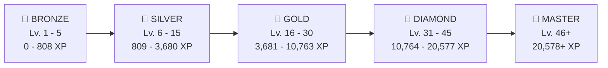
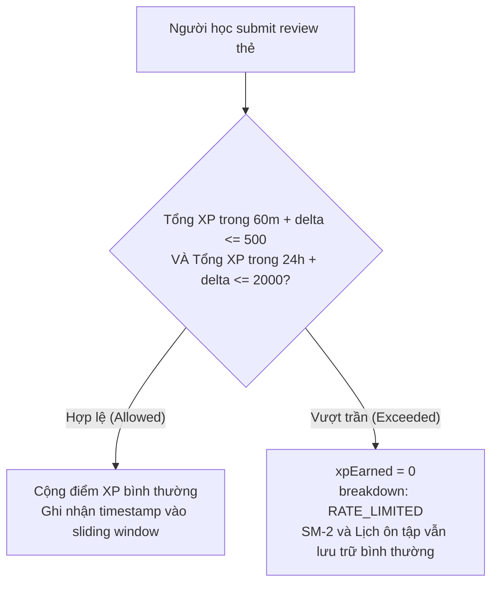

# 🧮 Thuật toán Điểm kinh nghiệm (XP) & Cấp bậc học viên (Learner Levels Engine)

WordStreak sử dụng hệ thống **Điểm kinh nghiệm (XP) & Cấp bậc lũy tiến đa thức** để thúc đẩy động lực học tập, xây dựng thói quen ghi nhớ từ vựng dài hạn thông qua cơ chế tưởng thưởng vi mô (Micro-reinforcement) và lộ trình danh vọng 5 Hạng thành thạo.

---

## 1. Công thức Ngưỡng Cấp bậc Đa thức (Polynomial Level Curve)

Ngưỡng tổng điểm kinh nghiệm tối thiểu ($\text{threshold}$) để đạt đến cấp bậc $L$ ($L \ge 1$) được xác định bởi hàm đa thức bậc $1.5$:

$$\text{threshold}(L) = \begin{cases} 0 & \text{khi } L \le 1 \\ \lfloor 50 \times (L - 1)^{1.5} + 50 \times (L - 1) \rfloor & \text{khi } L > 1 \end{cases}$$

Trong đó:

- $L$: Cấp bậc mục tiêu ($L \in \mathbb{N}_{\ge 1}$).
- $(L-1)^{1.5}$: Thành phần lũy thừa phi tuyến tính tạo độ dốc nhẹ nhàng ở giai đoạn khởi đầu và tăng dần độ thử thách ở các cấp cao.
- $50 \times (L-1)$: Thành phần tuyến tính đảm bảo khoảng cách giữa các cấp liên tiếp luôn tăng tối thiểu một lượng cơ sở.

### Lượng XP cần thiết để thăng cấp tiếp theo:

$$\Delta\text{XP}(L \to L+1) = \text{threshold}(L+1) - \text{threshold}(L)$$

---

## 2. Bảng Tra cứu Cấp bậc & Ngưỡng XP Mẫu ($L=1 \dots 50$)

| Level ($L$) | Ngưỡng XP tối thiểu ($\text{threshold}$) | XP cần từ Level trước ($\Delta\text{XP}$) | Hạng Danh vọng (Mastery Tier) |
| :---------: | :--------------------------------------: | :---------------------------------------: | :---------------------------: |
|  **Lv. 1**  |                 **0 XP**                 |                     —                     |         🥉 **BRONZE**         |
|  **Lv. 2**  |                **100 XP**                |                  100 XP                   |         🥉 **BRONZE**         |
|  **Lv. 3**  |                **241 XP**                |                  141 XP                   |         🥉 **BRONZE**         |
|  **Lv. 4**  |                **409 XP**                |                  168 XP                   |         🥉 **BRONZE**         |
|  **Lv. 5**  |                **600 XP**                |                  191 XP                   |         🥉 **BRONZE**         |
|  **Lv. 6**  |                **809 XP**                |                  209 XP                   |         🥈 **SILVER**         |
| **Lv. 10**  |               **1,800 XP**               |                  282 XP                   |         🥈 **SILVER**         |
| **Lv. 15**  |               **3,322 XP**               |                  358 XP                   |         🥈 **SILVER**         |
| **Lv. 16**  |               **3,681 XP**               |                  359 XP                   |          🥇 **GOLD**          |
| **Lv. 20**  |               **5,289 XP**               |                  425 XP                   |          🥇 **GOLD**          |
| **Lv. 25**  |               **7,591 XP**               |                  496 XP                   |          🥇 **GOLD**          |
| **Lv. 30**  |              **10,207 XP**               |                  557 XP                   |          🥇 **GOLD**          |
| **Lv. 31**  |              **10,764 XP**               |                  557 XP                   |        💎 **DIAMOND**         |
| **Lv. 35**  |              **13,121 XP**               |                  610 XP                   |        💎 **DIAMOND**         |
| **Lv. 40**  |              **16,339 XP**               |                  674 XP                   |        💎 **DIAMOND**         |
| **Lv. 45**  |              **19,846 XP**               |                  732 XP                   |        💎 **DIAMOND**         |
| **Lv. 46**  |              **20,578 XP**               |                  732 XP                   |         👑 **MASTER**         |
| **Lv. 50**  |              **23,618 XP**               |                  788 XP                   |         👑 **MASTER**         |

---

## 3. Hệ thống 5 Hạng Danh Vọng (Mastery Tiers)

Toàn bộ quá trình tiến hóa học thuật của học viên được phân bổ thành 5 Hạng đại diện cho các mốc thành thạo ngôn ngữ:



### Chi tiết Đặc tả từng Hạng:

| Hạng (Tier) | Tên tiếng Việt | Cấp độ (Levels) | Màu đại diện (Hex) | Biểu tượng Badge | Ý nghĩa học thuật                                                            |
| :---------- | :------------- | :-------------- | :----------------- | :--------------- | :--------------------------------------------------------------------------- |
| **BRONZE**  | Đồng           | Cấp 1 – 5       | `#B45309`          | `bronze-crest`   | Giai đoạn làm quen, xây dựng thói quen mở app và học 50-100 từ đầu tiên.     |
| **SILVER**  | Bạc            | Cấp 6 – 15      | `#94A3B8`          | `silver-crest`   | Người học kiên trì, duy trì nhịp ôn tập đều đặn và tích lũy vốn từ cơ bản.   |
| **GOLD**    | Vàng           | Cấp 16 – 30     | `#D97706`          | `gold-crest`     | Vốn từ mở rộng, đạt tốc độ phản xạ cao và hoàn thành các bộ từ chuyên ngành. |
| **DIAMOND** | Kim Cương      | Cấp 31 – 45     | `#06B6D4`          | `diamond-crest`  | Khả năng ghi nhớ vượt trội, duy trì chuỗi học tập bền vững trên 30-60 ngày.  |
| **MASTER**  | Cao Thủ        | Cấp 46 – 50+    | `#8B5CF6`          | `master-crest`   | Đẳng cấp cao nhất, làm chủ toàn bộ kho từ vựng và thuật toán ghi nhớ SM-2.   |

---

## 4. Ma trận Quy tắc Cộng điểm (XP Earning Rules Matrix)

Mọi điểm số trong hệ thống đều được thẩm định phía máy chủ (Server-authoritative), đảm bảo không thể giả mạo từ client:

| Hoạt động (Action Type)        | Điều kiện kích hoạt                                     | Điểm thưởng (+XP) | Hạn mức & Ràng buộc                                            |
| :----------------------------- | :------------------------------------------------------ | :---------------: | :------------------------------------------------------------- |
| **`CARD_REVIEW`** (Easy)       | Đánh giá thẻ SRS Rating 4                               |    **+10 XP**     | Chịu giới hạn trần vận tốc 500 XP/h.                           |
| **`CARD_REVIEW`** (Good)       | Đánh giá thẻ SRS Rating 3                               |    **+10 XP**     | Chịu giới hạn trần vận tốc 500 XP/h.                           |
| **`CARD_REVIEW`** (Hard)       | Đánh giá thẻ SRS Rating 2                               |     **+5 XP**     | Chịu giới hạn trần vận tốc 500 XP/h.                           |
| **`CARD_REVIEW`** (Again)      | Đánh giá thẻ SRS Rating 1                               |     **0 XP**      | Không bị trừ điểm phạt (Zero penalty).                         |
| **`DAILY_GOAL_COMPLETED`**     | Đạt số lượt review trong ngày $\ge \text{dailyGoal}$    |    **+50 XP**     | Duy nhất **1 lần/ngày** tính theo múi giờ IANA của người dùng. |
| **`STREAK_7_DAYS`**            | Chuỗi ngày tăng và $\text{currentStreak} \pmod 7 = 0$   |    **+100 XP**    | Chỉ thưởng khi chuỗi thực sự tăng (`streakIncreased = true`).  |
| **`STREAK_30_DAYS`**           | Chuỗi ngày tăng và $\text{currentStreak} \pmod{30} = 0$ |    **+500 XP**    | Chỉ thưởng khi chuỗi thực sự tăng (`streakIncreased = true`).  |
| **`PRACTICE_QUIZ`** (Xuất sắc) | Hoàn thành Quiz trắc nghiệm/điền từ $\ge 80\%$ điểm     |    **+30 XP**     | Tối đa **5 lượt thưởng/ngày**.                                 |
| **`PRACTICE_QUIZ`** (Đạt)      | Hoàn thành Quiz trắc nghiệm/điền từ $< 80\%$ điểm       |    **+10 XP**     | Tối đa **5 lượt thưởng/ngày**.                                 |
| **`HISTORICAL_BACKFILL`**      | Nạp bù điểm cho tài khoản cũ                            |    Biến thiên     | Tính toán 1 lần duy nhất khi nâng cấp hệ thống (idempotent).   |

---

## 5. Kiểm soát Vận tốc Chống Gian lận (Anti-Abuse Velocity Rate Limiter)

Nhằm ngăn ngừa hành vi dùng bot tự động spam đánh giá thẻ để cày cấp độ ảo, WordStreak áp dụng cơ chế giới hạn vận tốc đa tầng (Sliding Window Velocity Limiter):

### Các mốc hạn mức:

1. **Trần theo giờ**: Tối đa **$500\text{ XP}$ trong 60 phút trượt**.
2. **Trần theo ngày**: Tối đa **$2,000\text{ XP}$ trong 24 giờ trượt**.

### Cơ chế hoạt động:



- Khi người học vượt hạn mức, thuật toán SM-2 và trạng thái ôn tập của từ vựng **vẫn được lưu trữ đầy đủ** để không làm gián đoạn trải nghiệm học tập, nhưng lượng XP nhận được từ thẻ đó sẽ tạm thời về $0\text{ XP}$ cho đến khi cửa sổ trượt hạ nhiệt.

---

## 6. Triển khai Mã nguồn Tham chiếu (Reference Implementation)

File: [`packages/shared-types/src/gamification-xp.ts`](file:///Users/vutuanhau/Documents/PROJECT/WordStreak/packages/shared-types/src/gamification-xp.ts)

```typescript
export const MasteryTier = {
  BRONZE: "BRONZE",
  SILVER: "SILVER",
  GOLD: "GOLD",
  DIAMOND: "DIAMOND",
  MASTER: "MASTER",
} as const;

export type MasteryTier = (typeof MasteryTier)[keyof typeof MasteryTier];

/**
 * Tính toán ngưỡng XP tối thiểu cần để đạt Cấp L
 */
export function calculateThresholdForLevel(level: number): number {
  if (level <= 1) return 0;
  const lMinus1 = level - 1;
  return Math.floor(50 * Math.pow(lMinus1, 1.5) + 50 * lMinus1);
}

/**
 * Xác định Cấp bậc hiện tại từ Tổng XP tích lũy
 */
export function calculateLevelFromXp(totalXp: number): number {
  if (totalXp <= 0) return 1;
  let level = 1;
  while (totalXp >= calculateThresholdForLevel(level + 1)) {
    level++;
  }
  return level;
}

/**
 * Xác định Hạng Danh vọng từ Cấp bậc
 */
export function calculateTierFromLevel(level: number): MasteryTier {
  if (level >= 46) return MasteryTier.MASTER;
  if (level >= 31) return MasteryTier.DIAMOND;
  if (level >= 16) return MasteryTier.GOLD;
  if (level >= 6) return MasteryTier.SILVER;
  return MasteryTier.BRONZE;
}

/**
 * Tính toán chi tiết tiến độ phần trăm đến Cấp tiếp theo
 */
export function calculateLevelProgress(totalXp: number) {
  const safeXp = Math.max(0, totalXp);
  const level = calculateLevelFromXp(safeXp);
  const tier = calculateTierFromLevel(level);

  const currentLevelThresholdXp = calculateThresholdForLevel(level);
  const nextLevelThresholdXp = calculateThresholdForLevel(level + 1);

  const currentLevelXp = safeXp - currentLevelThresholdXp;
  const nextLevelRequiredXp = nextLevelThresholdXp - currentLevelThresholdXp;

  const rawPercent = (currentLevelXp / nextLevelRequiredXp) * 100;
  const progressPercent = Math.min(
    100,
    Math.max(0, Math.round(rawPercent * 100) / 100),
  );

  return {
    level,
    tier,
    currentLevelThresholdXp,
    nextLevelThresholdXp,
    currentLevelXp,
    nextLevelRequiredXp,
    progressPercent,
  };
}
```

---

## 7. Liên kết Tài liệu Liên quan

- [Tài liệu Tính năng: Gamification XP & Levels (`docs/features/gamification-xp-levels/README.md`)](../features/gamification-xp-levels/README.md)
- [Thuật toán Lặp lại ngắt quãng SuperMemo-2 (`docs/algorithms/supermemo-2.md`)](./supermemo-2.md)
- [Đặc tả Kỹ thuật Chi tiết (`.specify/features/gamification-xp-levels/spec.md`)](../../.specify/features/gamification-xp-levels/spec.md)
- [Kế hoạch Kiểm thử TDD (`.specify/features/gamification-xp-levels/test-plan.md`)](../../.specify/features/gamification-xp-levels/test-plan.md)
