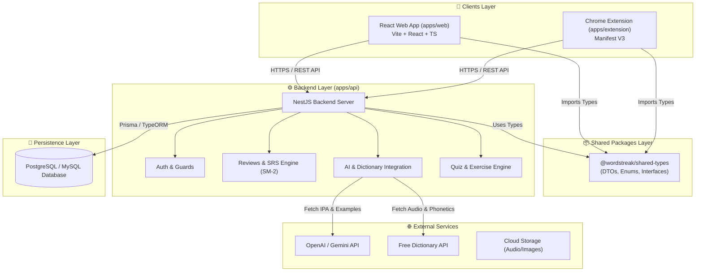

# 🏗️ Sơ đồ Kiến trúc Hệ thống (System Architecture Overview)

Tài liệu này mô tả tổng quan kiến trúc hệ thống của ứng dụng **WordStreak** theo mô hình pnpm Monorepo.

---

## 📊 1. Sơ đồ Luồng Hoạt động (System Component Diagram)

---

## 🧩 2. Các thành phần chính trong Monorepo

| Component | Đường dẫn | Công nghệ | Vai trò chính |
| :--- | :--- | :--- | :--- |
| **Backend API** | `apps/api` | NestJS, TypeScript, Node.js | Cung cấp RESTful APIs, xử lý authentication, thuật toán SRS, bài tập quiz, tích hợp AI. |
| **Web App** | `apps/web` | React 19, Vite, TypeScript | Giao diện người dùng học flashcard, làm bài tập, theo dõi biểu đồ tiến trình và streak. |
| **Chrome Extension** | `apps/extension` | React, Vite, Manifest V3 | Tiện ích duyệt web: bôi đen từ mới trên bất kỳ trang web nào -> Lưu nhanh vào bộ từ vựng. |
| **Shared Types** | `packages/shared-types` | TypeScript | Package lưu trữ các Interfaces, DTOs và Enums dùng chung cho cả Web, API và Extension. |

---

## 🔒 3. Cơ chế Bảo mật & Xác thực (Authentication Flow)

1. **Xác thực JWT (JSON Web Token):**
   - User đăng nhập thành công ➔ Backend cấp cặp token: `accessToken` (thời hạn ngắn, e.g. 15m) và `refreshToken` (thời hạn dài, e.g. 7d).
   - Frontend `apps/web` và `apps/extension` tự động gắn `Authorization: Bearer <accessToken>` trong các HTTP request.

2. **Cơ chế Guards trong NestJS:**
   - Tất cả các endpoint riêng tư đều được bảo vệ bởi `@UseGuards(JwtAuthGuard)`.
   - Đối với các endpoint công khai (e.g. login, register, public decks), sử dụng decorator `@Public()`.
