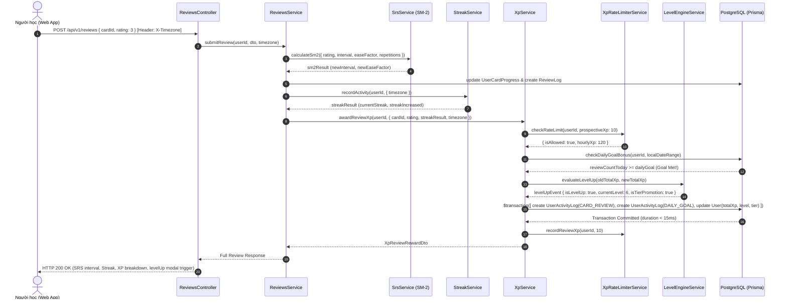
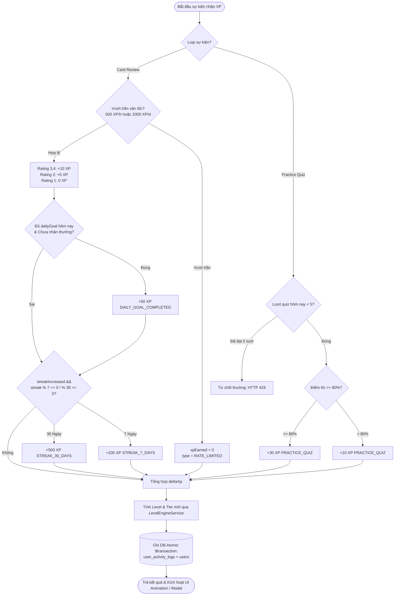

# Feature: Gamification XP & Learner Levels System (US-GAME-03)

**Slug**: `gamification-xp-levels`  
**Version**: 1.0  
**Ship date**: 2026-08-21  
**Spec**: [.specify/features/gamification-xp-levels/](../../.specify/features/gamification-xp-levels/)  
**Baseline**: [SIGNED-OFF v1.0](../../.specify/features/gamification-xp-levels/baseline.md)  
**Test Plan**: [.specify/features/gamification-xp-levels/test-plan.md](../../.specify/features/gamification-xp-levels/test-plan.md)  
**Validation Report**: [.specify/features/gamification-xp-levels/validation-report.md](../../.specify/features/gamification-xp-levels/validation-report.md)  
**Algorithm Specification**: [docs/algorithms/xp-and-levels.md](../../algorithms/xp-and-levels.md)

---

## 1. Mô tả ngắn (Overview & Business Value)

Hệ thống **Gamification XP & Learner Levels System (US-GAME-03)** cung cấp cơ chế động lực học tập đa tầng (Multi-tier Gamification Engine) cho WordStreak, kết hợp giữa phản hồi tức thời (Micro-reinforcement) và lộ trình phát triển dài hạn (Long-term Mastery Ladder).

### Vấn đề giải quyết & Giá trị mang lại:

1. **Phản hồi tức thì (Micro-reinforcement)**: Người học nhận điểm kinh nghiệm (XP) ngay khi chấm điểm thẻ flashcard (SRS review), hoàn thành bài thực hành (practice quiz), đạt mục tiêu ngày (daily goal), và duy trì chuỗi học tập (streak milestones).
2. **Thước đo năng lực minh bạch (Deterministic Progression)**: Sử dụng hàm đa thức bậc 1.5 $\text{threshold}(L) = \lfloor 50 \times (L-1)^{1.5} + 50 \times (L-1) \rfloor$ chia thành **5 Hạng danh vọng** (_Bronze, Silver, Gold, Diamond, Master_), khuyến khích người học duy trì thói quen ôn tập hàng ngày để thăng hạng.
3. **An toàn & Minh bạch dữ liệu**: Mọi giao dịch XP được lưu trữ bất biến trong sổ cái hoạt động (`user_activity_logs`) và cập nhật đồng thời với `User` trong **một PostgreSQL Transaction nguyên tử duy nhất**, đi kèm bộ lọc vận tốc (Velocity Rate Limiter) ngăn chặn tự động cày điểm gian lận.

---

## 2. Phạm vi tính năng (MoSCoW Must-Have đã ship)

- [x] **REQ-XP-001 (Card Review XP Engine)**: Cộng điểm server-authoritative khi lật thẻ SRS: Thẻ `GOOD`/`EASY` ($+10\text{ XP}$), `HARD` ($+5\text{ XP}$), `AGAIN` ($0\text{ XP}$).
- [x] **REQ-XP-002 (Daily Goal Bonus)**: Tự động thưởng $+50\text{ XP}$ khi hoàn thành số lượng từ mục tiêu hàng ngày (`dailyGoal`) theo múi giờ địa phương của người học (tối đa 1 lần/ngày).
- [x] **REQ-XP-003 & REQ-XP-004 (Streak Milestones XP)**: Thưởng $+100\text{ XP}$ khi đạt chuỗi 7 ngày và $+500\text{ XP}$ khi đạt chuỗi 30 ngày (kèm cờ `streakIncreased = true`).
- [x] **REQ-XP-005 (Pure Level & 5-Tier Engine)**: Triển khai thuật toán xác định cấp bậc và hạng danh vọng thuần túy (pure deterministic functions) đồng nhất giữa backend và frontend.
- [x] **REQ-XP-006 (Atomic PostgreSQL Transaction Ledger)**: Ghi nhật ký vào bảng `user_activity_logs` và cập nhật `User.totalXp`, `User.level`, `User.tier` trong một `$transaction`.
- [x] **REQ-XP-007 (Anti-Abuse Velocity Rate Limiting)**: Giới hạn trần tối đa $500\text{ XP/giờ}$ và $2,000\text{ XP/24 giờ}$ cho hoạt động ôn tập thẻ, sử dụng sliding window in-memory kết hợp warm-up từ DB.
- [x] **REQ-XP-008 (Topbar Gamification Widget)**: Hiển thị Level Pill trên thanh điều hướng với huy hiệu Hạng, nhãn `Lv. X`, thanh tiến độ lỏng và tooltip chi tiết khi hover.
- [x] **REQ-XP-009 (Study Floating Micro-Animation)**: Hiệu ứng hạt điểm nổi `+10 XP` bay lên 24px và mờ dần trong 800ms khi người học đánh giá thẻ.
- [x] **REQ-XP-010 (Level-Up Celebration Modal)**: Modal chúc mừng thăng cấp phong cách Obsidian dark (`#090909`), hiệu ứng huy hiệu xoay lò xo và pháo hoa Confetti toàn màn hình (hỗ trợ `prefers-reduced-motion`).
- [x] **REQ-XP-011 (Practice Quiz XP Rewards)**: Thưởng $+30\text{ XP}$ (điểm $\ge 80\%$) hoặc $+10\text{ XP}$ (điểm $< 80\%$) khi hoàn thành quiz trắc nghiệm / điền từ, giới hạn tối đa 5 lượt thưởng/ngày.
- [x] **REQ-XP-012 (Idempotent Historical Backfill)**: Script nạp bù điểm lịch sử an toàn cho người dùng cũ dựa trên số lượng review hợp lệ và chuỗi kỷ lục.

---

## 3. Ngoài phạm vi (Won't-Have v1)

- **Trừ điểm phạt XP (Negative XP)**: Không áp dụng trừ điểm khi đánh giá thẻ "Again" hoặc khi đứt chuỗi (duy trì triết lý tâm lý học tích cực).
- **Vật phẩm nhân đôi XP (Paid XP Boosters)**: Không bán vật phẩm buff điểm bằng tiền thật.
- **Giảm cấp bậc do vắng mặt (Level Degradation)**: Cấp bậc và XP là tài sản tích lũy vĩnh viễn, không bị tụt cấp khi tạm dừng học.
- **Bảng xếp hạng PvP đối kháng trực tiếp**: Chuyển giao sang phạm vi tính năng Social Leaderboards (Epic 09).

---

## 4. Kiến trúc & Luồng dữ liệu (Architecture & Data Flow)

### 4.1. Luồng chấm điểm Review thẻ, tính XP và Thăng cấp (Sequence Diagram)



### 4.2. Sơ đồ Cây quyết định Phân phối Điểm thưởng (XP Distribution Tree)



---

## 5. Các thành phần cốt lõi (Key Components)

### 5.1. Backend (`apps/api`)

| Component                                                                                                                                            | File Path                                                               | Trách nhiệm chính                                                                                                |
| :--------------------------------------------------------------------------------------------------------------------------------------------------- | :---------------------------------------------------------------------- | :--------------------------------------------------------------------------------------------------------------- |
| [`XpModule`](file:///Users/vutuanhau/Documents/PROJECT/WordStreak/apps/api/src/modules/gamification/gamification.module.ts)                          | `apps/api/src/modules/gamification/gamification.module.ts`              | Khai báo controller, providers và export `XpService`, `LevelEngineService`.                                      |
| [`XpController`](file:///Users/vutuanhau/Documents/PROJECT/WordStreak/apps/api/src/modules/gamification/xp.controller.ts)                            | `apps/api/src/modules/gamification/xp.controller.ts`                    | Cung cấp REST endpoints cho tóm tắt XP (`/summary`), lịch sử hoạt động (`/history`), và thực hành (`/practice`). |
| [`XpService`](file:///Users/vutuanhau/Documents/PROJECT/WordStreak/apps/api/src/modules/gamification/services/xp.service.ts)                         | `apps/api/src/modules/gamification/services/xp.service.ts`              | Phân phối XP nguyên tử, kiểm tra mốc streak, thưởng daily goal theo timezone và thực thi `$transaction`.         |
| [`LevelEngineService`](file:///Users/vutuanhau/Documents/PROJECT/WordStreak/apps/api/src/modules/gamification/services/level-engine.service.ts)      | `apps/api/src/modules/gamification/services/level-engine.service.ts`    | Thực thi thuật toán xác định cấp bậc, tiến độ %, hạng thành thạo và phát hiện sự kiện thăng cấp.                 |
| [`XpRateLimiterService`](file:///Users/vutuanhau/Documents/PROJECT/WordStreak/apps/api/src/modules/gamification/services/xp-rate-limiter.service.ts) | `apps/api/src/modules/gamification/services/xp-rate-limiter.service.ts` | Quản lý sliding window in-memory (500 XP/hr, 2,000 XP/24h) chống spam và cày điểm bot.                           |

### 5.2. Frontend (`apps/web`)

| Component / Hook                                                                                                                                            | File Path                                                                   | Trách nhiệm chính                                                                                  |
| :---------------------------------------------------------------------------------------------------------------------------------------------------------- | :-------------------------------------------------------------------------- | :------------------------------------------------------------------------------------------------- |
| [`useXpSummary`](file:///Users/vutuanhau/Documents/PROJECT/WordStreak/apps/web/src/features/gamification/hooks/useXpSummary.ts)                             | `apps/web/src/features/gamification/hooks/useXpSummary.ts`                  | React Hook fetch dữ liệu tổng quan XP, lắng nghe event cập nhật toàn cục `wordstreak:xp-updated`.  |
| [`TopbarLevelWidget`](file:///Users/vutuanhau/Documents/PROJECT/WordStreak/apps/web/src/features/gamification/components/TopbarLevelWidget.tsx)             | `apps/web/src/features/gamification/components/TopbarLevelWidget.tsx`       | Level Pill trên Header hiển thị huy hiệu Tier, nhãn level, progress bar và hover tooltip chi tiết. |
| [`FloatingXpToast`](file:///Users/vutuanhau/Documents/PROJECT/WordStreak/apps/web/src/features/gamification/components/FloatingXpToast.tsx)                 | `apps/web/src/features/gamification/components/FloatingXpToast.tsx`         | Hiệu ứng vi mô hiển thị badge `+10 XP` nổi lên khi submit rating thẻ.                              |
| [`LevelUpCelebrationModal`](file:///Users/vutuanhau/Documents/PROJECT/WordStreak/apps/web/src/features/gamification/components/LevelUpCelebrationModal.tsx) | `apps/web/src/features/gamification/components/LevelUpCelebrationModal.tsx` | Modal chúc mừng thăng cấp Obsidian Dark với hiệu ứng pháo hoa Confetti và lò xo Spring animation.  |
| [`TierBadgeIcon`](file:///Users/vutuanhau/Documents/PROJECT/WordStreak/apps/web/src/features/gamification/components/TierBadgeIcon.tsx)                     | `apps/web/src/features/gamification/components/TierBadgeIcon.tsx`           | Render vector SVG crest tương ứng 5 Hạng (Đồng, Bạc, Vàng, Kim Cương, Cao Thủ).                    |
| [`XpHistoryDrawer`](file:///Users/vutuanhau/Documents/PROJECT/WordStreak/apps/web/src/features/gamification/components/XpHistoryDrawer.tsx)                 | `apps/web/src/features/gamification/components/XpHistoryDrawer.tsx`         | Drawer/Modal xem toàn bộ lịch sử điểm và hoạt động nhận thưởng phân trang.                         |

### 5.3. Shared Types & Formulae (`packages/shared-types`)

- File: [`packages/shared-types/src/gamification-xp.ts`](file:///Users/vutuanhau/Documents/PROJECT/WordStreak/packages/shared-types/src/gamification-xp.ts)
- Chứa các hàm pure calculation: `calculateThresholdForLevel`, `calculateLevelFromXp`, `calculateTierFromLevel`, `calculateLevelProgress`.

---

## 6. Hợp đồng API & Endpoints (API Contracts & Endpoints)

### 6.1. `POST /api/v1/reviews` (Mở rộng)

Submits đánh giá thẻ SRS, tính toán SM-2, cập nhật streak và cộng điểm XP nguyên tử.

- **Headers**:
  - `Authorization: Bearer <jwt>`
  - `X-Timezone: Asia/Ho_Chi_Minh` (Tùy chọn)
- **Request Body**:
  ```json
  {
    "cardId": "c3f87622-498b-4948-a83d-3b5671ef3b40",
    "rating": 3
  }
  ```
- **Response `200 OK`**:
  ```json
  {
    "cardId": "c3f87622-498b-4948-a83d-3b5671ef3b40",
    "status": "LEARNING",
    "interval": 1,
    "repetitions": 1,
    "easeFactor": 2.5,
    "lastReviewedAt": "2026-08-21T08:15:00.000Z",
    "nextReviewDate": "2026-08-22T08:15:00.000Z",
    "streak": {
      "currentStreak": 7,
      "bestStreak": 7,
      "streakIncreased": true,
      "isActiveToday": true,
      "flameTier": 2,
      "message": "7 day streak! Keep it going!",
      "streakFreezes": 1
    },
    "xp": {
      "xpEarned": 160,
      "breakdown": [
        { "type": "CARD_REVIEW", "xp": 10, "description": "Good Review" },
        {
          "type": "DAILY_GOAL_COMPLETED",
          "xp": 50,
          "description": "Daily Goal Reached (10 cards) [2026-08-21]"
        },
        {
          "type": "STREAK_7_DAYS",
          "xp": 100,
          "description": "7-Day Streak Milestone"
        }
      ],
      "totalXp": 820,
      "level": 6,
      "tier": "SILVER",
      "currentLevelXp": 10,
      "nextLevelRequiredXp": 250,
      "levelProgressPercent": 4.0,
      "levelUp": {
        "isLevelUp": true,
        "previousLevel": 5,
        "currentLevel": 6,
        "previousTier": "BRONZE",
        "currentTier": "SILVER",
        "isTierPromotion": true
      }
    }
  }
  ```

---

### 6.2. `GET /api/v1/gamification/xp/summary`

Truy vấn bảng tổng quan tiến độ cấp bậc, tổng điểm XP và số điểm tích lũy trong ngày hiện tại.

- **Headers**:
  - `Authorization: Bearer <jwt>`
  - `X-Timezone: Asia/Ho_Chi_Minh`
- **Response `200 OK`**:
  ```json
  {
    "success": true,
    "data": {
      "userId": "usr_772211",
      "totalXp": 4250,
      "level": 18,
      "tier": "GOLD",
      "currentLevelXp": 185,
      "nextLevelRequiredXp": 490,
      "levelProgressPercent": 37.75,
      "todayXp": 80,
      "dailyGoalBonusEarnedToday": true,
      "nextTier": "DIAMOND",
      "nextTierLevel": 31,
      "tierMetadata": {
        "tier": "GOLD",
        "nameEn": "Gold",
        "nameVi": "Vàng",
        "minLevel": 16,
        "maxLevel": 30,
        "colorHex": "#D97706",
        "badgeIcon": "gold-crest"
      }
    }
  }
  ```

---

### 6.3. `GET /api/v1/gamification/xp/history`

Lấy danh sách nhật ký cộng điểm hoạt động có phân trang và bộ lọc theo loại hoạt động.

- **Query Parameters**:
  - `page`: number (mặc định: 1)
  - `limit`: number (mặc định: 20, max: 100)
  - `activityType`: string (`CARD_REVIEW`, `DAILY_GOAL_COMPLETED`, `STREAK_7_DAYS`, `STREAK_30_DAYS`, `PRACTICE_QUIZ`, `ADMIN_ADJUSTMENT`, `HISTORICAL_BACKFILL`)
- **Response `200 OK`**:
  ```json
  {
    "success": true,
    "data": {
      "data": [
        {
          "id": "act_8833aabb",
          "activityType": "DAILY_GOAL_COMPLETED",
          "xpEarned": 50,
          "metadata": {
            "description": "Daily Goal Reached (10 cards) [2026-08-21]"
          },
          "createdAt": "2026-08-21T08:15:00.000Z"
        },
        {
          "id": "act_9944ccdd",
          "activityType": "CARD_REVIEW",
          "xpEarned": 10,
          "metadata": { "description": "Good Review" },
          "createdAt": "2026-08-21T08:14:55.000Z"
        }
      ],
      "meta": {
        "total": 128,
        "page": 1,
        "limit": 20,
        "totalPages": 7
      }
    }
  }
  ```

---

### 6.4. `POST /api/v1/gamification/xp/practice`

Ghi nhận kết quả bài luyện tập và thưởng điểm kinh nghiệm thực hành (tối đa 5 lần/ngày).

- **Request Body**:
  ```json
  {
    "sessionId": "quiz_session_0102",
    "score": 9,
    "totalQuestions": 10
  }
  ```
- **Response `200 OK`**:
  ```json
  {
    "success": true,
    "data": {
      "sessionId": "quiz_session_0102",
      "scorePercentage": 90.0,
      "xpEarned": 30,
      "totalXp": 4280,
      "level": 18,
      "tier": "GOLD",
      "levelUp": {
        "isLevelUp": false,
        "previousLevel": 18,
        "currentLevel": 18,
        "previousTier": "GOLD",
        "currentTier": "GOLD",
        "isTierPromotion": false
      }
    },
    "message": "Practice quiz XP awarded successfully"
  }
  ```

---

## 7. Cơ sở dữ liệu (Database Schema & Indexes)

File: [`apps/api/prisma/schema.prisma`](file:///Users/vutuanhau/Documents/PROJECT/WordStreak/apps/api/prisma/schema.prisma)

### 7.1. Bảng `user_activity_logs` (Nhật ký giao dịch bất biến)

```prisma
model UserActivityLog {
  id           String   @id @default(uuid())
  userId       String
  activityType String   // CARD_REVIEW | DAILY_GOAL_COMPLETED | STREAK_7_DAYS | STREAK_30_DAYS | PRACTICE_QUIZ | ADMIN_ADJUSTMENT | HISTORICAL_BACKFILL
  xpEarned     Int
  metadata     Json?    // e.g. { "description": "...", "sessionId": "...", "score": 9 }
  createdAt    DateTime @default(now())

  user         User     @relation(fields: [userId], references: [id], onDelete: Cascade)

  @@index([userId, createdAt])
  @@index([userId, activityType])
  @@index([userId, activityType, createdAt])
  @@index([createdAt])
  @@map("user_activity_logs")
}
```

### 7.2. Mở rộng Model `User`

```prisma
model User {
  // ... các trường cơ bản
  totalXp      Int                @default(0)
  level        Int                @default(1)
  tier         String             @default("BRONZE")
  activityLogs UserActivityLog[]
}
```

---

## 8. Test Evidence & Quality Verification

Toàn bộ test suite liên quan đến Gamification XP & Levels đã được triển khai hoàn chỉnh và đạt **100% Pass Rate**:

### 8.1. Backend Unit & Integration Suites (`apps/api`)

- **Tổng kết**: **26 test suites, 185 tests passing** (Jest).
- **Test files trọng tâm**:
  - [`apps/api/src/modules/gamification/services/xp.service.spec.ts`](file:///Users/vutuanhau/Documents/PROJECT/WordStreak/apps/api/src/modules/gamification/services/xp.service.spec.ts): Kiểm thử thưởng review XP, daily goal deduplication, streak milestones, transaction atomicity, practice quiz capping.
  - [`apps/api/src/modules/gamification/services/level-engine.service.spec.ts`](file:///Users/vutuanhau/Documents/PROJECT/WordStreak/apps/api/src/modules/gamification/services/level-engine.service.spec.ts): Kiểm thử độ chính xác công thức toán đa thức bậc 1.5, boundary transitions 5 Tiers và progress percentage.
  - [`apps/api/src/modules/gamification/services/xp-rate-limiter.service.spec.ts`](file:///Users/vutuanhau/Documents/PROJECT/WordStreak/apps/api/src/modules/gamification/services/xp-rate-limiter.service.spec.ts): Kiểm thử sliding window 500 XP/hr và 2,000 XP/day, cache warm-up từ database.
  - [`apps/api/src/modules/gamification/xp.controller.spec.ts`](file:///Users/vutuanhau/Documents/PROJECT/WordStreak/apps/api/src/modules/gamification/xp.controller.spec.ts): Kiểm thử REST handler controller.

```text
PASS src/modules/gamification/services/xp.service.spec.ts
PASS src/modules/gamification/services/level-engine.service.spec.ts
PASS src/modules/gamification/services/xp-rate-limiter.service.spec.ts
PASS src/modules/gamification/xp.controller.spec.ts
PASS src/modules/reviews/reviews.service.spec.ts
PASS src/modules/reviews/reviews.controller.spec.ts
...
Test Suites: 26 passed, 26 total
Tests:       185 passed, 185 total
Time:        2.955 s
```

### 8.2. Frontend Component Suites (`apps/web`)

- **Tổng kết**: **17 test suites, 70 tests passing** (Vitest).
- **Test files trọng tâm**:
  - [`apps/web/src/features/gamification/components/TierBadgeIcon.spec.tsx`](file:///Users/vutuanhau/Documents/PROJECT/WordStreak/apps/web/src/features/gamification/components/TierBadgeIcon.spec.tsx): Render đúng 5 biểu tượng hạng theo màu và kích thước.
  - [`apps/web/src/features/gamification/components/TopbarLevelWidget.spec.tsx`](file:///Users/vutuanhau/Documents/PROJECT/WordStreak/apps/web/src/features/gamification/components/TopbarLevelWidget.spec.tsx): Render Level Pill, tiến độ % và popover hover.
  - [`apps/web/src/features/gamification/components/FloatingXpToast.spec.tsx`](file:///Users/vutuanhau/Documents/PROJECT/WordStreak/apps/web/src/features/gamification/components/FloatingXpToast.spec.tsx): Render badge nổi, tự động biến mất và tuân thủ prefers-reduced-motion.
  - [`apps/web/src/features/gamification/components/LevelUpCelebrationModal.spec.tsx`](file:///Users/vutuanhau/Documents/PROJECT/WordStreak/apps/web/src/features/gamification/components/LevelUpCelebrationModal.spec.tsx): Hiển thị modal chúc mừng thăng cấp, phím tắt Escape, trap focus.
  - [`apps/web/src/features/gamification/components/XpHistoryDrawer.spec.tsx`](file:///Users/vutuanhau/Documents/PROJECT/WordStreak/apps/web/src/features/gamification/components/XpHistoryDrawer.spec.tsx): Danh sách lịch sử nhận điểm và badge loại hoạt động.

```text
✓ src/features/gamification/components/TierBadgeIcon.spec.tsx (5 tests)
✓ src/features/gamification/components/TopbarLevelWidget.spec.tsx (3 tests)
✓ src/features/gamification/components/FloatingXpToast.spec.tsx (4 tests)
✓ src/features/gamification/components/LevelUpCelebrationModal.spec.tsx (4 tests)
✓ src/features/gamification/components/XpHistoryDrawer.spec.tsx (2 tests)
...
Test Files  17 passed (17)
Tests       70 passed (70)
```

---

## 9. Rollback & Migration Notes (Kế hoạch Triển khai & Phục hồi)

### 9.1. Database Migration

- Migration an toàn, tương thích ngược (Backward-compatible): Thêm cột `totalXp (DEFAULT 0)`, `level (DEFAULT 1)`, `tier (DEFAULT 'BRONZE')` vào bảng `users` và tạo mới bảng `user_activity_logs`.
- Không có breaking changes với các truy vấn cũ.

### 9.2. Historical Backfill

- Hệ thống hỗ trợ script backfill idempotent:
  ```bash
  pnpm --filter api run backfill:xp
  ```
- Script quét qua bảng `review_logs` và `user_streaks` để nạp bù điểm cho các tài khoản đang có `totalXp = 0`. Nếu chạy lại nhiều lần, tài khoản đã có `totalXp > 0` sẽ được bỏ qua an toàn.

### 9.3. Rollback Strategy

Nếu có sự cố nghiêm trọng cần rollback phiên bản:

1. Revert backend và frontend code về release trước đó.
2. Không cần drop bảng `user_activity_logs` hay drop cột trên `users` (dữ liệu tích lũy được bảo toàn nguyên vẹn cho lần deploy kế tiếp).

---

## 10. Tác giả & Phê duyệt

- **Implemented by**: AI Pair Programmer (Antigravity Senior Fullstack Specialist)
- **Reviewed & Signed-off by**: Lead Architect & Senior BA
- **Date**: 2026-08-21
- **Status**: Hoàn thành (`Delivered`)
