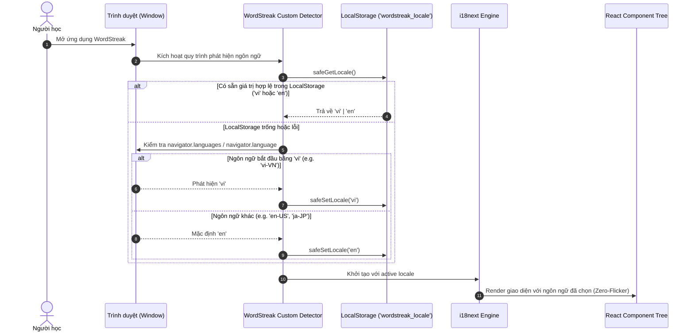
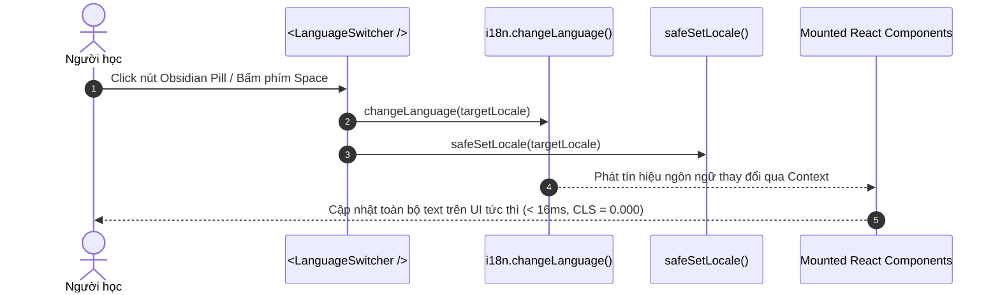

# Feature: Core i18n Infrastructure & Instant Language Switcher (US-I18N-01)

**Slug**: `i18n-core-switcher`  
**Version**: 1.0  
**Ship date**: 2026-08-22  
**Spec**: [.specify/features/i18n-core-switcher/](../../.specify/features/i18n-core-switcher/)  
**Baseline**: [SIGNED-OFF v1.0](../../.specify/features/i18n-core-switcher/baseline.md)  
**Epic**: `EPIC-10` (Localization & Internationalization Infrastructure)

---

## 1. Mô tả ngắn (Overview & Business Value)

Tính năng **Core i18n Infrastructure & Instant Language Switcher (US-I18N-01)** thiết lập nền tảng đa ngôn ngữ runtime tức thời (zero-reload) và an toàn kiểu dữ liệu 100% (type-safe) cho toàn bộ ứng dụng WordStreak (`apps/web`). Tính năng cho phép người học chuyển đổi mượt mà giữa **Tiếng Việt (`vi`)** và **Tiếng Anh (`en`)** chỉ với một cú nhấp chuột mà không bị mất dữ liệu phiên học, không giật lag giao diện và không cần tải lại trang.

```
┌──────────────────────────────────────────────────────────────────────────────────┐
│                         WordStreak i18n Architecture                             │
│                                                                                  │
│   [Obsidian Switcher] ──(Click / KeyPress)──> [i18next In-Memory State]          │
│          │                                                │                      │
│          ▼                                                ▼                      │
│   [LocalStorage] <───(safeSetLocale)───── [React Context Re-render (<16ms)]      │
│   ('wordstreak_locale')                                   │                      │
│          ▲                                                ▼                      │
│          └───(safeGetLocale)─────── [9 Domain Namespaces (vi / en)]              │
│                                     - common      - study      - community       │
│                                     - auth        - practice   - analytics       │
│                                     - dashboard   - decks      - settings        │
└──────────────────────────────────────────────────────────────────────────────────┘
```

### Vấn đề giải quyết & Giá trị mang lại:

1. **Chuyển đổi ngôn ngữ tức thì không tải lại trang (Zero-Reload Transition)**:
   - Thay đổi ngôn ngữ trực tiếp trong React memory context với độ trễ phản hồi $< 16\text{ms}$ (1 khung hình ở 60fps), giữ nguyên toàn bộ form đang nhập dở, trạng thái thẻ đang lật và tiến trình quiz.
2. **Tự động nhận diện ngôn ngữ trình duyệt (Browser Locale Detection)**:
   - Tự động phát hiện cài đặt `navigator.languages` của người học: khách truy cập từ Việt Nam (`vi*`) được tự động phục vụ giao diện Tiếng Việt ngay từ lần đầu truy cập, người dùng quốc tế mặc định Tiếng Anh (`en`).
3. **Phân vùng 9 Domain Namespaces chuyên biệt & Type-Safe 100%**:
   - Tách biệt từ điển thành 9 tệp JSON domain (`common`, `auth`, `dashboard`, `decks`, `study`, `practice`, `community`, `analytics`, `settings`).
   - Tận dụng TypeScript Module Declaration Augmentation (`CustomTypeOptions`) giúp IDE tự động gợi ý (autocomplete) và kiểm tra lỗi chính tả key dịch ngay khi code (`tsc -b --noEmit`).
4. **Nút bấm Obsidian Pill Switcher chuẩn Design System**:
   - Thiết kế dạng viên thuốc Obsidian dark (`#000000`), viền hairline 1px tinh tế, kích thước cố định chống giật layout (Anti-jitter geometry, CLS = 0.000), hỗ trợ đầy đủ phím tắt (`Enter`, `Space`) và chuẩn tiếp cận **WCAG 2.1 AA**.
5. **Khả năng chịu lỗi cao (Resilient LocalStorage & Graceful Fallbacks)**:
   - Xử lý mượt mà khi người dùng duyệt web ở chế độ ẩn danh (Incognito) hoặc LocalStorage bị chặn (`SecurityError`, `QuotaExceededError`).
   - Cơ chế tự phục hồi khi LocalStorage chứa giá trị không hợp lệ và tự động fallback về tiếng Anh (`en`) nếu thiếu key ở tiếng Việt.

---

## 2. Phạm vi tính năng (MoSCoW Scope)

### Must-Have (Đã hoàn thành trong v1.0)

- [x] **REQ-I18N-001 (Core Runtime & Detector)**: Tích hợp `i18next`, `react-i18next`, và `i18next-browser-languagedetector` với cấu hình fallback `en`, tải đồng bộ từ điển local.
- [x] **REQ-I18N-002 (Browser Detection & LocalStorage Cache)**: Tự động nhận diện mã ngôn ngữ `vi` từ browser, lưu trữ ưu tiên với key `wordstreak_locale`, bọc hàm an toàn `safeGetLocale` / `safeSetLocale`.
- [x] **REQ-I18N-003 (9 Modular Domain Namespaces)**: Tạo đầy đủ 18 tệp từ điển JSON (9 `vi` + 9 `en`) cho các nghiệp vụ `common`, `auth`, `dashboard`, `decks`, `study`, `practice`, `community`, `analytics`, `settings`.
- [x] **REQ-I18N-004 (Strict TypeScript Type-Safety)**: Khai báo module augmentation trong `apps/web/src/locales/types.ts` ràng buộc chặt chẽ kiểu trả về của hook `useTranslation()`.
- [x] **REQ-I18N-005 (Obsidian Pill Switcher Component)**: Xây dựng `<LanguageSwitcher />` tại `apps/web/src/components/LanguageSwitcher/` với giao diện Obsidian dark, cờ quốc gia `🇻🇳 VI` ⇄ `🇬🇧 EN`, hỗ trợ 2 kích thước (`obsidian` và `compact`).
- [x] **REQ-I18N-006 (Navigation Integration)**: Nhúng Language Switcher đồng bộ vào tất cả thanh điều hướng chính:
  - Header trang Landing Page (`apps/web/src/features/landing/components/Navbar.tsx`)
  - Header trang Dashboard (`apps/web/src/features/dashboard/components/DashboardNavbar.tsx`)
  - Layout Header dùng chung (`apps/web/src/components/layout/Header.tsx`)
- [x] **REQ-I18N-007 (Unit & Integration Testing)**: Bộ kiểm thử Vitest toàn diện cho Storage utils, I18n initialization, Translation Fallback, và Component UI interactions.

### Won't-Have (Dành cho các phiên bản tiếp theo)

- Hỗ trợ thêm các ngôn ngữ thứ 3 ngoài Vi/En (e.g., Nhật, Hàn, Trung) — Kiến trúc đã sẵn sàng mở rộng.
- Lazy-loading từ điển qua HTTP backend (hiện tại bundle JSON $< 15\text{KB}$ gzipped, tải tĩnh tối ưu tốc độ).

---

## 3. Kiến trúc Hệ thống & Luồng Dữ liệu (Architecture & Data Flow)

### 3.1. Sơ đồ Khởi tạo & Nhận diện Ngôn ngữ (Initialization Flow)



### 3.2. Sơ đồ Luồng Chuyển đổi Tức thì (Instant 1-Click Toggle)



---

## 4. Hợp đồng 9 Domain Namespaces (Namespaces Contract)

Hệ thống phân bổ bản dịch theo 9 miền nghiệp vụ độc lập, giúp tránh xung đột key và tối ưu hóa tính mô-đun:

| Namespace            | Mục đích & Nghiệp vụ                                                                      | Tệp Tiếng Việt                                                        | Tệp Tiếng Anh                                                         |
| :------------------- | :---------------------------------------------------------------------------------------- | :-------------------------------------------------------------------- | :-------------------------------------------------------------------- |
| `common` _(Default)_ | Nút bấm toàn cục, điều hướng, chân trang, xác nhận, nhãn trạng thái, thông báo lỗi chung  | [`vi/common.json`](file:///apps/web/src/locales/vi/common.json)       | [`en/common.json`](file:///apps/web/src/locales/en/common.json)       |
| `auth`               | Đăng nhập, đăng ký, quên mật khẩu, phiên làm việc, lỗi xác thực                           | [`vi/auth.json`](file:///apps/web/src/locales/vi/auth.json)           | [`en/auth.json`](file:///apps/web/src/locales/en/auth.json)           |
| `dashboard`          | Chỉ số thống kê, chuỗi ngày học (streak), mục tiêu hàng ngày, chào mừng                   | [`vi/dashboard.json`](file:///apps/web/src/locales/vi/dashboard.json) | [`en/dashboard.json`](file:///apps/web/src/locales/en/dashboard.json) |
| `decks`              | Quản lý bộ từ, tạo/sửa thẻ, import CSV/Excel/Anki, xuất dữ liệu                           | [`vi/decks.json`](file:///apps/web/src/locales/vi/decks.json)         | [`en/decks.json`](file:///apps/web/src/locales/en/decks.json)         |
| `study`              | Phiên ôn tập SRS flashcard, lật thẻ 3D, đánh giá SM-2 (Again, Hard, Good, Easy), tổng kết | [`vi/study.json`](file:///apps/web/src/locales/vi/study.json)         | [`en/study.json`](file:///apps/web/src/locales/en/study.json)         |
| `practice`           | Các chế độ trắc nghiệm, điền từ, bài tập nghe, nối từ, đánh giá phát âm AI                | [`vi/practice.json`](file:///apps/web/src/locales/vi/practice.json)   | [`en/practice.json`](file:///apps/web/src/locales/en/practice.json)   |
| `community`          | Chợ từ vựng cộng đồng, xem trước thẻ, sao chép 1-Click, đánh giá 5 sao                    | [`vi/community.json`](file:///apps/web/src/locales/vi/community.json) | [`en/community.json`](file:///apps/web/src/locales/en/community.json) |
| `analytics`          | Biểu đồ nhiệt (Heatmap), phân bổ độ thành thạo (Mastery), dự báo từ cần ôn                | [`vi/analytics.json`](file:///apps/web/src/locales/vi/analytics.json) | [`en/analytics.json`](file:///apps/web/src/locales/en/analytics.json) |
| `settings`           | Cài đặt hồ sơ cá nhân, chọn avatar, âm thanh gamification, bảo mật tài khoản              | [`vi/settings.json`](file:///apps/web/src/locales/vi/settings.json)   | [`en/settings.json`](file:///apps/web/src/locales/en/settings.json)   |

---

## 5. Hướng dẫn Sử dụng Type-Safe (Type-Safe Usage Guide)

### 5.1. Khai báo TypeScript Module Augmentation

Tại [`apps/web/src/locales/types.ts`](file:///apps/web/src/locales/types.ts), giao diện `CustomTypeOptions` được mở rộng để kết nối trực tiếp cấu trúc của 9 namespaces:

```typescript
// apps/web/src/locales/types.ts
import "i18next";
import common from "./en/common.json";
import auth from "./en/auth.json";
import dashboard from "./en/dashboard.json";
import decks from "./en/decks.json";
import study from "./en/study.json";
import practice from "./en/practice.json";
import community from "./en/community.json";
import analytics from "./en/analytics.json";
import settings from "./en/settings.json";

export interface TranslationResources {
  common: typeof common;
  auth: typeof auth;
  dashboard: typeof dashboard;
  decks: typeof decks;
  study: typeof study;
  practice: typeof practice;
  community: typeof community;
  analytics: typeof analytics;
  settings: typeof settings;
}

declare module "i18next" {
  interface CustomTypeOptions {
    defaultNS: "common";
    resources: TranslationResources;
  }
}
```

### 5.2. Mẫu Sử dụng trong React Component (Self-Contained Code Examples)

#### Ví dụ 1: Sử dụng Namespace Mặc định (`common`)

```tsx
import React from "react";
import { useTranslation } from "react-i18next";

export const ActionButtons: React.FC = () => {
  // Không truyền tham số -> tự động sử dụng defaultNS: 'common'
  const { t } = useTranslation();

  return (
    <div className="flex gap-2">
      <button className="px-4 py-2 bg-black text-white rounded-md">
        {t("actions.save")}
      </button>
      <button className="px-4 py-2 border rounded-md">
        {t("actions.cancel")}
      </button>
    </div>
  );
};
```

#### Ví dụ 2: Sử dụng Domain Namespace Cụ thể kèm Biến Nội suy (Interpolation)

```tsx
import React from "react";
import { useTranslation } from "react-i18next";

interface StreakBadgeProps {
  count: number;
}

export const StreakBadge: React.FC<StreakBadgeProps> = ({ count }) => {
  // Chỉ định namespace 'dashboard'
  const { t } = useTranslation("dashboard");

  return (
    <div className="flex items-center gap-1 font-mono text-sm">
      <span role="img" aria-label="flame">
        🔥
      </span>
      {/* Tự động kiểm tra key 'streak.streakDays' và biến { count } */}
      <span>{t("streak.streakDays", { count })}</span>
    </div>
  );
};
```

#### Ví dụ 3: Sử dụng Đa Namespace (Multiple Namespaces)

```tsx
import React from "react";
import { useTranslation } from "react-i18next";

export const StudyHeader: React.FC = () => {
  // Khai báo danh sách namespaces cần dùng
  const { t } = useTranslation(["study", "common"]);

  return (
    <header className="flex justify-between items-center p-4">
      {/* Gọi key từ namespace study với tiền tố 'study:' */}
      <h1 className="text-xl font-bold">{t("study:session.title")}</h1>

      {/* Gọi key từ namespace common */}
      <button className="text-sm text-gray-500">
        {t("common:actions.exit")}
      </button>
    </header>
  );
};
```

---

## 6. Đặc tả Nút bấm Obsidian Pill Switcher (`<LanguageSwitcher />`)

Nút bấm chuyển đổi ngôn ngữ được định nghĩa tại [`apps/web/src/components/LanguageSwitcher/LanguageSwitcher.tsx`](file:///apps/web/src/components/LanguageSwitcher/LanguageSwitcher.tsx) tuân thủ nghiêm ngặt tiêu chuẩn thiết kế `apps/web/DESIGN.md`.

```
      72px Fixed Container Width
┌──────────────────────────────────────┐
│  🇻🇳  VI                             │  (H-8: 32px, Rounded-Full)
└──────────────────────────────────────┘
  Flag   Monospace Label
```

### 6.1. Thuộc tính & Thiết kế Chi tiết

- **Container Geometry (Chống giật CLS)**:
  - Chiều rộng tối thiểu: `min-w-[72px]` (với variant `obsidian`) hoặc `min-w-[64px]` (với variant `compact`).
  - Chiều cao: `h-8` (32px) / `h-7` (28px).
  - Canh lề: `inline-flex items-center justify-center gap-1.5`.
  - Phông chữ nhãn: `font-mono text-xs font-bold tracking-wider text-white tabular-nums` (đảm bảo ký tự `"VI"` và `"EN"` chiếm cùng chiều rộng hiển thị).
- **Surface & Visual Tokens**:
  - Nền: Đen Obsidian `#000000` (`bg-black`).
  - Đường viền: 1px hairline border (`border-[#e5e5e5]` ở theme sáng, `dark:border-[#262626]` ở theme tối).
  - Hover state: `hover:border-[#404040] hover:scale-[1.02]`.
  - Active state: `active:scale-[0.98]`.
- **Accessibility & Phím tắt**:
  - Hỗ trợ đầy đủ tương tác bàn phím: bấm phím `Enter` hoặc phím cách `Space` kích hoạt toggle ngay lập tức.
  - Cung cấp `aria-label` và `title` song ngữ động (ví dụ: `"Chuyển sang Tiếng Việt"` khi đang ở tiếng Anh, `"Switch to English"` khi đang ở tiếng Việt).

---

## 7. Hợp đồng LocalStorage & Cơ chế Phục hồi Lỗi (Storage & Resiliency)

Tất cả các thao tác đọc/ghi LocalStorage được trừu tượng hóa qua [`apps/web/src/locales/utils/storage.ts`](file:///apps/web/src/locales/utils/storage.ts):

### 7.1. Hợp đồng Dữ liệu (Storage Contract)

| Thuộc tính           | Giá trị quy định      | Ghi chú                                       |
| :------------------- | :-------------------- | :-------------------------------------------- |
| **Storage Key**      | `'wordstreak_locale'` | Hằng số `STORAGE_KEY` trong `constants.ts`    |
| **Giá trị hợp lệ**   | `'vi'` \| `'en'`      | Kiểm tra qua hàm `validateStoredLocale()`     |
| **Giá trị mặc định** | `'en'`                | Khi không phát hiện được browser locale `vi*` |

### 7.2. Các Kịch bản Kháng lỗi (Resiliency Scenarios)

1. **Chế độ Duyệt web Ẩn danh / Bị Chặn Storage (Private Browsing / SecurityError)**:
   - Các hàm `safeGetLocale()` và `safeSetLocale()` được bọc trong khối `try...catch`.
   - Nếu `window.localStorage` ném ra ngoại lệ `DOMException`, hệ thống ghi log cảnh báo và tiếp tục duy trì trạng thái ngôn ngữ bình thường trong bộ nhớ React.
2. **Giá trị Lưu trữ Bị Sai lệch / Rác (Corrupt Stored Value)**:
   - Nếu `localStorage.getItem('wordstreak_locale')` chứa chuỗi không hợp lệ (ví dụ: `"null"`, `"undefined"`, `"fr"`), `validateStoredLocale()` sẽ loại bỏ giá trị này và trả về `null`. Hệ thống tự động kích hoạt bộ nhận diện browser để xác định lại.
3. **Thiếu Khóa Dịch (Missing Translation Key)**:
   - Cấu hình `fallbackLng: 'en'` đảm bảo khi một khóa dịch chưa có trong `vi/*.json`, giao diện sẽ hiển thị chuỗi fallback từ `en/*.json` thay vì hiển thị khoảng trắng hoặc bị crash.

---

## 8. Hướng dẫn Kiểm thử & Bằng chứng Xác thực (Testing Guide & Evidence)

### 8.1. Ma trận Kiểm thử Tự động (Automated Test Matrix)

Tính năng sở hữu bộ kiểm thử đơn vị và tích hợp toàn diện:

| Tệp Kiểm thử                                                                                                                  | Đối tượng kiểm thử                                                                                         | Số lượng Test Cases | Trạng thái |
| :---------------------------------------------------------------------------------------------------------------------------- | :--------------------------------------------------------------------------------------------------------- | :-----------------: | :--------: |
| [`storage.test.ts`](file:///apps/web/src/locales/__tests__/storage.test.ts)                                                   | Các hàm `safeGetLocale`, `safeSetLocale`, `safeRemoveLocale`, `validateStoredLocale`, xử lý `DOMException` |      12 tests       |  ✅ PASS   |
| [`i18n.test.ts`](file:///apps/web/src/locales/__tests__/i18n.test.ts)                                                         | Khởi tạo cấu hình i18n, nạp đủ 9 namespaces, chuyển đổi ngôn ngữ in-memory                                 |       4 tests       |  ✅ PASS   |
| [`fallback.test.ts`](file:///apps/web/src/locales/__tests__/fallback.test.ts)                                                 | Khả năng fallback về tiếng Anh khi thiếu key tiếng Việt, nội suy biến                                      |       3 tests       |  ✅ PASS   |
| [`LanguageSwitcher.test.tsx`](file:///apps/web/src/components/LanguageSwitcher/LanguageSwitcher.test.tsx)                     | Render Obsidian Pill, click chuyển đổi vi/en, phím tắt Enter/Space, aria-label                             |       7 tests       |  ✅ PASS   |
| [`DashboardNavbar.i18n.test.tsx`](file:///apps/web/src/features/dashboard/components/__tests__/DashboardNavbar.i18n.test.tsx) | Tích hợp Switcher trên Dashboard Navbar, cập nhật text tức thì không reload                                |       3 tests       |  ✅ PASS   |

### 8.2. Kết quả Chạy Kiểm thử Toàn bộ Hệ thống

```bash
pnpm --filter web test
```

```text
 ✓ src/locales/__tests__/storage.test.ts (12 tests)
 ✓ src/locales/__tests__/i18n.test.ts (4 tests)
 ✓ src/locales/__tests__/fallback.test.ts (3 tests)
 ✓ src/components/LanguageSwitcher/LanguageSwitcher.test.tsx (7 tests)
 ✓ src/features/dashboard/components/__tests__/DashboardNavbar.i18n.test.tsx (3 tests)

 Test Files  60 passed (60)
      Tests  293 passed (293)
   Duration  16.83s
```

---

## 9. Khắc phục Sự cố & Câu hỏi Thường gặp (Troubleshooting & FAQs)

### Q1: Tại sao tôi thêm key mới vào `vi/decks.json` nhưng TypeScript báo lỗi biên dịch?

> **Giải pháp**: Type definition được suy luận tự động từ các tệp từ điển tiếng Anh (`apps/web/src/locales/en/*.json`) theo quy chuẩn Canonical English. Hãy thêm key tương ứng vào `apps/web/src/locales/en/decks.json` trước, TypeScript sẽ tự động nhận diện và gợi ý autocomplete.

### Q2: Làm sao để kiểm tra giao diện ở ngôn ngữ Tiếng Việt khi test bằng Vitest / Playwright?

> **Giải pháp**: Trong test setup, gọi `i18n.changeLanguage('vi')` trước khi `render()`, hoặc khởi tạo `localStorage.setItem('wordstreak_locale', 'vi')`.

### Q3: Có cần gọi `window.location.reload()` sau khi chuyển đổi ngôn ngữ không?

> **Giải pháp**: **Tuyệt đối không**. `LanguageSwitcher` kích hoạt `i18n.changeLanguage()` chạy hoàn toàn trong React memory context. Toàn bộ component sử dụng `useTranslation()` sẽ tự động re-render mượt mà dưới 16ms mà không gây gián đoạn phiên học.

---

## 10. Tác giả & Quản trị (Metadata)

- **Feature Lead / Implementer**: AI Pair Programmer (Antigravity)
- **Role**: Technical Documentation Architect
- **Reviewed by**: Senior Engineering Review Board
- **Compliance**: Diataxis Framework (Reference & How-To), Matt Palmer 8 Rules, OpenAI Cookbook Standards.
