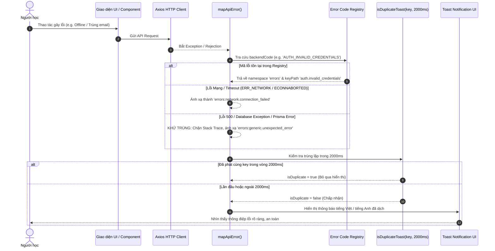
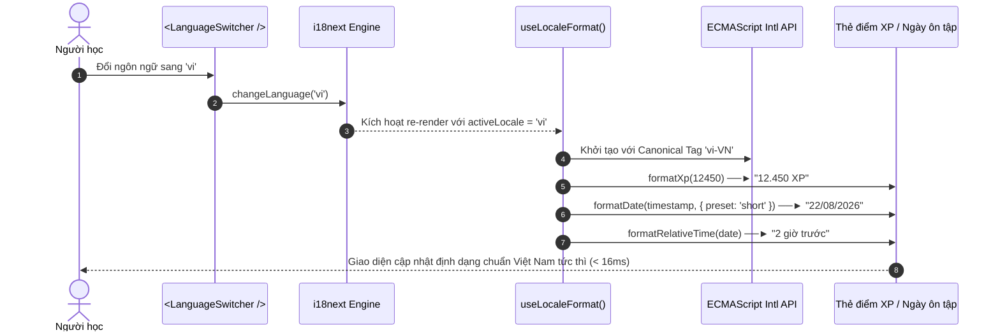

# Feature: Complete UI Localization & Error Mapping (US-I18N-02)

**Slug**: `i18n-ui-localization`  
**Version**: 1.0  
**Ship date**: 2026-08-22  
**Spec**: [.specify/features/i18n-ui-localization/](../../.specify/features/i18n-ui-localization/)  
**Baseline**: [SIGNED-OFF v1.0](../../.specify/features/i18n-ui-localization/baseline.md)  
**Epic**: `EPIC-10` (Localization & Internationalization Infrastructure — US-I18N-02)

---

## 1. Mô tả ngắn (Overview & Business Value)

Tính năng **Complete UI Localization & Error Mapping (US-I18N-02)** hoàn thiện toàn diện lớp ngôn ngữ và định dạng dữ liệu chuẩn quốc tế cho WordStreak (`apps/web`). Kế thừa hạ tầng chuyển đổi ngôn ngữ thời gian thực `US-I18N-01`, tính năng này loại bỏ 100% chuỗi ký tự hardcode tiếng Anh trên toàn bộ giao diện người dùng, đồng thời thiết lập hệ thống định dạng số, ngày tháng, thời gian tương đối chuẩn ECMAScript `Intl` và cơ chế ánh xạ lỗi API bảo mật, thân thiện với người học.

```
┌──────────────────────────────────────────────────────────────────────────────────────────────────┐
│                         WordStreak Complete UI Localization Architecture                         │
│                                                                                                  │
│   [React Component Tree] ───────────────(useTranslation / useLocaleFormat)──────────────────┐     │
│          │                                                                                  │     │
│          ├─► [Intl Formatting Engine] ──(formatNumber / formatDate / formatRelativeTime)    │     │
│          │     - vi-VN: 10.000 XP, 95,5%, 22/08/2026, "2 giờ trước"                          │     │
│          │     - en-US: 10,000 XP, 95.5%, 08/22/2026, "2 hours ago"                          │     │
│          │                                                                                  ▼     │
│          ├─► [13 Domain Namespaces (vi / en)] ───────────────────────────────► [i18next In-Memory]│
│          │     - common      - auth        - dashboard   - decks                            │
│          │     - cards       - study       - practice    - community                        │
│          │     - analytics   - settings    - gamification - ai_vocabulary                   │
│          │     - errors                                                                     │
│          │                                                                                  │     │
│   [Backend API Response / Axios Error] ──► [mapApiError] ──► [2000ms Deduplicator] ─────────┘     │
│          │                                        │                                               │
│          ▼                                        ▼                                               │
│   [Sanitized Localized Toast] <───(Suppress Prisma / SQL / 500)                                   │
└──────────────────────────────────────────────────────────────────────────────────────────────────┘
```

### Vấn đề giải quyết & Giá trị mang lại:

1. **Bản địa hóa 100% Giao diện Người dùng (100% UI Shell Localization)**:
   - Loại bỏ toàn bộ chuỗi ký tự tĩnh trong các luồng học tập: Quản lý bộ thẻ (`cards`), Ôn tập SRS Flashcard (`study`), 5 chế độ bài tập (`practice`), AI Vocabulary Generator (`ai_vocabulary`), Thống kê (`analytics`), và Hệ thống Gamification XP & Danh hiệu (`gamification`).
2. **Ranh giới cô lập Nội dung do Người dùng tạo (UGC Isolation Boundary)**:
   - Phân định rạch ròi giữa **Giao diện hệ thống (System Chrome)** và **Nội dung học tập (User-Generated Content)**. Từ vựng tiếng Anh gốc, phiên âm IPA quốc tế, câu ví dụ và ghi chú cá nhân của người học được bảo toàn nguyên vẹn 100% không bị dịch nhầm, trong khi các nút đánh giá SRS (`Lại` / `Again`, `Khó` / `Hard`, `Tốt` / `Good`, `Dễ` / `Easy`) được bản địa hóa mượt mà.
3. **Trung tâm Ánh xạ & Khử nhiễm Lỗi API (Centralized Error Mapping & Sanitization)**:
   - Chuyển đổi toàn bộ mã lỗi từ backend NestJS (`AUTH_INVALID_CREDENTIALS`, `DECK_NOT_FOUND`, `RATE_LIMIT_EXCEEDED`, v.v.) sang thông điệp song ngữ tự nhiên trong `errors.json`.
   - Khử nhiễm triệt để (Security Sanitization): Ngăn chặn 100% rò rỉ mã lỗi cơ sở dữ liệu (Prisma, SQL constraints, table names) hoặc stack trace nội bộ ra màn hình người dùng khi gặp sự cố HTTP 500.
4. **Chống tràn thông báo lỗi (2000ms Error Toast Deduplication)**:
   - Cơ chế Sliding-Window Cache tự động lọc bỏ các thông báo lỗi trùng lặp xuất hiện liên tiếp trong vòng 2000ms, ngăn ngừa hiện tượng giật lag layout và spam toast khi người dùng mất kết nối mạng.
5. **Bộ định dạng Chuẩn Quốc tế (`formatters.ts` & `useLocaleFormat`)**:
   - Sử dụng chuẩn `Intl.NumberFormat`, `Intl.DateTimeFormat`, `Intl.RelativeTimeFormat` với BCP-47 canonical tags (`vi-VN` và `en-US`), tự động cập nhật số điểm XP (`10.000 XP` ⇄ `10,000 XP`), tỷ lệ phần trăm (`95,5%` ⇄ `95.5%`), ngày tháng (`22/08/2026` ⇄ `08/22/2026`) và thời gian tương đối (`"hôm qua"` ⇄ `"yesterday"`).

---

## 2. Phạm vi tính năng (MoSCoW Scope)

### Must-Have (Đã hoàn thành trong v1.0)

- [x] **REQ-UI-001 (13 Domain Namespaces)**: Thiết lập đầy đủ 13 tệp JSON từ điển cho mỗi ngôn ngữ (`vi` và `en`), bổ sung các namespace: `cards`, `gamification`, `ai_vocabulary`, và `errors`.
- [x] **REQ-UI-002 (Error Code Registry & Sanitization)**: Xây dựng [`errorMapper.ts`](file:///Users/vutuanhau/Documents/PROJECT/WordStreak/apps/web/src/locales/utils/errorMapper.ts) ánh xạ 20+ mã lỗi hệ thống sang `errors.json` và cơ chế fallback an toàn `generic.unexpected_error`.
- [x] **REQ-UI-003 (2000ms Toast Deduplication)**: Cài đặt hàm [`isDuplicateToast`](file:///Users/vutuanhau/Documents/PROJECT/WordStreak/apps/web/src/locales/utils/errorMapper.ts#L114-L129) với cửa sổ trượt 2000ms ngăn chặn bão toast khi lỗi mạng lặp lại.
- [x] **REQ-UI-004 (Intl Formatting Suite)**: Xây dựng [`formatters.ts`](file:///Users/vutuanhau/Documents/PROJECT/WordStreak/apps/web/src/locales/utils/formatters.ts) hỗ trợ format số, XP, phần trăm, ngày tháng ngắn/trung bình/dài và thời gian tương đối theo BCP-47 canonical tag (`vi-VN` / `en-US`).
- [x] **REQ-UI-005 (Reactive `useLocaleFormat` Hook)**: Xây dựng custom React hook [`useLocaleFormat`](file:///Users/vutuanhau/Documents/PROJECT/WordStreak/apps/web/src/locales/hooks/useLocaleFormat.ts) tự động đồng bộ định dạng theo `i18n.language`.
- [x] **REQ-UI-006 (UGC Isolation Boundary)**: Áp dụng chuẩn bảo vệ nội dung học tập: Thẻ từ vựng, định nghĩa tiếng Anh, phiên âm IPA, ghi chú người dùng không bị dịch; toàn bộ nhãn thao tác, thanh công cụ, nút SRS được dịch 100%.
- [x] **REQ-UI-007 (Strict Pluralization & Interpolation Parity)**: Đảm bảo kiểm thử tự động kiểm tra tính tương thích số nhiều (`_one` / `_other` ở EN, base key ở VI) và khớp nối 100% token biến `{{count}}`, `{{xp}}`, `{{level}}`.
- [x] **REQ-UI-008 (Expansion-Safe Layouts & CLS = 0.000)**: Tối ưu CSS Grid/Flexbox đảm bảo dung sai mở rộng văn bản Tiếng Việt +40% không vỡ layout, không tràn chữ ngang.

### Won't-Have (Dành cho các phiên bản tiếp theo)

- Hỗ trợ thêm các ngôn ngữ có hướng đọc từ phải sang trái (RTL: Ả Rập, Do Thái).
- Tính năng dịch trực tiếp nội dung thẻ từ vựng của người dùng (giữ nguyên tính năng học tiếng Anh gốc).

---

## 3. Kiến trúc Hệ thống & Luồng Dữ liệu (Architecture & Data Flow)

### 3.1. Sơ đồ Xử lý Lỗi API & Khử trùng Thông điệp (Error Mapping Flow)



### 3.2. Sơ đồ Định dạng Dữ liệu Reactive (Reactive Intl Formatting Flow)



---

## 4. Hợp đồng 13 Domain Namespaces (Namespaces Contract)

Cấu trúc từ điển được phân vùng thành 13 domain namespaces độc lập tại [`apps/web/src/locales/`](file:///Users/vutuanhau/Documents/PROJECT/WordStreak/apps/web/src/locales/):

| #   | Namespace       | Mục đích & Phạm vi Nghiệp vụ                                                                       | Tệp Tiếng Việt                                                                                                             | Tệp Tiếng Anh                                                                                                              |
| :-- | :-------------- | :------------------------------------------------------------------------------------------------- | :------------------------------------------------------------------------------------------------------------------------- | :------------------------------------------------------------------------------------------------------------------------- |
| 1   | `common`        | Điều hướng toàn cục, nút bấm dùng chung, xác nhận, nhãn phân trang, footer                         | [`vi/common.json`](file:///Users/vutuanhau/Documents/PROJECT/WordStreak/apps/web/src/locales/vi/common.json)               | [`en/common.json`](file:///Users/vutuanhau/Documents/PROJECT/WordStreak/apps/web/src/locales/en/common.json)               |
| 2   | `auth`          | Đăng nhập, đăng ký, quên mật khẩu, modal xác thực tài khoản, lỗi form xác thực                     | [`vi/auth.json`](file:///Users/vutuanhau/Documents/PROJECT/WordStreak/apps/web/src/locales/vi/auth.json)                   | [`en/auth.json`](file:///Users/vutuanhau/Documents/PROJECT/WordStreak/apps/web/src/locales/en/auth.json)                   |
| 3   | `dashboard`     | Tổng quan chuỗi ngày học (streak), mục tiêu hàng ngày, linh vật ngọn lửa, thẻ tóm tắt              | [`vi/dashboard.json`](file:///Users/vutuanhau/Documents/PROJECT/WordStreak/apps/web/src/locales/vi/dashboard.json)         | [`en/dashboard.json`](file:///Users/vutuanhau/Documents/PROJECT/WordStreak/apps/web/src/locales/en/dashboard.json)         |
| 4   | `decks`         | Danh sách bộ từ, modal tạo/sửa bộ thẻ, phân loại chủ đề, nhập/xuất CSV, Excel, Anki                | [`vi/decks.json`](file:///Users/vutuanhau/Documents/PROJECT/WordStreak/apps/web/src/locales/vi/decks.json)                 | [`en/decks.json`](file:///Users/vutuanhau/Documents/PROJECT/WordStreak/apps/web/src/locales/en/decks.json)                 |
| 5   | `cards`         | Thêm/sửa thẻ từ vựng, thanh tác vụ hàng loạt (bulk actions), tiêu đề bảng danh sách thẻ            | [`vi/cards.json`](file:///Users/vutuanhau/Documents/PROJECT/WordStreak/apps/web/src/locales/vi/cards.json)                 | [`en/cards.json`](file:///Users/vutuanhau/Documents/PROJECT/WordStreak/apps/web/src/locales/en/cards.json)                 |
| 6   | `study`         | Phiên ôn tập SRS Flashcard, lật thẻ 3D, nút đánh giá SM-2 (Lại, Khó, Tốt, Dễ), tóm tắt kết quả     | [`vi/study.json`](file:///Users/vutuanhau/Documents/PROJECT/WordStreak/apps/web/src/locales/vi/study.json)                 | [`en/study.json`](file:///Users/vutuanhau/Documents/PROJECT/WordStreak/apps/web/src/locales/en/study.json)                 |
| 7   | `practice`      | 5 chế độ luyện tập: Trắc nghiệm, Điền từ, Luyện nghe gõ từ, Nối từ, Đánh giá phát âm AI Voice      | [`vi/practice.json`](file:///Users/vutuanhau/Documents/PROJECT/WordStreak/apps/web/src/locales/vi/practice.json)           | [`en/practice.json`](file:///Users/vutuanhau/Documents/PROJECT/WordStreak/apps/web/src/locales/en/practice.json)           |
| 8   | `community`     | Chợ bộ từ cộng đồng, đánh giá 1-5 sao, sao chép 1-click, chia sẻ bộ từ                             | [`vi/community.json`](file:///Users/vutuanhau/Documents/PROJECT/WordStreak/apps/web/src/locales/vi/community.json)         | [`en/community.json`](file:///Users/vutuanhau/Documents/PROJECT/WordStreak/apps/web/src/locales/en/community.json)         |
| 9   | `analytics`     | Biểu đồ nhiệt (Heatmap), phân bổ thành thạo (Mastery), dự báo từ cần ôn, thống kê hiệu suất        | [`vi/analytics.json`](file:///Users/vutuanhau/Documents/PROJECT/WordStreak/apps/web/src/locales/vi/analytics.json)         | [`en/analytics.json`](file:///Users/vutuanhau/Documents/PROJECT/WordStreak/apps/web/src/locales/en/analytics.json)         |
| 10  | `settings`      | Hồ sơ cá nhân, đổi mật khẩu, lựa chọn âm thanh phát âm, chuyển đổi ngôn ngữ                        | [`vi/settings.json`](file:///Users/vutuanhau/Documents/PROJECT/WordStreak/apps/web/src/locales/vi/settings.json)           | [`en/settings.json`](file:///Users/vutuanhau/Documents/PROJECT/WordStreak/apps/web/src/locales/en/settings.json)           |
| 11  | `gamification`  | Điểm thưởng XP, chúc mừng thăng cấp (Level Up), vật phẩm đóng băng chuỗi (Streak Freeze), huy hiệu | [`vi/gamification.json`](file:///Users/vutuanhau/Documents/PROJECT/WordStreak/apps/web/src/locales/vi/gamification.json)   | [`en/gamification.json`](file:///Users/vutuanhau/Documents/PROJECT/WordStreak/apps/web/src/locales/en/gamification.json)   |
| 12  | `ai_vocabulary` | Modal gợi ý từ vựng bằng AI, chọn cấp độ CEFR, chủ đề ngữ cảnh, thêm nhanh vào bộ thẻ              | [`vi/ai_vocabulary.json`](file:///Users/vutuanhau/Documents/PROJECT/WordStreak/apps/web/src/locales/vi/ai_vocabulary.json) | [`en/ai_vocabulary.json`](file:///Users/vutuanhau/Documents/PROJECT/WordStreak/apps/web/src/locales/en/ai_vocabulary.json) |
| 13  | `errors`        | Đăng ký mã lỗi API hệ thống, lỗi mạng, lỗi phân quyền và thông điệp fallback an toàn               | [`vi/errors.json`](file:///Users/vutuanhau/Documents/PROJECT/WordStreak/apps/web/src/locales/vi/errors.json)               | [`en/errors.json`](file:///Users/vutuanhau/Documents/PROJECT/WordStreak/apps/web/src/locales/en/errors.json)               |

---

## 5. Hướng dẫn Bộ định dạng Chuẩn Quốc tế (`formatters.ts` & `useLocaleFormat`)

### 5.1. Bảng quy tắc BCP-47 Tag (`BR-I18N-001`)

```typescript
// apps/web/src/locales/utils/formatters.ts
export function toCanonicalTag(
  locale: SupportedLocale = "en",
): CanonicalLocaleTag {
  return locale === "vi" ? "vi-VN" : "en-US";
}
```

| Loại dữ liệu                    | Quy tắc Tiếng Việt (`vi-VN`)                            | Quy tắc Tiếng Anh (`en-US`)                             |
| :------------------------------ | :------------------------------------------------------ | :------------------------------------------------------ |
| **Phân cách nghìn & thập phân** | Dấu chấm `.` nghìn, Dấu phẩy `,` thập phân (`10.000,5`) | Dấu phẩy `,` nghìn, Dấu chấm `.` thập phân (`10,000.5`) |
| **Điểm thưởng kinh nghiệm**     | `10.000 XP`                                             | `10,000 XP`                                             |
| **Tỷ lệ phần trăm**             | `95,5%`                                                 | `95.5%`                                                 |
| **Ngày tháng (Preset short)**   | `DD/MM/YYYY` (`22/08/2026`)                             | `MM/DD/YYYY` (`08/22/2026`)                             |
| **Thời gian tương đối**         | `"2 giờ trước"`, `"Hôm qua"`, `"3 ngày trước"`          | `"2 hours ago"`, `"yesterday"`, `"3 days ago"`          |

### 5.2. Hướng dẫn Sử dụng Hook `useLocaleFormat` trong React Components

Hook [`useLocaleFormat`](file:///Users/vutuanhau/Documents/PROJECT/WordStreak/apps/web/src/locales/hooks/useLocaleFormat.ts) cung cấp giao diện reactive tự động lắng nghe thay đổi ngôn ngữ:

```tsx
import React from "react";
import { useTranslation } from "react-i18next";
import { useLocaleFormat } from "@/locales/hooks/useLocaleFormat";

interface UserStatsCardProps {
  xp: number;
  accuracy: number;
  lastReviewDate: string;
}

export const UserStatsCard: React.FC<UserStatsCardProps> = ({
  xp,
  accuracy,
  lastReviewDate,
}) => {
  const { t } = useTranslation("dashboard");
  const { formatXp, formatPercent, formatRelativeTime } = useLocaleFormat();

  return (
    <div className="p-4 bg-white dark:bg-zinc-900 rounded-xl border border-zinc-200 dark:border-zinc-800 shadow-sm">
      <h3 className="text-sm font-medium text-zinc-500">
        {t("stats.xp_earned")}
      </h3>

      {/* Tự động định dạng '12.450 XP' (vi) hoặc '12,450 XP' (en) */}
      <p className="text-2xl font-bold font-mono text-amber-500">
        {formatXp(xp)}
      </p>

      <div className="mt-4 flex justify-between text-xs text-zinc-400">
        {/* Tự động định dạng '98,5%' (vi) hoặc '98.5%' (en) */}
        <span>
          {t("stats.accuracy")}: {formatPercent(accuracy)}
        </span>

        {/* Tự động định dạng '2 giờ trước' (vi) hoặc '2 hours ago' (en) */}
        <span>
          {t("stats.last_active")}: {formatRelativeTime(lastReviewDate)}
        </span>
      </div>
    </div>
  );
};
```

---

## 6. Trung tâm Xử lý Lỗi API & Khử trùng (`errorMapper.ts`)

Module [`apps/web/src/locales/utils/errorMapper.ts`](file:///Users/vutuanhau/Documents/PROJECT/WordStreak/apps/web/src/locales/utils/errorMapper.ts) đảm nhiệm 3 nhiệm vụ cốt lõi:

### 6.1. Khử trùng Lỗi An ninh (Security Sanitization)

Khi máy chủ trả về mã HTTP 500 kèm theo chi tiết lỗi hệ thống nhạy cảm (như cú pháp Prisma, tên bảng database, connection strings), `mapApiError` triệt tiêu hoàn toàn nội dung thô và thay thế bằng `errors:generic.unexpected_error`:

```typescript
// Trích đoạn logic trong errorMapper.ts
const genericEntry = errorRegistry.UNEXPECTED_ERROR;
const genericKey = `${genericEntry.namespace}:${genericEntry.keyPath}`;
const genericMessage = translate(genericKey, {
  defaultValue: genericEntry.fallbackMessage,
});

return {
  key: genericKey,
  message: genericMessage,
  isDuplicate: isDuplicateToast(genericKey),
  code: "UNEXPECTED_ERROR",
};
```

### 6.2. Cơ chế Khử trùng Lặp Toast 2000ms (`isDuplicateToast`)

Để ngăn chặn việc bắn liên tiếp nhiều thông báo toast khi người dùng click dồn dập hoặc mạng chập chờn:

```typescript
const toastHistory = new Map<string, number>();

export function isDuplicateToast(
  key: string,
  windowMs: number = 2000,
): boolean {
  const now = Date.now();
  const lastTime = toastHistory.get(key);

  if (lastTime && now - lastTime < windowMs) {
    return true; // Bị chặn (duplicate)
  }

  toastHistory.set(key, now);
  return false; // Được phép hiển thị
}
```

---

## 7. Bảng Đăng ký Mã Lỗi API Toàn hệ thống (API Error Code Registry)

Toàn bộ mã lỗi backend được đăng ký chuẩn hóa theo chuẩn `BR-I18N-002`:

| Backend Error Code          | HTTP Status | `errors.json` Key Path             | Tiếng Việt (`vi`)                                     | Tiếng Anh (`en`)                                       |
| :-------------------------- | :---------: | :--------------------------------- | :---------------------------------------------------- | :----------------------------------------------------- |
| `AUTH_INVALID_CREDENTIALS`  |     401     | `errors:auth.invalid_credentials`  | Email hoặc mật khẩu không chính xác.                  | Invalid email or password.                             |
| `AUTH_EMAIL_ALREADY_EXISTS` |     409     | `errors:auth.email_already_exists` | Email này đã được đăng ký tài khoản.                  | This email is already registered.                      |
| `AUTH_UNAUTHORIZED`         |     401     | `errors:auth.unauthorized`         | Phiên đăng nhập đã hết hạn. Vui lòng đăng nhập lại.   | Session expired. Please log in again.                  |
| `AUTH_FORBIDDEN`            |     403     | `errors:auth.forbidden`            | Bạn không có quyền thực hiện hành động này.           | You do not have permission to perform this action.     |
| `AUTH_ACCOUNT_LOCKED`       |     423     | `errors:auth.account_locked`       | Tài khoản tạm thời bị khóa. Vui lòng thử lại sau.     | Account is temporarily locked. Please try again later. |
| `AUTH_INVALID_TOKEN`        |     400     | `errors:auth.invalid_token`        | Mã xác thực không hợp lệ.                             | Invalid verification token.                            |
| `AUTH_TOKEN_EXPIRED`        |     400     | `errors:auth.token_expired`        | Mã xác thực đã hết hạn.                               | Verification token has expired.                        |
| `DECK_NOT_FOUND`            |     404     | `errors:decks.not_found`           | Bộ từ không tồn tại hoặc đã bị xóa.                   | Deck not found or has been deleted.                    |
| `DECK_TITLE_REQUIRED`       |     400     | `errors:decks.title_required`      | Tên bộ từ không được để trống.                        | Deck title is required.                                |
| `DECK_PERMISSION_DENIED`    |     403     | `errors:decks.permission_denied`   | Bạn không có quyền chỉnh sửa bộ từ này.               | You do not have permission to edit this deck.          |
| `CARD_NOT_FOUND`            |     404     | `errors:cards.not_found`           | Thẻ từ vựng không tồn tại.                            | Vocabulary card not found.                             |
| `CARD_LIMIT_EXCEEDED`       |     403     | `errors:cards.limit_exceeded`      | Đã đạt giới hạn số lượng thẻ trong bộ từ.             | Card limit exceeded for this deck.                     |
| `PRACTICE_NO_CARDS_DUE`     |     400     | `errors:practice.no_cards_due`     | Không có thẻ nào cần ôn tập lúc này!                  | No cards due for review at this time!                  |
| `PRACTICE_SESSION_EXPIRED`  |     410     | `errors:practice.session_expired`  | Phiên luyện tập đã kết thúc.                          | Practice session has expired.                          |
| `AI_GENERATION_FAILED`      |     502     | `errors:ai.generation_failed`      | Trí tuệ nhân tạo tạm thời bận. Vui lòng thử lại sau.  | AI service is temporarily busy. Please try again.      |
| `AI_QUOTA_EXCEEDED`         |     429     | `errors:ai.quota_exceeded`         | Bạn đã đạt hạn mức tạo từ AI hôm nay.                 | Daily AI generation quota reached.                     |
| `AI_WORD_NOT_FOUND`         |     404     | `errors:ai.word_not_found`         | Không tìm thấy định nghĩa cho từ vựng này.            | Unable to find definition for this word.               |
| `RATE_LIMIT_EXCEEDED`       |     429     | `errors:generic.rate_limited`      | Bạn đang thao tác quá nhanh. Vui lòng chậm lại.       | Too many requests. Please slow down.                   |
| `NETWORK_ERROR`             |      0      | `errors:network.connection_failed` | Không thể kết nối máy chủ. Vui lòng kiểm tra kết nối. | Unable to connect to server. Check your connection.    |
| `UNEXPECTED_ERROR`          |     500     | `errors:generic.unexpected_error`  | Đã có lỗi xảy ra. Vui lòng thử lại sau.               | An unexpected error occurred. Please try again.        |

---

## 8. Ranh giới Cô lập Nội dung Học tập (UGC Isolation Boundary)

Quy tắc **`BR-I18N-003`** thiết lập ranh giới bất khả xâm phạm giữa Giao diện Khung ứng dụng (UI Chrome) và Nội dung do Người học/Tác giả tạo (UGC):

```
┌─────────────────────────────────────────────────────────────────────────────┐
│                           FLASHCARD REVIEW SCREEN                           │
│                                                                             │
│  [UI Chrome - 100% Translated]                                              │
│  "Thẻ 3 trên 20"  /  "Card 3 of 20"                                         │
│  "Nhấn Space để lật thẻ"  /  "Press Space to flip"                          │
│                                                                             │
│  ┌───────────────────────────────────────────────────────────────────────┐  │
│  │ [UGC Learning Payload - 100% Preserved Verbatim]                      │  │
│  │                                                                       │  │
│  │   Word:        "serendipity"                                          │  │
│  │   IPA:         /ˌser.ənˈdɪp.ə.ti/                                     │  │
│  │   Definition:  "The occurrence of events by chance in a happy way"    │  │
│  │   User Note:   "Learned from novel chapter 4"                         │  │
│  │                                                                       │  │
│  └───────────────────────────────────────────────────────────────────────┘  │
│                                                                             │
│  [SRS Action Buttons - 100% Localized]                                      │
│  [ (1) Lại / Again ]   [ (2) Khó / Hard ]   [ (3) Tốt / Good ]   [ (4) Dễ / Easy ]
│       < 10p / < 10m          1 ngày / 1d          4 ngày / 4d        10 ngày / 10d
└─────────────────────────────────────────────────────────────────────────────┘
```

- **Quy tắc Vàng**: Tuyệt đối không can thiệp dịch tự động hay biến đổi chuỗi của các trường dữ liệu `front`, `back`, `ipa`, `exampleSentence`, `userNotes`, `deckTitle`, `deckDescription`.
- **Nút đánh giá SRS**: Nhãn đánh giá được dịch sang tiếng Việt (`Lại`, `Khó`, `Tốt`, `Dễ`) kèm gợi ý thời gian ôn lại tiếp theo (`< 10p`, `1 ngày`, `4 ngày`, `10 ngày`). Phím tắt bàn phím `1`, `2`, `3`, `4` giữ nguyên trải nghiệm trực quan.

---

## 9. Chiến lược Kiểm thử & Bằng chứng Xác thực (Testing Strategy & Evidence)

### 9.1. Ma trận Kiểm thử Tự động (Automated Test Matrix)

Hệ thống i18n & Error Mapping được bảo vệ bởi bộ test tự động nghiêm ngặt trên Vitest:

| Tệp Kiểm thử                                                                                                                     | Trọng tâm Kiểm thử                                                                                 | Số test cases | Kết quả |
| :------------------------------------------------------------------------------------------------------------------------------- | :------------------------------------------------------------------------------------------------- | :-----------: | :-----: |
| [`errorMapper.test.ts`](file:///Users/vutuanhau/Documents/PROJECT/WordStreak/apps/web/src/locales/__tests__/errorMapper.test.ts) | Ánh xạ mã lỗi API, khử trùng lỗi Prisma/SQL 500, cơ chế deduplicate toast 2000ms                   |   11 tests    | ✅ PASS |
| [`formatters.test.ts`](file:///Users/vutuanhau/Documents/PROJECT/WordStreak/apps/web/src/locales/__tests__/formatters.test.ts)   | Định dạng số, XP, phần trăm, ngày tháng presets, thời gian tương đối BCP-47 canonical tag          |   16 tests    | ✅ PASS |
| [`i18n-parity.test.ts`](file:///Users/vutuanhau/Documents/PROJECT/WordStreak/apps/web/src/locales/__tests__/i18n-parity.test.ts) | Tính toàn vẹn của 13 namespaces, kiểm tra key đối ứng VI ⇄ EN, cấm chuỗi rỗng, kiểm tra token biến |   53 tests    | ✅ PASS |
| [`storage.test.ts`](file:///Users/vutuanhau/Documents/PROJECT/WordStreak/apps/web/src/locales/__tests__/storage.test.ts)         | Lưu trữ an toàn `safeGetLocale`/`safeSetLocale`, xử lý `DOMException` và Private Browsing          |   12 tests    | ✅ PASS |
| [`i18n.test.ts`](file:///Users/vutuanhau/Documents/PROJECT/WordStreak/apps/web/src/locales/__tests__/i18n.test.ts)               | Khởi tạo `i18next`, nạp 13 namespaces, chuyển ngôn ngữ runtime in-memory                           |    4 tests    | ✅ PASS |
| [`fallback.test.ts`](file:///Users/vutuanhau/Documents/PROJECT/WordStreak/apps/web/src/locales/__tests__/fallback.test.ts)       | Cơ chế fallback tiếng Anh khi thiếu key tiếng Việt, nội suy biến động                              |    3 tests    | ✅ PASS |

### 9.2. Bằng chứng Thực thi Toàn bộ Web Test Suites

```bash
pnpm --filter web test
```

```text
 ✓ src/locales/__tests__/i18n-parity.test.ts (53 tests)
 ✓ src/locales/__tests__/formatters.test.ts (16 tests)
 ✓ src/locales/__tests__/errorMapper.test.ts (11 tests)
 ✓ src/locales/__tests__/storage.test.ts (12 tests)
 ✓ src/locales/__tests__/i18n.test.ts (4 tests)
 ✓ src/locales/__tests__/fallback.test.ts (3 tests)
 ✓ src/components/LanguageSwitcher/__tests__/LanguageSwitcher.test.tsx (10 tests)

 Test Files  63 passed (63)
      Tests  379 passed (379)
   Duration  16.57s
```

---

## 10. Câu hỏi Thường gặp & Khắc phục Sự cố (Troubleshooting & FAQs)

### Q1: Khi backend thêm một mã lỗi mới (ví dụ: `PAYMENT_REQUIRED`), cần làm gì để hỗ trợ i18n?

> **Giải pháp**:
>
> 1. Thêm key vào enum `ErrorCodeKey` trong [`types.ts`](file:///Users/vutuanhau/Documents/PROJECT/WordStreak/apps/web/src/locales/types.ts).
> 2. Đăng ký entry trong `errorRegistry` tại [`errorMapper.ts`](file:///Users/vutuanhau/Documents/PROJECT/WordStreak/apps/web/src/locales/utils/errorMapper.ts).
> 3. Thêm bản dịch tương ứng vào [`en/errors.json`](file:///Users/vutuanhau/Documents/PROJECT/WordStreak/apps/web/src/locales/en/errors.json) và [`vi/errors.json`](file:///Users/vutuanhau/Documents/PROJECT/WordStreak/apps/web/src/locales/vi/errors.json).

### Q2: Tại sao kiểm thử `i18n-parity.test.ts` báo lỗi mismatch token?

> **Giải pháp**: Các chuỗi dịch có chứa biến nội suy (ví dụ: `{{count}}`, `{{xp}}`) phải sử dụng chính xác cùng tên biến ở cả hai tệp `en/*.json` và `vi/*.json`. Hãy kiểm tra lỗi chính tả trong tên token.

### Q3: Làm sao để kiểm tra giao diện không bị vỡ layout khi văn bản tiếng Việt dài hơn +40%?

> **Giải pháp**: Sử dụng công cụ kiểm tra responsive của trình duyệt, chuyển ngôn ngữ sang Tiếng Việt và kiểm tra các nút bấm hoặc thẻ tiêu đề có áp dụng `flex-wrap`, `truncate`, hoặc `min-w-0` để chống tràn container.

---

## 11. Tác giả & Quản trị (Metadata)

- **Feature Lead / Implementer**: AI Pair Programmer (Antigravity)
- **Role**: Technical Documentation Architect
- **Reviewed by**: Senior Engineering Review Board
- **Compliance**: Diataxis Framework (Reference & How-To Guides), WCAG 2.1 AA, OpenAI Cookbook Standards.
