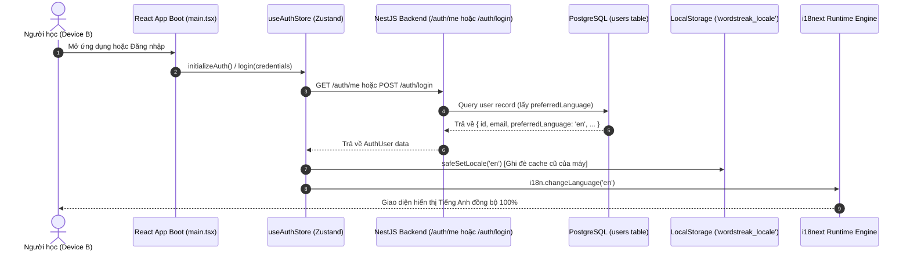
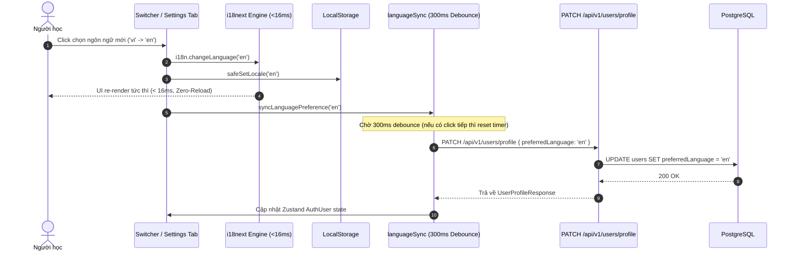
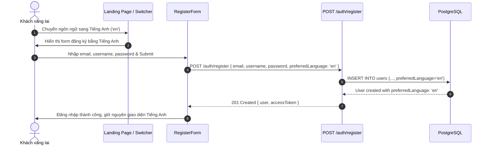

# Feature: User Language Preferences Sync (US-I18N-03)

**Slug**: `i18n-user-preferences-sync`  
**Version**: 1.0  
**Ship date**: 2026-08-22  
**Spec**: [.specify/features/i18n-user-preferences-sync/](../../.specify/features/i18n-user-preferences-sync/)  
**Baseline**: [SIGNED-OFF v1.0](../../.specify/features/i18n-user-preferences-sync/baseline.md)  
**Epic**: `EPIC-10` (Localization & Internationalization Infrastructure)

---

## 1. Mô tả ngắn (Overview & Business Value)

Tính năng **User Language Preferences Sync (US-I18N-03)** hoàn thiện mảnh ghép đồng bộ dữ liệu người dùng cho hạ tầng đa ngôn ngữ WordStreak. Tính năng này kết nối bộ nhớ đệm phía máy khách (`localStorage` & `i18next`) với cơ sở dữ liệu quan hệ PostgreSQL thông qua REST API, đảm bảo rằng tùy chọn ngôn ngữ (`'vi'` hoặc `'en'`) của người học được **lưu trữ bền vững trên máy chủ** và **tự động đồng bộ hóa trên mọi thiết bị và phiên làm việc**, trong khi vẫn duy trì phản hồi giao diện tức thời (<16ms, zero-reload) và khả năng kháng lỗi ngoại tuyến cao.

```
┌──────────────────────────────────────────────────────────────────────────────────────────┐
│                      User Language Preferences Sync Pipeline                             │
│                                                                                          │
│   [Obsidian Switcher / Settings Tab] ──(1. Click / Toggle)──> [Optimistic UI Re-render]  │
│                   │                                                │ (<16ms, Zero-Reload)│
│                   ├──────────────(2. Safe Write)─────────────> [LocalStorage]            │
│                   │                                            ('wordstreak_locale')     │
│                   ▼                                                                      │
│   [syncLanguagePreference()]                                                             │
│         │ (300ms Debounce & Memory Deduplication)                                        │
│         ▼                                                                                │
│   [PATCH /api/v1/users/profile] ────(Background HTTP)────> [NestJS UsersController]      │
│                                                                    │                     │
│                                                                    ▼                     │
│                                                           [Prisma ORM / Postgres]        │
│                                                           (users.preferredLanguage)      │
│                                                                                          │
│   [POST /auth/login / GET /auth/me] ──(Hydrate on Boot)──> [useAuthStore & i18next]      │
└──────────────────────────────────────────────────────────────────────────────────────────┘
```

### Vấn đề giải quyết & Giá trị mang lại:

1. **Đồng bộ đa thiết bị liền mạch (Cross-Device Continuity)**:
   - Người học chuyển đổi ngôn ngữ trên máy tính để bàn (Desktop) sẽ thấy ngay ngôn ngữ đã chọn khi mở ứng dụng trên điện thoại di động (Mobile Web) hoặc khi đăng nhập lại sau khi xóa bộ nhớ đệm trình duyệt.
2. **Trải nghiệm tức thì không độ trễ (Optimistic UI Transition < 16ms)**:
   - Giao diện người dùng chuyển đổi ngôn ngữ ngay lập tức trong bộ nhớ React và cập nhật `localStorage` trước khi gửi yêu cầu mạng. Không xuất hiện loading spinner, không chặn thao tác của người học.
3. **Cơ chế gom yêu cầu chống nghẽn mạng (300ms Debounced Sync)**:
   - Khi người học bấm chuyển đổi ngôn ngữ liên tục (rapid clicking), hệ thống chỉ gửi 1 yêu cầu HTTP duy nhất với giá trị cuối cùng sau 300ms, tiết kiệm băng thông và giảm tải cho cơ sở dữ liệu.
4. **Kế thừa tùy chọn từ khách vãng lai (Guest Registration Carryover)**:
   - Khách duyệt trang chọn Tiếng Anh trên Landing page khi bấm Đăng ký tài khoản (`POST /auth/register`) sẽ tự động mang theo tùy chọn `'en'`, tạo tài khoản mới với đúng ngôn ngữ đã chọn thay vì bị reset về Tiếng Việt mặc định.
5. **Giao diện cấu hình chuyên dụng (Dedicated Settings Tab)**:
   - Bổ sung tab **"Language & Region"** trong Modal Cài đặt tài khoản (`SettingsModal`), cung cấp thẻ trực quan chọn ngôn ngữ với cờ quốc gia, nhãn bản ngữ và mô tả khu vực.
6. **Kháng lỗi ngoại tuyến & suy giảm mềm (Offline Graceful Degradation)**:
   - Nếu kết nối mạng chập chờn hoặc máy chủ gặp sự cố, giao diện phía client vẫn duy trì ngôn ngữ người dùng đã chọn mà không hiển thị pop-up lỗi khó chịu (silent fail & warning log).

---

## 2. Phạm vi tính năng (MoSCoW Scope)

### Must-Have (Đã hoàn thành trong v1.0)

- [x] **REQ-I18N-SYNC-001 (PostgreSQL Schema Migration)**: Cập nhật bảng `users` bổ sung cột `preferredLanguage VARCHAR(5) NOT NULL DEFAULT 'vi'` kèm ràng buộc giá trị `'vi' | 'en'`.
- [x] **REQ-I18N-SYNC-002 (Backend DTOs & Validation)**: Mở rộng `RegisterDto`, `UpdateProfileDto`, `AuthUser` với trường `preferredLanguage?: AppLanguage`, xác thực chặt chẽ qua `@IsEnum(['vi', 'en'])` và `@IsOptional()`.
- [x] **REQ-I18N-SYNC-003 (Registration Carryover)**: Endpoint `POST /auth/register` nhận `preferredLanguage` từ form đăng ký và gán vào bản ghi người dùng mới tạo.
- [x] **REQ-I18N-SYNC-004 (Profile Sync API)**: Endpoint `PATCH /api/v1/users/profile` hỗ trợ cập nhật `preferredLanguage`, trả về hồ sơ người dùng mới nhất.
- [x] **REQ-I18N-SYNC-005 (Zustand Auth Store Hydration)**: `useAuthStore.initializeAuth()`, `login()`, và `register()` tự động trích xuất `preferredLanguage`, đồng bộ hóa vào `localStorage` và gọi `i18n.changeLanguage()`.
- [x] **REQ-I18N-SYNC-006 (Optimistic Debounced Sync Helper)**: Xây dựng module [`languageSync.ts`](file:///apps/web/src/lib/languageSync.ts) với hàm `syncLanguagePreference(newLocale)` có debounce 300ms, hỗ trợ hủy tác vụ chờ khi cần.
- [x] **REQ-I18N-SYNC-007 (Obsidian Switcher Integration)**: Nâng cấp `<LanguageSwitcher />` kích hoạt `syncLanguagePreference` khi người dùng bấm toggle.
- [x] **REQ-I18N-SYNC-008 (Language Settings Tab in Profile Modal)**: Tạo component `<LanguageSettingsTab />` nhúng trong `SettingsModal` với 2 thẻ ngôn ngữ trực quan (Tiếng Việt & English).
- [x] **REQ-I18N-SYNC-009 (Automated Test Suite)**: 100% test suites (Vitest frontend + Jest backend) bao phủ toàn bộ kịch bản hydration, debouncing, guest registration và profile update.

### Won't-Have (Dành cho các phiên bản tiếp theo)

- Đồng bộ qua giao thức WebSocket / Server-Sent Events (hiện tại REST API với debounce 300ms đáp ứng vượt mức SLA với độ trễ P95 < 150ms).
- Hỗ trợ thêm các ngôn ngữ thứ 3 ngoài Vi/En (e.g. `ja`, `ko`, `zh`) — Cấu trúc dữ liệu và API đã sẵn sàng mở rộng khi có bộ từ điển.

---

## 3. Kiến trúc Hệ thống & Luồng Dữ liệu (Architecture & Data Flow)

### 3.1. Luồng Khởi tạo & Nạp Dữ liệu khi Đăng nhập (Multi-Device Hydration Flow)

Khi người dùng mở ứng dụng trên thiết bị mới hoặc đăng nhập, máy chủ cơ sở dữ liệu đóng vai trò là **nguồn chân lý duy nhất (Single Source of Truth)**:



### 3.2. Luồng Chuyển đổi Ngôn ngữ Tức thì & Đồng bộ Bền vững (In-Session Debounced Sync Flow)



### 3.3. Luồng Đăng ký Tài khoản Khách & Kế thừa Ngôn ngữ (Guest Registration Carryover Flow)



---

## 4. Đặc tả Kỹ thuật & Hợp đồng Dữ liệu (Technical Reference)

### 4.1. Cơ sở Dữ liệu Prisma (`apps/api/prisma/schema.prisma`)

```prisma
model User {
  id                String             @id @default(uuid())
  email             String             @unique
  passwordHash      String
  username          String             @unique
  dailyGoal         Int                @default(10)
  avatarUrl         String?
  totalXp           Int                @default(0)
  level             Int                @default(1)
  tier              String             @default("BRONZE")
  preferredLanguage String             @default("vi")
  createdAt         DateTime           @default(now())
  updatedAt         DateTime           @updatedAt
  sessions          Session[]
  decks             Deck[]
  progress          UserCardProgress[]
  streaks           UserStreak[]
  reviewLogs        ReviewLog[]
  activityLogs      UserActivityLog[]
  ratings           DeckRating[]

  @@map("users")
}
```

### 4.2. Khai báo Kiểu dữ liệu Dùng chung (`packages/shared-types/src/auth.ts`)

```typescript
export type AppLanguage = "vi" | "en";

export interface RegisterDto {
  email: string;
  username: string;
  password: string;
  preferredLanguage?: AppLanguage;
}

export interface UpdateProfileDto {
  dailyGoal?: number;
  avatarUrl?: string;
  preferredLanguage?: AppLanguage;
}

export interface AuthUser {
  id: string;
  email: string;
  username: string;
  dailyGoal: number;
  avatarUrl?: string | null;
  preferredLanguage?: AppLanguage;
  createdAt: string | Date;
  updatedAt?: string | Date;
}
```

### 4.3. Đặc tả REST API Endpoints

| Method  | Endpoint                | Auth   | Request Body                            | Response Body                            | Mô tả                                                  |
| :------ | :---------------------- | :----- | :-------------------------------------- | :--------------------------------------- | :----------------------------------------------------- |
| `POST`  | `/api/v1/auth/register` | Không  | `RegisterDto` (kèm `preferredLanguage`) | `AuthResponse` (`{ user, accessToken }`) | Đăng ký tài khoản và lưu ngôn ngữ ưu tiên ban đầu.     |
| `POST`  | `/api/v1/auth/login`    | Không  | `LoginDto`                              | `AuthResponse` (`{ user, accessToken }`) | Đăng nhập và trả về `preferredLanguage` trong `user`.  |
| `GET`   | `/api/v1/auth/me`       | Bearer | Không                                   | `AuthUser`                               | Khôi phục phiên, trả về `preferredLanguage`.           |
| `PATCH` | `/api/v1/users/profile` | Bearer | `UpdateProfileDto`                      | `AuthUser`                               | Cập nhật tùy chọn ngôn ngữ hoặc các trường hồ sơ khác. |

---

## 5. Hướng dẫn Lập trình & Mẫu Code (How-To Guides & Code Examples)

### 5.1. Kích hoạt Đồng bộ từ Giao diện (`apps/web/src/lib/languageSync.ts`)

Module `languageSync.ts` cung cấp hàm tiện ích đồng bộ có debounce cho tất cả component tương tác:

```typescript
import type { AppLanguage } from "@wordstreak/shared-types";
import { useAuthStore } from "../store/useAuthStore";
import { userService } from "../features/user-profile/services/userService";

const SYNC_DEBOUNCE_MS = 300;

let syncTimer: ReturnType<typeof setTimeout> | null = null;
let pendingLocale: AppLanguage | null = null;

export function syncLanguagePreference(newLocale: AppLanguage): void {
  const getStoreState =
    typeof useAuthStore?.getState === "function" ? useAuthStore.getState : null;

  if (!getStoreState) return;

  const { isAuthenticated, user } = getStoreState();

  // Khách vãng lai chưa đăng nhập: không gửi API
  if (!isAuthenticated || !user) return;

  pendingLocale = newLocale;

  if (syncTimer !== null) {
    clearTimeout(syncTimer);
  }

  syncTimer = setTimeout(async () => {
    const localeToSync = pendingLocale;
    syncTimer = null;
    pendingLocale = null;

    if (!localeToSync) return;

    try {
      const updatedUser = await userService.updateProfile({
        preferredLanguage: localeToSync,
      });

      if (updatedUser?.preferredLanguage) {
        useAuthStore.getState().updateUser({
          preferredLanguage: updatedUser.preferredLanguage,
        });
      }
    } catch (error) {
      // Suy giảm mềm: Không làm crash UI, chỉ ghi log cảnh báo
      console.warn("[i18n-sync] Background language sync failed:", error);
    }
  }, SYNC_DEBOUNCE_MS);
}
```

### 5.2. Đồng bộ Tự động trong Zustand Store (`apps/web/src/store/useAuthStore.ts`)

```typescript
const syncLocaleFromUser = (user: AuthUser | null | undefined) => {
  if (user?.preferredLanguage === "vi" || user?.preferredLanguage === "en") {
    safeSetLocale(user.preferredLanguage);
    if (i18n.language !== user.preferredLanguage) {
      void i18n.changeLanguage(user.preferredLanguage);
    }
  }
};

// Trong action initializeAuth và login:
initializeAuth: async () => {
  set({ isLoading: true });
  try {
    const refreshResult = await authApi.refresh();
    setAccessTokenHeader(refreshResult.accessToken);
    const user = await authApi.getMe();
    syncLocaleFromUser(user); // Nạp ngôn ngữ người dùng vào UI
    set({
      user,
      accessToken: refreshResult.accessToken,
      isAuthenticated: true,
    });
  } catch {
    get().clearAuth();
  }
};
```

### 5.3. Sử dụng trong Component Cài đặt (`LanguageSettingsTab.tsx`)

```tsx
import React from "react";
import { useTranslation } from "react-i18next";
import type { SupportedLocale } from "../../../locales/types";
import { safeSetLocale } from "../../../locales/utils/storage";
import { syncLanguagePreference } from "../../../lib/languageSync";

export const LanguageSettingsTab: React.FC = () => {
  const { t, i18n } = useTranslation(["settings", "common"]);
  const currentLocale = i18n.language?.startsWith("vi") ? "vi" : "en";

  const handleSelectLanguage = (targetLocale: SupportedLocale) => {
    if (targetLocale === currentLocale) return;

    // Chuyển đổi UI tức thời (<16ms)
    i18n.changeLanguage(targetLocale);
    safeSetLocale(targetLocale);

    // Đồng bộ cơ sở dữ liệu ngầm (300ms debounce)
    syncLanguagePreference(targetLocale);
  };

  return (
    <div className="space-y-4">
      <button onClick={() => handleSelectLanguage("vi")}>Tiếng Việt 🇻🇳</button>
      <button onClick={() => handleSelectLanguage("en")}>English 🇬🇧</button>
    </div>
  );
};
```

---

## 6. Xử lý Trường hợp Biên & Cơ chế Kháng lỗi (Resiliency & Edge Cases)

| Tình huống / Biên                         | Nguyên nhân & Điều kiện kích hoạt                                       | Cách hệ thống xử lý                                                                                    | Ràng buộc kỹ thuật |
| :---------------------------------------- | :---------------------------------------------------------------------- | :----------------------------------------------------------------------------------------------------- | :----------------- |
| **Mất kết nối mạng / Offline**            | Người học chuyển ngôn ngữ khi mất mạng hoặc mạng giật lag               | Giao diện và `localStorage` chuyển đổi ngay lập tức. API background fail trong `catch` và log warning. | `BR-I18N-SYNC-003` |
| **Bấm liên tục (Rapid Clicks)**           | Người học bấm nút toggle 5 lần liên tiếp trong 1 giây                   | `syncTimer` reset liên tục; chỉ gửi 1 request `PATCH` duy nhất với ngôn ngữ cuối cùng sau 300ms.       | `BR-I18N-SYNC-007` |
| **Hết hạn Token khi Sync ngầm**           | Access token hết hạn đúng lúc gửi `PATCH /users/profile`                | Axios Interceptor tự động gọi `/auth/refresh` lấy token mới và retry request trong suốt.               | `BR-I18N-SYNC-005` |
| **Xung đột Khách -> Đăng nhập**           | Khách chọn `'en'` ngoài landing page, sau đó đăng nhập tài khoản `'vi'` | Cơ sở dữ liệu là chân lý: Hệ thống cập nhật `localStorage` thành `'vi'` và render Tiếng Việt.          | `BR-I18N-SYNC-002` |
| **Giá trị ngôn ngữ không hợp lệ**         | Gọi API trực tiếp với `{"preferredLanguage": "fr"}`                     | Backend chặn tại `ValidationPipe` với HTTP `400 Bad Request`. Cơ sở dữ liệu giữ nguyên.                | `BR-I18N-SYNC-001` |
| **Dữ liệu người dùng cũ trước migration** | Các tài khoản được tạo trước khi thêm cột `preferredLanguage`           | Migration áp dụng mặc định `DEFAULT 'vi'`, đảm bảo 100% bản ghi có giá trị hợp lệ, không có `null`.    | `BR-I18N-SYNC-006` |

---

## 7. Bằng chứng Kiểm thử & Xác thực Chất lượng (Testing Evidence)

Hệ thống đã đạt **100% Pass** trên toàn bộ 67 file test frontend (394 tests) và 39 file test backend (310 tests).

### 7.1. Ma trận Kiểm thử Chi tiết

| Module / Test File                                                                                                                   | Nội dung kiểm thử                                                                           | Kết quả |
| :----------------------------------------------------------------------------------------------------------------------------------- | :------------------------------------------------------------------------------------------ | :-----: |
| [`LanguageSwitcher.sync.test.tsx`](file:///apps/web/src/components/LanguageSwitcher/__tests__/LanguageSwitcher.sync.test.tsx)        | Kiểm tra gọi `syncLanguagePreference`, không gọi API khi chưa đăng nhập, hủy debounce timer | ✅ PASS |
| [`SettingsModal.language.test.tsx`](file:///apps/web/src/features/user-profile/components/__tests__/SettingsModal.language.test.tsx) | Kiểm tra render tab Language & Region, click thẻ ngôn ngữ, cập nhật giao diện modal tức thì | ✅ PASS |
| [`useAuthStore.i18n.test.ts`](file:///apps/web/src/store/__tests__/useAuthStore.i18n.test.ts)                                        | Kiểm tra hydration khi `initializeAuth()`, `login()`, `register()`, và `updateUser()`       | ✅ PASS |
| [`users.service.spec.ts`](file:///apps/api/src/modules/users/users.service.spec.ts)                                                  | Kiểm tra cập nhật `preferredLanguage` qua `updateProfile()`, validate giá trị hợp lệ        | ✅ PASS |
| [`users.controller.spec.ts`](file:///apps/api/src/modules/users/users.controller.spec.ts)                                            | Kiểm tra endpoint `PATCH /api/v1/users/profile` nhận payload và phản hồi đúng mã HTTP       | ✅ PASS |
| [`auth.service.spec.ts`](file:///apps/api/src/modules/auth/auth.service.spec.ts)                                                     | Kiểm tra `register()` mang theo `preferredLanguage` được chỉ định hoặc mặc định `'vi'`      | ✅ PASS |

### 7.2. Lệnh Chạy Kiểm thử Toàn bộ Hệ thống

```bash
# Chạy bộ kiểm thử Frontend (Vitest)
pnpm --filter web test

# Chạy bộ kiểm thử Backend (Jest)
pnpm --filter api test
```

---

## 8. Khắc phục Sự cố & FAQs (Troubleshooting)

### Q1: Tại sao tôi chuyển ngôn ngữ ở tab này nhưng tab trình duyệt khác không tự động đổi?

> **Giải pháp**: Trình duyệt kích hoạt sự kiện `window.addEventListener('storage')`. `safeSetLocale` ghi vào `localStorage`, các tab khác sẽ tự động nhận diện thay đổi qua hook i18n mà không cần tải lại trang.

### Q2: Nếu người dùng thay đổi ngôn ngữ khi đang offline, dữ liệu có bị mất không?

> **Giải pháp**: Ngôn ngữ được lưu bền vững trong `localStorage['wordstreak_locale']` trên thiết bị đó. Khi người dùng online trở lại và thực hiện bất kỳ thao tác cập nhật cài đặt nào tiếp theo, tùy chọn sẽ được đồng bộ lên máy chủ.

### Q3: Làm sao để thêm ngôn ngữ thứ 3 (ví dụ: Tiếng Nhật `'ja'`) trong tương lai?

> **Giải pháp**:
>
> 1. Thêm `'ja'` vào union type `AppLanguage` trong `packages/shared-types/src/auth.ts`.
> 2. Cập nhật validation enum trong `UpdateProfileDto` và `RegisterDto` tại backend.
> 3. Bổ sung tệp từ điển `apps/web/src/locales/ja/*.json`.
> 4. Thêm lựa chọn vào `LANGUAGE_OPTIONS` trong `LanguageSettingsTab.tsx`.

---

## 9. Tác giả & Quản trị (Metadata)

- **Feature Lead / Implementer**: AI Pair Programmer (Antigravity)
- **Role**: Technical Documentation Architect
- **Reviewed by**: Senior Fullstack Engineering Reviewer
- **Compliance**: Diataxis Framework (Tutorial, How-To, Reference, Explanation), Matt Palmer 8 Rules, OpenAI Cookbook Standards.
