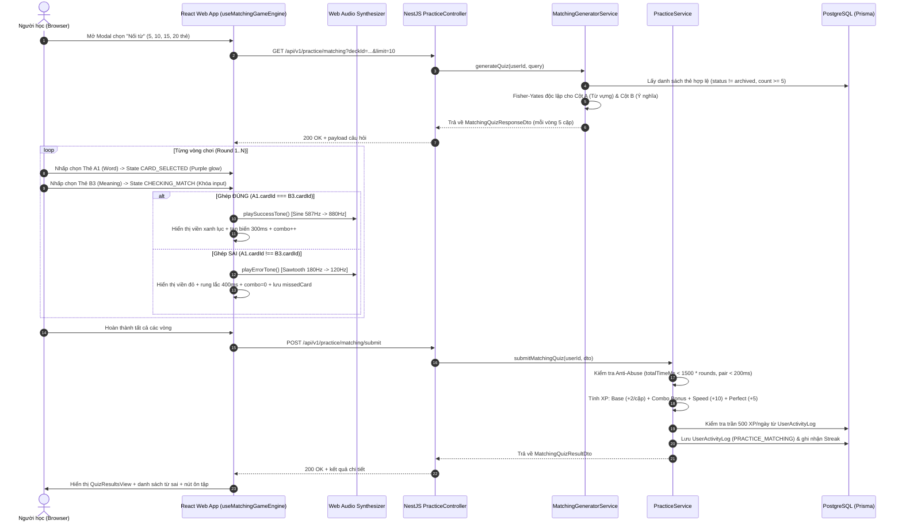
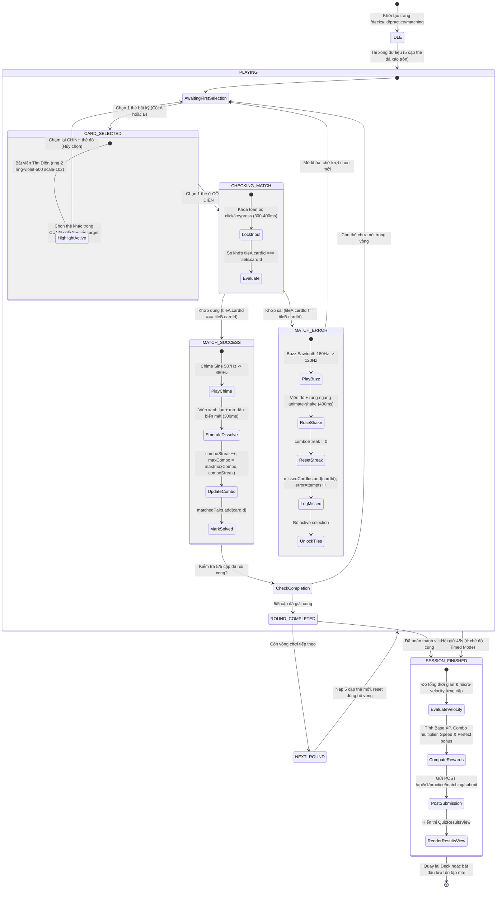

# Feature: Chế độ Nối từ vựng (Word Matching Game) (US-QUIZ-04)

**Slug**: `quiz-word-matching`  
**Version**: 1.0  
**Ship date**: 2026-08-21  
**Spec**: [.specify/features/quiz-word-matching/](../../.specify/features/quiz-word-matching/)  
**Baseline**: [SIGNED-OFF v1.0](../../.specify/features/quiz-word-matching/baseline.md)  
**Epic**: `EPIC-04` (Multi-format Practice & Quiz Modes — US-QUIZ-04)

---

## 1. Mô tả ngắn (Overview & Value Proposition)

Tính năng **Nối từ vựng (Word Matching Game)** mang đến phương thức luyện tập phản xạ liên kết từ vựng đa chiều, kích thích thị giác và xúc giác cho người học WordStreak. Thay vì chỉ ghi nhớ đơn hướng qua lật thẻ flashcard hay trắc nghiệm 4 đáp án truyền thống, chế độ nối từ trình bày bàn cờ 2 cột gồm 5 thuật ngữ tiếng Anh và 5 định nghĩa tiếng Việt được xáo trộn độc lập bằng thuật toán Fisher-Yates.

### Điểm nổi bật kỹ thuật:

- **Bàn cờ 2 cột tương tác 2 chiều (Bidirectional Selection)**: Cho phép chọn từ Trái $\to$ Phải hoặc Phải $\to$ Trái, chuyển đổi lựa chọn trong cùng cột mượt mà, tự hủy chọn khi chạm lại thẻ mà không bị phạt điểm.
- **Bộ tổng hợp âm thanh Web Audio API thuần (Zero-Asset Web Audio Synthesizer)**: Khởi tạo âm thanh trực tiếp qua các bộ dao động sóng (OscillatorNode) trong trình duyệt (Sine sweep khi đúng, Sawtooth buzz khi sai, Bell ping khi combo), giảm 100% dung lượng tải tệp MP3 ngoài.
- **Hệ thống Gamification & Combo Multiplier**: Cơ chế tích lũy chuỗi đúng liên tiếp nâng cấp hệ số nhân kinh nghiệm ($1.0\times, 1.2\times, 1.5\times, 2.0\times$), thưởng tốc độ ($+10\text{ XP}$ khi hoàn thành $\le 15.0\text{s}$) và thưởng độ chính xác tuyệt đối ($+5\text{ XP}$).
- **Hàng rào chống gian lận & Cô lập SRS**: Tự động phát hiện bot tự động tốc độ cao ($< 1500\text{ms}$/vòng hoặc $< 200\text{ms}$/cặp), áp trần luyện tập $500\text{ XP/ngày}$, và bảo toàn 100% chu kỳ lặp lại Spaced Repetition (`UserCardProgress`).

---

## 2. Phạm vi tính năng (MoSCoW In-Scope)

### User Stories & Acceptance Criteria

```
┌──────────────────────────────────────────────────────────────────────────────────┐
│                             USER STORIES & SCENARIOS                             │
├───────────────────┬──────────────────────────────────────────────────────────────┤
│ Story ID          │ Tiêu chí chấp thuận (Acceptance Criteria)                    │
├───────────────────┼──────────────────────────────────────────────────────────────┤
│ **US-MATCH-01**   │ - Khởi chạy từ `QuizSetupModal` với lựa chọn 5, 10, 15, 20   │
│ Cấu hình & Bảo vệ │   thẻ (chia thành các vòng 5 cặp) và hẹn giờ 45s / Zen Mode. │
│ số lượng thẻ      │ - Chặn khởi chạy nếu bộ từ $< 5$ thẻ (badge cảnh báo + 400). │
├───────────────────┼──────────────────────────────────────────────────────────────┤
│ **US-MATCH-02**   │ - Bàn cờ 2 cột (Cột A: Từ vựng Anh; Cột B: Nghĩa Việt).      │
│ Tương tác 2 cột & │ - Chọn 2 chiều, đổi chọn trong cùng cột, chạm lại để hủy.    │
│ Phản hồi tức thì  │ - Đúng: Chime 587Hz->880Hz, viền xanh lục, tan biến 300ms.  │
│                   │ - Sai: Buzz 180Hz->120Hz, viền đỏ, rung lắc 400ms.          │
│                   │ - Khóa tương tác tạm thời (300-400ms) chống race condition.  │
│                   │ - Phím tắt `1-5`, `Q-T` (hoặc `6-0`), `Space`, `Escape`.     │
├───────────────────┼──────────────────────────────────────────────────────────────┤
│ **US-MATCH-03**   │ - Tổng kết `QuizResultsView`: accuracy %, max combo, XP breakdown.│
│ Tổng kết, XP &    │ - Thưởng tốc độ +10 XP, thưởng chuẩn xác +5 XP.              │
│ Chống gian lận    │ - Bot detection (<1500ms vòng / <200ms cặp) -> set 0 XP.     │
│                   │ - Danh sách từ ghép sai kèm phát âm để ôn tập lại.           │
└───────────────────┴──────────────────────────────────────────────────────────────┘
```

---

## 3. Ngoài phạm vi (Won't-Have v1)

- **Đấu trường đối kháng Real-time PvP**: Ghép trận trực tiếp giữa 2 người chơi qua WebSocket (dành cho Epic 07: Multiplayer Arenas).
- **Tùy biến cặp thẻ nhiễu thủ công**: Hệ thống tự động lấy cặp từ chính xác từ bộ thẻ; không tạo các câu đố logic ngữ nghĩa phức tạp dạng 1-nhiều.
- **Biến động chu kỳ SM-2**: Kết quả nối từ không làm thay đổi các trường `easeFactor`, `interval`, `repetitions`, `nextReviewDate` trong `UserCardProgress`.

---

## 4. Kiến trúc Kỹ thuật & Luồng Dữ liệu (Architecture & Data Flow)

### 4.1. Sơ đồ Luồng Dữ liệu Toàn hệ thống (System Data Flow)



---

### 4.2. State Machine Quản lý Trạng thái Trò chơi (Game Engine FSM)



---

## 5. Danh mục Quy tắc Nghiệp vụ (Business Rules BR-MATCH-001 .. BR-MATCH-012)

| Mã quy tắc         | Tên quy tắc                                         | Mô tả chi tiết & Công thức tính toán                                                                                                                                                                                                                                                                                                                                                 |
| :----------------- | :-------------------------------------------------- | :----------------------------------------------------------------------------------------------------------------------------------------------------------------------------------------------------------------------------------------------------------------------------------------------------------------------------------------------------------------------------------- |
| **`BR-MATCH-001`** | **Kích thước vòng & Bố cục 2 cột**                  | Mỗi vòng chơi gồm đúng **5 cặp thẻ** (tổng cộng 10 ô). Cột A (trái) hiển thị 5 từ vựng tiếng Anh kèm phiên âm IPA; Cột B (phải) hiển thị 5 nghĩa tiếng Việt. Các phiên chơi lớn (10, 15, 20 thẻ) được chia thành các vòng tuần tự $N = \lfloor \text{limit} / 5 \rfloor$.                                                                                                            |
| **`BR-MATCH-002`** | **Xáo trộn độc lập (Fisher-Yates)**                 | Cột từ tiếng Anh và cột nghĩa tiếng Việt được xáo trộn độc lập bằng thuật toán Fisher-Yates khi bắt đầu vòng. Không có sự tương ứng cố định về vị trí dòng giữa 2 cột.                                                                                                                                                                                                               |
| **`BR-MATCH-003`** | **Lựa chọn 2 chiều (Bidirectional)**                | Người học có thể bắt đầu chọn từ Cột A rồi sang Cột B, hoặc từ Cột B rồi sang Cột A. Thứ tự chọn không ảnh hưởng đến điểm số hay độ chính xác.                                                                                                                                                                                                                                       |
| **`BR-MATCH-004`** | **Chuyển đổi cùng cột & Tự hủy chọn**               | Nhấp vào một ô khác trong _cùng một cột_ sẽ chuyển tiêu điểm chọn sang ô mới ngay lập tức mà không bị tính lỗi. Nhấp lại vào _chính ô đang chọn_ sẽ hủy trạng thái chọn về trung tính (Neutral).                                                                                                                                                                                     |
| **`BR-MATCH-005`** | **Khóa tương tác & Thời lượng Animation**           | Khi chọn ô thứ hai ở cột đối diện, hệ thống chuyển sang `CHECKING_MATCH` và khóa mọi tương tác chuột/bàn phím. Cặp đúng hiển thị màu ngọc lục bảo trong **300ms** trước khi biến mất. Cặp sai hiển thị màu đỏ kèm hiệu ứng rung lắc trong **400ms** trước khi hoàn nguyên.                                                                                                           |
| **`BR-MATCH-006`** | **Điểm kinh nghiệm cơ bản (Base XP)**               | Mỗi cặp từ nối đúng được cộng $+2\text{ XP}$ cơ bản ($10\text{ XP}$ cho mỗi vòng 5 cặp hoàn chỉnh).                                                                                                                                                                                                                                                                                  |
| **`BR-MATCH-007`** | **Hệ số nhân Combo (Combo Multipliers)**            | Chuỗi nối đúng liên tiếp $c$ không mắc lỗi áp dụng hệ số nhân:<br>$$M(c) = \begin{cases} 1.0 & \text{khi } c \in [1, 2] \\ 1.2 & \text{khi } c \in [3, 4] \\ 1.5 & \text{khi } c \in [5, 9] \quad (\text{Vòng sạch}) \\ 2.0 & \text{khi } c \ge 10 \quad (\text{Siêu chuỗi đa vòng}) \end{cases}$$<br>Điểm thưởng combo: $\text{Bonus}_{\text{combo}} = \sum 2 \times (M(c) - 1.0)$. |
| **`BR-MATCH-008`** | **Thưởng tốc độ (Round Speed Bonus)**               | Trong một vòng 5 cặp, nếu người học hoàn thành trong thời gian $T_{\text{round}} \le 15.0\text{s}$ và không mắc bất kỳ lỗi sai nào, hệ thống thưởng thêm $+10\text{ XP}$ cho mỗi vòng đạt chuẩn.                                                                                                                                                                                     |
| **`BR-MATCH-009`** | **Thưởng hoàn hảo (Perfect Accuracy Bonus)**        | Nếu hoàn thành tất cả 5 cặp trong vòng ngay từ lần thử đầu tiên ($\text{errors} = 0$), hệ thống thưởng thêm $+5\text{ XP}$ cho mỗi vòng hoàn hảo.                                                                                                                                                                                                                                    |
| **`BR-MATCH-010`** | **Hàng rào vận tốc chống Bot (Anti-Abuse Guard)**   | Backend kiểm tra dữ liệu nộp bài:<br>1. Nếu $T_{\text{total}} < 1500\text{ms} \times \text{totalRounds}$ (với $\text{totalPairs} \ge 5$), HOẶC<br>2. Bất kỳ cặp nào có thời gian ghép $t_{\text{pair}} < 200\text{ms}$,<br>Hệ thống đánh dấu `isBotFlagged = true`, đặt toàn bộ XP phiên về $0\text{ XP}$, và ghi log cảnh báo an ninh.                                              |
| **`BR-MATCH-011`** | **Trần kinh nghiệm hàng ngày (Daily Practice Cap)** | Tất cả các chế độ luyện tập tự do chia sẻ hạn mức tối đa **500 XP/ngày**. Khi vượt trần, người học vẫn có thể tiếp tục chơi nhưng điểm XP nhận thêm trong ngày bằng 0.                                                                                                                                                                                                               |
| **`BR-MATCH-012`** | **Cô lập SM-2 & Điều kiện bộ từ tối thiểu**         | Trò chơi yêu cầu bộ từ phải có tối thiểu $\ge 5$ thẻ hợp lệ. Phiên chơi hoàn toàn không làm thay đổi các chỉ số Spaced Repetition (`interval`, `easeFactor`, `nextReviewDate`). Danh sách thẻ bị ghép sai được trả về để người học ôn tập lại.                                                                                                                                       |

---

## 6. Đặc tả REST API (REST API Specifications)

### 6.1. Khởi tạo câu hỏi nối từ: `GET /api/v1/practice/matching`

- **Mô tả**: Sinh cấu trúc các vòng chơi nối từ 2 cột với thuật toán xáo trộn ngẫu nhiên.
- **Bảo mật**: Yêu cầu `Bearer Token` (`JwtAuthGuard`).
- **Query Parameters**:
  - `deckId` (`string`, bắt buộc): UUID của bộ từ.
  - `limit` (`number`, tùy chọn, mặc định `10`, min `5`, max `50`): Số lượng thẻ mục tiêu.
  - `roundsCount` (`number`, tùy chọn, min `1`, max `10`): Số lượng vòng chơi (mỗi vòng tương ứng 5 cặp).

#### Ví dụ Request:

```http
GET /api/v1/practice/matching?deckId=a1b2c3d4-e5f6-7a8b-9c0d-1e2f3a4b5c6d&limit=10 HTTP/1.1
Host: api.wordstreak.internal
Authorization: Bearer <jwt-token>
```

#### Phản hồi thành công (HTTP 200 OK):

```json
{
  "success": true,
  "data": {
    "deckId": "a1b2c3d4-e5f6-7a8b-9c0d-1e2f3a4b5c6d",
    "deckTitle": "Oxford 3000 Core Vocabulary",
    "totalCards": 10,
    "totalRounds": 2,
    "rounds": [
      {
        "roundIndex": 0,
        "totalRounds": 2,
        "wordTiles": [
          {
            "id": "tile_w_card_101",
            "cardId": "card_101",
            "text": "Ubiquitous",
            "type": "WORD",
            "phonetic": "/juːˈbɪk.wɪ.təs/",
            "audioUrl": "https://assets.wordstreak.app/audio/ubiquitous.mp3"
          },
          {
            "id": "tile_w_card_102",
            "cardId": "card_102",
            "text": "Resilient",
            "type": "WORD",
            "phonetic": "/rɪˈzɪl.jənt/",
            "audioUrl": "https://assets.wordstreak.app/audio/resilient.mp3"
          }
        ],
        "meaningTiles": [
          {
            "id": "tile_m_card_102",
            "cardId": "card_102",
            "text": "Kiên cường, bền bỉ, mau phục hồi",
            "type": "MEANING",
            "phonetic": null,
            "audioUrl": null
          },
          {
            "id": "tile_m_card_101",
            "cardId": "card_101",
            "text": "Phổ biến, có mặt ở khắp mọi nơi",
            "type": "MEANING",
            "phonetic": null,
            "audioUrl": null
          }
        ]
      }
    ]
  }
}
```

#### Mã lỗi thường gặp:

- `400 Bad Request`: `INSUFFICIENT_CARDS_FOR_MATCHING` khi bộ từ có $< 5$ thẻ.
- `403 Forbidden`: Người dùng không sở hữu bộ từ và bộ từ không ở chế độ Public.
- `404 Not Found`: Không tìm thấy bộ từ hoặc bộ từ đã bị lưu trữ (`isArchived = true`).

---

### 6.2. Nộp kết quả bài nối từ: `POST /api/v1/practice/matching/submit`

- **Mô tả**: Chấm điểm kết quả, kiểm tra vận tốc chống bot, tính toán điểm thưởng tốc độ / combo, kiểm tra trần XP ngày và cập nhật streak.
- **Alias hỗ trợ**: Endpoint `POST /api/v1/practice/submit` và `POST /api/v1/practice/submit-quiz` cũng tự động phân luồng sang matching handler nếu `mode === "MATCHING"` hoặc có trường `totalPairs`.
- **Request Body (`SubmitMatchingQuizDto`)**:

```json
{
  "deckId": "a1b2c3d4-e5f6-7a8b-9c0d-1e2f3a4b5c6d",
  "mode": "MATCHING",
  "totalPairs": 10,
  "totalTimeMs": 24500,
  "maxCombo": 10,
  "answers": [
    {
      "cardId": "card_101",
      "matchedInMs": 2100,
      "attempts": 1,
      "isCorrectFirstTry": true,
      "isCorrect": true
    },
    {
      "cardId": "card_102",
      "matchedInMs": 1850,
      "attempts": 2,
      "isCorrectFirstTry": false,
      "isCorrect": true
    }
  ]
}
```

#### Phản hồi thành công (HTTP 200 OK):

```json
{
  "success": true,
  "data": {
    "submissionId": "wm_sub_1771676240000",
    "score": 10,
    "accuracy": 100,
    "totalPairs": 10,
    "matchedCount": 10,
    "accuracyPercentage": 100,
    "maxCombo": 10,
    "totalTimeMs": 24500,
    "totalXpEarned": 42,
    "totalXp": 42,
    "isBotFlagged": false,
    "xpBreakdown": {
      "baseXp": 20,
      "comboBonusXp": 7,
      "speedBonusXp": 10,
      "perfectBonusXp": 5,
      "totalXp": 42,
      "isDailyCapped": false,
      "isBotDetected": false,
      "isBotFlagged": false
    },
    "missedCards": [
      {
        "cardId": "card_102",
        "word": "Resilient",
        "meaning": "Kiên cường, bền bỉ, mau phục hồi",
        "phonetic": "/rɪˈzɪl.jənt/",
        "audioUrl": "https://assets.wordstreak.app/audio/resilient.mp3",
        "errorAttempts": 1
      }
    ]
  },
  "message": "Matching quiz session submitted successfully"
}
```

---

## 7. Thông số Kỹ thuật Bộ tổng hợp Âm thanh (Web Audio API Synthesizer)

Hệ thống sử dụng custom hook [`useWebAudioSynthesizer`](file:///Users/vutuanhau/Documents/PROJECT/WordStreak/apps/web/src/features/practice/hooks/useWebAudioSynthesizer.ts) để phát hiệu ứng âm thanh mà không cần phụ thuộc vào tệp audio ngoại vi:

```
┌──────────────────────────────────────────────────────────────────────────────────┐
│                      WEB AUDIO SYNTHESIZER OSCILLATOR SPECS                      │
├─────────────────┬──────────┬───────────────────┬──────────┬──────────────────────┤
│ Âm thanh        │ Dạng sóng│ Dải tần số (Hz)   │ Thời gian│ Biên độ (Gain Curve) │
├─────────────────┼──────────┼───────────────────┼──────────┼──────────────────────┤
│ **Khớp đúng**   │ Sine     │ $587.33 \to 880$  │ 120ms    │ Exponential decay    │
│ (Success Chime) │ (Sine)   │ (D5 $\to$ A5)     │          │ $0.20 \to 0.001$     │
├─────────────────┼──────────┼───────────────────┼──────────┼──────────────────────┤
│ **Ghép sai**    │ Sawtooth │ $180 \to 120$     │ 180ms    │ Linear decay         │
│ (Error Buzz)    │ (Saw)    │ Double-pulse sub  │          │ $0.25 \to 0.001$     │
├─────────────────┼──────────┼───────────────────┼──────────┼──────────────────────┤
│ **Chuỗi Combo** │ Sine     │ $1046.50$ (C6)    │ 150ms    │ Bell chime envelope  │
│ (Combo Ding)    │ (Chime)  │ High-pass filtered│          │ $0.22 \to 0.001$     │
└─────────────────┴──────────┴───────────────────┴──────────┴──────────────────────┘
```

- **Quản lý Lifecycle**: Tự động giải phóng `AudioContext.close()` khi unmount component nhằm loại trừ rò rỉ bộ nhớ.
- **Xử lý Autoplay Policy**: Tự động gọi `audioContext.resume()` ngay tại cử chỉ tương tác đầu tiên của người dùng nếu ngữ cảnh âm thanh đang ở trạng thái `suspended`.
- **Cấu hình Mute**: Lưu trạng thái tắt/bật âm thanh vào `localStorage` (`wordstreak:sound-muted`).

---

## 8. Các thay đổi Kỹ thuật trong Mã nguồn (Codebase Changes)

### 8.1. Shared Types (`packages/shared-types`)

- File: [`packages/shared-types/src/practice.ts`](file:///Users/vutuanhau/Documents/PROJECT/WordStreak/packages/shared-types/src/practice.ts)
  - `MatchingTileType`: Định dạng loại thẻ (`WORD` | `MEANING`).
  - `MatchingTileState`: Trạng thái thẻ (`NEUTRAL`, `SELECTED`, `MATCHED`, `MISMATCH`).
  - `MatchingCardItemDto`, `MatchingRoundDto`, `GetMatchingQuizQueryDto`, `MatchingQuizResponseDto`.
  - `MatchingAnswerSubmissionDto`, `SubmitMatchingQuizDto`, `MatchingMissedCardDto`, `MatchingQuizResultDto`.

### 8.2. Backend NestJS (`apps/api`)

- [`apps/api/src/modules/practice/matching-generator.service.ts`](file:///Users/vutuanhau/Documents/PROJECT/WordStreak/apps/api/src/modules/practice/matching-generator.service.ts): Xử lý truy vấn bộ từ, xác thực quyền truy cập, chia nhỏ vòng 5 cặp và xáo trộn Fisher-Yates 2 cột độc lập.
- [`apps/api/src/modules/practice/dto/get-matching-quiz.dto.ts`](file:///Users/vutuanhau/Documents/PROJECT/WordStreak/apps/api/src/modules/practice/dto/get-matching-quiz.dto.ts): DTO validate tham số truy vấn `deckId`, `limit` (5-50), `roundsCount` (1-10).
- [`apps/api/src/modules/practice/dto/submit-matching-quiz.dto.ts`](file:///Users/vutuanhau/Documents/PROJECT/WordStreak/apps/api/src/modules/practice/dto/submit-matching-quiz.dto.ts): DTO validate payload nộp bài nối từ.
- [`apps/api/src/modules/practice/practice.service.ts`](file:///Users/vutuanhau/Documents/PROJECT/WordStreak/apps/api/src/modules/practice/practice.service.ts): Động cơ tính điểm XP, hệ số combo, hàng rào chống bot velocity, áp trần 500 XP/ngày và tổng hợp danh sách từ sai.
- [`apps/api/src/modules/practice/practice.controller.ts`](file:///Users/vutuanhau/Documents/PROJECT/WordStreak/apps/api/src/modules/practice/practice.controller.ts): Cung cấp REST endpoints `GET /api/v1/practice/matching` và `POST /api/v1/practice/matching/submit`.
- [`apps/api/src/modules/practice/practice.module.ts`](file:///Users/vutuanhau/Documents/PROJECT/WordStreak/apps/api/src/modules/practice/practice.module.ts): Đăng ký `MatchingGeneratorService`.

### 8.3. Frontend React 19 (`apps/web`)

- [`apps/web/src/features/practice/hooks/useWebAudioSynthesizer.ts`](file:///Users/vutuanhau/Documents/PROJECT/WordStreak/apps/web/src/features/practice/hooks/useWebAudioSynthesizer.ts): Bộ phát âm thanh dao động sóng Web Audio API không tốn băng thông.
- [`apps/web/src/features/practice/hooks/useMatchingGameEngine.ts`](file:///Users/vutuanhau/Documents/PROJECT/WordStreak/apps/web/src/features/practice/hooks/useMatchingGameEngine.ts): State machine quản lý toàn diện phiên chơi, bảo vệ chống double-click bằng `useRef`, tính toán combo, đồng hồ đếm giờ và nộp bài.
- [`apps/web/src/features/practice/components/MatchingTile.tsx`](file:///Users/vutuanhau/Documents/PROJECT/WordStreak/apps/web/src/features/practice/components/MatchingTile.tsx): Thẻ ghép từ tương tác với cơ chế neo tọa độ ngoài (Outer Anchor) triệt tiêu rung giật 60Hz hover jitter, nút phát âm thanh và badge phím tắt.
- [`apps/web/src/features/practice/components/MatchingGameBoard.tsx`](file:///Users/vutuanhau/Documents/PROJECT/WordStreak/apps/web/src/features/practice/components/MatchingGameBoard.tsx): Khung hiển thị 2 cột (Từ vựng `1-5` vs Định nghĩa `Q-T`) kèm trình bắt sự kiện bàn phím.
- [`apps/web/src/features/practice/components/MatchingProgressBar.tsx`](file:///Users/vutuanhau/Documents/PROJECT/WordStreak/apps/web/src/features/practice/components/MatchingProgressBar.tsx): Thanh điều hướng trên cùng hiển thị tiến độ vòng, bộ đếm combo ngọn lửa tím, đồng hồ và nút bật/tắt âm thanh.
- [`apps/web/src/features/practice/components/QuizSetupModal.tsx`](file:///Users/vutuanhau/Documents/PROJECT/WordStreak/apps/web/src/features/practice/components/QuizSetupModal.tsx): Tích hợp tab "Nối từ" (Word Matching) với badge kiểm tra điều kiện $\ge 5$ thẻ.
- [`apps/web/src/features/practice/pages/WordMatchingPage.tsx`](file:///Users/vutuanhau/Documents/PROJECT/WordStreak/apps/web/src/features/practice/pages/WordMatchingPage.tsx): Trang game hoàn chỉnh toàn màn hình kết nối API, state engine, streak sync và màn hình tổng kết kết quả.
- [`apps/web/src/features/practice/services/practiceService.ts`](file:///Users/vutuanhau/Documents/PROJECT/WordStreak/apps/web/src/features/practice/services/practiceService.ts): Client API tích hợp các hàm `getMatchingQuiz` và `submitMatchingQuiz`.
- [`apps/web/src/App.tsx`](file:///Users/vutuanhau/Documents/PROJECT/WordStreak/apps/web/src/App.tsx): Định tuyến `/decks/:id/practice/matching` và `/practice/matching`.

---

## 9. Ma trận Kiểm thử & Độ bao phủ (Testing Matrix & Coverage)

```
┌──────────────────────────────────────────────────────────────────────────────────┐
│                         AUTOMATED TEST SUITES SUMMARY                            │
├───────────────────────────────────────────────────────┬───────────┬──────────────┤
│ Test Suite File                                       │ Số lượng  │ Trạng thái   │
├───────────────────────────────────────────────────────┼───────────┼──────────────┤
│ **Backend Suites (NestJS / Jest)**                    │           │              │
│ - `matching-generator.service.spec.ts`                │ 8 tests   │ ✅ 100% Pass │
│ - `dto/get-matching-quiz.dto.spec.ts`                 │ 5 tests   │ ✅ 100% Pass │
│ - `dto/submit-matching-quiz.dto.spec.ts`              │ 5 tests   │ ✅ 100% Pass │
│ - `practice.service.spec.ts` (Matching scenarios)     │ 9 tests   │ ✅ 100% Pass │
│ - `practice.controller.spec.ts` (Matching endpoints)  │ 5 tests   │ ✅ 100% Pass │
├───────────────────────────────────────────────────────┼───────────┼──────────────┤
│ **Frontend Suites (React 19 / Vitest)**               │           │              │
│ - `hooks/useMatchingGameEngine.spec.ts`               │ 11 tests  │ ✅ 100% Pass │
│ - `hooks/useWebAudioSynthesizer.spec.ts`              │ 8 tests   │ ✅ 100% Pass │
│ - `components/MatchingTile.spec.tsx`                  │ 6 tests   │ ✅ 100% Pass │
│ - `components/MatchingGameBoard.spec.tsx`             │ 6 tests   │ ✅ 100% Pass │
│ - `components/MatchingProgressBar.spec.tsx`           │ 5 tests   │ ✅ 100% Pass │
│ - `pages/WordMatchingPage.spec.tsx`                   │ 2 tests   │ ✅ 100% Pass │
├───────────────────────────────────────────────────────┼───────────┼──────────────┤
│ **TỔNG CỘNG KIỂM THỬ MATCHING MODE**                  │ **70 tests**│ ✅ **100% PASS**│
└───────────────────────────────────────────────────────┴───────────┴──────────────┘
```

### Các ca kiểm thử biên tiêu biểu đã được xác minh:

1. **Chia nhóm 5 cặp & Bỏ qua dư lẻ**: Bộ từ 14 thẻ với `limit=10` sinh đúng 2 vòng (10 thẻ); bộ từ $< 5$ thẻ ném lỗi `INSUFFICIENT_CARDS_FOR_MATCHING`.
2. **Xáo trộn vị trí độc lập**: Xác thực không bao giờ có sự tương quan vị trí cố định 1-1 giữa 2 cột sau xáo trộn Fisher-Yates.
3. **Chống đúp lệnh (Double-Click & Race Protection)**: Bấm liên tục nhiều ô trong thời gian $< 50\text{ms}$ khi đang ở `CHECKING_MATCH` không làm sai lệch state hay kích hoạt nhiều timeout.
4. **Hệ số nhân Combo liên vòng**: Giữ nguyên chuỗi 5x từ vòng 1 sang vòng 2 để kích hoạt mốc 10x ($2.0\times$ multiplier).
5. **Chống gian lận Bot Velocity**: Nộp bài với thời gian $< 1500\text{ms}$ hoặc có cặp $< 200\text{ms}$ bị triệt tiêu toàn bộ điểm thưởng về $0\text{ XP}$.

---

## 10. Tác giả & Phê duyệt (Authors & Sign-off)

- **Technical Documentation Architect**: AI (Antigravity)
- **Code Review**: [Adversarial Senior Code Review (Score: 92/100 — Grade: A-)](../../docs/reviews/code-review-quiz-word-matching.md)
- **UI/UX & Accessibility Review**: [Design System & Motion Review (Score: 96/100 — Grade: A+)](../../docs/reviews/ui-review-quiz-word-matching.md)
- **Reviewed & Approved by**: User (Approved Implementation Plan)
- **Ship Date**: 2026-08-21
- **Status**: Hoàn thành (`Delivered`)
