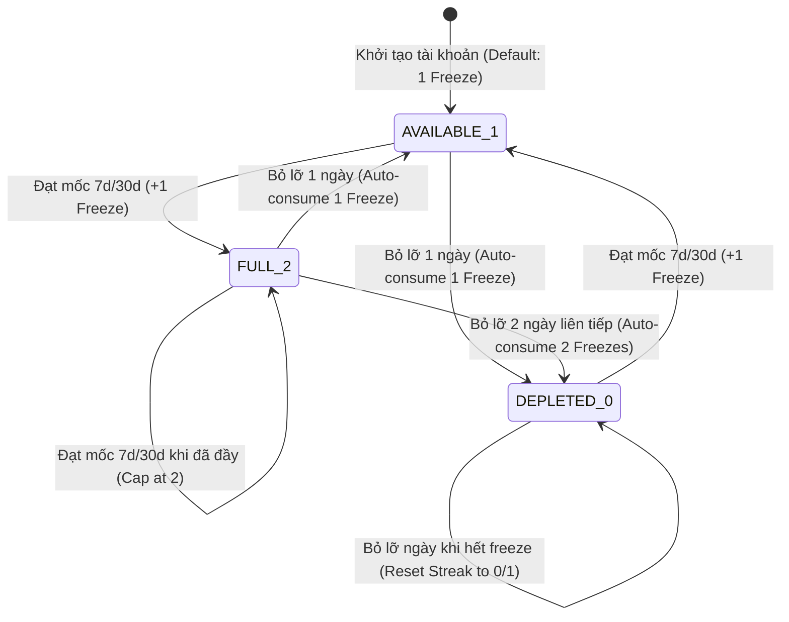

# Feature: Streak Freeze Protection Mechanic (US-GAME-02)

**Slug**: `streak-freeze`  
**Version**: 1.0  
**Ship date**: 2026-08-21  
**Spec**: [.specify/features/streak-freeze/](../../.specify/features/streak-freeze/)  
**Baseline**: [SIGNED-OFF v1.0](../../.specify/features/streak-freeze/baseline.md)  
**Test Plan**: [.specify/features/streak-freeze/test-plan.md](../../.specify/features/streak-freeze/test-plan.md)  
**Validation Report**: [.specify/features/streak-freeze/validation-report.md](../../.specify/features/streak-freeze/validation-report.md)

---

## 1. Mô tả ngắn (Overview & Problem Solved)

Tính năng **Streak Freeze Protection Mechanic (US-GAME-02)** là cơ chế bảo vệ chuỗi học tập tự động (Shield Protection) nhằm ngăn ngừa tình trạng người học mất toàn bộ chuỗi ngày học tập tích lũy (streak) khi gặp các biến cố bất khả kháng hoặc quên học trong 1–2 ngày ngắn hạn.

Trước đây, khi người học bị gián đoạn $\ge 2$ ngày ($\Delta d \ge 2$), hệ thống sẽ thực hiện hard-reset chuỗi về 0 hoặc 1, gây đứt gãy động lực học tập (streak churn). Với cơ chế **Streak Freeze**, người học được trang bị sẵn 1 lượt đóng băng chuỗi mặc định (tối đa chứa được 2 lượt). Khi phát hiện ngày bị bỏ lỡ, hệ thống sẽ **tự động kích hoạt (lazy auto-consume)** lượt đóng băng để bảo toàn chuỗi nguyên vẹn, đồng thời thưởng thêm lượt freeze khi người học đạt các mốc kiên trì 7 ngày và 30 ngày.

---

## 2. Phạm vi tính năng (MoSCoW Must-Have đã ship)

- [x] **US-FREEZE-001 Scenario 1 (Single Missed Day Auto-Protect)**: Khi người học bỏ lỡ 1 ngày học ($\Delta d = 2$) và có ít nhất 1 Streak Freeze, hệ thống tự động tiêu thụ 1 freeze, giữ nguyên chuỗi `currentStreak` và gắn cờ `wasProtectedByFreeze = true`.
- [x] **US-FREEZE-001 Scenario 1 (Multi-Day Protection)**: Khi người học bỏ lỡ 2 ngày ($\Delta d = 3$) và có đủ 2 Streak Freezes, hệ thống tiêu thụ 2 freeze và bảo toàn chuỗi.
- [x] **US-FREEZE-001 Scenario 2 (Exceeding Quota Streak Reset)**: Khi khoảng thời gian vắng mặt vượt quá số lượng freeze sở hữu ($\Delta d > \text{streakFreezes} + 1$), hệ thống reset chuỗi về 0 (hoặc 1 khi học mới) mà không lãng phí số freeze đang có.
- [x] **US-FREEZE-002 Scenario 1 (Milestone Replenishment)**: Tự động thưởng $+1$ Streak Freeze khi người học đạt mốc streak 7 ngày hoặc 30 ngày (nếu chưa đạt trần giới hạn).
- [x] **US-FREEZE-002 Scenario 2 (Capacity Capping)**: Giới hạn tối đa số lượng freeze sở hữu là $2$ (`MAX_STREAK_FREEZES = 2`). Nếu đạt mốc thưởng khi đã có 2 freeze, hệ thống không cộng dồn vượt trần.
- [x] **US-FREEZE-003 Scenario 1 (Frost Shield UI Indicator)**: Hiển thị huy hiệu đóng băng băng giá `1/2 🧊` kèm tooltip giải thích chi tiết trên `StreakWidget` ở Dashboard.
- [x] **US-FREEZE-003 Scenario 2 (Protection Notification Modal)**: Hiển thị modal thông báo `StreakSavedModal` với hiệu ứng khiên băng cứu chuỗi, thống kê số ngày đã bảo vệ và số freeze còn lại.
- [x] **Milestone Celebration Integration**: `StreakCelebrationModal` hiển thị huy hiệu vinh danh `+1 Streak Freeze Earned! 🧊` khi đạt mốc thưởng 7d / 30d.

---

## 3. Ngoài phạm vi (Won't-Have v1)

- **XP / Gem Store Freeze Purchase**: Chưa mở bán hoặc đổi lượt đóng băng bằng điểm thưởng XP/Gems (dự kiến trong Epic 07 / Shop).
- **Paid Streak Repairs**: Không bán tính năng khôi phục chuỗi bằng tiền thật (WordStreak giữ vững tôn chỉ 100% miễn phí trọn đời cho trải nghiệm học).
- **Custom Freeze Skins**: Chưa hỗ trợ tùy biến giao diện linh vật đóng băng đặc biệt.

---

## 4. Các thay đổi kỹ thuật chính (Technical Architecture)

### 4.1. Database Schema (`UserStreak` Model)

File: [`apps/api/prisma/schema.prisma`](file:///Users/vutuanhau/Documents/PROJECT/WordStreak/apps/api/prisma/schema.prisma#L101-L114)

Mô hình `UserStreak` được mở rộng thêm 3 trường quản lý cơ chế đóng băng:

```prisma
model UserStreak {
  id               String    @id @default(uuid())
  userId           String    @unique
  currentStreak    Int       @default(0)
  bestStreak       Int       @default(0)
  lastActiveDate   DateTime?

  // --- Streak Freeze Extension Fields ---
  streakFreezes    Int       @default(1)    // Số lượt đóng băng khả dụng (0..2)
  lastFreezeDate   DateTime?                // Thời điểm kích hoạt đóng băng gần nhất
  totalFreezesUsed Int       @default(0)    // Tổng số lượt đóng băng đã tiêu thụ trong lịch sử

  user             User      @relation(fields: [userId], references: [id], onDelete: Cascade)

  @@map("user_streaks")
}
```

### 4.2. Shared Contracts & DTOs

File: [`packages/shared-types/src/streaks.ts`](file:///Users/vutuanhau/Documents/PROJECT/WordStreak/packages/shared-types/src/streaks.ts)

- **`UserStreakDto`**:
  - `streakFreezes: number`: Số lượt đóng băng hiện tại ($0 \dots 2$).
  - `maxStreakFreezes: number`: Hạn mức tối đa ($2$).
  - `totalFreezesUsed?: number`: Tổng lượt freeze đã dùng.
  - `lastFreezeDate?: string | null`: Thời điểm dùng freeze gần nhất.
  - `wasProtectedByFreeze?: boolean`: Đánh dấu chuỗi vừa được cứu tự động trong lần truy vấn này.
  - `freezesUsed?: number`: Số lượt freeze vừa tiêu thụ ($1$ hoặc $2$).
- **`StreakActivityResponseDto`**:
  - `streakFreezes: number`
  - `wasProtectedByFreeze?: boolean`
  - `freezesUsed?: number`
  - `earnedMilestoneFreeze?: boolean`: Báo hiệu vừa nhận thưởng freeze từ mốc 7d/30d.

### 4.3. Backend (`apps/api`)

- **`StreakService`** ([`apps/api/src/modules/streaks/streak.service.ts`](file:///Users/vutuanhau/Documents/PROJECT/WordStreak/apps/api/src/modules/streaks/streak.service.ts)):
  - **Lazy Evaluation on `getStreak`**: Khi client gọi `GET /api/v1/streaks/me`, hệ thống tính khoảng cách ngày $\Delta d$. Nếu $2 \le \Delta d \le \text{streakFreezes} + 1$, hệ thống tự động trừ freeze trong database, cập nhật `lastActiveDate` ảo về ngày hôm qua và trả về `wasProtectedByFreeze = true`.
  - **Record Activity Protection**: Trong `recordActivity`, nếu người học bỏ lỡ ngày trong hạn mức freeze, hệ thống tự động trừ freeze và ghi nhận tăng chuỗi $+1$ thay vì reset về $1$.
  - **Milestone Rewards Engine**: Khi chuỗi đạt mốc $7$ hoặc $30$ ngày và $\text{streakFreezes} < 2$, tự động cộng $+1$ freeze và gắn cờ `earnedMilestoneFreeze = true`.
- **`StreakController`** ([`apps/api/src/modules/streaks/streak.controller.ts`](file:///Users/vutuanhau/Documents/PROJECT/WordStreak/apps/api/src/modules/streaks/streak.controller.ts)):
  - Cung cấp các endpoint `GET /api/v1/streaks/me` và `POST /api/v1/streaks/record-activity` tiếp nhận timezone header `x-timezone`.

### 4.4. Frontend (`apps/web`)

- **`useStreak` Hook** ([`apps/web/src/features/dashboard/hooks/useStreak.ts`](file:///Users/vutuanhau/Documents/PROJECT/WordStreak/apps/web/src/features/dashboard/hooks/useStreak.ts)):
  - Quản lý trạng thái reactive cho `streakFreezes`, `maxStreakFreezes`, `wasProtectedByFreeze`, và hàm `dismissFreezeSavedNotice()`.
  - Tự động đồng bộ toàn cục qua sự kiện `wordstreak:streak-updated`.
- **`StreakWidget`** ([`apps/web/src/features/dashboard/components/StreakWidget.tsx`](file:///Users/vutuanhau/Documents/PROJECT/WordStreak/apps/web/src/features/dashboard/components/StreakWidget.tsx)):
  - Hiển thị huy hiệu khiên băng `Streak Freeze` (`1/2 🧊` hoặc `2/2 🧊`).
  - Hỗ trợ tooltip trợ năng (Accessible Tooltip) khi hover hoặc focus bàn phím, giải thích luật tự động bảo vệ.
- **`StreakSavedModal`** ([`apps/web/src/features/dashboard/components/StreakSavedModal.tsx`](file:///Users/vutuanhau/Documents/PROJECT/WordStreak/apps/web/src/features/dashboard/components/StreakSavedModal.tsx)):
  - Modal thông báo chuỗi đã được cứu thành công với biểu tượng khiên băng xoay động, thống kê số ngày đã cứu và số freeze còn lại.
- **`StreakCelebrationModal`** ([`apps/web/src/features/dashboard/components/StreakCelebrationModal.tsx`](file:///Users/vutuanhau/Documents/PROJECT/WordStreak/apps/web/src/features/dashboard/components/StreakCelebrationModal.tsx)):
  - Tích hợp thêm badge thông báo nhận thưởng `+1 Streak Freeze Earned! 🧊` khi chạm mốc 7 ngày hoặc 30 ngày.

---

## 5. Thuật toán & Cơ chế Hoạt động (Algorithms & Mechanics)

### 5.1. Công thức Tính toán Khoảng cách Ngày ($\Delta d$)

Hệ thống tính độ lệch ngày lịch giữa ngày hoạt động gần nhất ($\text{lastActiveDay}$) và ngày hiện tại ($\text{today}$) theo múi giờ địa phương (IANA timezone) của người dùng:

$$\Delta d = \text{Date.UTC}(y_{\text{today}}, m_{\text{today}} - 1, d_{\text{today}}) - \text{Date.UTC}(y_{\text{last}}, m_{\text{last}} - 1, d_{\text{last}}) \div 86,400,000$$

- $\Delta d = 0$: Đã học hôm nay (`isActiveToday = true`).
- $\Delta d = 1$: Đã học hôm qua, chuỗi đang chờ hôm nay (`isPendingToday = true`).
- $\Delta d \ge 2$: Người học đã bỏ lỡ ít nhất 1 ngày. Số ngày cần cứu là $\text{needed} = \Delta d - 1$.

### 5.2. Máy trạng thái Tiêu thụ & Phục hồi Freeze (State Transition)



### 5.3. Sơ đồ Logic Đánh giá Lười (Lazy Auto-Evaluation Flowchart)

```mermaid
flowchart TD
    Start([Người dùng truy cập hoặc ghi nhận hoạt động]) --> CalcDelta[Tính delta_d theo múi giờ địa phương]
    CalcDelta --> CheckDelta{delta_d?}

    CheckDelta -- delta_d <= 1 --> NormalFlow[Xử lý streak thông thường: No-op hoặc +1]

    CheckDelta -- delta_d >= 2 --> CheckQuota{delta_d <= streakFreezes + 1 && currentStreak > 0?}

    CheckQuota -- Có đủ Freeze --> Consume[Tiêu thụ needed = delta_d - 1 freezes<br/>streakFreezes -= needed<br/>wasProtectedByFreeze = true]
    Consume --> Preserve[Bảo toàn currentStreak<br/>Cập nhật lastFreezeDate]

    CheckQuota -- Không đủ Freeze --> Reset[Không tiêu thụ freeze<br/>currentStreak = 0 hoặc 1<br/>wasProtectedByFreeze = false]

    Preserve --> CheckMilestone{newStreak in [7, 30] && streakFreezes < 2?}
    Reset --> CheckMilestone
    NormalFlow --> CheckMilestone

    CheckMilestone -- Đúng --> Award[streakFreezes += 1<br/>earnedMilestoneFreeze = true]
    CheckMilestone -- Sai --> Finish([Lưu Database & Trả kết quả])
    Award --> Finish
```

---

## 6. Test Evidence & Quality Verification

Toàn bộ hệ thống kiểm thử tự động đã được thực thi và đạt **100% tỷ lệ vượt qua (100% Pass Rate)**:

### 6.1. Backend Test Suites (`apps/api`)

- **Tổng kết**: **17 test suites, 123 tests passing** (Jest).
- **File kiểm thử trọng tâm**: [`apps/api/src/modules/streaks/streak.service.spec.ts`](file:///Users/vutuanhau/Documents/PROJECT/WordStreak/apps/api/src/modules/streaks/streak.service.spec.ts)
  - `[TC-FREEZE-001]`: Kiểm tra tự động trừ 1 freeze khi bỏ lỡ 1 ngày ($\Delta d = 2$) trong cả `getStreak` và `recordActivity`, bảo toàn `currentStreak` và trả về `wasProtectedByFreeze = true`.
  - `[TC-FREEZE-002]`: Kiểm tra tự động trừ 2 freeze khi bỏ lỡ 2 ngày ($\Delta d = 3$) và có đủ 2 freeze.
  - `[TC-FREEZE-003]`: Kiểm tra khoảng cách bỏ lỡ vượt hạn mức freeze ($\Delta d = 3$ khi chỉ có 1 freeze) sẽ reset streak mà không làm hao hụt số freeze còn lại.
  - `[TC-FREEZE-004]`: Kiểm tra đạt mốc 7 ngày và 30 ngày được cộng thưởng $+1$ freeze.
  - `[TC-FREEZE-005]`: Kiểm tra hạn mức trần (capping) không vượt quá 2 freeze khi đạt mốc milestone.

```text
PASS src/modules/streaks/streak.service.spec.ts
PASS src/modules/streaks/streak.controller.spec.ts
PASS src/modules/reviews/reviews.service.spec.ts
PASS src/modules/reviews/reviews.controller.spec.ts
PASS src/modules/practice/practice.service.spec.ts
...
Test Suites: 17 passed, 17 total
Tests:       123 passed, 123 total
Snapshots:   0 total
Time:        2.565 s
```

### 6.2. Frontend Test Suites (`apps/web`)

- **Tổng kết**: **7 test files, 37 tests passing** (Vitest).
- **File kiểm thử trọng tâm**:
  - [`apps/web/src/features/dashboard/components/StreakWidget.spec.tsx`](file:///Users/vutuanhau/Documents/PROJECT/WordStreak/apps/web/src/features/dashboard/components/StreakWidget.spec.tsx) (6 tests): Render huy hiệu khiên băng `1/2 🧊`, tooltip giải thích, và đồng bộ số liệu.
  - [`apps/web/src/features/dashboard/components/StreakSavedModal.spec.tsx`](file:///Users/vutuanhau/Documents/PROJECT/WordStreak/apps/web/src/features/dashboard/components/StreakSavedModal.spec.tsx) (6 tests): Hiển thị modal thông báo khiên cứu chuỗi, phím tắt Escape, và nút CTA tiếp tục học.
  - [`apps/web/src/features/dashboard/components/StreakCelebrationModal.spec.tsx`](file:///Users/vutuanhau/Documents/PROJECT/WordStreak/apps/web/src/features/dashboard/components/StreakCelebrationModal.spec.tsx) (4 tests): Hiển thị pháo hoa Confetti và badge thưởng mốc `+1 Streak Freeze Earned! 🧊`.
  - [`apps/web/src/features/dashboard/hooks/useStreak.spec.ts`](file:///Users/vutuanhau/Documents/PROJECT/WordStreak/apps/web/src/features/dashboard/hooks/useStreak.spec.ts) (6 tests): Kiểm tra khởi tạo, nhận event cập nhật chuỗi và cờ đóng băng.

```text
✓ src/features/dashboard/components/StreakWidget.spec.tsx (6 tests)
✓ src/features/dashboard/components/StreakSavedModal.spec.tsx (6 tests)
✓ src/features/dashboard/components/StreakCelebrationModal.spec.tsx (4 tests)
✓ src/features/dashboard/hooks/useStreak.spec.ts (6 tests)
...
Test Files  7 passed (7)
Tests       37 passed (37)
```

---

## 7. Known Accepted Risks / Gaps

Theo [Validation Report (.specify/features/streak-freeze/validation-report.md)](../../.specify/features/streak-freeze/validation-report.md):

- **Gaps**: Không có (Zero gaps identified).
- **Accepted Risks**: Rủi ro thao tác múi giờ sai lệch được kiểm soát hoàn toàn thông qua tính toán tập trung tại backend và hỗ trợ chuẩn IANA timezone kết hợp fallback UTC an toàn.

---

## 8. Tác giả & Phê duyệt

- **Implemented by**: AI Pair Programmer (Antigravity)
- **Reviewed & Signed-off by**: Lead Architect & Product Owner
- **Date**: 2026-08-21
- **Status**: Hoàn thành (`Delivered`)
