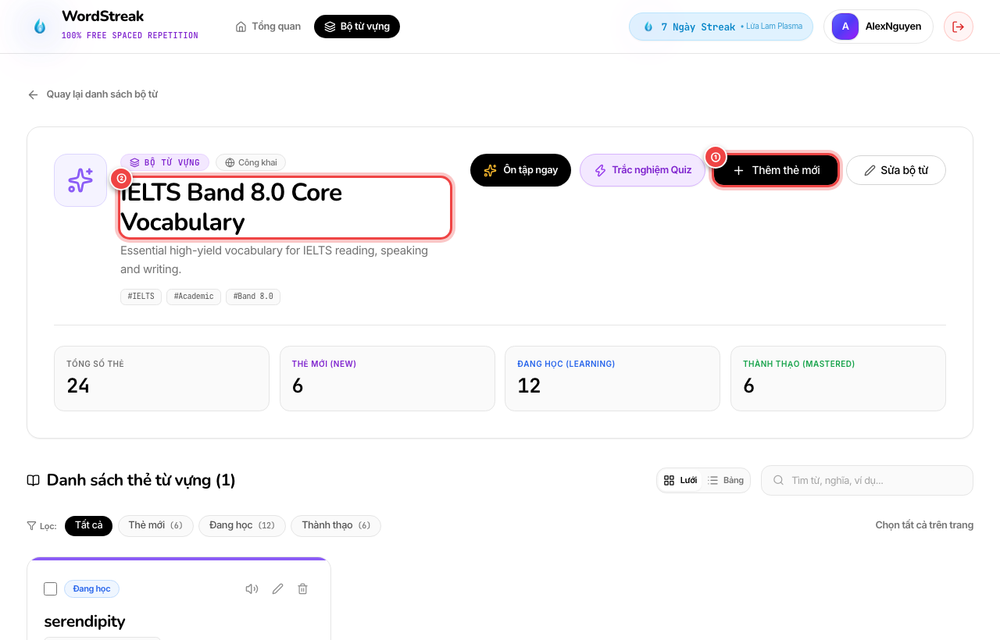
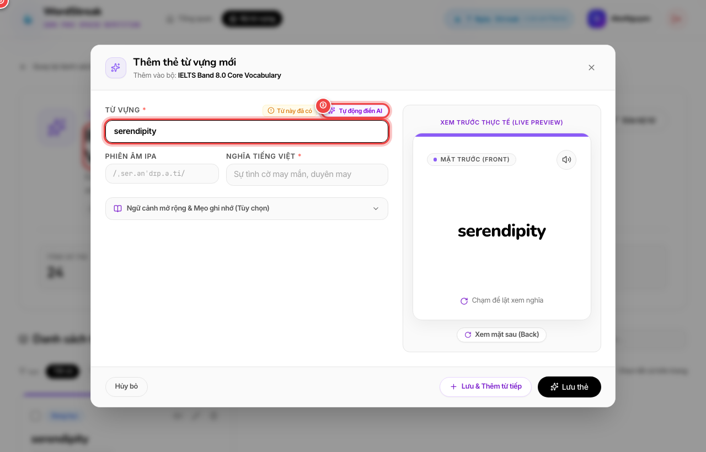
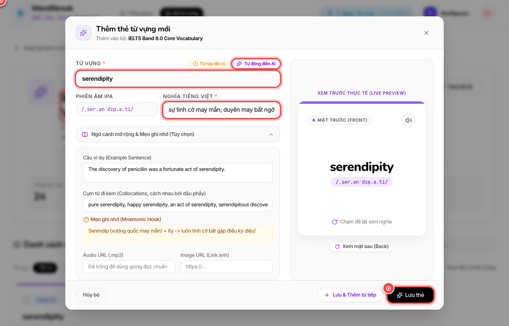
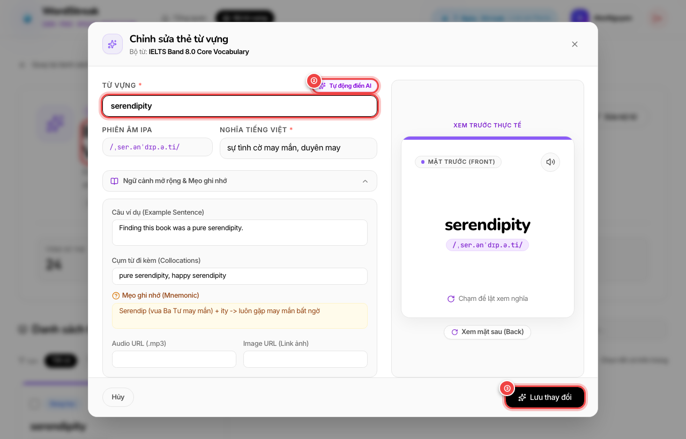

# ✨ Tạo Thẻ Từ Vựng Thông Minh Với AI & Tra Cứu Tự Động (AI-Assisted Vocabulary Generator)

> **Đối tượng người dùng:** Người học WordStreak (100% Miễn phí trọn đời)  
> **Tính năng:** Tự Động Điền Thẻ Từ Vựng Bằng AI & Bộ Nhớ Đệm Toàn Hệ Thống (US-AI-01 & US-AI-02)  
> **Phiên bản:** 1.0.0  
> **Cập nhật lần cuối:** 2026-08-21  

---

## 🎯 1. Giới thiệu Tính năng Tạo Thẻ Thông Minh với AI

Trước đây, việc tạo một chiếc thẻ từ vựng (flashcard) chất lượng cao đòi hỏi bạn phải tốn rất nhiều thời gian:
1. Mở từ điển Cambridge/Oxford tra cứu phiên âm IPA.
2. Dịch nghĩa tiếng Việt và tìm định nghĩa tiếng Anh phù hợp với ngữ cảnh.
3. Tìm câu ví dụ thực tế và dịch nghĩa câu.
4. Ghi chú các cụm từ hay đi kèm (collocations).
5. Nghĩ ra mẹo ghi nhớ (mnemonic hook).

Quy trình này thường mất từ **1.5 đến 2 phút cho mỗi thẻ từ**, khiến bạn nhanh chóng cảm thấy mệt mỏi và ngại thêm từ mới vào bộ sưu tập của mình.

Với **Trợ Lý AI Tự Động Điền Thẻ Từ Vựng (AI-Assisted Vocabulary Generator)** của WordStreak:
* **Tốc độ thần tốc (1-Click):** Bạn chỉ cần nhập từ tiếng Anh và nhấn nút **`✨ Tự động điền AI`** (hoặc phím `Enter`). Hệ thống sẽ tự động điền đầy đủ mọi thông tin chuẩn xác trong tích tắc.
* **Bộ nhớ đệm siêu tốc toàn cầu (Global Dictionary Cache):** Hàng triệu từ vựng phổ biến đã được lưu trữ sẵn trong cơ sở dữ liệu dùng chung, trả về kết quả ngay lập tức (**< 50 mili-giây**).
* **Hoàn toàn miễn phí & Không giới hạn tra cứu từ có sẵn:** Bạn có thể tra cứu và tạo thẻ không giới hạn từ kho dữ liệu dùng chung, kèm theo 30 lượt tạo từ hoàn toàn mới mỗi ngày.
* **Toàn quyền chỉnh sửa trước khi lưu:** Tất cả các trường thông tin do AI điền đều có thể chỉnh sửa tự do theo ý thích cá nhân trước khi bạn bấm lưu thẻ.

---

## 🚀 2. Hướng dẫn Từng Bước Thao Tác Trực Quan

### Bước 1: Mở cửa sổ Thêm thẻ mới trong Bộ từ vựng

Từ danh sách bộ từ vựng cá nhân, mở bộ từ bạn đang học để bắt đầu bổ sung thêm từ vựng mới:

- `①` **Nút "Thêm thẻ mới":** Nhấp vào nút màu đen hình dấu cộng `+` ở góc trên bên phải thanh công cụ.
- `②` **Thông tin Bộ từ vựng:** Hiển thị tiêu đề bộ từ (ví dụ: *IELTS Band 8.0 Core Vocabulary*), số lượng thẻ hiện có và trạng thái chia sẻ.

---

### Bước 2: Nhập từ vựng & Kích hoạt Tự động điền AI

Khi cửa sổ popup mở ra, bạn chỉ cần nhập từ tiếng Anh hoặc cụm từ bạn muốn học:

- `①` **Ô nhập từ vựng:** Gõ từ tiếng Anh (ví dụ: `serendipity`, `resilient`, `ubiquitous`) hoặc từ tiếng Việt (ví dụ: `trang giấy`, `kiên cường`).
- `②` **Nút "Tự động điền AI":** Nhấp vào nút màu tím lấp lánh (hoặc nhấn ngay phím `Enter` trên bàn phím) để yêu cầu AI tra cứu và sinh nội dung.
- `③` **Khung xem trước 3D (Live Preview):** Hiển thị diện mạo thực tế của chiếc thẻ flashcard theo thời gian thực.

---

### Bước 3: Xem kết quả AI điền tự động & Lưu thẻ

Chỉ trong khoảng 1 giây, toàn bộ nội dung học tập phong phú sẽ được điền đầy đủ và mở rộng:

- `①` **Nghĩa tiếng Việt & Phiên âm IPA:** Tự động điền phiên âm chuẩn quốc tế (`/ˌser.ənˈdɪp.ə.ti/`) và nghĩa tiếng Việt chuẩn xác.
- `②` **Ngữ cảnh mở rộng & Mẹo ghi nhớ (Mnemonic):** Tự động mở rộng và điền câu ví dụ tiếng Anh, bản dịch tiếng Việt, các cụm từ collocations hay gặp, và mẹo ghi nhớ sinh động.
- `③` **Thẻ xem trước trực quan:** Cập nhật ngay lập tức diện mạo hoàn chỉnh của chiếc thẻ.
- `④` **Nút "Lưu thẻ":** Nhấp vào nút **"Lưu thẻ"** (hoặc chọn **"Lưu & Thêm từ tiếp"** để tạo tiếp từ mới mà không cần đóng cửa sổ).

---

### Bước 4: Chỉnh sửa thẻ hiện có với AI

Bạn cũng có thể dễ dàng làm phong phú thêm những chiếc thẻ cũ bằng cách mở cửa sổ Chỉnh sửa thẻ:

- `①` **Ô từ vựng cần sửa:** Cho phép bạn đổi từ hoặc bổ sung nghĩa.
- `②` **Nút "Tự động điền AI":** Bấm nút để AI tự động cập nhật lại toàn bộ nghĩa, phiên âm và mẹo nhớ mới nhất.
- `③` **Nút "Lưu thay đổi":** Lưu lại phiên bản đã được hoàn thiện.

---

## 🛡️ 3. Cơ Chế Dự Phòng & Bảo Toàn Dữ Liệu (Zero Data Loss)

WordStreak được thiết kế với tiêu chuẩn an toàn dữ liệu cao nhất:

* **Tự động chuyển đổi từ điển dự phòng (Multi-tier Fallback):** Nếu mạng quốc tế bị nghẽn hoặc máy chủ AI bận, hệ thống sẽ tự động chuyển tiếp sang Từ điển Mở Quốc tế (Free Dictionary API) để lấy phiên âm và nghĩa chuẩn xác mà bạn không phải làm gì thêm.
* **Không bao giờ làm mất dữ liệu đã nhập (Zero Data Loss):** Nếu bạn vô tình gõ sai chính tả một từ không có thật (ví dụ: `xyzabc99`), hệ thống sẽ hiển thị một thông báo màu vàng thân thiện: *"Không tìm thấy dữ liệu từ điển cho từ này. Bạn có thể tự nhập thông tin thủ công."* Toàn bộ các chữ bạn đã gõ vẫn được giữ nguyên vẹn 100%.

---

## ⚡ 4. Phím Tắt Tiện Lợi Cho Người Học Nhanh

| Phím tắt | Thao tác thực hiện |
| :--- | :--- |
| **`Enter`** (khi ô từ vựng đang chọn) | Tự động kích hoạt điền AI mà không cần dùng chuột |
| **`Tab`** | Chuyển nhanh giữa các ô phiên âm, nghĩa tiếng Việt, câu ví dụ |
| **`Escape`** | Đóng cửa sổ popup thêm/sửa thẻ |

---

## ❓ 5. Câu Hỏi Thường Gặp (FAQ)

### Q1: Tính năng AI này có bị tính phí sau này không?
> **Trả lời:** Hoàn toàn **KHÔNG**. WordStreak cam kết 100% miễn phí trọn đời cho mọi tính năng cốt lõi. Nhờ hệ thống bộ nhớ đệm dùng chung (Global Dictionary Cache), các từ vựng đã được tạo một lần sẽ được phục vụ miễn phí mãi mãi cho tất cả người học.

### Q2: Tôi có thể tạo bao nhiêu từ mới mỗi ngày bằng AI?
> **Trả lời:** Mỗi ngày bạn được cấp **30 lượt tạo từ mới tinh** chưa từng có trong hệ thống. Đối với các từ đã có sẵn trong kho từ điển của WordStreak (chiếm hơn 90% từ vựng thông dụng), bạn có thể tra cứu và tạo **hoàn toàn không giới hạn**!

### Q3: Tôi có thể sửa lại nghĩa hoặc mẹo nhớ do AI tạo ra không?
> **Trả lời:** Hoàn toàn được! AI chỉ đóng vai trò là trợ lý điền sẵn giúp bạn tiết kiệm thời gian gõ phím. Bạn luôn có 100% quyền tự do chỉnh sửa, thêm bớt từ ngữ hoặc đổi ví dụ theo cách nhớ riêng của bạn trước khi bấm nút Lưu.
