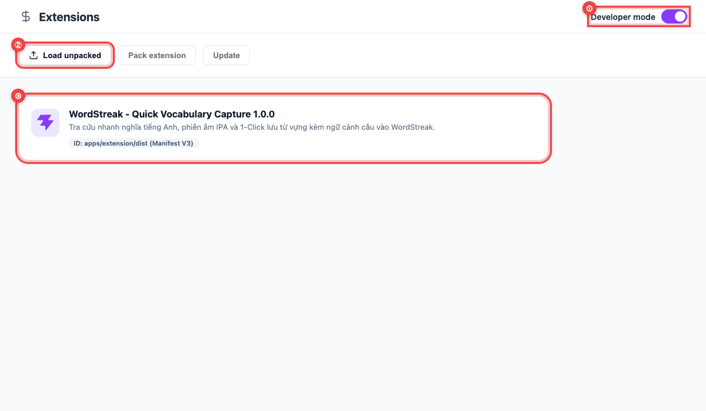
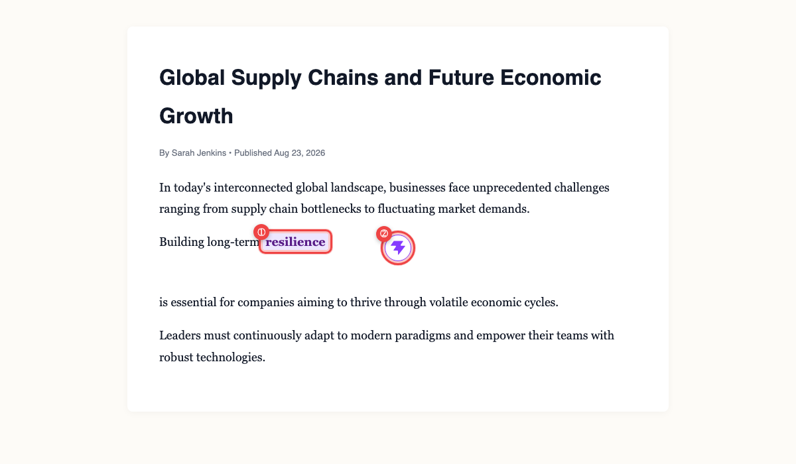
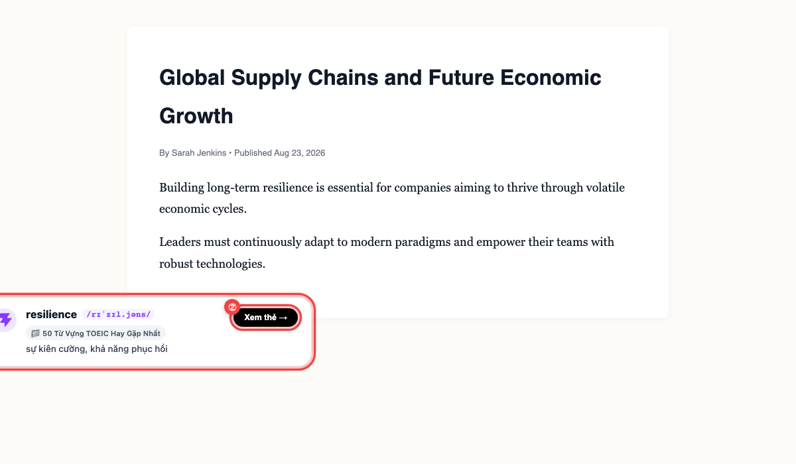
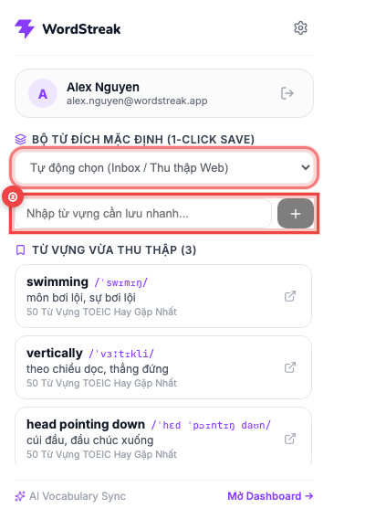
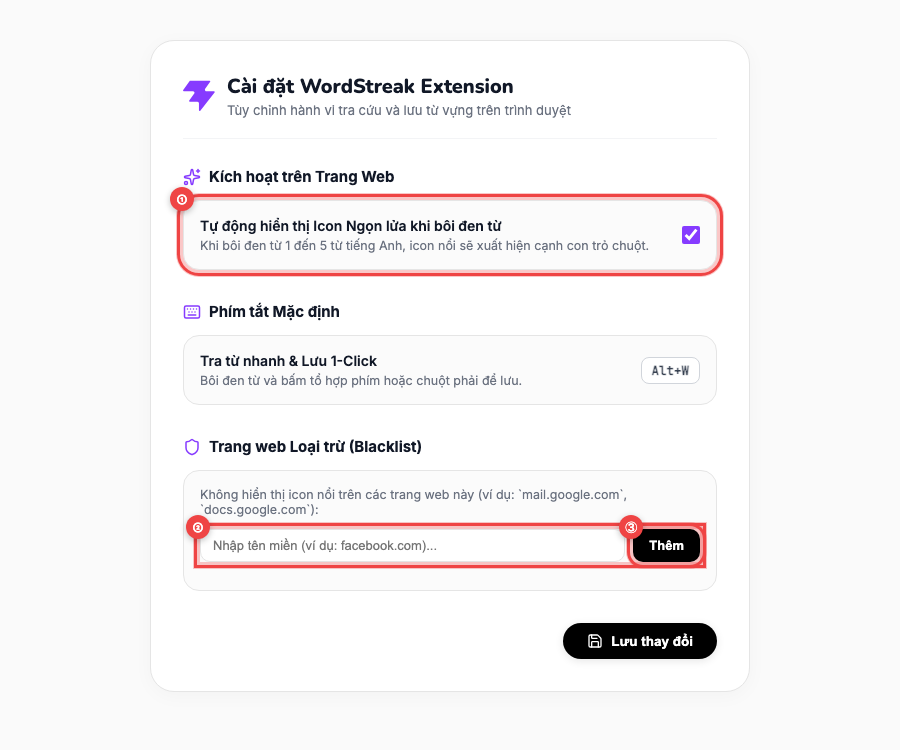

# 📖 Hướng dẫn Sử dụng: Tiện ích mở rộng trình duyệt (WordStreak Extension)

> **Đối tượng độc giả:** Người học WordStreak  
> **Phiên bản:** 1.0 (Chuẩn Manifest V3)  
> **Trình duyệt hỗ trợ:** Google Chrome, Brave Browser, Microsoft Edge, Arc, Opera, Cốc Cốc  
> **Cập nhật lần cuối:** 2026-08-23

---

## 🎯 Giới thiệu Tiện ích

**WordStreak Extension** là tiện ích mở rộng giúp bạn biến mọi hoạt động đọc báo (BBC, Medium, NYT), đọc tài liệu hoặc lướt web hàng ngày thành nguồn từ vựng phong phú mà không lo đứt mạch đọc:

- ⚡ **Lưu từ 1-Chạm (1-Click Fast Save):** Bôi đen từ mới trên bất kỳ trang web nào $\rightarrow$ bấm icon ngọn lửa tím để lưu ngay vào Bộ từ WordStreak.
- 📖 **Trích xuất Ngữ cảnh Tự động:** Extension tự động bắt trọn nguyên văn câu văn chứa từ vựng đó để bạn ghi nhớ theo ngữ cảnh thực tế.
- 🤖 **AI Tra nghĩa & Phiên âm IPA Tức thì:** Tự động điền phiên âm chuẩn quốc tế, loại từ và nghĩa tiếng Việt tương ứng.
- 🔄 **Đồng bộ Spaced Repetition (SM-2):** Thẻ từ mới lưu sẵn sàng xuất hiện trong các phiên ôn tập thông minh trên Web App.

---

## 🚀 Hướng dẫn Cài đặt & Sử dụng Chi tiết

### Bước 1: Cài đặt Tiện ích vào Trình duyệt (Chrome / Brave)

Sau khi build gói tiện ích bằng lệnh `pnpm --filter @wordstreak/extension build`, bạn có thể cài đặt trực tiếp vào trình duyệt trong chưa đầy 30 giây:

1. Mở trình duyệt và truy cập vào trang quản lý tiện ích:
   - Trên **Chrome**: Gõ `chrome://extensions` vào thanh địa chỉ.
   - Trên **Brave**: Gõ `brave://extensions` vào thanh địa chỉ.
2. Bật công tắc **"Chế độ dành cho nhà phát triển" (Developer mode)** ở góc trên bên phải **①**.
3. Bấm nút **"Tải tiện ích đã giải nén" (Load unpacked)** **②** và chọn thư mục `apps/extension/dist` trong mã nguồn WordStreak.
4. Tiện ích **WordStreak - Quick Vocabulary Capture** sẽ xuất hiện trên danh sách **③**. Bấm biểu tượng Ghim (Pin) trên thanh công cụ để truy cập nhanh!

---

### Bước 2: Bôi đen từ mới & Bấm icon Ngọn lửa tím (1-Click Save)

Khi đọc tin tức hoặc tài liệu tiếng Anh, bạn có thể tra cứu và lưu từ mới ngay tức thì mà không cần rời khỏi trang web:

1. Dùng chuột **bôi đen từ vựng mới** (độ dài 1 đến 5 từ) **①**.
2. Một icon **Ngọn lửa WordStreak tím** nhỏ gọn, tinh tế sẽ xuất hiện ngay phía trên con trỏ chuột **②**.
3. **Click vào icon Ngọn lửa** để hệ thống tự động:
   - Cắt câu văn ngữ cảnh chứa từ đó.
   - Gọi AI điền phiên âm IPA và nghĩa tiếng Việt.
   - Lưu trực tiếp vào Bộ từ mặc định của bạn.

---

### Bước 3: Xem Thông báo Lưu thành công & Đổi Bộ từ nhanh

Ngay sau khi bấm lưu, hệ thống hiển thị thông báo nhẹ nhàng ở góc dưới màn hình:

1. Hộp thoại **Toast thông báo thành công** xuất hiện ở góc dưới bên phải **①** và sẽ tự động biến mất sau 2.5 giây.
2. Nếu bạn muốn chuyển từ vựng vừa lưu sang một bộ từ khác, bấm ngay nút **"Đổi bộ từ"** **②** trên thông báo.
3. Nếu từ vựng đã có trong bộ từ, hệ thống sẽ hiển thị cảnh báo trùng lặp và cho phép bạn bổ sung câu ví dụ mới vào thẻ hiện có mà không làm mất tiến độ học cũ.

---

### Bước 4: Quản lý Bộ từ đích & Danh sách từ vừa lưu (Popup Window)

Khi bấm vào biểu tượng WordStreak trên thanh công cụ của trình duyệt, cửa sổ Popup quản lý nhanh sẽ mở ra:

1. **Chọn Bộ từ đích mặc định ①:** Chọn bộ từ mà bạn muốn ưu tiên lưu từ vựng vào (ví dụ: _"IELTS Reading"_, _"Từ vựng Công nghệ"_, hoặc _"Inbox / Thu thập Web"_).
2. **Ô nhập từ nhanh ②:** Cho phép bạn gõ trực tiếp từ mới kèm nghĩa để lưu ngay mà không cần mở Web App.
3. **Danh sách từ vừa thu thập:** Hiển thị danh sách các từ bạn vừa lưu trong ngày kèm phiên âm, nghĩa và nút chuyển nhanh đến thẻ trên Web App.

---

### Bước 5: Tùy chỉnh Cài đặt & Trang web Loại trừ (Options Page)

Bấm vào biểu tượng Bánh răng ⚙️ ở góc trên Popup để mở trang Cài đặt nâng cao:

1. **Bật/Tắt Icon nổi ①:** Cho phép bạn bật hoặc tắt tính năng tự động hiện icon ngọn lửa khi bôi đen từ (phù hợp khi bạn chỉ muốn dùng phím tắt hoặc chuột phải).
2. **Phím tắt mặc định:** Bôi đen từ và bấm tổ hợp phím `Alt + W` (hoặc `Option + W` trên Mac) để lưu nhanh.
3. **Danh sách Loại trừ (Blacklist) ② & ③:** Thêm các tên miền bạn không muốn hiển thị icon nổi (ví dụ: `docs.google.com`, `mail.google.com`).

---

## 💡 Mẹo & Phím tắt Hữu ích

- **Phím tắt nhanh (`Alt + W`):** Bôi đen từ trên web và bấm tổ hợp phím `Alt + W` để lưu thẻ ngay lập tức mà không cần click chuột.
- **Menu Chuột phải (Context Menu):** Bôi đen từ $\rightarrow$ click chuột phải $\rightarrow$ chọn _"Thêm vào WordStreak"_.
- **Đồng bộ Đăng nhập 1-Chạm:** Chỉ cần đăng nhập vào Web App WordStreak (`localhost:5173` hoặc `app.wordstreak.com`), Extension sẽ tự động nhận diện tài khoản mà không yêu cầu nhập lại mật khẩu.

---

## ❓ Câu hỏi Thường gặp (FAQ)

- **Q: Trình duyệt Brave có dùng được Extension này không?**  
  **A:** Hoàn toàn được 100%! Brave được xây dựng trên lõi Chromium nên tương thích tuyệt đối với chuẩn Manifest V3. Bạn chỉ cần vào `brave://extensions` và bấm _Load unpacked_.
- **Q: Extension có làm chậm tốc độ tải trang web không?**  
  **A:** Không. Content Script của WordStreak được đóng gói siêu nhẹ, chỉ kích hoạt khi người dùng bôi đen chữ và toàn bộ giao diện được cô lập bằng Shadow DOM nên không ảnh hưởng đến hiệu năng duyệt web.
- **Q: Tôi có cần mở sẵn tab WordStreak để Extension hoạt động không?**  
  **A:** Không cần. Sau khi đăng nhập lần đầu, Extension tự động lưu phiên đăng nhập an toàn trong trình duyệt và sẵn sàng hoạt động ở mọi tab.
