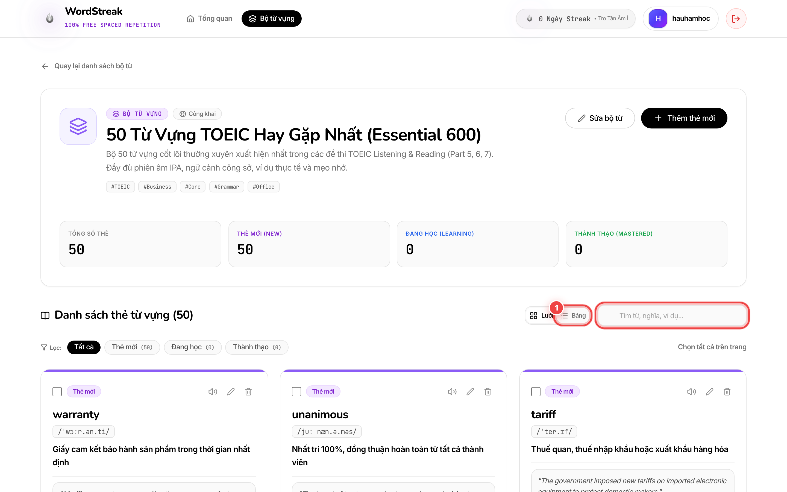
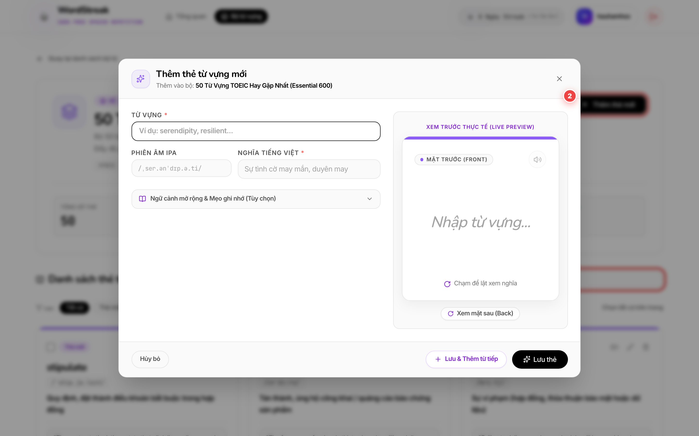
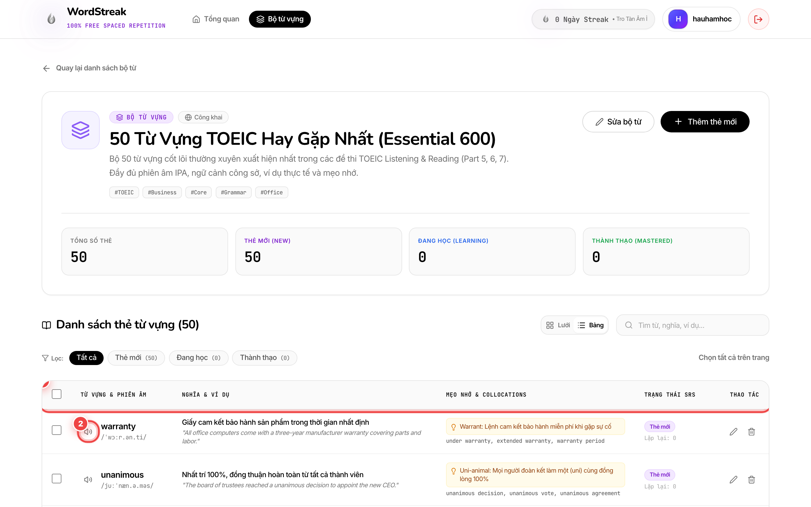
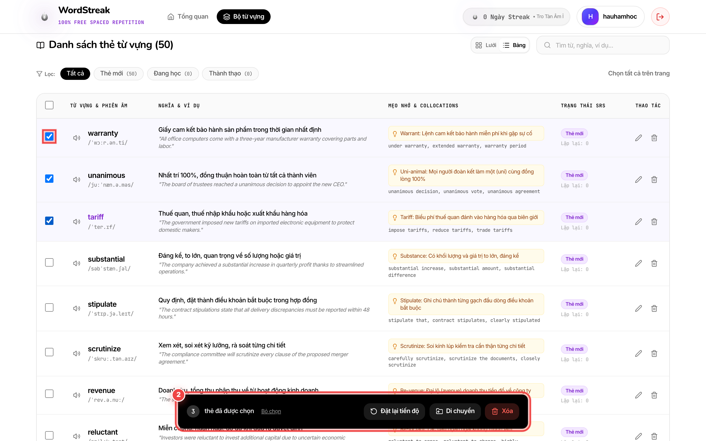
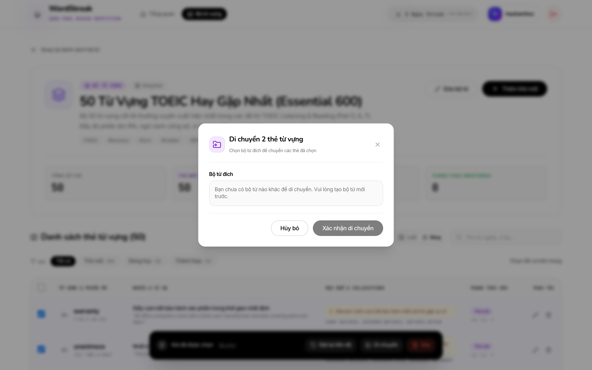
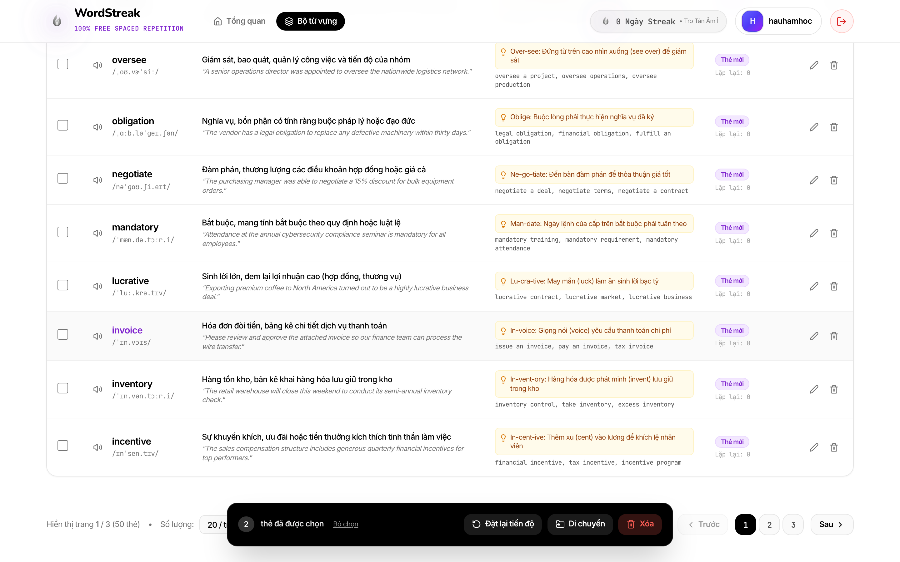

# Hướng dẫn Sử dụng: Quản lý & Tra cứu Thẻ Từ vựng

> Cập nhật lần cuối: 2026-08-20

## Tính năng này giúp gì cho bạn?

Khi học một bộ từ vựng có nhiều từ (như bộ 50 từ TOEIC), bạn cần tìm kiếm nhanh, kiểm tra xem từ nào mình đã thuộc, từ nào chưa học, và sắp xếp lại các thẻ một cách gọn gàng.

Tính năng **Quản lý & Tra cứu Thẻ** cho phép bạn:

- Xem từ vựng theo dạng **Lưới thẻ Flashcard 3D** hoặc **Bảng dữ liệu hàng ngang** mật độ cao.
- Tìm kiếm từ khóa theo thời gian thực và lọc theo cấp độ ghi nhớ Spaced Repetition (Mới / Đang học / Thành thạo).
- Thực hiện các thao tác quản lý hàng loạt: Xóa nhiều thẻ, Chuyển thẻ sang bộ từ khác, hoặc Đặt lại tiến độ học về Mới để học lại từ đầu.

---

## Hướng dẫn từng bước

### Bước 1: Mở Bộ từ vựng và chọn Chế độ hiển thị

- Khi mở một Bộ từ, danh sách thẻ mặc định hiển thị ở dạng **Lưới Flashcard 3D**.
- **① Nút chuyển chế độ xem (Lưới / Bảng)**: Bấm nút **"Bảng"** (khoanh đỏ ①) nếu bạn muốn xem danh sách dạng bảng dòng kẻ nhiều thông tin, hoặc bấm **"Lưới"** để xem dạng thẻ học trực quan. Lựa chọn của bạn sẽ được ghi nhớ tự động cho các lần truy cập sau.
- **② Thanh tìm kiếm nhanh**: Nằm ngay cạnh nút chuyển chế độ xem (khoanh đỏ ②), sẵn sàng cho bạn gõ từ khóa.

---

### Bước 2: Tìm kiếm từ vựng và Lọc theo Mức độ ghi nhớ

- **① Ô tìm kiếm từ khóa**: Gõ bất kỳ chữ cái tiếng Anh, nghĩa tiếng Việt hoặc câu ví dụ (ví dụ: gõ `contract` vào ô khoanh đỏ ①). Danh sách sẽ tự động lọc ngay lập tức mà không cần bấm phím Enter.
- **② Bộ lọc trạng thái (Filter Chips)**: Bấm vào các nhãn màu (khoanh đỏ ②) để lọc:
  - **Tất cả**: Xem toàn bộ từ trong bộ từ.
  - **Thẻ mới**: Những từ vựng bạn vừa thêm vào và chưa ôn tập phiên nào.
  - **Đang học**: Những từ đang trong quá trình lặp lại ngắt quãng để ghi nhớ.
  - **Thành thạo**: Những từ bạn đã ghi nhớ vững vàng.

---

### Bước 3: Xem Bảng danh sách chi tiết và Nghe phát âm trực tiếp

- **① Hàng tiêu đề và dữ liệu bảng**: Chế độ bảng (khoanh đỏ ①) sắp xếp rõ ràng các cột: Từ vựng, Loại từ & Phiên âm, Nghĩa tiếng Việt, Câu ví dụ, Trạng thái học và Hành động.
- **② Nút Loa phát âm**: Bấm biểu tượng chiếc loa màu xanh (khoanh đỏ ②) trên từng dòng từ vựng để nghe giọng đọc bản xứ chuẩn xác ngay tức thì mà không cần mở form chỉnh sửa.

---

### Bước 4: Tích chọn nhiều thẻ để mở Thanh thao tác hàng loạt

- **① Ô tích chọn (Checkbox)**: Tích vào ô vuông ở đầu mỗi dòng (khoanh đỏ ①) cho những từ bạn muốn xử lý (hoặc tích ô trên cùng cạnh tiêu đề để chọn tất cả từ trên trang).
- **② Thanh công cụ hàng loạt màu đen (Floating Toolbar)**: Sẽ lập tức nổi lên ở đáy màn hình (khoanh đỏ ②), hiển thị số lượng thẻ đã chọn và 3 nút hành động nhanh:
  - 🗑️ **Xóa**: Xóa đồng loạt các thẻ đã chọn.
  - 📦 **Di chuyển**: Chuyển các thẻ sang bộ từ khác.
  - 🔄 **Đặt lại tiến độ**: Đưa các thẻ đã chọn về trạng thái Mới để học lại từ đầu.

---

### Bước 5: Di chuyển thẻ sang Bộ từ vựng khác (Bulk Move)

1. Bấm nút **"Di chuyển"** trên thanh công cụ hàng loạt.
2. **① Chọn Bộ từ đích**: Chọn bộ từ bạn muốn chuyển đến trong danh sách thả xuống (khoanh đỏ ①).
3. **② Xác nhận di chuyển**: Bấm nút **"Xác nhận di chuyển"** (khoanh đỏ ②) để hoàn tất. Toàn bộ tiến độ học và lịch sử ôn tập của các thẻ này sẽ được bảo lưu nguyên vẹn sang bộ từ mới.

---

### Bước 6: Phân trang và Tùy chỉnh số lượng thẻ hiển thị

- **① Thanh điều khiển phân trang**: Ở dưới cùng của danh sách (khoanh đỏ ①):
  - Hiển thị tổng số thẻ hiện có và trang hiện tại (ví dụ: _Hiển thị 1 - 20 trong tổng số 50 thẻ_).
  - Bấm nút **"Trước"** hoặc **"Sau"** để lật trang mượt mà.
  - Chọn số lượng thẻ trên mỗi trang (`10`, `20`, hoặc `50` thẻ) tùy theo thói quen học tập của bạn.

---

## Mẹo hay khi sử dụng

- **Mẹo 1 - Ôn tập lại từ khó**: Nếu sau một thời gian bạn muốn làm mới lại một nhóm từ vựng khó nhớ, hãy tích chọn các từ đó và bấm **"Đặt lại tiến độ"**. Bạn không cần phải xóa thẻ đi tạo lại từ đầu.
- **Mẹo 2 - Mở rộng chi tiết ở dạng Lưới**: Khi xem ở dạng Lưới Flashcard 3D, hãy bấm nút mũi tên nhỏ dưới chân mỗi thẻ để xem nhanh phần **Mẹo ghi nhớ (Mnemonic)** và **Cụm từ hay đi kèm (Collocations)**.

---

## Câu hỏi thường gặp

**Q: Khi tôi chuyển thẻ sang bộ từ khác, tiến độ học Spaced Repetition của tôi có bị mất không?**  
**A:** Hoàn toàn không. WordStreak giữ nguyên toàn bộ lịch sử ôn tập (độ dễ, số lần lặp lại, ngày ôn tiếp theo) của bạn khi di chuyển thẻ.

**Q: Tôi có thể chọn tất cả các thẻ ở tất cả các trang cùng lúc không?**  
**A:** Ô tích chọn trên cùng sẽ chọn tất cả thẻ trên **trang hiện tại** (tối đa 50 thẻ/lần). Điều này giúp bạn kiểm soát trực quan chính xác những thẻ mình sắp xóa hoặc di chuyển trước khi bấm xác nhận.

---

## Chưa hỗ trợ trong phiên bản này

- Kéo thả thủ công để thay đổi vị trí từng thẻ theo ý muốn (thứ tự hiện tại sắp xếp theo thời gian tạo mới nhất).
- Chỉnh sửa trực tiếp nội dung từng ô dữ liệu dạng bảng tính Excel inline (bạn vẫn có thể bấm nút Sửa trên từng thẻ để chỉnh sửa chi tiết).
