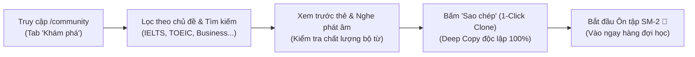
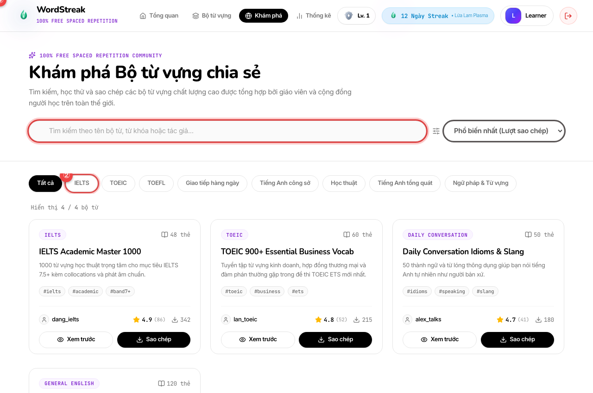
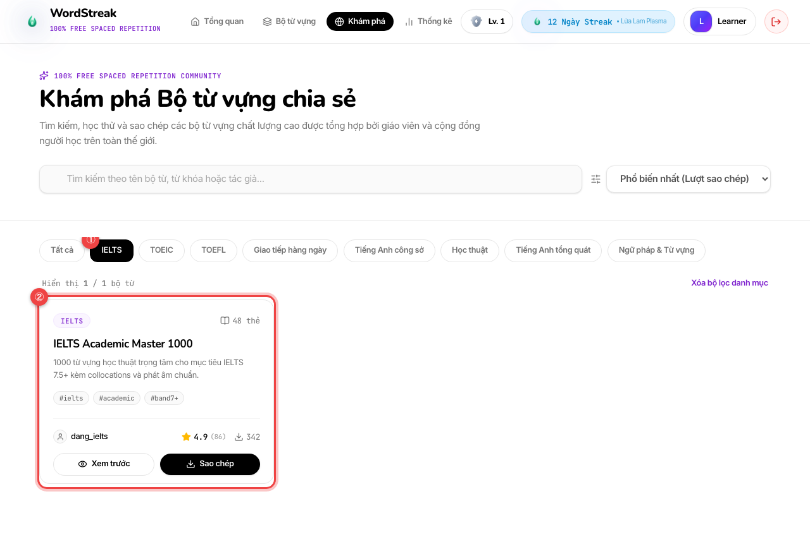
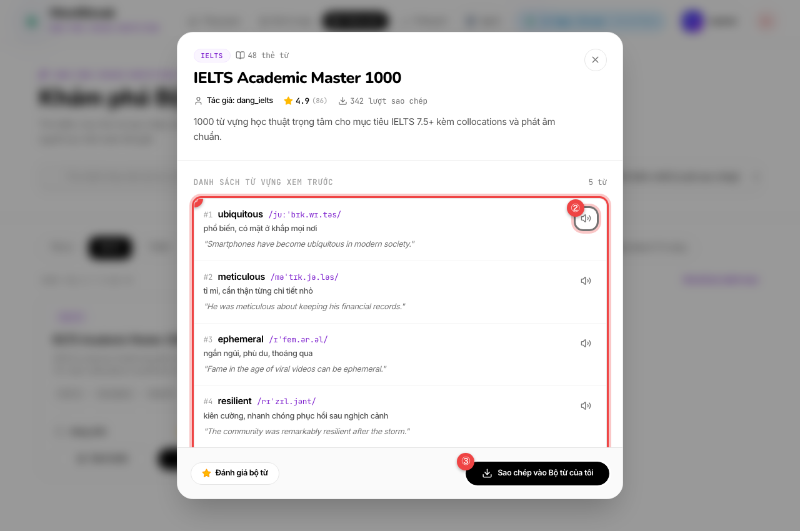
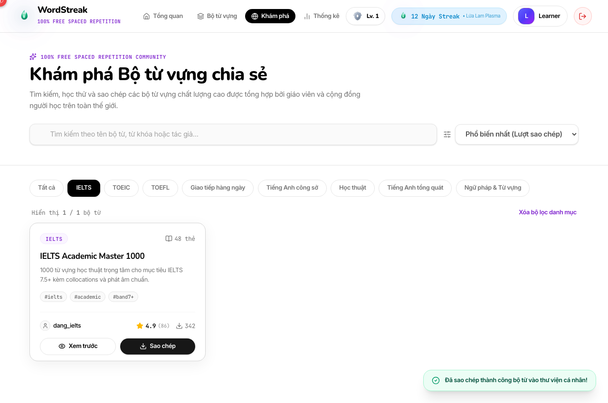
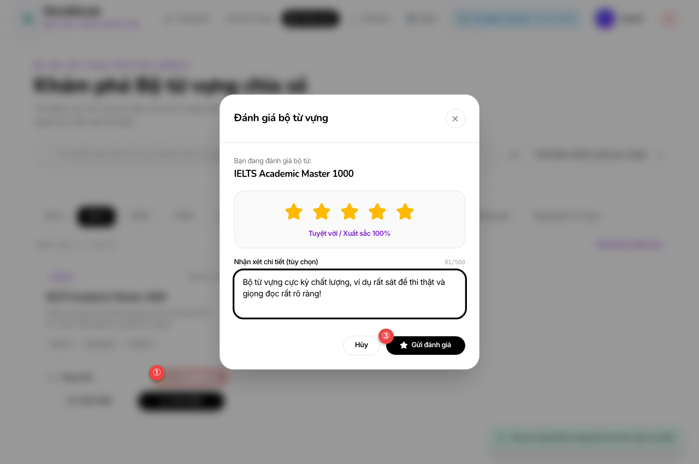

# 🌐 Hướng Dẫn Sử Dụng: Khám Phá & Chia Sẻ Bộ Từ Vựng Cộng Đồng (Community Decks Marketplace)

> **Đối tượng người dùng:** Người học WordStreak (100% Miễn phí trọn đời)  
> **Tính năng:** Thư viện Bộ Từ Vựng Cộng Đồng & Sao Chép 1-Click (`US-ECO-02`)  
> **Phiên bản:** 1.0.0  
> **Cập nhật lần cuối:** 2026-08-22

---

## 🎯 1. Giới thiệu Thư Viện Cộng Đồng (Community Marketplace)

Trước đây, mỗi người học WordStreak thường phải tự mình xây dựng từng bộ từ vựng từ đầu. Để có được một bộ từ vựng luyện thi IELTS 8.0, TOEIC 900+ hay Tiếng Anh Công sở với đầy đủ phiên âm IPA chuẩn, ví dụ thực tế và giải nghĩa cặn kẽ, bạn có thể phải mất từ vài tuần đến cả tháng.

Tính năng **Khám phá Bộ Từ Vựng Cộng Đồng (Community Decks Marketplace)** mở ra cánh cửa kết nối tri thức:

### 🌟 Những lợi ích nổi bật dành cho bạn:

- ⚡ **Sao chép 1-Click (1-Click Clone)**: Sao chép toàn bộ bộ từ vựng gồm hàng trăm thẻ vào thư viện cá nhân chỉ với 1 cú nhấp chuột.
- 🔒 **Bản sao độc lập 100% (Deep Copy Isolation)**: Bạn toàn quyền chỉnh sửa, thêm bớt từ vựng trong bộ từ đã sao chép mà không ảnh hưởng gì tới bộ từ gốc của tác giả.
- 🎯 **Sẵn sàng cho Spaced Repetition (SM-2)**: Tất cả các thẻ trong bộ từ được sao chép sẽ ngay lập tức được khởi tạo vào hàng đợi ôn tập ngắt quãng SM-2 của bạn ở trạng thái **Mới (NEW)**.
- ⭐ **Hệ thống Đánh giá 5 sao minh bạch**: Dễ dàng nhận diện các bộ từ xuất sắc nhất thông qua điểm đánh giá trung bình và nhận xét từ những người học đi trước.
- 🏷️ **Phân loại theo Chủ đề Chuẩn hóa**: Lọc nhanh theo các danh mục như `IELTS`, `TOEIC`, `TOEFL`, `Tiếng Anh công sở`, `Giao tiếp hàng ngày`, `Học thuật`...

---

## 🚀 2. Hướng dẫn Thao Tác Từng Bước

### Bước 1: Mở Trang Khám Phá Bộ Từ Vựng Cộng Đồng

Trên thanh điều hướng trên cùng (Top Navbar), nhấp vào mục **"Khám phá"** (hoặc truy cập trực tiếp đường dẫn `/community`):

- `①` **Thanh tìm kiếm nhanh:** Nhập từ khóa, tên bộ từ hoặc tên tác giả bạn quan tâm.
- `②` **Thanh chọn danh mục (Category Chips):** Nhấp chọn nhanh các danh mục phổ biến (`IELTS`, `TOEIC`, `TOEFL`, `Business English`...).
- `③` **Bộ lọc sắp xếp:** Chọn sắp xếp theo _Phổ biến nhất_, _Đánh giá cao nhất_, hoặc _Mới nhất_.
- `④` **Thẻ bộ từ cộng đồng:** Hiển thị tiêu đề, số lượng từ, điểm đánh giá trung bình, số lượt sao chép và tên tác giả.

---

### Bước 2: Tìm Kiếm & Lọc Bộ Từ Theo Nhu Cầu Học Tập

Nhấp vào chip danh mục hoặc gõ từ khóa tìm kiếm để thu hẹp kết quả:

- `①` **Huy hiệu danh mục đang chọn:** Chip danh mục chuyển sang nền màu đen nổi bật để biểu thị bộ lọc đang được kích hoạt.
- `②` **Danh sách bộ từ đã lọc:** Toàn bộ các bộ từ thuộc danh mục được chọn sẽ hiển thị tức thì với đầy đủ thông tin số sao và lượt clone.

---

### Bước 3: Xem Trước Danh Sách Thẻ & Nghe Phát Âm Thử

Nhấp vào nút **"Xem trước"** trên thẻ bộ từ để mở cửa sổ chi tiết:

- `①` **Danh sách từ vựng xem trước:** Xem chi tiết từng từ, phiên âm IPA chuẩn quốc tế, định nghĩa tiếng Việt và câu ví dụ minh họa ngữ cảnh.
- `②` **Nút loa phát âm:** Nhấp vào biểu tượng loa để nghe giọng đọc bản xứ của từ vựng tương ứng.
- `③` **Nút Sao chép vào Bộ từ của tôi:** Bấm nút màu đen nổi bật ở chân popup để nhân bản toàn bộ từ vựng vào tài khoản cá nhân.

---

### Bước 4: Sao Chép 1-Click Vào Thư Viện Cá Nhân

Nhấp vào nút **"Sao chép"** trên thẻ hoặc trong popup xem trước:

- `①` **Thông báo thành công:** Hộp thông báo màu xanh lá cây xuất hiện xác nhận toàn bộ thẻ từ đã được thêm vào thư viện của bạn. Bộ từ mới sẽ xuất hiện ngay trong trang **"Bộ từ vựng" (`/decks`)** và sẵn sàng cho các bài tập trắc nghiệm, gõ từ hay nối từ!

---

### Bước 5: Đánh Giá 5 Sao & Gửi Nhận Xét Đóng Góp

Sau khi đã học thử bộ từ, bạn có thể gửi đánh giá để ghi nhận công sức của tác giả:

- `①` **Chọn số sao đánh giá:** Nhấp chọn từ 1 đến 5 sao tương ứng với mức độ hài lòng về chất lượng từ vựng.
- `②` **Khung nhận xét chi tiết:** Nhập cảm nhận hoặc chia sẻ kinh nghiệm học từ bộ từ này cho các bạn học khác.
- `③` **Nút "Gửi đánh giá":** Bấm nút màu đen để lưu đánh giá. Điểm số trung bình của bộ từ sẽ được cập nhật ngay lập tức trên hệ thống.

---

## 💡 3. Một Số Mẹo & Lưu Ý Hữu Ích

> [!TIP]
> **Cách chia sẻ bộ từ của chính bạn lên Cộng đồng:**
>
> 1. Truy cập trang **"Bộ từ vựng" (`/decks`)** và mở bộ từ cá nhân của bạn.
> 2. Bấm nút **"Chỉnh sửa bộ từ"** (Edit Deck).
> 3. Bật tùy chọn **"Công khai bộ từ cho cộng đồng" (`isPublic = true`)** và chọn đúng danh mục (Category).
> 4. Bấm **"Lưu thay đổi"** — bộ từ của bạn sẽ lập tức xuất hiện trên trang Khám phá để mọi người cùng học!

> [!NOTE]
> **Bảo mật và Quyền riêng tư:**
> Khi công khai một bộ từ, các thành viên khác chỉ có thể nhìn thấy tên người dùng (username) và ảnh đại diện (avatar) của bạn. Địa chỉ email, mật khẩu và toàn bộ lịch sử học tập cá nhân của bạn được bảo mật tuyệt đối 100%.

---

## ❓ 4. Câu Hỏi Thường Gặp (FAQ)

- **Hỏi:** Khi tôi chỉnh sửa bộ từ đã sao chép thì tác giả bộ từ gốc có bị ảnh hưởng không?  
  **Đáp:** **Hoàn toàn không!** Cơ chế sao chép của WordStreak tạo ra một bản sao độc lập 100% trong tài khoản của bạn. Bạn có thể thoải mái thêm từ, sửa nghĩa hoặc xóa thẻ mà không làm thay đổi dữ liệu của tác giả gốc.

- **Hỏi:** Thẻ trong bộ từ vừa sao chép sẽ bắt đầu học từ đâu trong hệ thống Lặp lại ngắt quãng (SM-2)?  
  **Đáp:** Tất cả các thẻ sao chép đều được khởi tạo ở trạng thái **Mới (NEW)** với chu kỳ ôn tập ban đầu là 0 ngày, giúp bạn ôn tập từ đầu một cách bài bản nhất.
