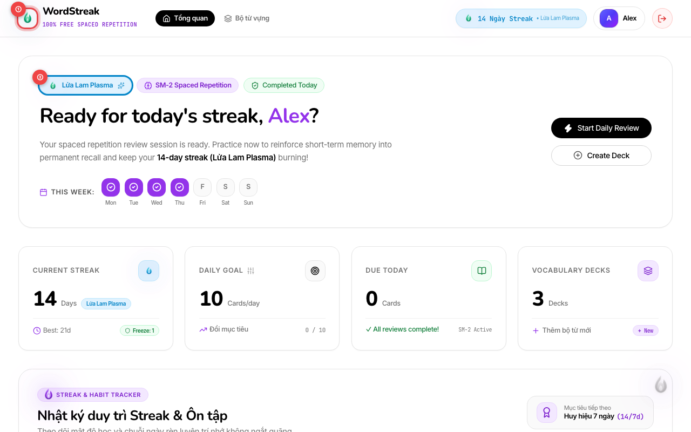
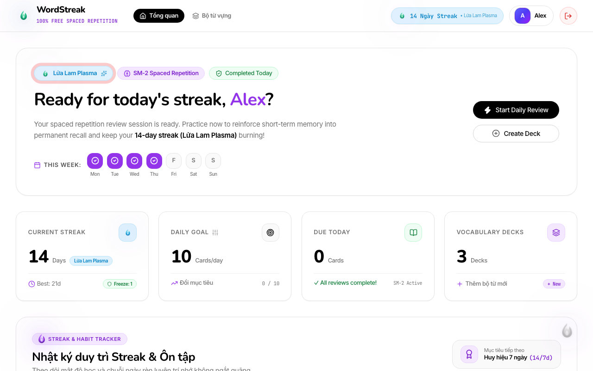
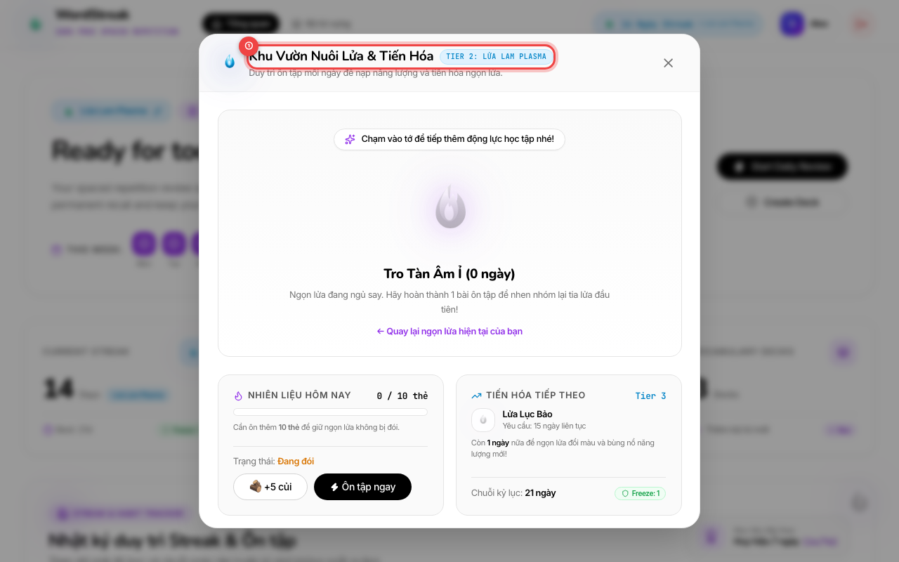
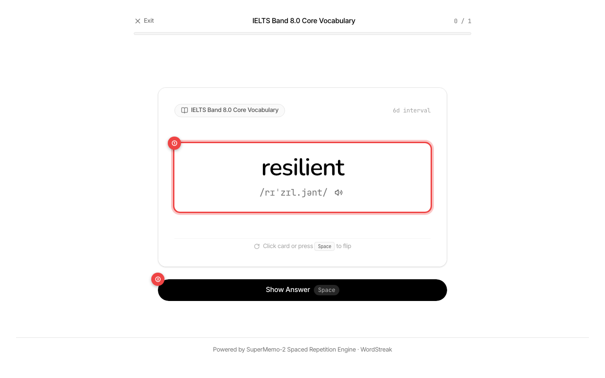
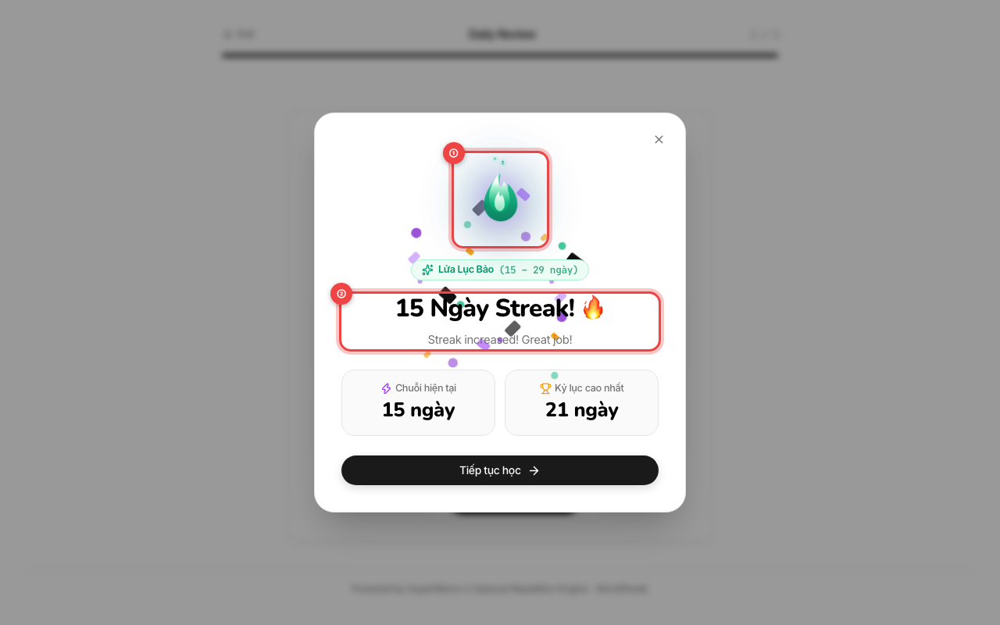

# 📖 Hướng dẫn Sử dụng: Hệ thống Chuỗi ngày học & Linh vật Ngọn lửa (Daily Streak & Mascot Guide)

> **Đối tượng người dùng:** Người học WordStreak  
> **Phiên bản:** 1.0.0 (US-GAME-01)  
> **Cập nhật lần cuối:** 2026-08-20

---

## 🎯 Tổng quan tính năng

Hệ thống **Chuỗi ngày học (Daily Streak)** và **Linh vật Ngọn lửa Tím (Electric Violet Flame)** của WordStreak được thiết kế để biến việc trau dồi từ vựng tiếng Anh thành một thói quen tự nhiên hàng ngày.

Mỗi ngày bạn hoàn thành phiên ôn tập thẻ nhớ (Spaced Repetition) hoặc trả lời trắc nghiệm, ngọn lửa học tập của bạn sẽ được nạp thêm củi năng lượng, rực sáng hơn và tự động thăng cấp qua các bậc lửa quyền năng!

---

## 🚀 Các bước tương tác & Giữ lửa Streak

### Bước 1: Theo dõi Chuỗi ngày & Tiến độ tuần trên Bảng điều khiển

Sau khi đăng nhập vào WordStreak, khu vực đầu trang Bảng điều khiển (Dashboard) sẽ hiển thị chi tiết trạng thái chuỗi ngày của bạn:

- `①` **Linh vật Ngọn lửa Tím:** Đang cháy bập bùng với hiệu ứng ánh sáng tím neon sống động. Ngọn lửa sẽ đổi màu và kích thước tương ứng với số ngày bạn duy trì liên tục.
- `②` **Huy hiệu Chuỗi ngày & Cấp bậc:** Hiển thị số ngày liên tục (ví dụ: _Chuỗi 14 ngày_) và tên cấp bậc linh vật hiện tại (_Lửa Lam Plasma / Tier 3_). Nhấn vào huy hiệu này để mở Khu vườn Nuôi lửa.
- `③` **Lịch tuần 7 ngày (Weekly Habit Tracker):** Thể hiện trực quan những ngày trong tuần bạn đã hoàn thành phiên học. Các ô có dấu tích tím `✔` thể hiện ngày đã học thành công; ô viền tím nhấp nháy chỉ ngày hôm nay đang chờ bạn ôn tập.

---

### Bước 2: Kiểm tra nhanh Streak trên Thanh điều hướng (Navbar)

Dù bạn đang ở bất kỳ trang nào (Trang danh sách Bộ từ, Chi tiết Thẻ nhớ, hay Kho từ vựng), số ngày chuỗi luôn được cập nhật trực tiếp tại góc trên bên phải màn hình:

- `①` **Nút Huy hiệu Streak:** Hiển thị ngọn lửa và số ngày streak hiện tại. Nhấn vào nút này bất cứ lúc nào để xem nhanh trạng thái hoặc mở Khu vườn Lửa.

---

### Bước 3: Khám phá Khu vườn Nuôi Lửa & Tiến hóa Linh vật

Nhấn vào linh vật hoặc huy hiệu cấp bậc để mở cửa sổ Khu vườn Nuôi lửa:

- `①` **Khu Vườn Linh Vật:** Chiêm ngưỡng hoạt ảnh ngọn lửa đa tầng sắc tím, xem thanh tiến độ điểm kinh nghiệm (XP) cần thiết để tiến hóa lên cấp bậc tiếp theo.
- `②` **Nạp Củi / Thức ăn:** Nhấn nút nạp củi để thưởng thức hoạt ảnh những thanh gỗ bay vào nuôi dưỡng ngọn lửa bùng cháy rực rỡ hơn.

---

### Bước 4: Hoàn thành Phiên ôn tập Flashcard (SM-2)

Để giữ chuỗi ngày học không bị đứt và tăng thêm 1 ngày vào chuỗi của bạn, hãy bắt đầu một phiên học thẻ nhớ:

- `①` **Thẻ từ vựng mục tiêu:** Đọc từ vựng, phiên âm quốc tế (IPA) và câu ví dụ ngữ cảnh.
- `②` **Nút Lật thẻ & Đánh giá:** Nhấn phím `Space` hoặc nút **Lật thẻ** để xem giải nghĩa, sau đó chọn mức độ nhớ (_Quên, Khó, Nhớ tốt, Dễ_) để hoàn thành thẻ.

---

### Bước 5: Đón nhận Thông báo Vinh danh & Tăng Streak

Ngay khi bạn hoàn thành thẻ học đầu tiên trong ngày, hệ thống sẽ tự động tính toán theo múi giờ địa phương của bạn và hiển thị cửa sổ vinh danh:

- `①` **Ngọn lửa vinh danh:** Bùng cháy rực rỡ cùng hiệu ứng pháo hoa hạt giấy (confetti) chúc mừng.
- `②` **Thông báo kỷ lục chuỗi:** Hiển thị số ngày streak mới và thông điệp khích lệ tinh thần học tập.
- `③` **Nút Tiếp tục học tập:** Nhấn phím `Enter` hoặc nút **Tiếp tục học tập** để quay trở lại Bảng điều khiển với chuỗi ngày đã được cộng thêm!

---

## 🧬 4 Bậc Tiến Hóa của Linh Vật Ngọn Lửa

| Cấp bậc    |  Số ngày Streak  | Tên Linh Vật                            | Đặc điểm & Màu sắc ngọn lửa                                                                   |
| :--------- | :--------------: | :-------------------------------------- | :-------------------------------------------------------------------------------------------- |
| **Tier 1** |  **1 – 6 ngày**  | **Spark (Tia Lửa Tím)**                 | Ngọn lửa nhỏ màu tím hoa cà (`#c084fc`), cháy nhẹ nhàng khởi đầu thói quen.                   |
| **Tier 2** | **7 – 13 ngày**  | **Ember (Lửa Lam Plasma)**              | Lửa cháy mạnh mẽ với quầng sáng tím hoàng gia (`#9333ea`) và tàn tro bay lượn.                |
| **Tier 3** | **14 – 29 ngày** | **Inferno (Lửa Lục Bảo)**               | Ngọn lửa tím rực rỡ bốc cao, lõi trắng tinh khiết (`#ffffff`), hào quang lan tỏa.             |
| **Tier 4** |   **30+ ngày**   | **Cosmic Nova (Lửa Tím Siêu Tân Tinh)** | Linh vật tối thượng với hào quang sao băng tím vũ trụ, biểu trưng cho sự kiên trì tuyệt đỉnh! |

---

## 💡 Mẹo Duy trì Chuỗi Ngày Học Bất Tử

1. **Quy tắc 2 phút mỗi ngày:** Dù bạn bận rộn đến đâu, chỉ cần dành ra 2 phút hoàn thành tối thiểu 1 phiên ôn tập ngắn trước 23:59 là chuỗi ngày của bạn được bảo vệ an toàn.
2. **Tự động theo múi giờ khi đi du lịch:** Khi bạn di chuyển sang múi giờ khác, WordStreak tự động nhận diện giờ địa phương trên điện thoại/máy tính của bạn để tính ngày học chính xác mà không lo bị lệch giờ máy chủ.
3. **Kéo thả linh vật:** Bạn có thể nhấn giữ và kéo thả ngọn lửa mascot đi khắp màn hình để bầu bạn khi duyệt web hoặc học từ vựng.
4. **Nếu lỡ quên 1 ngày:** Đừng nản lòng! Hãy mở ứng dụng và học ngay hôm nay để thắp lại ngọn lửa mới. Thói quen bền vững được xây dựng từ việc luôn quay trở lại sau những lần gián đoạn.

---

## ❓ Câu hỏi Thường Gặp (FAQ)

- **Hỏi: Tôi học vào lúc 23:55 và tiếp tục học đến 00:05 thì có được tính là 2 ngày không?**  
  **Đáp:** Có! WordStreak tính ngày theo giờ địa phương của bạn. Phiên lúc 23:55 sẽ hoàn thành chuỗi của ngày hôm trước, và phiên 00:05 sẽ ngay lập tức được ghi nhận cho ngày hôm sau.

- **Hỏi: Tôi ôn tập nhiều lần trong một ngày thì chuỗi có tăng thêm nhiều ngày không?**  
  **Đáp:** Không. Mỗi ngày dương lịch bạn chỉ cần học 1 lần để duy trì và tăng 1 ngày streak. Các lần học sau trong cùng ngày sẽ giúp bạn ghi nhớ sâu hơn mà không làm nhảy sai chuỗi ngày.

- **Hỏi: WordStreak có tính phí để khôi phục chuỗi ngày khi bị mất không?**  
  **Đáp:** Hoàn toàn không! WordStreak là nền tảng **100% Miễn phí mãi mãi**. Không bao giờ có tính năng nạp tiền mua chuỗi hay các gói phí ẩn.
