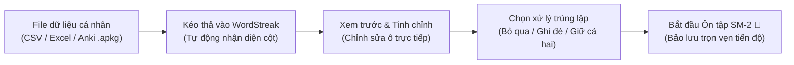
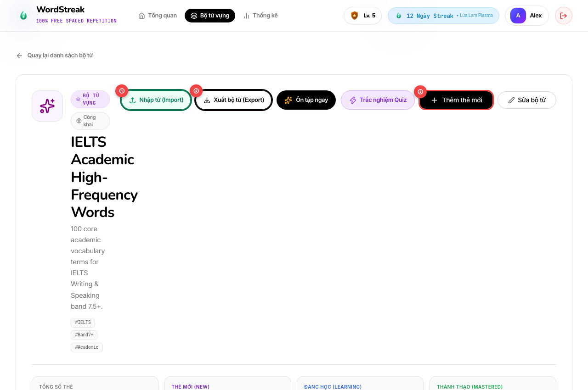
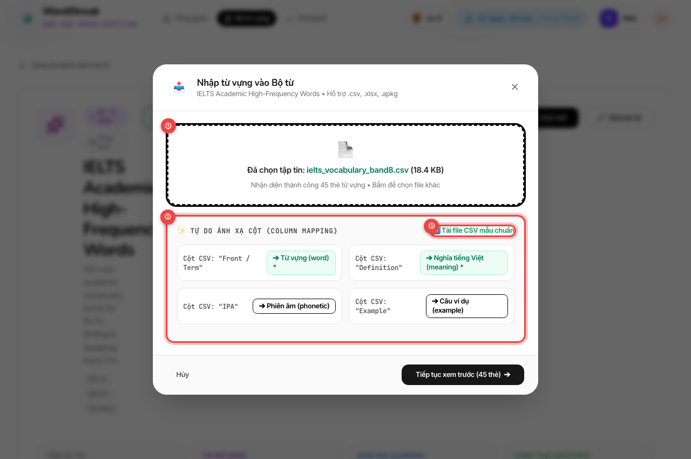
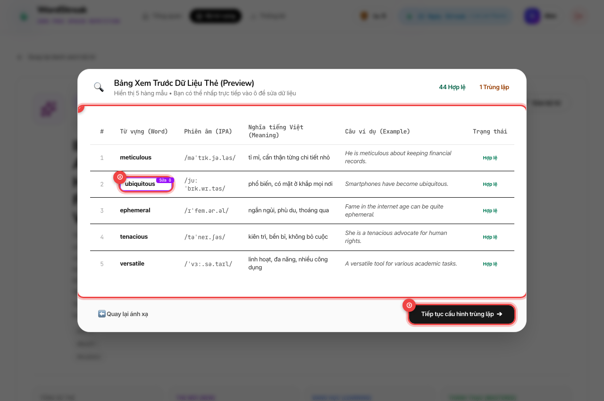
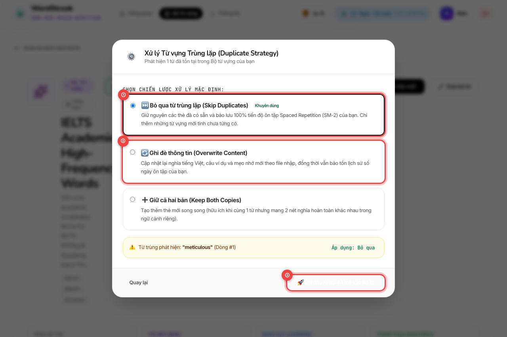
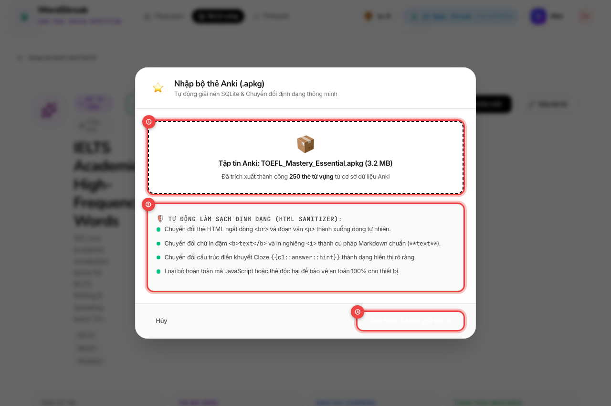
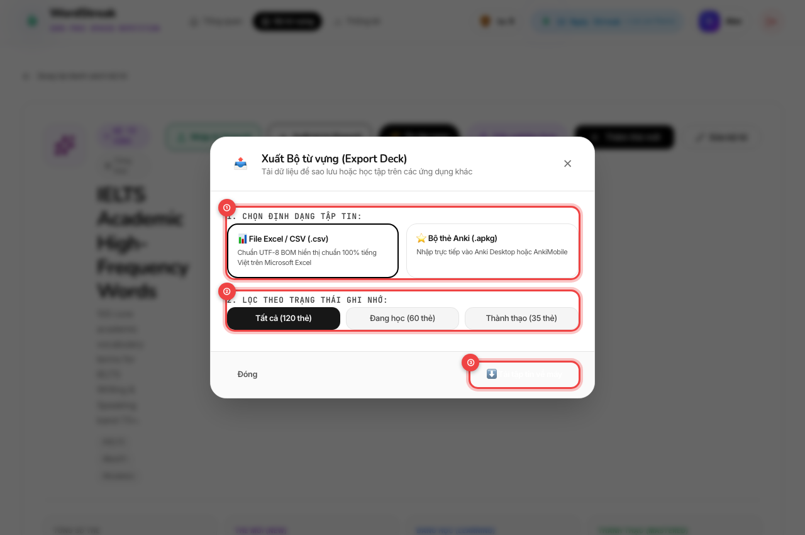

# 📦 Hướng Dẫn Sử Dụng: Nhập & Xuất Bộ Từ Vựng (Deck Import & Export - CSV, Excel & Anki)

> **Đối tượng người dùng:** Người học WordStreak (100% Miễn phí trọn đời)  
> **Tính năng:** Nhập & Xuất Dữ Liệu Bộ Từ Vựng Toàn Diện (`US-ECO-01`)  
> **Phiên bản:** 1.0.0  
> **Cập nhật lần cuối:** 2026-08-21

---

## 🎯 1. Giới thiệu Tính năng Nhập & Xuất Bộ Từ

Trước đây, khi bạn muốn chuyển toàn bộ kho từ vựng yêu thích từ **Excel, Google Sheets, Quizlet hoặc Anki** sang WordStreak, bạn thường phải tốn rất nhiều giờ ngồi gõ lại từng từ, tra cứu lại từng câu ví dụ và phiên âm.

Tính năng **Nhập & Xuất Bộ Từ Vựng (Deck Import & Export)** của WordStreak mang đến giải pháp di chuyển dữ liệu thần tốc chỉ trong vài cú nhấp chuột:

### 🌟 Những lợi ích nổi bật dành cho bạn:

- ⚡ **Nhập hàng trăm từ trong 1 giây**: Xử lý mượt mà các tập tin lên tới **2.000 thẻ từ** hoặc dung lượng tối đa **15MB**.
- 🧩 **Tự do ánh xạ cột (Flexible Column Mapping)**: Bạn không cần phải đổi tên cột trong file theo mẫu cứng nhắc. Hệ thống tự động nhận diện thông minh các tiêu đề song ngữ tiếng Anh và tiếng Việt như `Front/Back`, `Word/Meaning`, `Từ vựng/Nghĩa`, `IPA/Phiên âm`...
- 🔍 **Bảng xem trước & Chỉnh sửa ô trực tiếp (Live Preview & Inline Editing)**: Dễ dàng kiểm tra trước 5 hàng dữ liệu và nhấp chuột sửa trực tiếp bất kỳ từ nào bị gõ sai chính tả trước khi lưu.
- 🛡️ **Kiểm soát trùng lặp thông minh (Conflict Strategy)**: Tùy ý chọn **Bỏ qua (Skip)** để bảo vệ tiến độ học thẻ cũ, **Ghi đè (Overwrite)** để cập nhật định nghĩa mới, hoặc **Giữ cả hai (Keep Both)**.
- 📦 **Tương thích 100% với Anki (.apkg)**: Tự động trích xuất các bộ thẻ Anki và làm sạch các thẻ HTML phức tạp (`<b>`, ` `, dạng điền khuyết Cloze `{{c1::...}}`) thành văn bản chuẩn đẹp mắt.
- 📊 **Xuất dữ liệu chuẩn tiếng Việt trên Microsoft Excel**: File CSV xuất ra được tích hợp sẵn mã định danh chuẩn **UTF-8 BOM**, giúp mở trên Excel không bao giờ bị lỗi font hay biến thành ký tự lạ, đồng thời tích hợp cơ chế bảo vệ an toàn chống mã độc bảng tính.

---

## 🚀 2. Hướng dẫn Từng Bước Thao Tác Trực Quan

### Bước 1: Mở cửa sổ Nhập / Xuất từ Trang Chi Tiết Bộ Từ

Từ trang tổng quan danh sách bộ từ vựng cá nhân, mở bộ từ bạn muốn thao tác (hoặc tạo một bộ từ mới):

- `①` **Nút "Nhập từ (Import)":** Nút màu xanh ngọc lục bảo nổi bật ở góc trên bên phải thanh công cụ. Nhấp vào đây để mở hộp thoại nhập thẻ từ file ngoại vi.
- `②` **Nút "Xuất bộ từ (Export)":** Nút màu xanh dương giúp bạn tải toàn bộ thẻ trong bộ từ về máy tính dưới dạng CSV hoặc Anki bất kỳ lúc nào.
- `③` **Nút "Thêm thẻ mới":** Vẫn sẵn sàng phục vụ khi bạn chỉ muốn bổ sung thủ công từng từ đơn lẻ.

---

### Bước 2: Tải lên Tập tin & Tự Do Ánh Xạ Cột (Column Mapping)

Khi cửa sổ popup **Nhập từ vựng vào Bộ từ** mở ra, kéo thả tập tin của bạn vào khung tải lên:

- `①` **Khu vực Kéo thả tập tin (Dropzone):** Hỗ trợ kéo thả trực tiếp hoặc nhấp chuột để chọn các định dạng:
  - File bảng tính CSV (`.csv`)
  - File Microsoft Excel (`.xlsx`, `.xls`)
  - Gói dữ liệu thẻ Anki (`.apkg`)
- `②` **Khung Tự do Ánh xạ Cột (Column Mapping):**
  - Hệ thống sẽ tự động ghép nối các cột trong file của bạn tương ứng với các trường dữ liệu của WordStreak: _Từ vựng (Word)_, _Nghĩa tiếng Việt (Meaning)_, _Phiên âm (Phonetic)_, _Câu ví dụ (Example Sentence)_, _Cụm từ đi kèm (Collocations)_, và _Mẹo ghi nhớ (Mnemonic)_.
  - Nếu file của bạn dùng tên cột khác lạ, bạn có thể tự do chọn lại cột tương ứng từ danh sách thả xuống.
- `③` **Liên kết "Tải file CSV mẫu chuẩn":** Nhấp vào đây để tải ngay một tập tin mẫu chuẩn chỉnh về máy nếu bạn muốn nhập từ theo cấu trúc chuẩn của WordStreak.

---

### Bước 3: Bảng Xem Trước Dữ Liệu & Chỉnh Sửa Ô Trực Tiếp

Trước khi lưu vào cơ sở dữ liệu học tập, WordStreak hiển thị bảng xem trước trực quan:

- `①` **Bảng Xem Trước 5 Hàng Mẫu (Live Preview):**
  - Hiển thị cấu trúc thực tế của các thẻ sau khi ghép cột.
  - Mỗi hàng đều có huy hiệu trạng thái rõ ràng: 🟢 **Hợp lệ (Valid)**, 🟡 **Trùng lặp (Duplicate)**, hoặc 🔴 **Thiếu thông tin (Missing required field)**.
- `②` **Chỉnh Sửa Ô Trực Tiếp (Inline Cell Editing):**
  - Nếu phát hiện ô nào bị gõ sai chính tả hoặc thiếu dấu, bạn chỉ cần **nhấp chuột trực tiếp vào ô đó** để sửa ngay tại chỗ mà không cần phải mở lại file Excel!
- `③` **Nút "Tiếp tục cấu hình trùng lặp":** Nhấp để chuyển sang bước kiểm tra và xử lý các từ đã có trong bộ từ.

---

### Bước 4: Lựa Chọn Chiến Lược Xử Lý Từ Vựng Trùng Lặp

Nếu trong file nhập có những từ bạn đã học từ trước, WordStreak cung cấp 3 giải pháp xử lý linh hoạt:

- `①` **⏭️ Bỏ qua từ trùng lặp (Skip Duplicates - Khuyên dùng):**
  - Giữ nguyên chiếc thẻ hiện có trong bộ từ cùng toàn bộ tiến độ ghi nhớ Spaced Repetition (SM-2) quý giá của bạn.
  - Hệ thống chỉ thêm vào những từ mới tinh.
- `②` **🔄 Ghi đè thông tin (Overwrite Content):**
  - Cập nhật lại nghĩa tiếng Việt, phiên âm hoặc ví dụ mới theo file bạn vừa tải lên.
  - _Đặc biệt:_ Lịch sử số ngày ôn tập và độ dễ của thẻ vẫn được bảo toàn nguyên vẹn.
- `③` **🚀 Bắt đầu Nhập thẻ:** Nhấp nút màu xanh lá để hoàn tất quá trình. Tất cả các từ mới sẽ được khởi tạo trong hàng đợi ôn tập **Thẻ mới (NEW)** ngay lập tức.

---

### Bước 5: Nhập Trọn Bộ Thẻ Từ Anki (.apkg) Với Trình Làm Sạch Tự Động

Nếu bạn đang chuyển đổi từ phần mềm Anki sang WordStreak:

- `①` **Tải lên gói Anki (`.apkg`):** Trình duyệt của bạn sẽ tự động giải nén cơ sở dữ liệu `collection.anki2` trực tiếp trên máy với tốc độ siêu nhanh và bảo mật tuyệt đối.
- `②` **Trình Làm Sạch Định Dạng (HTML Sanitizer & Cloze Normalizer):**
  - Tự động chuyển đổi các thẻ ngắt dòng `<b>`, `<i>`, ` `, `
` sang định dạng chữ in đậm và in nghiêng chuẩn Markdown.
  - Chuyển đổi các cấu trúc điền từ Cloze (ví dụ: `{{c1::answer::hint}}`) thành định dạng hiển thị tự nhiên.
  - Loại bỏ hoàn toàn mã script rác để đảm bảo tốc độ tải ứng dụng nhẹ nhất.
- `③` **Nút "Xem trước & Nhập thẻ":** Nhấp để xác nhận nhập toàn bộ bộ thẻ Anki vào WordStreak.

---

### Bước 6: Xuất Bộ Từ Vựng Ra File CSV (Chuẩn Tiếng Việt) hoặc Anki

Khi bạn muốn chia sẻ bộ từ cho bạn bè hoặc sao lưu ngoại tuyến:

- `①` **Chọn Định dạng Tập tin Xuất:**
  - **📊 File Excel / CSV (.csv):** Tích hợp sẵn mã ký tự chuẩn UTF-8 BOM (`\uFEFF`). Khi bạn nhấp đúp mở file trên Microsoft Excel trên Windows hoặc macOS, toàn bộ dấu tiếng Việt đều hiển thị chuẩn xác 100%, không bao giờ bị lỗi font.
  - **⭐ Bộ thẻ Anki (.apkg / text):** Dễ dàng nhập ngược lại vào ứng dụng Anki Desktop hay AnkiMobile.
- `②` **Lọc Theo Mức Độ Thành Thạo (Mastery Filter):**
  - **Tất cả (All Cards):** Xuất toàn bộ thẻ có trong bộ từ.
  - **Đang học (Learning):** Chỉ xuất những từ bạn đang trong quá trình lặp lại ngắt quãng.
  - **Thành thạo (Mastered):** Chỉ xuất những từ vựng bạn đã ghi nhớ vững vàng.
- `③` **Nút "Tải tập tin về máy":** Bấm nút để trình duyệt tải file về thiết bị ngay tức thì.

---

## 💡 3. Mẹo Hay & Bí Quyết Chuẩn Bị File Dữ Liệu

> [!TIP]
> **1. Sử dụng File Mẫu Chuẩn để nhập nhanh nhất:**  
> Tại Bước 2 của hộp thoại Nhập từ, hãy nhấp vào liên kết **"Tải file CSV mẫu chuẩn"**. Bạn chỉ cần dán danh sách từ của mình vào các cột `Word`, `Meaning`, `Phonetic`, `Example Sentence` có sẵn để hệ thống tự động nhận diện 100% không cần chỉnh tay.

> [!TIP]
> **2. Mở file CSV tiếng Việt trên Excel không bị lỗi:**  
> File CSV do WordStreak xuất ra đã được chèn sẵn mã UTF-8 BOM chuẩn quốc tế. Bạn chỉ cần nhấp đúp chuột để mở trực tiếp trong Excel mà không cần phải thực hiện các bước chuyển đổi _Data -> From Text/CSV_ phức tạp.

> [!TIP]
> **3. Nhập từ Quizlet sang WordStreak:**  
> Trên Quizlet, mở học phần của bạn > chọn biểu tượng **...** > chọn **Xuất (Export)** > chọn dấu phân cách giữa thuật ngữ và định nghĩa là Dấu phẩy (Comma) > Sao chép hoặc lưu thành file `.csv` > Kéo thả vào WordStreak để học tiếp với thuật toán Spaced Repetition SM-2 thông minh!

---

## ❓ 4. Câu Hỏi Thường Gặp & Xử Lý Sự Cố (FAQ)

### Q1: Tôi có thể nhập tối đa bao nhiêu từ vựng trong một lần tải lên?

> **Trả lời:** Bạn có thể nhập tối đa **2.000 thẻ từ** cho mỗi lần tải lên (dung lượng tập tin tối đa 15MB). Nếu bạn có bộ từ lớn hơn (ví dụ 5.000 từ), bạn chỉ cần chia thành 2-3 file nhỏ để nhập lần lượt.

---

### Q2: Khi tôi chọn chiến lược "Ghi đè (Overwrite)", lịch sử học tập của tôi có bị mất không?

> **Trả lời:** Hoàn toàn **KHÔNG**. WordStreak chỉ cập nhật lại phần nội dung câu chữ (nghĩa, ví dụ, mẹo nhớ). Toàn bộ lịch sử ôn tập Spaced Repetition (khoảng thời gian lặp lại `interval`, hệ số dễ `easeFactor`, ngày đến hạn ôn tập) của bạn đều được bảo toàn nguyên vẹn 100%.

---

### Q3: Tập tin Anki (.apkg) bị báo lỗi không đọc được, tôi phải xử lý thế nào?

> **Trả lời:**
>
> 1. Hãy đảm bảo bạn xuất file từ Anki với định dạng gói thẻ chuẩn `.apkg` (chứa tệp cơ sở dữ liệu `collection.anki2`).
> 2. Nếu bộ thẻ chứa nhiều file âm thanh/hình ảnh dung lượng quá nặng (> 15MB), bạn có thể bỏ tích chọn _"Include media"_ khi xuất từ Anki để giảm dung lượng file.

---

### Q4: File CSV xuất ra có an toàn khi mở trên máy tính công ty không?

> **Trả lời:** Tuyệt đối an toàn! WordStreak được trang bị hệ thống phòng vệ mã độc bảng tính tự động (**CWE-1236 Formula Defense**). Tất cả các ô dữ liệu chứa ký tự đặc biệt như `=`, `+`, `-`, `@` đều được vô hiệu hóa tự động để bảo đảm Excel của bạn không bao giờ bị thực thi lệnh ngoài ý muốn.
