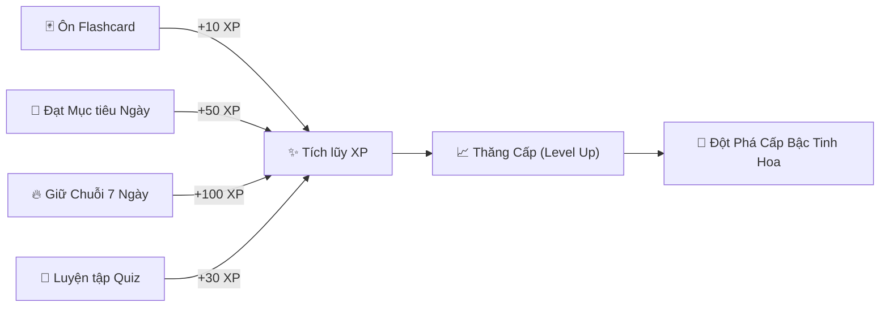
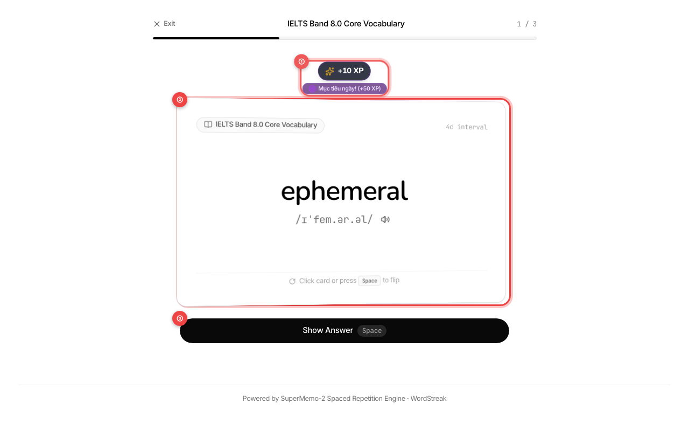
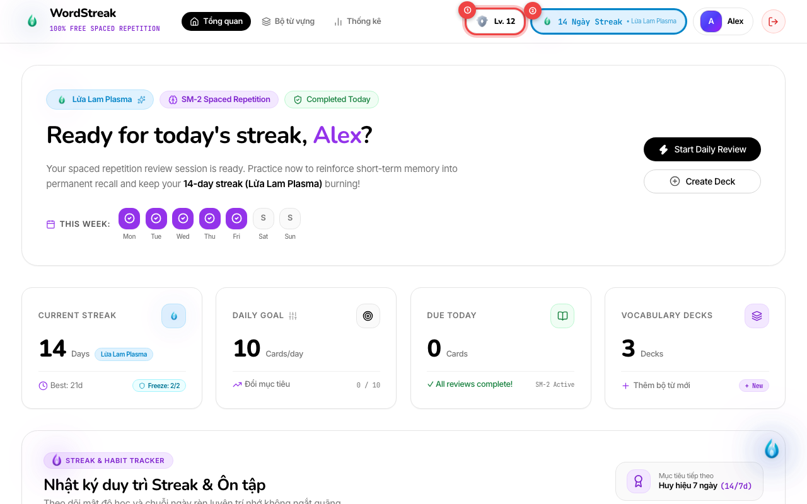
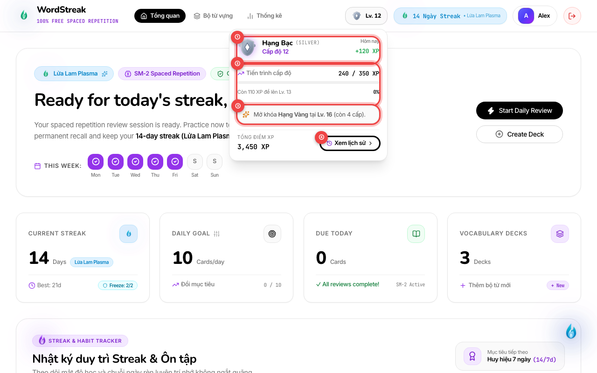
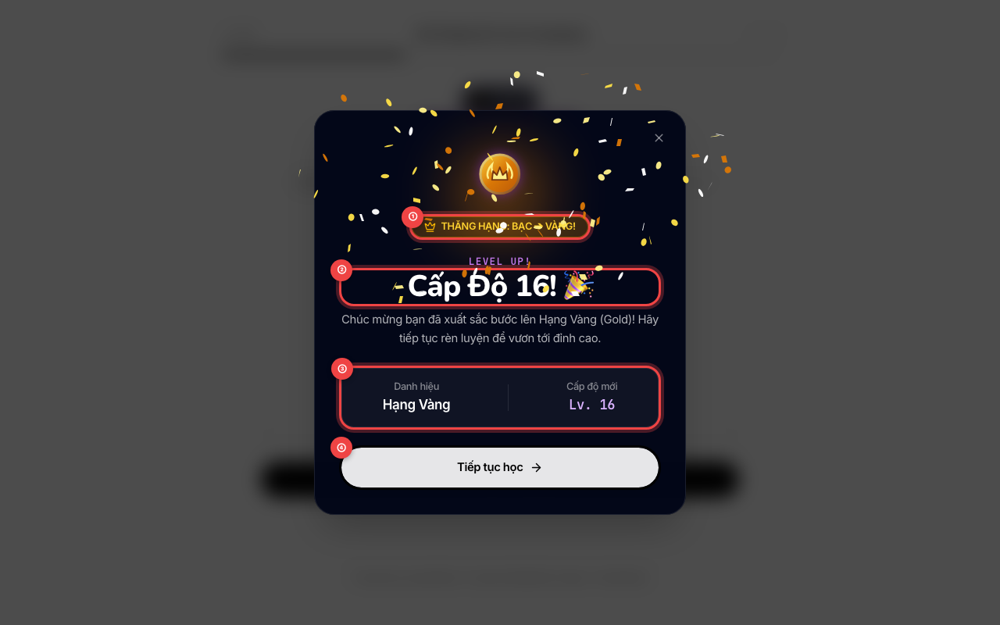
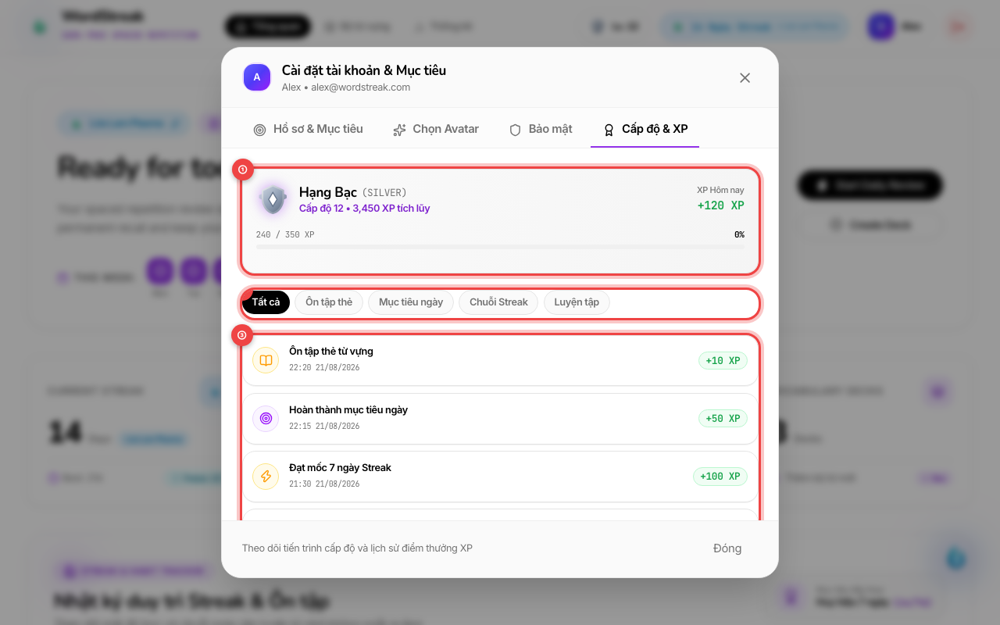

# 🏆 Hướng dẫn: Hệ thống Cấp độ & Điểm Kinh Nghiệm (XP & Learner Levels)

> **Đối tượng người dùng:** Người học tiếng Anh trên WordStreak (Miễn phí trọn đời)  
> **Tính năng:** Hệ thống Thăng Cấp & Điểm Kinh Nghiệm (Gamification XP & Mastery Tiers - US-GAME-03)  
> **Phiên bản:** 1.0.0  
> **Cập nhật lần cuối:** 2026-08-21

---

## 🎯 1. Điểm Kinh Nghiệm (XP) & Cấp độ trong WordStreak là gì?

Học ngoại ngữ là một hành trình dài cần sự bền bỉ. Để mỗi phút giây học tập của bạn đều trở nên thú vị, tràn đầy hứng khởi và được ghi nhận xứng đáng, WordStreak mang đến **Hệ thống Cấp độ & Điểm Kinh Nghiệm (XP - Experience Points)**:

- **XP là gì?** XP là thước đo nỗ lực học tập của bạn. Mỗi khi bạn ghi nhớ một từ vựng mới, hoàn thành bài tập trắc nghiệm hay giữ vững chuỗi ngày học liên tục, bạn đều nhận được điểm thưởng kinh nghiệm tương ứng.
- **Cấp độ (Level):** Tích lũy đủ XP sẽ giúp bạn tự động **Thăng Cấp (Level Up)**, mở khóa các danh hiệu cao quý và đưa tên tuổi của bạn lên những nấc thang vinh quang mới.
- **Công bằng & Minh bạch:** Mọi điểm số bạn kiếm được đều được lưu trữ vĩnh viễn trong **Sổ cái Lịch sử Cá nhân**, không bao giờ bị mất đi hay giảm sút theo thời gian.

---

## 👑 2. Bảng 5 Cấp Bậc Tinh Hoa (Mastery Tiers)

Trên con đường chinh phục kho từ vựng tiếng Anh, bạn sẽ lần lượt thăng hoa qua **5 Cấp bậc Tinh hoa**. Mỗi cấp bậc sở hữu một biểu tượng huy hiệu độc quyền cùng màu sắc phong thủy đại diện cho sự trưởng thành ngôn ngữ của bạn:

| Cấp bậc Tinh hoa        | Giới hạn Cấp độ  |    Biểu tượng Huy hiệu     |      Màu sắc Chủ đạo       | Ý nghĩa Danh hiệu & Cột mốc                                                                                                       |
| :---------------------- | :--------------: | :------------------------: | :------------------------: | :-------------------------------------------------------------------------------------------------------------------------------- |
| **Đồng (Bronze)**       |  **Cấp 1 – 5**   |  🥉 _Khiên Đồng Khởi Sắc_  |  Nâu Hổ Phách (`#B45309`)  | **Người Khởi Hành:** Bắt đầu xây dựng thói quen học tập hàng ngày và làm quen với phương pháp thẻ nhớ lặp lại ngắt quãng.         |
| **Bạc (Silver)**        |  **Cấp 6 – 15**  |   🥈 _Khiên Bạc Ánh Kim_   |  Bạc Ánh Kim (`#94A3B8`)   | **Người Chăm Chỉ:** Phương pháp học đã đi vào nền nếp; vốn từ vựng cơ bản được củng cố vững chắc mỗi ngày.                        |
| **Vàng (Gold)**         | **Cấp 16 – 30**  | 🥇 _Vương Miện Hoàng Kim_  | Vàng Hoàng Gia (`#D97706`) | **Học Giả Vững Vàng:** Sở hữu phản xạ từ vựng linh hoạt, dễ dàng vượt qua các bài kiểm tra trắc nghiệm với độ chính xác cao.      |
| **Kim Cương (Diamond)** | **Cấp 31 – 45**  |   💎 _Bảo Ngọc Lam Biển_   |  Lam Biển Sâu (`#06B6D4`)  | **Bậc Thầy Ngôn Ngữ:** Làm chủ hàng ngàn từ vựng chuyên sâu, tự tin đọc hiểu tài liệu và biểu đạt tự nhiên.                       |
| **Cao Thủ (Master)**    | **Cấp 46 – 50+** | 👑 _Vương Miện Thần Thoại_ | Tím Thạch Anh (`#8B5CF6`)  | **Huyền Thoại Bất Tử:** Đỉnh cao tri thức và sự kiên trì tuyệt đỉnh, biểu tượng truyền cảm hứng cho toàn thể cộng đồng người học! |

> [!NOTE]
> Khi bạn đạt đến các cột mốc thăng hạng đặc biệt (ví dụ từ Cấp 5 lên Cấp 6 để vào bậc **Bạc**, hoặc từ Cấp 15 lên Cấp 16 để vào bậc **Vàng**), hệ thống sẽ kích hoạt màn hình **Đột phá Cấp bậc (Tier Promotion)** với hiệu ứng vinh danh hoành tráng!

---

## ⚡ 3. Bí quyết Kiếm XP Mỗi Ngày & Điểm Thưởng Nổi

Bạn có thể tích lũy điểm kinh nghiệm dễ dàng thông qua mọi hoạt động học tập trên ứng dụng:

- `①` **Thông báo Điểm Thưởng Nổi (Floating XP Toast):** Hiển thị điểm số đạt được tức thì ngay khi đánh giá thẻ (`+10 XP`) kèm thông báo thưởng nóng khi hoàn thành mục tiêu ngày (`🎯 Mục tiêu ngày! (+50 XP)`).
- `②` **Thẻ Từ Vựng Đang Ôn Tập:** Giao diện thẻ Flashcard chuẩn SM-2 hiển thị từ vựng (`ephemeral`), phát âm, giải nghĩa tiếng Việt, câu ví dụ và mẹo nhớ từ (Memory Tip).
- `③` **Nút Lật Thẻ / Xem Câu Trả Lời:** Nhấn phím `Space` hoặc nút "Show Answer" để lật mặt sau và đánh giá mức độ ghi nhớ.

### Chi tiết cách tính điểm XP:

#### 1. Ôn tập Thẻ Từ vựng Flashcard (Spaced Repetition SM-2)

- 🌟 **Nhớ Tốt (Good) / Dễ (Easy):** **+10 XP** cho mỗi thẻ thuộc lòng.
- ⚡ **Khó (Hard):** **+5 XP** khích lệ nỗ lực ghi nhớ.
- 🔄 **Quên (Again):** **0 XP** (thẻ sẽ được xếp lại vào cuối phiên để bạn ôn lại ngay lập tức mà không bị phạt điểm).

#### 2. Hoàn thành Mục tiêu Ngày (Daily Goal Bonus)

- 🎯 **Thưởng nóng:** **+50 XP** ngay khi bạn hoàn thành đủ số lượng thẻ mục tiêu đã đăng ký trong ngày (ví dụ: ôn đủ 10 thẻ hoặc 20 thẻ).
- Mỗi ngày bạn có thể nhận 1 lần điểm thưởng mục tiêu ngày sau khi kết thúc bài học.

#### 3. Thưởng Mốc Chuỗi Học Tập Bền Bỉ (Streak Milestones)

- ⚡ **Chuỗi 7 ngày liên tiếp:** Nhận ngay **+100 XP** và được tặng thêm **+1 Khiên Đóng Băng Streak Freeze 🧊**!
- 🏆 **Chuỗi 30 ngày liên tiếp:** Nhận đại tiệc **+500 XP** kèm tiến hóa linh vật ngọn lửa tối thượng _Cosmic Nova_!
- Cứ mỗi chu kỳ 7 ngày và 30 ngày tiếp theo, phần thưởng XP khổng lồ này lại tiếp tục được trao tặng.

#### 4. Luyện tập Trắc nghiệm & Điền từ vào câu (Quiz Practice)

- 🧩 **Đạt điểm cao (từ 80% trở lên):** **+30 XP** cho mỗi bài Quiz xuất sắc.
- 📝 **Hoàn thành bài luyện tập (dưới 80%):** **+10 XP** khích lệ tinh thần rèn luyện.
- _(Để tạo sự cân bằng và bảo vệ sức khỏe người học, bạn có thể nhận tối đa 5 lần thưởng điểm từ Quiz mỗi ngày)._

---

## 🛡️ 4. Xem Cấp độ trên Thanh Công cụ (Topbar Level Crest)

Dù bạn đang duyệt danh sách bài học, tạo thẻ mới hay theo dõi thống kê, tiến trình cấp độ của bạn luôn hiển thị thời gian thực tại góc trên màn hình:

- `①` **Huy hiệu Cấp bậc & Cấp độ (Topbar Level Widget):** Biểu tượng huy hiệu mang màu sắc cấp bậc tương ứng của bạn (Đồng, Bạc, Vàng, Kim Cương hoặc Cao Thủ) cùng số cấp độ hiện tại (ví dụ: `Lv. 12`) và thanh tiến trình mini.
- `②` **Thanh Chuỗi Học Tập (Streak Pill):** Hiển thị chuỗi ngày học liên tục (ví dụ: `14 Ngày Streak • Lửa Lam Plasma`) giúp bạn luôn theo dõi phong độ rèn luyện hàng ngày.

---

### Mở Hộp Thông tin Chi tiết (Level Hover Popover)

Chỉ cần **rê chuột (hover)** hoặc **nhấn nhẹ** vào Huy hiệu Cấp độ trên thanh công cụ, một bảng tổng kết thông minh sẽ mở ra:

- `①` **Huy hiệu & Cấp bậc Tinh hoa:** Hiển thị tên cấp bậc (Hạng Bạc / Silver), cấp độ hiện tại (`Cấp độ 12`) và số điểm kinh nghiệm nhận được hôm nay (`+120 XP`).
- `②` **Thanh Tiến độ Cấp độ:** Thể hiện chi tiết số XP hiện tại (`240 / 350 XP`), thanh đo phần trăm trực quan (`68%`) và số điểm còn thiếu để lên cấp tiếp theo (`Còn 110 XP để lên Lv. 13`).
- `③` **Mục tiêu Cột mốc Tiếp theo:** Nhắc nhở cấp độ cần đạt để mở khóa Cấp bậc Tinh hoa mới (ví dụ: `Mở khóa Hạng Vàng tại Lv. 16 (còn 4 cấp)`).
- `④` **Nút "Xem lịch sử":** Nhấp để mở ngay Sổ cái Lịch sử Tích lũy XP toàn thời gian trong phần Cài đặt.

---

## 🎉 5. Màn hình Chúc Mừng Thăng Cấp (Level Up Celebration)

Mỗi khi tích lũy đủ điểm kinh nghiệm để bước sang cấp độ mới, màn hình chúc mừng kỳ diệu sẽ xuất hiện tức thì để vinh danh bạn:

- `①` **Huy hiệu Đột Phá Thăng Hạng (Tier Promotion Badge):** Bảng vinh danh nổi bật khi bạn vượt ngưỡng thăng hạng mới (ví dụ: `THĂNG HẠNG: BẠC ➔ VÀNG! 👑`).
- `②` **Tiêu Đề Vinh Danh & Hiệu Ứng Pháo Hoa:** Lời chúc mừng nỗ lực bền bỉ (`Cấp Độ 16! 🎉`) kèm cơn mưa hạt giấy pháo hoa (confetti) rực rỡ mang màu sắc phong thủy của cấp bậc đạt được.
- `③` **Thẻ Chi Tiết Cấp Độ Mới:** Hiển thị danh hiệu cao quý vừa chạm tới (`Hạng Vàng`) và chỉ số cấp độ mới (`Lv. 16`).
- `④` **Nút "Tiếp tục học":** Nhấn phím `Enter`, `Escape` hoặc nút màu trắng để đóng màn hình vinh danh và tiếp tục hành trình học tập.

---

## 📜 6. Xem Lịch sử Hoạt động & Tích lũy XP trong Cài đặt Cá nhân

Bạn muốn xem lại toàn bộ quá trình phấn đấu của mình từ ngày đầu tiên tham gia WordStreak? Hãy sử dụng tính năng **Sổ cái Lịch sử XP (XP History Ledger)**:

### Cách mở Lịch sử XP:

1. Nhấp vào nút **Xem lịch sử** từ Hộp thông tin Cấp độ trên thanh công cụ Topbar.
2. Hoặc nhấp vào **Avatar Cá nhân > Cài đặt tài khoản & Mục tiêu > Thẻ "Cấp độ & XP"**.

### Các thành phần chính trong Sổ cái XP:

- `①` **Bảng Tổng Quan Cấp Độ & XP Tích Lũy:** Tóm tắt danh hiệu hiện tại (`Hạng Bạc`), tổng điểm tích lũy (`3,450 XP`), điểm kiếm được hôm nay (`+120 XP`) cùng thanh tiến độ cấp độ chi tiết.
- `②` **Thanh Bộ Lọc Danh Mục:** Cho phép lọc nhanh lịch sử theo từng loại hoạt động (_Tất cả_, _Ôn tập thẻ_, _Mục tiêu ngày_, _Chuỗi Streak_, _Luyện tập_).
- `③` **Sổ Cái Chi Tiết Từng Hoạt Động:** Danh sách ghi nhận từng mốc học tập minh bạch với biểu tượng danh mục, tên bài học, mốc thời gian chi tiết đến từng phút và số điểm cộng (`+10 XP`, `+50 XP`, `+100 XP`).

---

## 💡 7. Mẹo Vàng Tăng Cấp Thần Tốc & Bền Vững

> [!TIP]
> **1. Khởi đầu ngày mới với Combo "3 trong 1":**  
> Dành 5 phút buổi sáng hoàn thành 10–15 thẻ Flashcard. Bạn sẽ kích hoạt chuỗi Streak (bảo toàn ngọn lửa), hoàn thành Mục tiêu ngày (**+50 XP**) và thu về ít nhất **+100 đến +150 XP** chỉ trong tích tắc!

> [!TIP]
> **2. Đặt Mục tiêu Ngày vừa sức:**  
> Bạn có thể tùy chỉnh mục tiêu ngày (ví dụ: 10 thẻ, 20 thẻ hoặc 30 thẻ) trong phần Cài đặt. Hãy chọn con số mà bạn có thể duy trì mỗi ngày để không bao giờ bỏ lỡ phần thưởng **+50 XP** quý giá.

> [!TIP]
> **3. "Đổi gió" bằng 1 bài Quiz ngắn trước khi ngủ:**  
> Nếu cảm thấy mỏi mắt sau một ngày dài, hãy làm nhanh 1 bài Quiz trắc nghiệm 5 câu để kiếm thêm **+30 XP** nhẹ nhàng và củng cố trí nhớ dài hạn.

> [!TIP]
> **4. Học đều mỗi ngày thay vì "cày cuốc dồn dập":**  
> Hệ thống bộ nhớ não bộ hoạt động tốt nhất khi được tiếp xúc lặp lại ngắt quãng. Học 15 phút mỗi ngày sẽ giúp bạn tích lũy điểm bền vững và nhớ từ lâu gấp 10 lần so với việc học 2 tiếng dồn vào cuối tuần.

---

## ❓ 8. Câu hỏi Thường Gặp (FAQs)

- **Hỏi: Điểm XP của tôi có bị trừ đi nếu tôi lỡ quên học một vài ngày không?**  
  **Đáp:** Hoàn toàn không! Điểm XP và Cấp độ trong WordStreak là **thành quả vĩnh viễn** của bạn. Dù bạn có tạm nghỉ, số điểm và cấp bậc của bạn vẫn được bảo toàn nguyên vẹn 100%.

- **Hỏi: Tại sao tôi ôn tập liên tục rất nhiều thẻ nhưng điểm dừng lại không tăng thêm nữa?**  
  **Đáp:** Để bảo vệ sức khỏe thị giác và ngăn ngừa tình trạng học quá tải (burnout), WordStreak áp dụng hạn mức tích lũy tối đa **500 XP / giờ**. Nếu đạt mức này, bạn hãy nghỉ ngơi thư giãn đôi mắt khoảng 30–45 phút rồi quay lại học tiếp nhé!

- **Hỏi: Tôi có thể dùng tiền thật để mua XP hoặc mua cấp độ không?**  
  **Đáp:** Tuyệt đối không. WordStreak là nền tảng học tập **100% Miễn phí trọn đời**, không bán tính năng bằng tiền. Mọi cấp độ và huy hiệu đều phản ánh chân thực nỗ lực và sự kiên trì của chính bạn.

- **Hỏi: Cấp độ tối đa trong WordStreak là bao nhiêu?**  
  **Đáp:** Cấp độ Cao Thủ (Master) mở ra từ Cấp 46 và **không có giới hạn trần**. Bạn có thể liên tục chinh phục các cấp độ 50, 100, 200+ để thiết lập những kỷ lục vô tiền khoáng hậu cho riêng mình!

- **Hỏi: Tôi có thể xem thứ hạng của mình so với bạn bè ở đâu?**  
  **Đáp:** Bảng xếp hạng Tuần và Toàn thời gian sẽ hiển thị vị trí của bạn dựa trên tổng số XP bạn đã tích lũy. Hãy cùng bạn bè thi đua thăng cấp mỗi tuần nhé!
