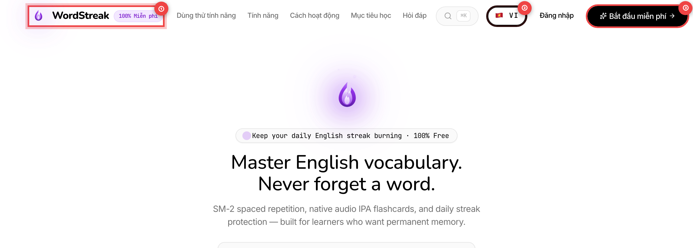
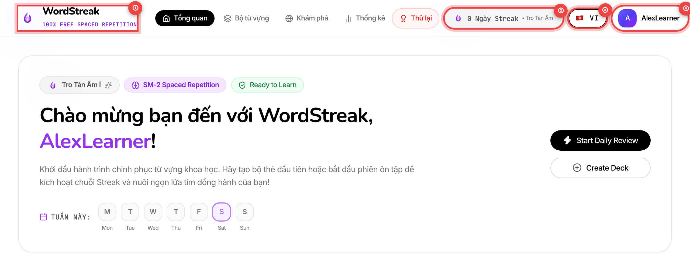
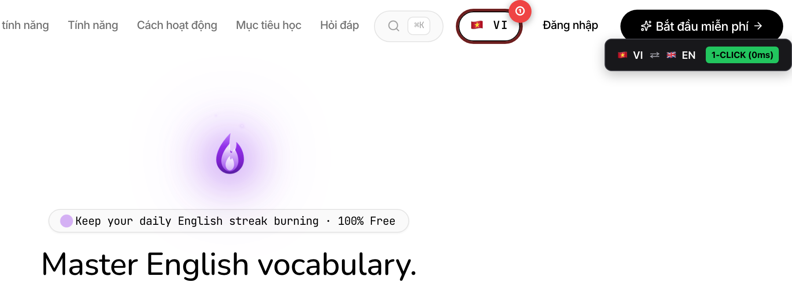
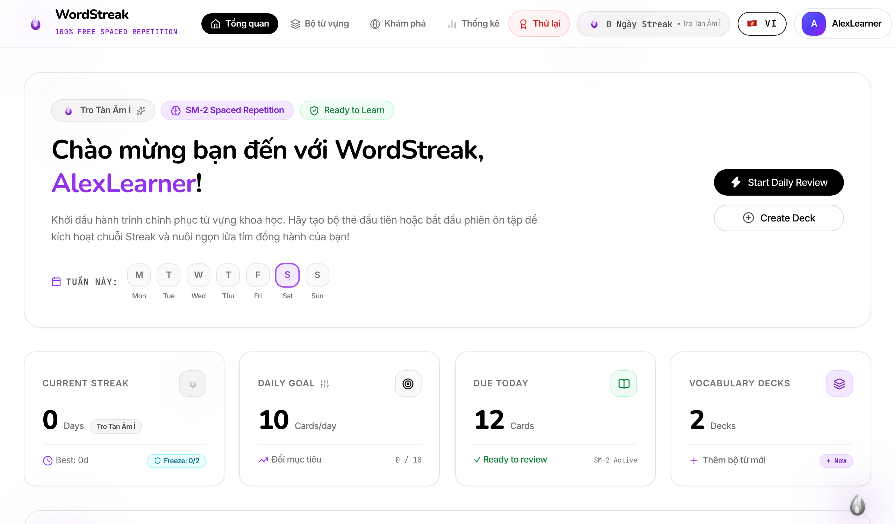
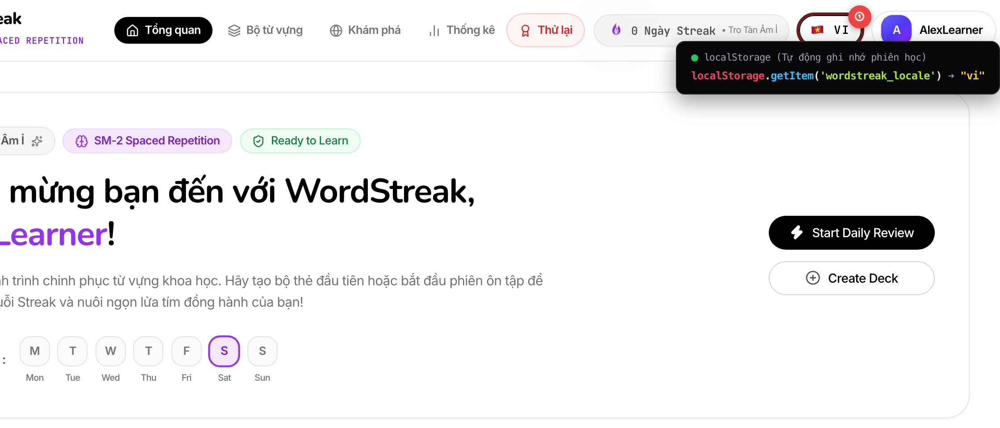

# 🌐 Nút Chuyển Đổi Ngôn Ngữ Tức Thì (Instant Language Switcher)

> **Đối tượng người dùng:** Tất cả người học trên WordStreak (Cả tài khoản khách & thành viên đã đăng nhập)  
> **Mã tính năng:** `US-I18N-01` (Hạ tầng Đa ngôn ngữ Core & Nút chuyển đổi tức thì)  
> **Hỗ trợ ngôn ngữ:** 🇻🇳 Tiếng Việt (VI) & 🇬🇧 English (EN)  
> **Cập nhật lần cuối:** 2026-08-22

---

## 🎯 1. Nút Chuyển Đổi Ngôn Ngữ Là Gì?

Trong hành trình chinh phục từ vựng tiếng Anh, mỗi người học có một nhu cầu và trình độ khác nhau:

- **Người mới bắt đầu:** Cần giao diện Tiếng Việt thân thiện, rõ ràng để dễ dàng nắm bắt các hướng dẫn, chế độ ôn tập và thuật ngữ học thuật.
- **Người học nâng cao:** Muốn "tắm" trong môi trường 100% Tiếng Anh (Phương pháp Học Đắm Chìm - _Immersion Method_) để tăng phản xạ tự nhiên và làm quen với ngôn ngữ chuẩn quốc tế mỗi ngày.

**Nút Chuyển Đổi Ngôn Ngữ Tức Thì (Instant Language Switcher)** của WordStreak được thiết kế theo phong cách viên nang tối giản tinh tế (nền trắng viền đen sắc nét, hiệu ứng đổ bóng nhẹ), cho phép bạn chuyển đổi toàn bộ giao diện giữa **Tiếng Việt 🇻🇳** và **English 🇬🇧** chỉ bằng **đúng 1 cú nhấp chuột** mà không cần tải lại trang.

```
┌─────────────────────────┐         1 Cú Click          ┌─────────────────────────┐
│   🇻🇳 VI (Tiếng Việt)   │   ───────────────────────►   │     🇬🇧 EN (English)     │
│  "Tổng quan", "Bộ từ"   │   ◄───────────────────────   │ "Dashboard", "Decks"    │
└─────────────────────────┘      Cập nhật tức thì 0ms   └─────────────────────────┘
```

---

## 📍 2. Vị Trí Của Nút Chuyển Đổi Ngôn Ngữ

Bạn có thể dễ dàng tìm thấy nút đổi ngôn ngữ ở mọi nơi trên WordStreak:

### 🌟 A. Trên Trang Chủ / Trang Giới Thiệu (Landing Page)

Ngay từ khi vừa truy cập WordStreak lần đầu tiên (ngay cả khi chưa đăng nhập), nút đổi ngôn ngữ đã sẵn sàng ở góc trên bên phải thanh điều hướng:



- `①` **Logo & Menu Điều Hướng Chính:** Nhận diện thương hiệu WordStreak cùng các liên kết khám phá tính năng, cách thức hoạt động và câu hỏi thường gặp.
- `②` **Viên Nang Chuyển Đổi Ngôn Ngữ (Language Switcher):** Nút viên thuốc nền trắng viền đen sắc nét, hiển thị quốc kỳ và mã ngôn ngữ hiện tại (ví dụ: `🇻🇳 VI` hoặc `🇬🇧 EN`).
- `③` **Cụm Nút Đăng Nhập / Đăng Ký:** Tự động hiển thị nhãn ngôn ngữ tương ứng (_"Bắt đầu miễn phí"_ hoặc _"Start Free"_).

---

### 📊 B. Trên Bảng Điều Khiển Học Tập (Dashboard Topbar)

Khi đã đăng nhập và đang học tập hàng ngày, nút đổi ngôn ngữ nằm gọn gàng trên thanh điều hướng đầu trang bên cạnh các thông số học tập quan trọng nhất:



- `①` **Logo & Menu Học Tập:** Điều hướng nhanh giữa các khu vực: **Tổng quan** (_Dashboard_), **Bộ từ vựng** (_Decks_), **Khám phá cộng đồng** (_Community_) và **Thống kê** (_Analytics_).
- `②` **Huy Hiệu Chuỗi Ngày Học (Streak Flame):** Hiển thị số ngày học liên tục và linh vật ngọn lửa năng lượng của bạn.
- `③` **Nút Chuyển Ngôn Ngữ Tức Thì:** Viên nang nền trắng viền đen tiện dụng — bấm vào bất kỳ lúc nào để chuyển đổi tức thì giao diện làm việc.
- `④` **Hồ Sơ & Cài Đặt Người Dùng:** Nơi bạn quản lý ảnh đại diện, mục tiêu từ vựng hàng ngày, thông tin tài khoản và bảo mật.

---

## ⚡ 3. Cách Sử Dụng: Đổi Ngôn Ngữ Trong 1 Cú Nhấp Chuột

### 🖱️ Thao tác bằng Chuột hoặc Màn hình Cảm ứng



1. **Nhấp vào viên nang ngôn ngữ `①`:**
   - Nếu màn hình đang ở Tiếng Việt (`🇻🇳 VI`), nhấp vào sẽ ngay lập tức đổi sang English (`🇬🇧 EN`).
   - Nếu màn hình đang ở English (`🇬🇧 EN`), nhấp vào sẽ ngay lập tức quay trở lại Tiếng Việt (`🇻🇳 VI`).
2. **Không gián đoạn (0ms delay):** Toàn bộ văn bản trên màn hình (thanh điều hướng, thẻ thống kê, danh sách bộ thẻ từ, nhãn nút bấm, thông báo) sẽ biến đổi mượt mà trong chớp mắt mà không tải lại trang và không làm mất dữ liệu bạn đang thao tác.



---

### ⌨️ Thao tác Bằng Bàn Phím (Dành Cho Người Dùng Chuộng Phím Tắt)

WordStreak tuân thủ nghiêm ngặt tiêu chuẩn tiếp cận web quốc tế (W3C WCAG 2.1 AA):

1. Nhấn phím `Tab` trên bàn phím cho đến khi vòng hào quang tiêu điểm (Focus Ring) bao quanh nút Chuyển đổi ngôn ngữ.
2. Nhấn phím `Space` (Phím cách) hoặc `Enter` để đổi ngôn ngữ ngay lập tức.
3. Phần mềm đọc màn hình (Screen Reader) sẽ phát âm rõ ràng: _"Switch to English"_ hoặc _"Chuyển sang Tiếng Việt"_.

---

## 💾 4. Tự Động Lưu Lựa Chọn Cho Mọi Phiên Học Sau (Session Persistence)

Bạn hoàn toàn không cần phải bấm chọn lại ngôn ngữ mỗi lần mở trình duyệt:



- **Ghi nhớ thông minh `①`:** Ngay khi bạn chọn ngôn ngữ, WordStreak sẽ tự động ghi nhớ lựa chọn của bạn vào bộ nhớ thiết bị (`wordstreak_locale`).
- **Mở tab mới hoặc F5 tải lại trang:** Giao diện vẫn giữ nguyên ngôn ngữ bạn đã chọn từ trước mà không cần thao tác lại.
- **Tự động nhận diện lần đầu (Smart Auto-Detection):** Nếu bạn là người dùng mới toanh chưa từng chọn ngôn ngữ, WordStreak sẽ tự động kiểm tra cài đặt trình duyệt của bạn (Tiếng Việt hoặc Tiếng Anh) để hiển thị ngôn ngữ phù hợp và tự nhiên nhất.

> [!TIP]
> **Mẹo Học Nhanh:** Khi mới ôn từ vựng khó, bạn có thể để giao diện Tiếng Việt để nắm bắt nhanh ngữ cảnh và hướng dẫn. Khi đã thuần thục, hãy bấm đổi sang English để rèn luyện tư duy trực tiếp bằng tiếng Anh như người bản xứ!

---

## 💎 5. Lợi Ích Cốt Lõi Dành Cho Người Học

| Lợi ích                                   | Mô tả chi tiết cho bạn                                                                                         |
| :---------------------------------------- | :------------------------------------------------------------------------------------------------------------- |
| 🚀 **Chuyển Đổi Không Độ Trễ (0ms)**      | Không cần chờ tải lại toàn trang (_zero page reload_), trải nghiệm tức thì mượt mà.                            |
| 🧠 **Học Đắm Chìm Linh Hoạt (Immersion)** | Dễ dàng chuyển đổi giữa chế độ học hiểu ngữ nghĩa (Tiếng Việt) và phản xạ trực tiếp (Tiếng Anh).               |
| 🛡️ **An Toàn Tuyệt Đối Cho Dữ Liệu**      | Chỉ thay đổi ngôn ngữ hiển thị giao diện, không làm thay đổi nội dung bộ thẻ hay chuỗi ngày Streak.            |
| 📱 **Đồng Bộ Hoàn Hảo Trên Mọi Thiết Bị** | Thiết kế viên nang nền trắng viền đen tinh tế, hiển thị sắc nét trên cả máy tính, máy tính bảng và điện thoại. |

---

## ❓ 6. Câu Hỏi Thường Gặp (FAQ)

### ❓ 1. Tôi đổi ngôn ngữ thì các thẻ từ vựng và bộ thẻ của tôi có bị dịch tự động không?

> **Trả lời:** Không. Nút đổi ngôn ngữ chỉ tác động lên **giao diện ứng dụng** (tiêu đề, nút bấm, menu, nhãn thống kê, thông báo). Toàn bộ nội dung từ vựng, câu ví dụ, phát âm IPA và ghi chú trong các Bộ từ của bạn sẽ luôn được giữ nguyên vẹn 100% như bạn đã soạn thảo.

---

### ❓ 2. Đổi ngôn ngữ có làm mất chuỗi ngày học (Daily Streak) hay điểm XP của tôi không?

> **Trả lời:** Hoàn toàn không! Mọi thông số học tập, chuỗi ngày liên tục, cấp độ linh vật ngọn lửa và điểm kinh nghiệm XP của bạn đều được bảo toàn nguyên vẹn trên hệ thống.

---

### ❓ 3. Tôi dùng nhiều tab trình duyệt cùng lúc thì cài đặt có đồng bộ không?

> **Trả lời:** Có! Nhờ hệ thống lưu trữ thông minh qua `wordstreak_locale`, khi bạn mở thêm tab mới trên cùng một trình duyệt, tab mới sẽ tự động nhận diện ngôn ngữ yêu thích của bạn ngay lập tức.

---

### ❓ 4. Khi tôi đăng xuất rồi đăng nhập lại trên máy khác thì sao?

> **Trả lời:** Trên máy tính hoặc điện thoại mới, hệ thống sẽ ưu tiên nhận diện theo cài đặt trình duyệt của máy đó; bạn chỉ cần bấm 1 lần vào nút ngôn ngữ là máy mới cũng sẽ ghi nhớ lựa chọn của bạn mãi mãi.

---

### ❓ 5. WordStreak có dự định hỗ trợ thêm các ngôn ngữ khác không?

> **Trả lời:** Hiện tại WordStreak hỗ trợ 2 ngôn ngữ chủ đạo là **Tiếng Việt 🇻🇳** và **English 🇬🇧**. Đội ngũ phát triển đang tiếp tục hoàn thiện hạ tầng đa ngôn ngữ để sẵn sàng bổ sung thêm các ngôn ngữ phổ biến khác (Tiếng Nhật, Tiếng Hàn, Tiếng Trung...) trong các bản nâng cấp tương lai.

---

> [!NOTE]
> Bạn có thắc mắc hoặc cần hỗ trợ thêm về tính năng ngôn ngữ? Hãy truy cập mục [Hỏi Đáp & Trợ Giúp](/faq) hoặc liên hệ đội ngũ WordStreak qua email hỗ trợ cộng đồng!
