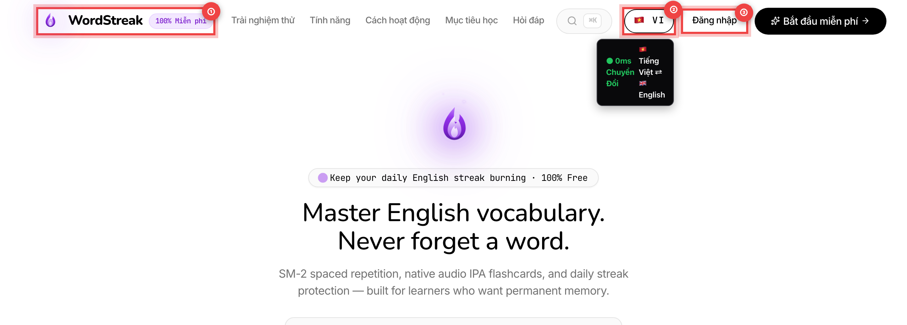
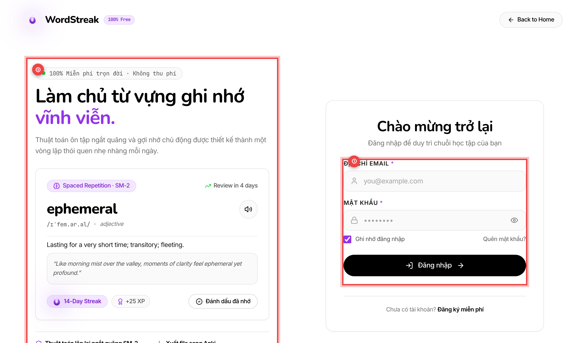
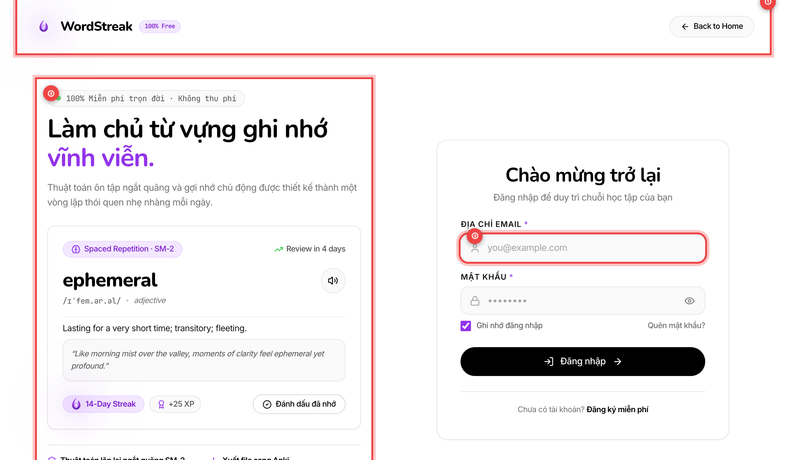
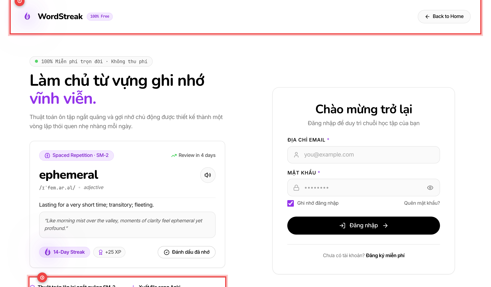
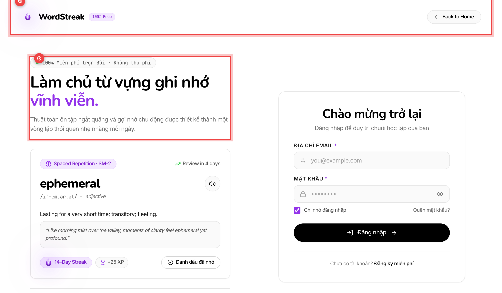
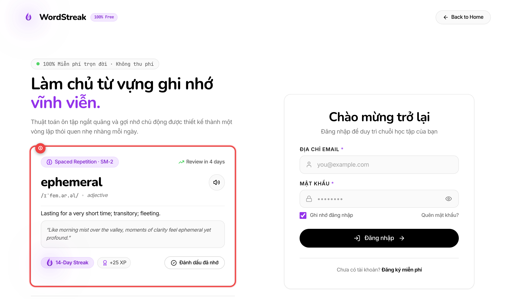
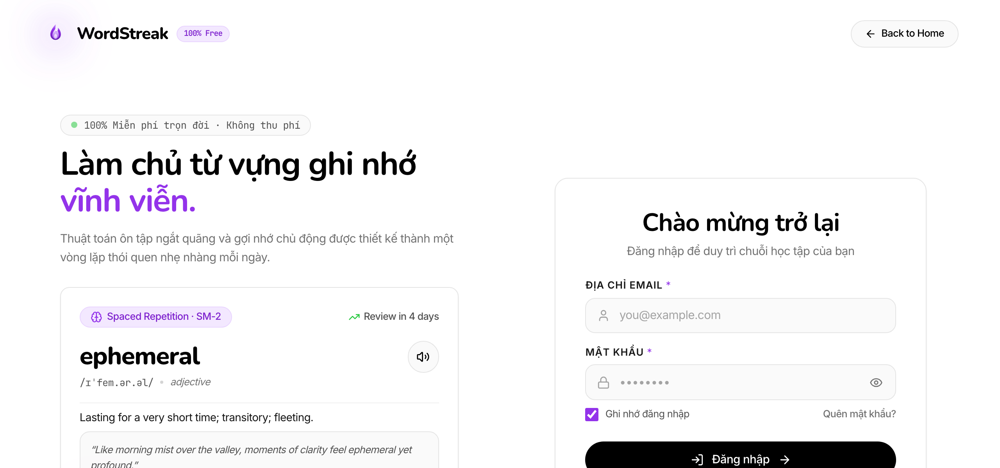

# 🌍 Trải Nghiệm Học Tập Đa Ngôn Ngữ Song Ngữ (Bilingual UI Localization)

> **Đối tượng người dùng:** Toàn bộ người học trên WordStreak (Học sinh, sinh viên, người đi làm và người luyện thi chứng chỉ quốc tế)  
> **Mã tính năng:** `US-I18N-02` (Bản địa hóa toàn diện giao diện người dùng & Thông báo bảo mật thân thiện)  
> **Hỗ trợ ngôn ngữ:** 🇻🇳 Tiếng Việt & 🇬🇧 English  
> **Cập nhật lần cuối:** 2026-08-22

---

## 🎯 1. Giới Thiệu Tổng Quan Tính Năng Đa Ngôn Ngữ

Học một ngôn ngữ mới luôn đòi hỏi sự linh hoạt trong phương pháp tiếp cận:

- **Khi mới bắt đầu hoặc học chủ đề mới:** Giao diện **Tiếng Việt 🇻🇳** giúp bạn hiểu rõ 100% các tính năng, thuật ngữ học thuật, quy tắc lặp lại ngắt quãng (SRS) và các gợi ý bài tập mà không gặp bất kỳ rào cản nào.
- **Khi muốn tăng tốc phản xạ:** Giao diện **English 🇬🇧** mở ra môi trường **Học Đắm Chìm (Immersion Learning)**, biến từng thao tác hàng ngày — từ lật thẻ, chọn đáp án trắc nghiệm đến xem báo cáo biểu đồ — thành cơ hội rèn luyện tư duy tiếng Anh trực tiếp.

Tính năng **Bản địa hóa giao diện toàn diện (UI Localization)** của WordStreak mang đến trải nghiệm song ngữ mượt mà trên toàn bộ nền tảng, giúp bạn tự do chuyển đổi qua lại bất cứ lúc nào chỉ với **1 cú nhấp chuột (0ms)**.

```
┌─────────────────────────────────────────────────────────────────────────────┐
│                    HỆ THỐNG ĐA NGÔN NGỮ WORDSTREAK                         │
├──────────────────────────────────────┬──────────────────────────────────────┤
│          🇻🇳 TIẾNG VIỆT               │            🇬🇧 ENGLISH                │
├──────────────────────────────────────┼──────────────────────────────────────┤
│ • Tổng quan & Bộ từ vựng             │ • Dashboard & Vocabulary Decks       │
│ • Ôn tập Flashcard SRS 4 mức độ      │ • SRS Flashcard Review (Again/Easy)  │
│ • 5 Chế độ luyện tập & Luyện phát âm │ • 5 Practice Modes & Speech AI       │
│ • Thống kê trí nhớ & Bản đồ 365 ngày │ • Retention Analytics & 365d Heatmap │
│ • Thông báo lỗi thân thiện, dễ hiểu  │ • Friendly & Secure Error Messages   │
└──────────────────────────────────────┴──────────────────────────────────────┘
```

---

## ⚡ 2. Chuyển Đổi Ngôn Ngữ Tức Thì Với Viên Nang Obsidian (Obsidian Pill)

Bạn có thể thay đổi ngôn ngữ hiển thị của toàn bộ ứng dụng mọi lúc, mọi nơi ngay trên thanh điều hướng đầu trang (Header / Navbar):



- `①` **Menu Điều Hướng & Trang Chủ:** Logo WordStreak và các lối tắt dẫn tới các khu vực chính của ứng dụng.
- `②` **Viên Nang Chuyển Đổi Ngôn Ngữ (Obsidian Pill Switcher):** Nút bấm thiết kế viên thuốc tối giản, hiển thị cờ quốc gia và mã ngôn ngữ hiện tại (`🇻🇳 VI` hoặc `🇬🇧 EN`). Nhấp vào nút này để chuyển đổi tức thì giao diện trong 0ms mà không làm tải lại trang hay gián đoạn phiên học.
- `③` **Cụm Nút Đăng Nhập / Đăng Ký:** Tự động điều chỉnh nhãn hiển thị tương ứng theo ngôn ngữ bạn chọn (_"Đăng nhập / Bắt đầu miễn phí"_ hoặc _"Log In / Start Free"_).

> [!TIP]
> **Thao tác nhanh bằng bàn phím:** Nhấn phím `Tab` để di chuyển tiêu điểm đến viên nang ngôn ngữ `②`, sau đó nhấn phím `Space` (Phím cách) hoặc `Enter` để đổi ngôn ngữ ngay lập tức.

---

## 📱 3. Trải Nghiệm Học Tập Song Ngữ Trên Từng Màn Hình

Hệ thống Đa ngôn ngữ được đồng bộ toàn diện trên 100% các màn hình của WordStreak:

### 🔐 A. Màn hình Đăng nhập, Đăng ký & Giới thiệu (Authentication & Showcase)

Ngay từ bước đầu tiên khi tạo tài khoản hoặc đăng nhập, giao diện đã được bản địa hóa chi tiết để tạo sự an tâm và thuận tiện tối đa:



- `①` **Biểu Mẫu Nhập Liệu Thân Thiện:** Nhãn ô nhập (_"Email hoặc tên người dùng"_, _"Mật khẩu"_), gợi ý nhập liệu placeholder và các thông báo kiểm tra tính hợp lệ đều hiển thị rõ ràng bằng ngôn ngữ bạn đã chọn.
- `②` **Nút Đổi Ngôn Ngữ Độc Lập:** Cho phép bạn chuyển đổi ngôn ngữ ngay tại trang đăng nhập trước khi bước vào ứng dụng.
- `③` **Bảng Giới Thiệu Tính Năng Nổi Bật:** Trình bày sinh động các giá trị cốt lõi của WordStreak (Thuật toán ghi nhớ dài hạn SM-2, chuỗi ngày Streak ngọn lửa, luyện phát âm trí tuệ nhân tạo).

---

### 📚 B. Danh Sách Bộ Thẻ & Quản Lý Thẻ Chi Tiết (Decks & Card Management)

Trung tâm quản lý từ vựng giúp bạn sắp xếp, tìm kiếm và thao tác hàng loạt trên các bộ thẻ học tập:



- `①` **Cụm Nút Thao Tác Nhanh:** Các nút hành động chính như _"Thêm thẻ mới"_, _"Bắt đầu ôn tập"_, _"Luyện tập"_ và _"Nhập / Xuất dữ liệu"_ hiển thị nhãn dịch sắc nét, chuẩn ngữ cảnh.
- `②` **Bộ Lọc Tìm Kiếm & Chế Độ Xem:** Hỗ trợ tìm kiếm từ vựng theo từ khóa, lọc theo trạng thái (_"Từ mới"_, _"Đang học"_, _"Thành thạo"_) và chuyển đổi linh hoạt giữa chế độ **Dạng Lưới (Grid View)** hoặc **Dạng Bảng (Table View)**.
- `③` **Thẻ Từ Vựng Bảo Toàn Nguyên Bản:** Trong khi toàn bộ nhãn thao tác, trạng thái ôn tập và ngày nhắc lại được dịch sang Tiếng Việt, nội dung từ tiếng Anh gốc, phát âm IPA, nghĩa định nghĩa và câu ví dụ của bạn vẫn được giữ nguyên vẹn 100%.

---

### 🧠 C. Ôn Tập Flashcard Trí Nhớ Dài Hạn (SRS Flashcard Review)

Màn hình ôn tập thẻ ghi nhớ được tinh chỉnh trực quan để bạn tập trung cao độ vào việc ghi nhớ:



- `①` **Thanh Tiến Độ & Phím Tắt Ôn Tập:** Hiển thị số lượng thẻ còn lại trong phiên học và gợi ý các phím tắt bàn phím tiện lợi (`Space` để lật thẻ, `1 - 4` để chấm điểm).
- `②` **Mặt Trước & Mặt Sau Thẻ Flashcard:** Thiết kế tối giản, sắc nét giúp hiển thị rõ ràng từ vựng, phiên âm ngữ âm quốc tế, loại từ và câu ví dụ thực tế.
- `③` **4 Nút Đánh Giá Mức Độ Ghi Nhớ (SRS Rating Buttons):**
  - 🔴 **Lặp lại (Again):** Nhắc lại sau 1 phút nếu bạn chưa nhớ.
  - 🟠 **Khó (Hard):** Khoảng cách ngắn (ví dụ: _2 ngày_) khi bạn cần nhiều nỗ lực để nhớ.
  - 🟢 **Tốt (Good):** Khoảng cách chuẩn (ví dụ: _6 ngày_) khi bạn nhớ đúng và thoải mái.
  - 🔵 **Dễ (Easy):** Khoảng cách dài (ví dụ: _12 ngày_) khi từ vựng đã trở nên quá quen thuộc.

---

### 🎯 D. 5 Chế Độ Luyện Tập & Luyện Phát Âm Bằng Giọng Nói (Practice Modes & Speech AI)

Hệ thống bài tập đa dạng giúp bạn củng cố từ vựng ở mọi giác quan (Đọc, Nghe, Viết, Phát âm):



- `①` **Tiêu Đề & Hướng Dẫn Chế Độ Học:** Toàn bộ câu hỏi, yêu cầu bài làm và thanh đếm thời gian trong 5 chế độ:
  1. **Trắc nghiệm 4 đáp án** (_Multiple Choice_)
  2. **Điền từ vào chỗ trống** (_Fill in the Blank_)
  3. **Nối từ với định nghĩa** (_Word Matching_)
  4. **Luyện nghe chính tả** (_Listening Practice_)
  5. **Luyện phát âm giọng nói** (_Speech Assessment_)
- `②` **Khu Vực Làm Bài Tương Tác:** Giao diện phản hồi trực quan với hiệu ứng màu sắc ngay khi bạn chọn đáp án (Xanh lá: Đúng 🎉, Đỏ: Cần xem lại 💡).
- `③` **Cửa Sổ Đánh Giá Phát Âm Bằng Trí Tuệ Nhân Tạo (AI Speech Modal):**
  - Phân tích chi tiết 3 tiêu chí cốt lõi: **Độ chính xác (Accuracy)**, **Độ lưu loát (Fluency)**, và **Độ rõ chữ (Pronunciation Clarity)**.
  - Gợi ý sửa lỗi phát âm cụ thể theo chuẩn âm vị quốc tế.

---

### 📊 E. Thống Kê Học Tập & Cài Đặt Cá Nhân (Analytics Hub & User Settings)

Báo cáo phân tích chuyên sâu giúp bạn theo dõi quá trình phát triển của trí nhớ:



- `①` **Các Chỉ Số Trí Nhớ & Bản Đồ Nhiệt 365 Ngày:** Hiển thị tỷ lệ ghi nhớ 30 ngày (_Retention Rate_), tổng lượt ôn tập và mức độ chuyên cần theo từng ô vuông nhiệt độ màu tím.
- `②` **Dự Báo Ngày Hoàn Thành Bộ Từ:** Thuật toán tự động tính toán vận tốc học của bạn để dự báo chính xác ngày hoàn thành 100% bộ từ vựng.
- `③` **Cửa Sổ Cài Đặt Cá Nhân & Ngôn Ngữ (Settings Modal):** Cho phép bạn tùy chỉnh ngôn ngữ giao diện ưu tiên, thay đổi mục tiêu số từ mỗi ngày (Daily Goal) và quản lý khiên đóng băng Streak Freeze.

---

## 🛡️ 4. Cơ Chế Hiển Thị Thông Báo Lỗi Thân Thiện & Bảo Mật

Khi gặp sự cố kỹ thuật (mất kết nối mạng, phiên đăng nhập hết hạn hoặc nhập sai thông tin), WordStreak cam kết không làm bạn bối rối bởi những dòng mã máy tính khó hiểu:



- `①` **Giải Thích Rõ Ràng, Gần Gũi:** Mọi thông báo lỗi đều được chuyển ngữ thành câu văn tiếng Việt thân thiện, mô tả đúng nguyên nhân thực tế (ví dụ: _"Không thể kết nối đến máy chủ. Kết nối internet của bạn có thể đang bị gián đoạn."_).
- `②` **Nút Khắc Phục Tức Thì:** Luôn đi kèm hành động gợi ý cụ thể như _"Thử lại ngay"_, _"Tải lại dữ liệu"_ hoặc _"Đăng nhập lại"_.
- `③` **Bảo Mật Tuyệt Đối (Zero Stack Trace):** Hệ thống loại bỏ hoàn toàn các đoạn mã nguồn kỹ thuật hoặc thông tin máy chủ nội bộ trên màn hình người dùng, bảo vệ quyền riêng tư và an toàn thông tin tối đa.

---

## 💎 5. Quy Tắc Bảo Toàn 100% Nội Dung Thẻ Từ Vựng (User Content Protection)

Một nguyên tắc cốt lõi trong thiết kế đa ngôn ngữ của WordStreak:

> [!IMPORTANT]
> **Quy Tắc Vàng Về Dữ Liệu:** Khi bạn bấm chuyển đổi giữa **Tiếng Việt 🇻🇳** và **English 🇬🇧**, hệ thống **CHỈ THAY ĐỔI** ngôn ngữ của giao diện điều khiển (nút bấm, menu, nhãn thống kê, hướng dẫn bài tập).  
> **100% Nội dung thẻ từ vựng của bạn** (Từ tiếng Anh, nghĩa bạn tự ghi chú, phiên âm IPA, câu ví dụ và thẻ tag cá nhân) sẽ **KHÔNG BAO GIỜ** bị dịch máy tự động làm xáo trộn hoặc thay đổi.

| Thành phần giao diện                        | Khi đổi sang Tiếng Việt 🇻🇳     | Khi đổi sang English 🇬🇧      |
| :------------------------------------------ | :----------------------------- | :--------------------------- |
| **Thanh Menu / Điều hướng**                 | _"Tổng quan", "Bộ từ", "Học"_  | _"Dashboard", "Decks", ..._  |
| **Nút chấm điểm Flashcard**                 | _"Lặp lại", "Khó", "Tốt", ..._ | _"Again", "Hard", "Good"_    |
| **Tiêu đề & Hướng dẫn bài tập**             | Tiếng Việt thân thiện, dễ hiểu | Tiếng Anh chuẩn quốc tế      |
| **Nội dung thẻ từ vựng (Thuật ngữ, Ví dụ)** | **Giữ nguyên 100% bản gốc**    | **Giữ nguyên 100% bản gốc**  |
| **Điểm kinh nghiệm XP & Chuỗi ngày Streak** | **Bảo toàn nguyên vẹn 100%**   | **Bảo toàn nguyên vẹn 100%** |

---

## ❓ 6. Câu Hỏi Thường Gặp (FAQ) & Mẹo Học Tập Tối Ưu

### ❓ 1. Tôi muốn luyện thi IELTS/TOEFL thì nên để ngôn ngữ nào?

> **Lời khuyên:** Hãy bắt đầu tuần đầu tiên với **Tiếng Việt 🇻🇳** để làm quen với các loại bài tập và thuật ngữ nhớ lặp lại ngắt quãng SM-2. Sau đó, hãy chuyển sang **English 🇬🇧** để tạo môi trường học tập 100% tiếng Anh tự nhiên mỗi ngày.

---

### ❓ 2. Khi tôi mở ứng dụng trên trình duyệt mới, WordStreak sẽ hiển thị ngôn ngữ gì?

> **Trả lời:** Hệ thống có tính năng **Tự động nhận diện thông minh (Smart Detection)**. Lần đầu tiên bạn mở web, WordStreak sẽ hiển thị theo ngôn ngữ trình duyệt của bạn (Tiếng Việt nếu máy dùng tiếng Việt, English nếu máy dùng tiếng Anh). Ngay khi bạn bấm chọn lại một lần, hệ thống sẽ ghi nhớ vĩnh viễn cho những lần mở sau.

---

### ❓ 3. Tôi có thể đổi ngôn ngữ khi đang giữa một phiên làm bài trắc nghiệm không?

> **Trả lời:** Có! Bạn có thể bấm nút ngôn ngữ Obsidian Pill trên thanh menu bất cứ lúc nào. Toàn bộ câu hỏi, thời gian và các lựa chọn đáp án sẽ lập tức cập nhật ngôn ngữ mà không làm mất tiến độ bài làm hiện tại.

---

### ❓ 4. Tại sao một số thuật ngữ chuyên ngành như "Spaced Repetition (SRS)" vẫn xuất hiện kèm tiếng Anh?

> **Trả lời:** Để hỗ trợ tốt nhất cho người học chuẩn bị thi các chứng chỉ quốc tế, WordStreak sử dụng cách chú thích song ngữ thông minh (ví dụ: _"Lặp lại ngắt quãng (SRS)"_ hay _"Tỷ lệ ghi nhớ (Retention Rate)"_), giúp bạn vừa hiểu sâu bản chất tiếng Việt vừa nắm chắc thuật ngữ học thuật quốc tế.

---

> [!NOTE]
> Bạn cần thêm trợ giúp hoặc muốn đóng góp ý kiến về bản dịch giao diện? Hãy gửi phản hồi cho đội ngũ phát triển tại mục [Hỗ Trợ Cộng Đồng](/community) hoặc qua email hỗ trợ của WordStreak!
