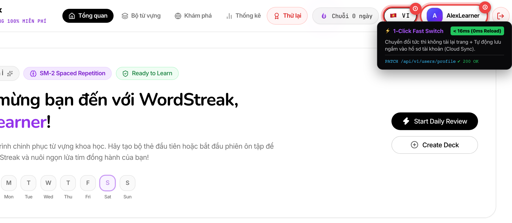
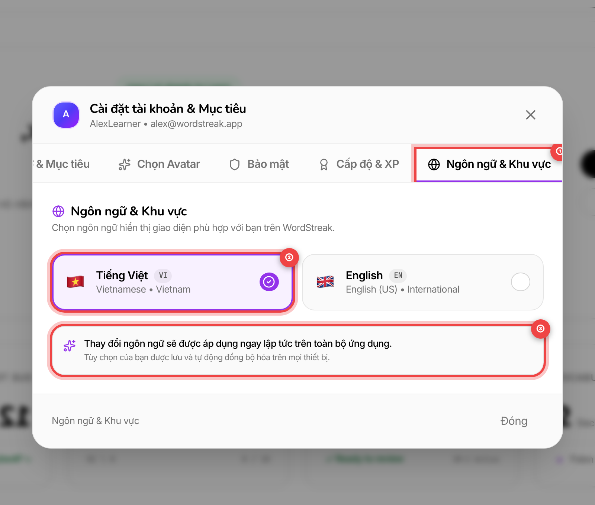
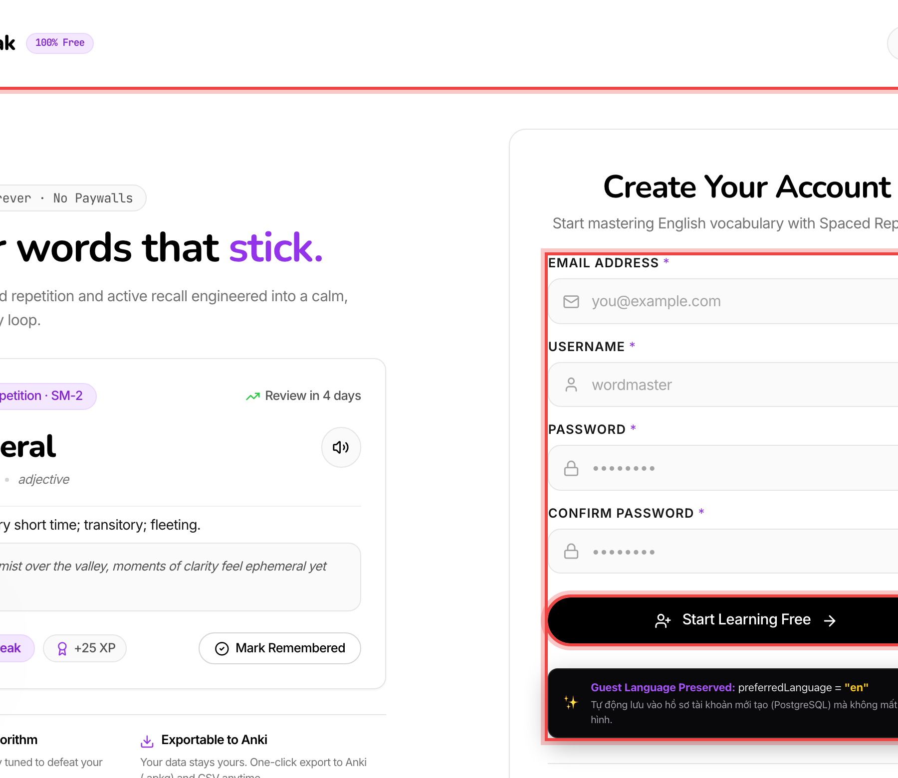
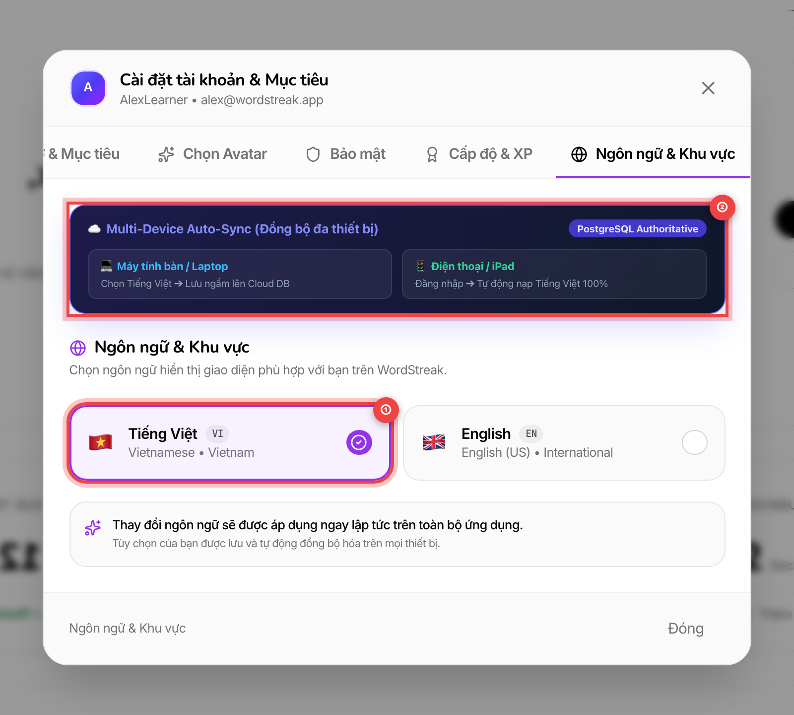
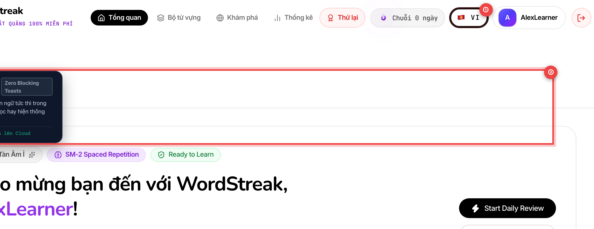

# 🔄 Cài Đặt Tùy Chọn Ngôn Ngữ & Đồng Bộ Hồ Sơ Tự Động (User Language Preferences Sync)

> **Đối tượng người dùng:** Toàn bộ người học WordStreak (Người dùng máy tính, điện thoại, máy tính bảng & thành viên mới đăng ký)  
> **Mã tính năng:** `US-I18N-03` (Đồng bộ Tùy chọn Ngôn ngữ Hồ sơ Đám mây & Đa Thiết Bị)  
> **Hỗ trợ ngôn ngữ:** 🇻🇳 Tiếng Việt (VI) & 🇬🇧 English (EN)  
> **Cập nhật lần cuối:** 2026-08-22

---

## 🎯 1. Tính Năng Đồng Bộ Tùy Chọn Ngôn Ngữ Là Gì?

Khi học ngoại ngữ trên nhiều thiết bị khác nhau — ví dụ: luyện từ vựng trên **máy tính bàn/laptop** tại nhà và ôn tập nhanh trên **điện thoại di động** khi đang di chuyển — điều bất tiện nhất là phải bấm chọn lại ngôn ngữ giao diện mỗi lần đăng nhập hay đổi máy.

Tính năng **Đồng Bộ Tùy Chọn Ngôn Ngữ Hồ Sơ (User Language Preferences Sync)** giúp ghi nhớ và đồng bộ ngôn ngữ yêu thích của bạn lên hệ thống máy chủ đám mây an toàn:

- ⚡ **Chuyển đổi tức thì (< 16ms):** Bấm đổi ngôn ngữ là giao diện cập nhật ngay trong chớp mắt mà không cần tải lại toàn trang hay gián đoạn phiên học.
- ☁️ **Đồng bộ tự động đa thiết bị:** Đổi ngôn ngữ ở bất kỳ đâu, mọi thiết bị khác của bạn sẽ tự động nhận diện chính xác ngôn ngữ đó ngay khi đăng nhập.
- 🎁 **Kế thừa lựa chọn của khách:** Khám phá trang web bằng tiếng Anh và quyết định tạo tài khoản? Tài khoản mới của bạn sẽ tự động lưu sẵn tiếng Anh mà không bị quay về mặc định.
- 🛡️ **Bền bỉ khi mất mạng (Offline):** Khi mạng chập chờn hoặc offline, bạn vẫn đổi ngôn ngữ bình thường trên máy, hệ thống sẽ tự động lưu ngầm lên đám mây khi có kết nối trở lại.

```
┌─────────────────────────────────────────────────────────────────────────────┐
│                 LUỒNG ĐỒNG BỘ NGÔN NGỮ ĐÁM MÂY WORDSTREAK                   │
├──────────────────────────┬──────────────────────┬───────────────────────────┤
│    💻 MÁY TÍNH / LAPTOP  │  ☁️ MÁY CHỦ HỒ SƠ    │    📱 ĐIỆN THOẠI / IPAD   │
├──────────────────────────┼──────────────────────┼───────────────────────────┤
│ Bạn chọn: 🇻🇳 Tiếng Việt │ ── Tự động lưu ──►   │ Khi bạn mở máy đăng nhập: │
│ UI đổi ngay lập tức 0ms  │  (preferredLanguage) │ Tự động nạp: 🇻🇳 100%      │
└──────────────────────────┴──────────────────────┴───────────────────────────┘
```

---

## ⚡ 2. Đổi Ngôn Ngữ Nhanh Với Nút Viên Nang Obsidian (Obsidian Pill)

Bạn có thể thay đổi nhanh ngôn ngữ hiển thị của ứng dụng bất cứ lúc nào ngay tại thanh đầu trang (Header / Navbar):



- `①` **Nút Viên Nang Ngôn Ngữ (Obsidian Pill Switcher):** Nhấp chuột hoặc chạm vào viên nang cờ quốc tế (`🇻🇳 VI` hoặc `🇬🇧 EN`) để chuyển đổi tức thì giao diện trong tích tắc (<16ms). Hệ thống sẽ tự động gửi lệnh lưu ngầm tùy chọn mới vào hồ sơ tài khoản của bạn trên đám mây.
- `②` **Khu Vực Hồ Sơ Cá Nhân & Cài Đặt:** Hiển thị tên người dùng và ảnh đại diện của bạn. Bạn có thể bấm vào đây để mở cửa sổ Cài đặt chi tiết.

> [!TIP]
> **Không lo gián đoạn:** Việc bấm đổi ngôn ngữ diễn ra hoàn toàn mượt mà, không tải lại trang và không làm mất tiến độ ôn thẻ Flashcard hay bài tập trắc nghiệm bạn đang làm dở.

---

## ⚙️ 3. Quản Lý Chi Tiết Trong Cửa Sổ Cài Đặt (Settings Modal)

Nếu muốn xem toàn bộ tùy chọn vùng và chọn ngôn ngữ một cách trực quan, bạn có thể sử dụng thẻ **Ngôn ngữ & Khu vực** trong Cửa sổ Cài đặt:



- `①` **Thẻ "Ngôn ngữ & Khu vực" (Language & Region Tab):** Nhấp vào biểu tượng quả địa cầu trên thanh danh mục cài đặt để mở giao diện quản lý ngôn ngữ giao diện.
- `②` **Thẻ Lựa Chọn Ngôn Ngữ Trực Quan:** Bấm vào thẻ ngôn ngữ bạn mong muốn (**🇻🇳 Tiếng Việt** hoặc **🇬🇧 English (US)**). Thẻ đang kích hoạt sẽ có viền tím nổi bật kèm dấu tích tròn màu tím xác nhận.
- `③` **Thông Báo Trạng Thái Thời Gian Thực:** Lời nhắc xác nhận thay đổi đã được áp dụng tức thì trên toàn bộ ứng dụng và đã được đồng bộ hóa an toàn với tài khoản đám mây của bạn.

---

## 🎁 4. Kế Thừa Ngôn Ngữ Khi Đăng Ký Tài Khoản Mới (Guest Carryover)

Khi bạn lần đầu ghé thăm WordStreak với tư cách khách và chọn giao diện Tiếng Anh (`🇬🇧 English`), bạn hoàn toàn không phải cài đặt lại sau khi tạo tài khoản:



- `①` **Trạng Thái Ngôn Ngữ Ban Đầu:** Ngôn ngữ bạn đã lựa chọn khi duyệt xem trang chủ WordStreak (ví dụ: `🇬🇧 English`).
- `②` **Biểu Mẫu Điền Thông Tin Đăng Ký:** Nhập tên người dùng, địa chỉ email và mật khẩu bảo vệ tài khoản mới.
- `③` **Nút "Tạo Tài Khoản" (Create Account):** Khi bạn nhấn nút đăng ký, hệ thống sẽ tự động đính kèm tùy chọn ngôn ngữ bạn đang chọn vào hồ sơ mới tạo trên máy chủ PostgreSQL. Khi vào Bảng điều khiển (Dashboard), giao diện sẽ giữ nguyên 100% tiếng Anh như bạn mong muốn!

---

## 📱 5. Đồng Bộ Liền Mạch Trên Mọi Thiết Bị (Multi-Device Auto-Sync)

Hệ sinh thái WordStreak tự động đồng bộ hóa trạng thái ngôn ngữ giữa các thiết bị mà bạn sở hữu:



- `①` **Lựa Chọn Ngôn Ngữ Được Đánh Dấu:** Ngôn ngữ bạn đang kích hoạt trên thiết bị hiện tại (ví dụ: `🇻🇳 Tiếng Việt`).
- `②` **Bảng Đồng Bộ Đa Thiết Bị:**
  - **Khi thao tác trên Máy tính/Laptop:** Bạn đổi sang Tiếng Việt ➔ Lựa chọn được lưu tức thì lên Hồ sơ Đám mây.
  - **Khi chuyển sang Điện thoại/Máy tính bảng:** Vừa đăng nhập vào ứng dụng ➔ Hệ thống tự động nạp chính xác Tiếng Việt mà không cần bạn phải thao tác cấu hình lại.

---

## 🛡️ 6. Hoạt Động Bền Bỉ Khi Mất Mạng (Offline Resilience)

Trong quá trình học tập di động, nếu chẳng may kết nối Wi-Fi hoặc 4G bị gián đoạn, WordStreak vẫn đảm bảo trải nghiệm học tập của bạn diễn ra liền mạch:



- `①` **Nút Đổi Ngôn Ngữ Vẫn Hoạt Động Mượt Mà:** Bạn vẫn có thể bấm đổi qua lại giữa Tiếng Việt và Tiếng Anh bình thường ngay cả khi không có kết nối mạng.
- `②` **Cơ Chế Xử Lý Thông Minh (Zero Disruption):**
  - Giao diện chuyển đổi ngay lập tức nhờ bộ nhớ cục bộ trên thiết bị (`localStorage`).
  - **Không hiện thông báo lỗi chặn màn hình:** Phiên học của bạn không bị làm phiền bởi các cửa sổ lỗi mạng khó chịu.
  - **Tự động lưu bù khi có mạng:** Ngay khi thiết bị kết nối Internet trở lại, hệ thống sẽ tự động đồng bộ tùy chọn mới nhất lên hồ sơ đám mây của bạn.

---

## 💎 7. Bảng Tổng Hợp Lợi Ích Dành Cho Người Học

| Tính năng                                   | Trải nghiệm thực tế mang lại cho bạn                                                                            |
| :------------------------------------------ | :-------------------------------------------------------------------------------------------------------------- |
| 🚀 **Chuyển đổi tức thì (< 16ms)**          | Đổi ngôn ngữ trong 1 cú click chuột, không độ trễ, không tải lại trang (_Zero Reload_).                         |
| ☁️ **Đồng bộ đám mây đa thiết bị**          | Đổi trên Laptop, tự động cập nhật trên Điện thoại & iPad ngay khi đăng nhập.                                    |
| 🎯 **2 Cách chuyển đổi linh hoạt**          | Dùng nút viên nang Obsidian trên thanh đầu trang hoặc Thẻ Ngôn ngữ trong Cửa sổ Cài đặt.                        |
| 🎁 **Kế thừa thông minh cho tài khoản mới** | Khách chọn Tiếng Anh trước khi đăng ký sẽ tự động sở hữu tài khoản Tiếng Anh ngay từ đầu.                       |
| 🛡️ **Bảo toàn dữ liệu học tập 100%**        | Đổi ngôn ngữ chỉ thay đổi nhãn giao diện, toàn bộ từ vựng, điểm kinh nghiệm XP và chuỗi ngày Streak nguyên vẹn. |

---

## ❓ 8. Câu Hỏi Thường Gặp (FAQ)

### ❓ 1. Tôi đang mở WordStreak trên cả máy tính và điện thoại cùng lúc, khi đổi ngôn ngữ trên máy tính thì điện thoại có đổi theo ngay không?

> **Trả lời:** Có! Khi bạn đổi ngôn ngữ trên máy tính, tùy chọn mới sẽ được lưu ngay lên hồ sơ tài khoản. Khi bạn thao tác tiếp hoặc mở tab mới trên điện thoại, hệ thống sẽ tự động đồng bộ và hiển thị ngôn ngữ mới nhất của bạn.

---

### ❓ 2. Tôi đổi ngôn ngữ sang English thì các câu ví dụ và nghĩa tiếng Việt trong bộ từ của tôi có bị mất không?

> **Trả lời:** Hoàn toàn không! Tính năng Đồng bộ Ngôn ngữ chỉ thay đổi **ngôn ngữ của hệ thống giao diện** (thanh menu, tên nút bấm, báo cáo thống kê, thông báo). Toàn bộ nội dung học tập do bạn tạo ra (từ vựng, phiên âm IPA, nghĩa tiếng Việt, câu ví dụ và ghi chú nhớ từ) sẽ luôn được bảo toàn nguyên vẹn 100%.

---

### ❓ 3. Nếu tôi sử dụng phím tắt bàn phím thì có đổi được ngôn ngữ không?

> **Trả lời:** Có. Bạn có thể nhấn phím `Tab` để di chuyển vùng chọn đến nút viên nang ngôn ngữ trên đầu trang, sau đó nhấn phím `Space` (Phím cách) hoặc `Enter` để đổi ngôn ngữ ngay tức khắc.

---

> [!TIP]
> **Lời khuyên học tập:** Khi bắt đầu học một bộ từ vựng mới hoặc làm quen với phương pháp Spaced Repetition, hãy để giao diện **🇻🇳 Tiếng Việt** để nắm vững quy trình. Khi đã tự tin, hãy chuyển sang **🇬🇧 English** để tận dụng tối đa phương pháp **Học Đắm Chìm (Immersion)** mỗi ngày!
