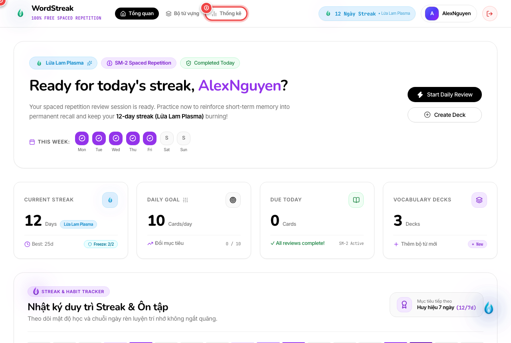
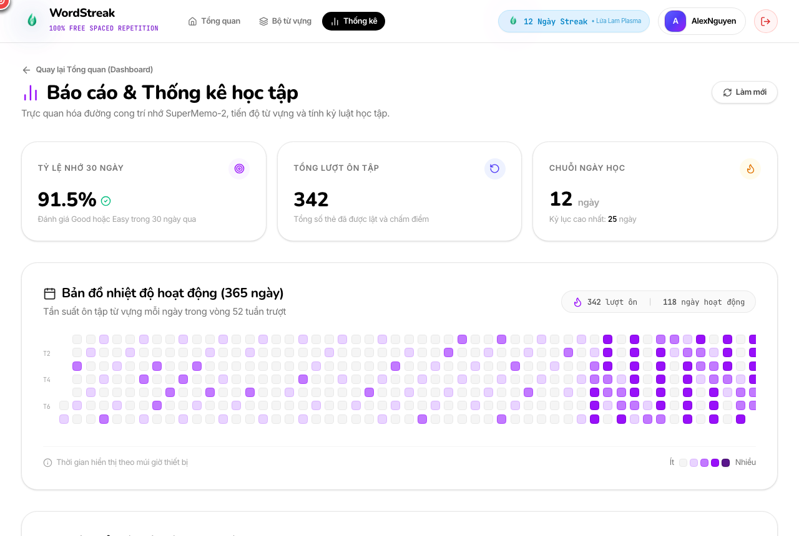

# 📊 Hướng Dẫn Sử Dụng Báo Cáo & Thống Kê Học Tập (Learning Analytics & Retention Dashboard)

> **Đối tượng người dùng:** Toàn bộ người học trên nền tảng WordStreak (100% Miễn phí trọn đời)  
> **Tính năng:** Bảng điều khiển phân tích trí nhớ, Bản đồ nhiệt hoạt động 365 ngày & Dự báo hoàn thành Bộ từ (US-STAT-01, US-STAT-02, US-STAT-03)  
> **Phiên bản:** 1.0.0  
> **Cập nhật lần cuối:** 2026-08-21

---

## 🎯 1. Giới thiệu Trung tâm Báo cáo & Thống kê

Trong quá trình học ngoại ngữ, cảm giác không biết mình đang tiến bộ đến đâu hay đã thực sự ghi nhớ được bao nhiêu từ vựng là nguyên nhân hàng đầu khiến nhiều người bỏ cuộc.

**Trung tâm Báo cáo & Thống kê (Learning Analytics Hub)** của WordStreak được xây dựng để giúp bạn:

1. **Trực quan hóa mức độ thành thạo từ vựng (Word Mastery Curve):** Biết chính xác bao nhiêu từ đã chuyển hóa từ "Từ mới" sang "Đang học" và đạt mốc "Thành thạo" trong trí nhớ dài hạn (Spaced Repetition SM-2).
2. **Bản đồ nhiệt độ hoạt động 365 ngày (Activity Heatmap):** Theo dõi tần suất và số lượng thẻ ôn tập mỗi ngày trong suốt 52 tuần gần nhất theo múi giờ địa phương của bạn.
3. **Dự báo ngày hoàn thành Bộ từ (Deck Completion Forecast):** Dựa trên tốc độ học tập thực tế của bạn trong 7 ngày qua để ước tính chính xác ngày bạn sẽ làm chủ 100% bộ từ vựng.
4. **Đo lường tỷ lệ ghi nhớ 30 ngày (Retention Rate):** Tỷ lệ phần trăm các lần đánh giá thẻ đạt mức "Nhớ tốt (Good)" và "Dễ (Easy)".

---

## 🚀 2. Hướng dẫn Từng Bước Thao Tác Trực Quan

### Bước 1: Xem widget tóm tắt trên trang Tổng quan (Dashboard)

Ngay khi đăng nhập vào hệ thống, bạn có thể nắm bắt nhanh tiến độ ghi nhớ tổng quát:

- `①` **Khung tóm tắt "Thống kê học tập & Trí nhớ":** Hiển thị thanh tiến độ 3 màu trực quan (Xanh lá: Thành thạo, Xanh tím: Đang học, Xám: Từ mới) kèm số lượng từ cụ thể và tỷ lệ nhớ 30 ngày.
- `②` **Liên kết điều hướng "Thống kê":** Nhấp vào nút **`Thống kê`** trên thanh menu trên cùng (hoặc nhấp vào dòng chữ _"Xem chi tiết ➔"_) để mở trung tâm báo cáo chuyên sâu.

---

### Bước 2: Khám phá Chỉ số cốt lõi & Bản đồ nhiệt hoạt động 365 ngày

Trang phân tích chi tiết cung cấp bức tranh toàn diện về thói quen và kỷ luật học tập:

- `①` **3 Thẻ chỉ số tổng quan (Hero KPIs):**
  - **Tỷ lệ nhớ 30 ngày:** Tỷ lệ % từ vựng bạn nhớ tốt khi ôn tập trong tháng qua (Mục tiêu vàng là $> 85\%$).
  - **Tổng lượt ôn tập:** Tổng số lần bạn đã lật thẻ và chấm điểm kể từ khi tạo tài khoản.
  - **Chuỗi ngày học:** Số ngày học liên tục hiện tại và kỷ lục chuỗi dài nhất bạn từng đạt được.
- `②` **Bản đồ nhiệt hoạt động 365 ngày (Activity Heatmap):**
  - Gồm 52 cột thể hiện 52 tuần trượt tính đến hôm nay theo múi giờ thiết bị của bạn.
  - 5 cấp độ màu: Từ màu xám (0 lượt ôn) đến màu tím đậm rực rỡ (trên 31 lượt ôn/ngày).
  - Di chuột vào từng ô vuông để xem chính xác số lượng từ đã ôn trong ngày đó.

---

### Bước 3: Phân tích chiều sâu Mức độ thành thạo từ vựng (SM-2 Memory Curve)

Biểu đồ phân bổ giúp bạn hiểu rõ chất lượng bộ nhớ của bản thân:

- `①` **Thanh phân bổ đa sắc:** Thể hiện tỷ lệ phần trăm phân bố giữa các nhóm từ.
- `②` **Nhóm "Thành thạo" (Mastered - Xanh lá):** Những từ có khoảng cách lặp lại $\ge 21$ ngày và đã vượt qua tối thiểu 4 lần ôn tập thành công. Từ vựng đã đi sâu vào trí nhớ dài hạn.
- `③` **Nhóm "Đang học" (Learning - Tím Indigo):** Những từ đang trong chu kỳ lặp lại ngắt quãng (Khoảng cách ôn tập từ 1 đến 20 ngày).
- `④` **Nhóm "Từ mới" (New - Xám Slate):** Những từ vừa thêm vào bộ từ nhưng chưa trải qua phiên ôn tập đầu tiên nào.

---

### Bước 4: Theo dõi Tiến độ & Dự báo ngày hoàn thành từng Bộ từ

Biết trước ngày đích đến giúp bạn lên kế hoạch ôn thi hoặc chinh phục mục tiêu dễ dàng:

- `①` **Thông tin Bộ từ & Thanh tiến độ:** Hiển thị tên bộ từ, màu sắc nhận diện và thanh % từ đã thành thạo.
- `②` **Vận tốc học & Số từ còn lại:** Hiển thị số lượng từ chưa Mastered và tốc độ học trung bình mỗi ngày (tính theo 7 ngày gần nhất).
- `③` **Huy hiệu Dự báo hoàn thành:**
  - **Đang học:** Dự đoán số ngày và ngày cụ thể bạn sẽ làm chủ 100% bộ từ (ví dụ: _Dự kiến: ~2 ngày (23/08/2026)_).
  - **Đã hoàn thành:** Tự động gắn nhãn huy hiệu vinh danh _"Đã hoàn thành 100% 🎉"_.

---

## 💡 Mẹo Tối Ưu Hóa Hiệu Quả Ghi Nhớ

- **Duy trì màu tím đều đặn:** Ôn tập 10-15 từ mỗi ngày mang lại hiệu quả bền vững hơn là dồn 100 từ vào một ngày cuối tuần.
- **Tận dụng tính năng Streak Freeze:** Nếu có việc bận đột xuất, khiên bảo vệ chuỗi sẽ tự động kích hoạt để giữ trọn vẹn chuỗi ngày học trên bản đồ nhiệt.
- **Theo dõi tỷ lệ nhớ 30 ngày:** Nếu tỷ lệ nhớ giảm xuống dưới 80%, hãy giảm bớt số lượng từ mới học mỗi ngày trong Cài đặt Mục tiêu để tập trung ôn kỹ các từ đang học.

---

## ❓ Câu Hỏi Thường Gặp (FAQ)

- **Q: Tại sao một từ tôi đã học nhiều lần nhưng vẫn nằm ở mục "Đang học"?**  
  **A:** Theo thuật toán SuperMemo-2, một từ chỉ được coi là "Thành thạo" khi khoảng cách nhắc lại đạt từ 21 ngày trở lên và bạn đã đánh giá đúng ít nhất 4 lần liên tiếp. Điều này đảm bảo từ vựng đã thực sự chuyển hóa thành trí nhớ dài hạn.

- **Q: Bản đồ nhiệt tính toán ngày theo múi giờ nào?**  
  **A:** Hệ thống tự động nhận diện múi giờ trên máy tính/điện thoại của bạn (ví dụ: `Asia/Ho_Chi_Minh`), đảm bảo mọi lượt ôn tập lúc 11:30 đêm vẫn được tính chuẩn xác vào ngày hôm đó.

- **Q: Tốc độ ôn tập hàng ngày (Daily Velocity) được tính như thế nào?**  
  **A:** Hệ thống lấy trung bình số thẻ bạn ôn tập trong các ngày hoạt động của 7 ngày qua. Nếu bạn là người mới học dưới 3 ngày, hệ thống sẽ tạm thời sử dụng Mục tiêu hàng ngày (Daily Goal) của bạn để ước tính.
