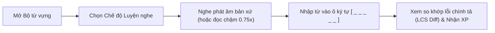
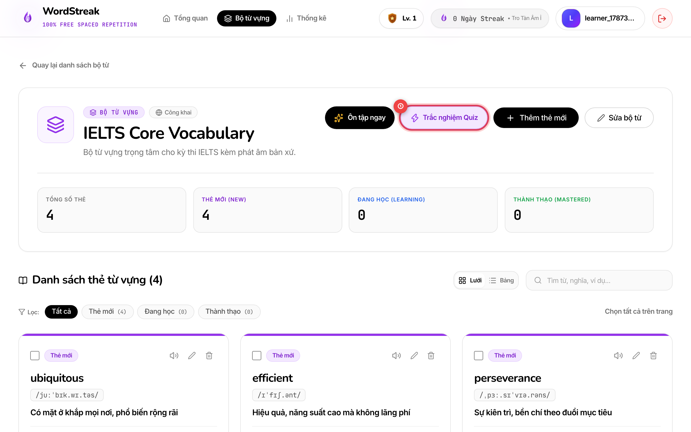
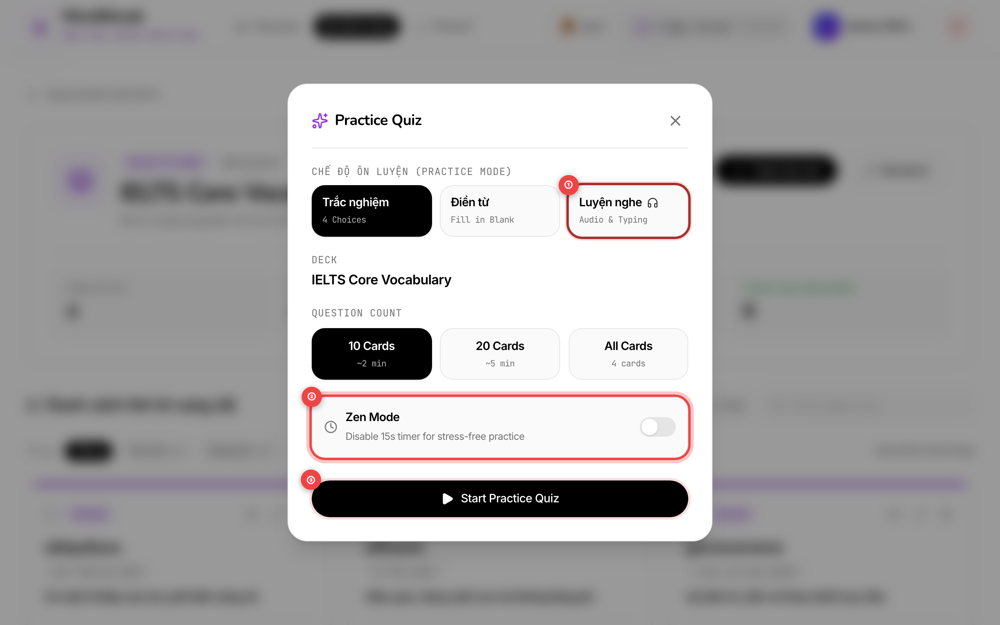
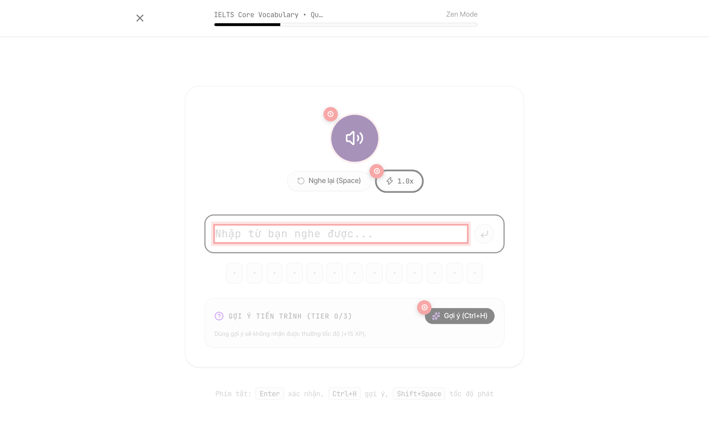
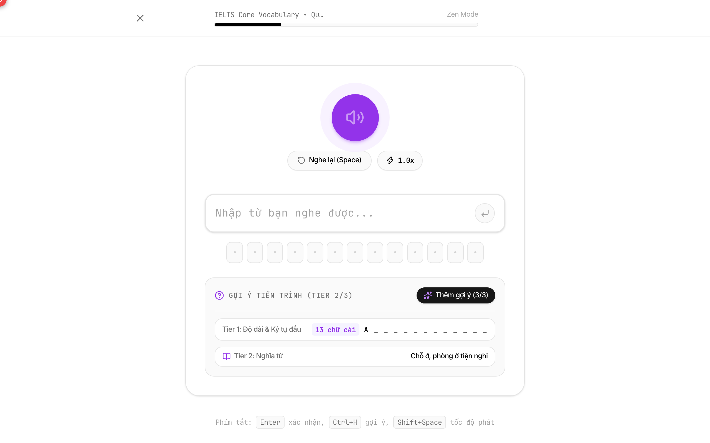
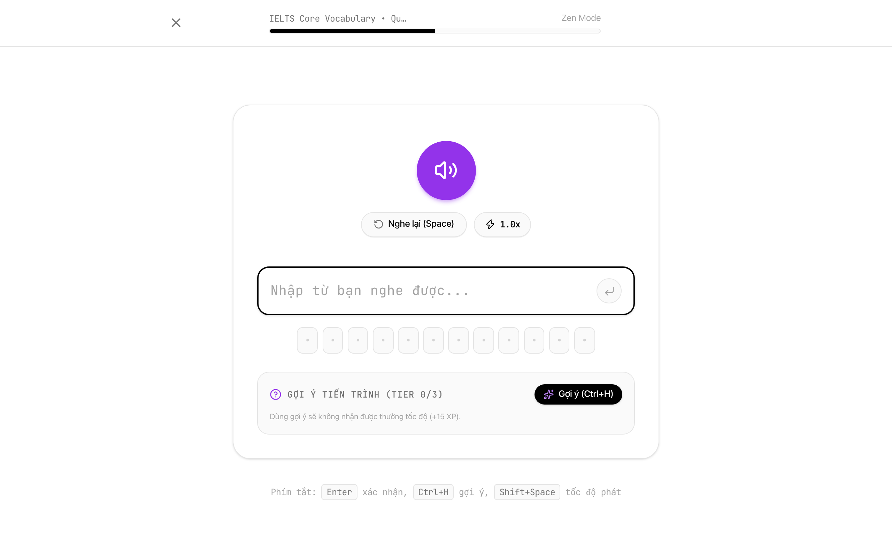
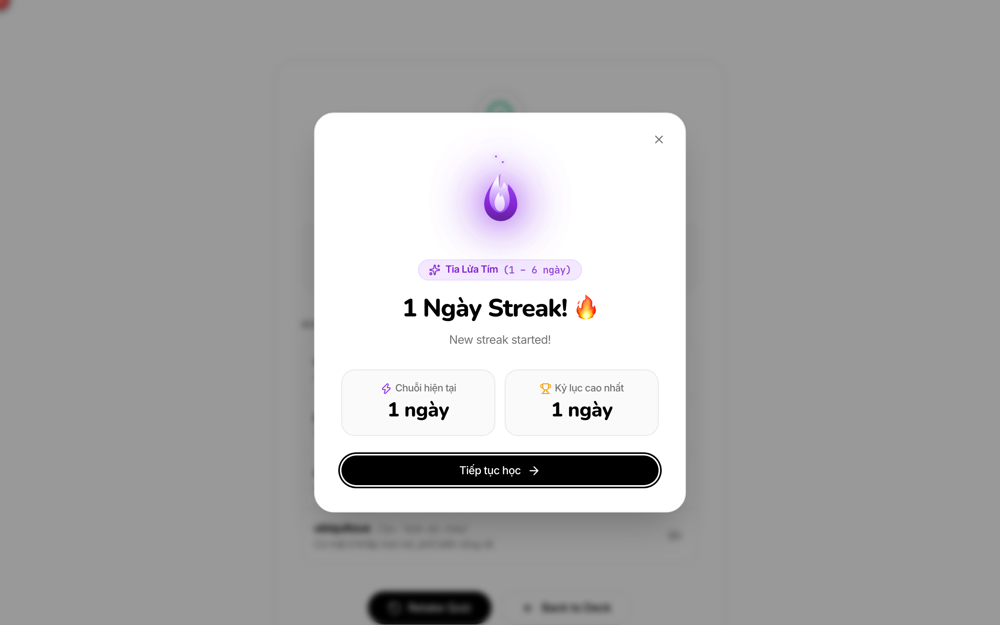

# 🎧 Hướng Dẫn Sử Dụng: Chế Độ Luyện Nghe & Gõ Từ (Listening & Typing Practice)

> Cập nhật lần cuối: 2026-08-21 • Tính năng: Listening & Typing Practice Quiz (US-QUIZ-03)

---

## 🎯 Tính năng này giúp gì cho bạn?

Khi học từ vựng tiếng Anh, việc chỉ nhìn mặt chữ (thụ động) thường dẫn đến tình trạng "biết từ nhưng không nghe ra" hoặc "nghe hiểu nhưng viết sai chính tả".

**Chế độ Luyện nghe gõ từ (Listening & Typing Drill)** của WordStreak kết hợp giữa **phản xạ âm thanh trực tiếp** và **trí nhớ cơ bắp khi gõ phím (Active Recall Typing)**, giúp bạn:

### Lợi ích nổi bật:

- 🔊 **Phát âm bản xứ chuẩn xác & Failover thông minh**: Nghe audio chất lượng cao từ CDN từ điển; tự động chuyển sang giọng đọc máy thông minh khi mạng yếu hoặc file âm thanh bị lỗi.
- ⚡ **Khắc phục triệt để lỗi chính tả (Character Diff Visualizer)**: Hiển thị trực quan từng ký tự bị thiếu, sai hoặc thừa bằng màu sắc rõ nét ngay khi nộp bài.
- 🐢 **Chế độ Luyện nghe chậm (0.75x Slow Mode)**: Giúp bạn nghe rõ từng âm tiết khó, âm đuôi (ending sounds) và trọng âm từ.
- 💡 **Thang gợi ý 3 cấp độ (Progressive Hints)**: Hỗ trợ linh hoạt từ chữ cái đầu, dịch nghĩa tiếng Việt đến phiên âm quốc tế IPA khi gặp từ vựng học thuật khó.
- 🏆 **Điểm thưởng Tốc độ & Streak ngọn lửa**: Nhận +10 XP cơ bản, +15 XP thưởng phản xạ nhanh (dưới 8 giây) và nhân đôi điểm số cùng chuỗi combo liên tiếp!

---

## 📖 Hướng dẫn từng bước với Hình ảnh Thực tế

### Bước 1: Mở Bộ từ vựng & Bấm nút "Trắc nghiệm Quiz"

1. Truy cập vào trang chi tiết bộ từ vựng bạn muốn luyện tập (`/decks/:id`).
2. **① Nút "Trắc nghiệm Quiz"** (khoanh đỏ ①): Bấm vào nút màu tím có biểu tượng tia sét trên thanh công cụ đầu trang (cạnh nút _Ôn tập ngay_).

---

### Bước 2: Chọn Chế độ "Luyện nghe" (Audio & Typing)

Trong cửa sổ cấu hình **Practice Quiz**:

- **① Tab "Luyện nghe"** (khoanh đỏ ①): Chọn tab có biểu tượng tai nghe 🎧 để chuyển sang chế độ Luyện nghe gõ từ.
- **② Chọn số lượng câu** (khoanh đỏ ②): Chọn gói luyện tập phù hợp (**10 Cards**, **20 Cards** hoặc **All Cards**).
- **③ Bắt đầu luyện tập** (khoanh đỏ ③): Bấm nút **"Start Practice Quiz"** để vào bài làm ngay. Bạn cũng có thể gạt công tắc **Zen Mode** nếu muốn học thư giãn không giới hạn thời gian 20 giây.

---

### Bước 3: Nghe phát âm & Nhập từ vào ô ký tự động

Màn hình làm bài hiển thị:

- **① Nút Loa phát âm** (khoanh đỏ ①): Âm thanh sẽ tự động phát khi vào câu. Bạn có thể nhấn phím **`Space`** hoặc nhấp vào biểu tượng Loa để nghe lại.
- **② Ô nhập ký tự động** (khoanh đỏ ②): Ô nhập tự động canh số lượng dấu gạch dưới tương ứng với độ dài từ (`_ _ _ _ _`). Gõ từ vựng qua bàn phím và nhấn **`Enter`** để nộp bài.
- **③ Nút chỉnh tốc độ phát** (khoanh đỏ ③): Nhấp nút hoặc nhấn **`Shift + Space`** để chuyển đổi giữa tốc độ chuẩn `1.0x` và tốc độ đọc chậm `0.75x Slow`.
- **④ Nút Gợi ý (Hint)** (khoanh đỏ ④): Nhấn nút **Gợi ý** (hoặc nhấn **`Ctrl + H`** / **`Cmd + H`**) khi bạn cần trợ giúp.

---

### Bước 4: Sử dụng Thang gợi ý phân tầng 3 cấp độ (Progressive Hints)

Khi gặp từ vựng khó nhớ, bấm nút **Gợi ý** hoặc nhấn **`Ctrl + H`** để mở từng nấc thông tin:

- **① Khung Gợi ý phân tầng** (khoanh đỏ ①):
  - **Tier 1 (Cấp 1):** Mở chữ cái đầu tiên và số lượng ký tự (ví dụ: `a _ _ _ _ _ _ _ _ _ _ _ _`).
  - **Tier 2 (Cấp 2):** Hiển thị nghĩa tiếng Việt chuẩn ngữ cảnh của từ (ví dụ: _Chỗ ở, phòng ở tiện nghi_).
  - **Tier 3 (Cấp 3):** Mở phiên âm quốc tế chuẩn IPA (ví dụ: `/əˌkɒm.əˈdeɪ.ʃən/`).

> 💡 **Mẹo Gamification:** Khi sử dụng gợi ý (Tier 1 trở lên) hoặc nghe lại quá 2 lần, bạn vẫn nhận đủ +10 XP cơ bản cho câu đúng nhưng sẽ nhường lại điểm thưởng tốc độ (+15 XP) cho các câu tự nhớ hoàn toàn!

---

### Bước 5: Xem so khớp lỗi chính tả trực quan (Character Diff)

Nếu bạn gõ chưa chính xác (ví dụ gõ `"acomodation"` thay vì `"accommodation"`):

- **① Bảng so khớp ký tự (Character Diff)** (khoanh đỏ ①):
  - Hệ thống sẽ rung nhẹ viền đỏ và hiển thị chính xác các chữ cái bị thiếu hoặc sai (ví dụ thiếu chữ `c` và `m`).
  - Giúp bạn nhớ ngay các phụ âm kép và quy tắc chính tả đặc thù của từ vựng tiếng Anh.

---

### Bước 6: Màn hình Tổng kết & Điểm thưởng XP

Sau khi hoàn thành tất cả các câu hỏi:

- **① Tỷ lệ chính xác (Accuracy)** (khoanh đỏ ①): Hiển thị phần trăm số câu bạn đã nghe và gõ đúng chính xác.
- **② Điểm kinh nghiệm (XP)** (khoanh đỏ ②): Tổng kết điểm XP kiếm được trong buổi học, bao gồm điểm cơ bản và điểm thưởng tốc độ.
- **③ Nút hành động tiếp theo** (khoanh đỏ ③): Nhấp **"Luyện lại"** để ôn lại ngay danh sách từ chưa đúng hoặc bấm **"Quay lại bộ từ"** để tiếp tục học tập.

---

## ⌨️ Bảng Phím Tắt Tiện Lợi (Keyboard Shortcuts)

| Phím tắt                       | Thao tác                 | Mô tả                                                                           |
| :----------------------------- | :----------------------- | :------------------------------------------------------------------------------ |
| **`Enter`**                    | Gửi đáp án / Chuyển tiếp | Nộp từ vừa gõ hoặc chuyển nhanh sang câu tiếp sau khi xem kết quả               |
| **`Space`**                    | Nghe lại phát âm         | Phát lại audio đọc từ vựng                                                      |
| **`Shift + Space`**            | Chuyển tốc độ đọc        | Bật/Tắt chế độ đọc chậm `0.75x Slow` / `1.0x Normal`                            |
| **`Ctrl + H`** / **`Cmd + H`** | Mở gợi ý theo tầng       | Kích hoạt từng cấp độ gợi ý (Chữ cái đầu $\rightarrow$ Nghĩa $\rightarrow$ IPA) |
| **`Esc`**                      | Đóng modal               | Đóng modal cấu hình và quay lại danh sách từ                                    |

---

## 💡 Những Câu Hỏi Thường Gặp (FAQ)

### 1. Nếu từ vựng trong bộ từ chưa có link audio MP3 thì có luyện nghe được không?

**Có!** WordStreak tích hợp cơ chế tự động chuyển tiếp (Failover) sang bộ đọc chuẩn quốc tế của trình duyệt (`Web Speech API`). Bạn vẫn sẽ nghe được giọng đọc chuẩn xác hoàn toàn miễn phí.

### 2. Chế độ Luyện nghe có làm thay đổi ngày ôn tập ngắt quãng (SM-2 Spaced Repetition) không?

**Không.** Các bài tập Quiz (Trắc nghiệm, Điền từ, Luyện nghe) hoạt động như những buổi luyện tập kỹ năng phản xạ độc lập. Chu kỳ ôn tập SM-2 chỉ được cập nhật khi bạn tham gia phiên ôn thẻ flashcard chính thức (`/review`).

### 3. Làm sao để đạt tối đa điểm XP trong một buổi Luyện nghe?

- Trả lời đúng trong vòng **8 giây đầu tiên**.
- Không sử dụng nút Gợi ý (`0 hints used`).
- Không nghe lại quá 2 lần.
- Duy trì chuỗi câu đúng liên tiếp (Combo Streak) để nhân đôi điểm thưởng!
