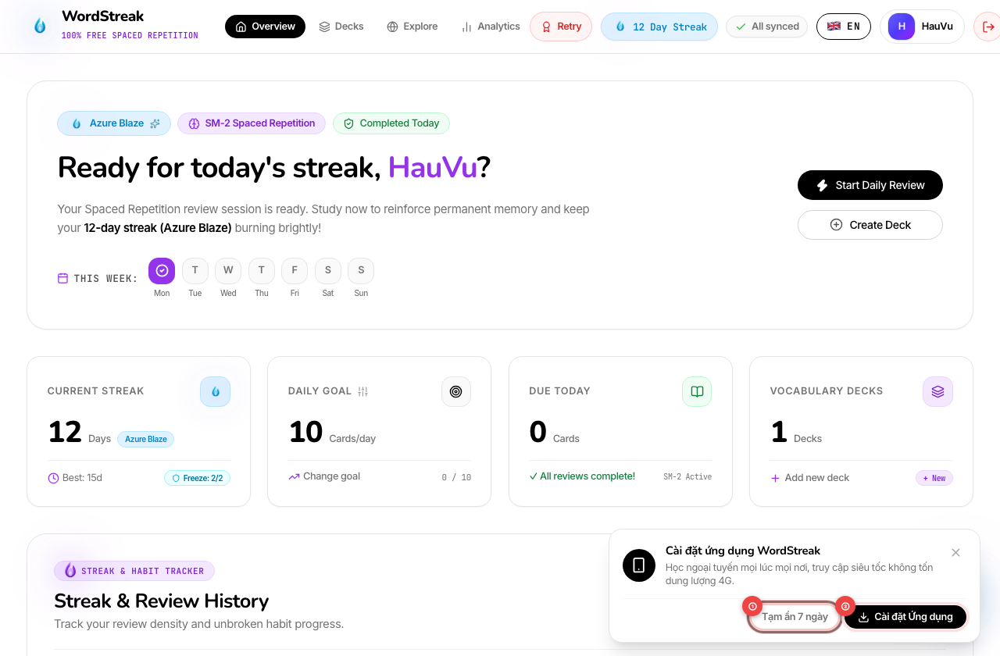
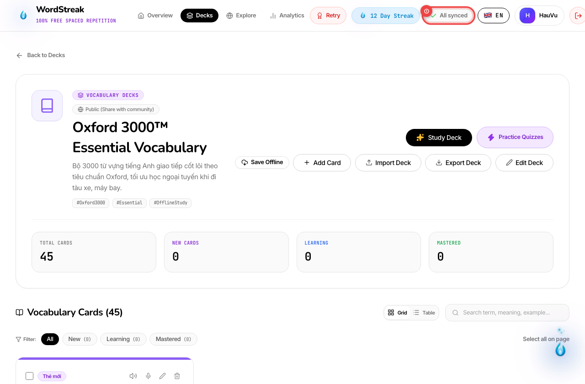
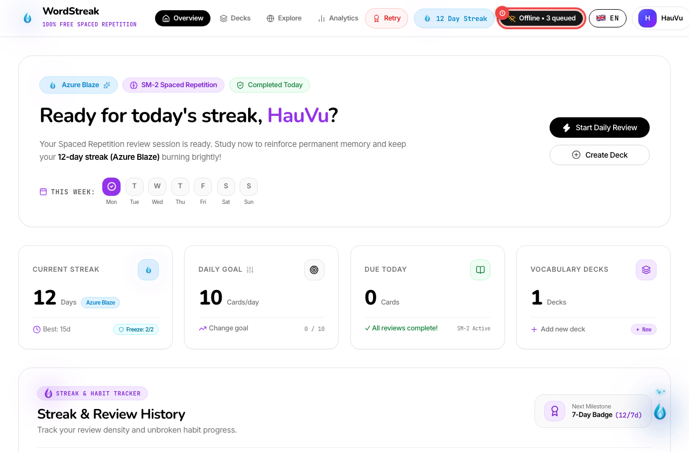
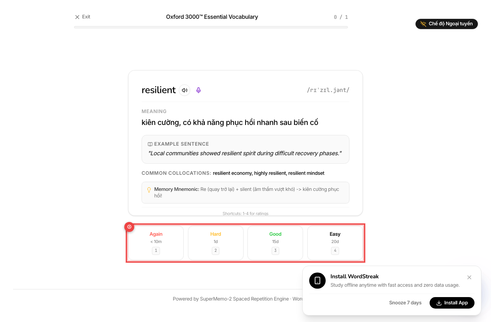
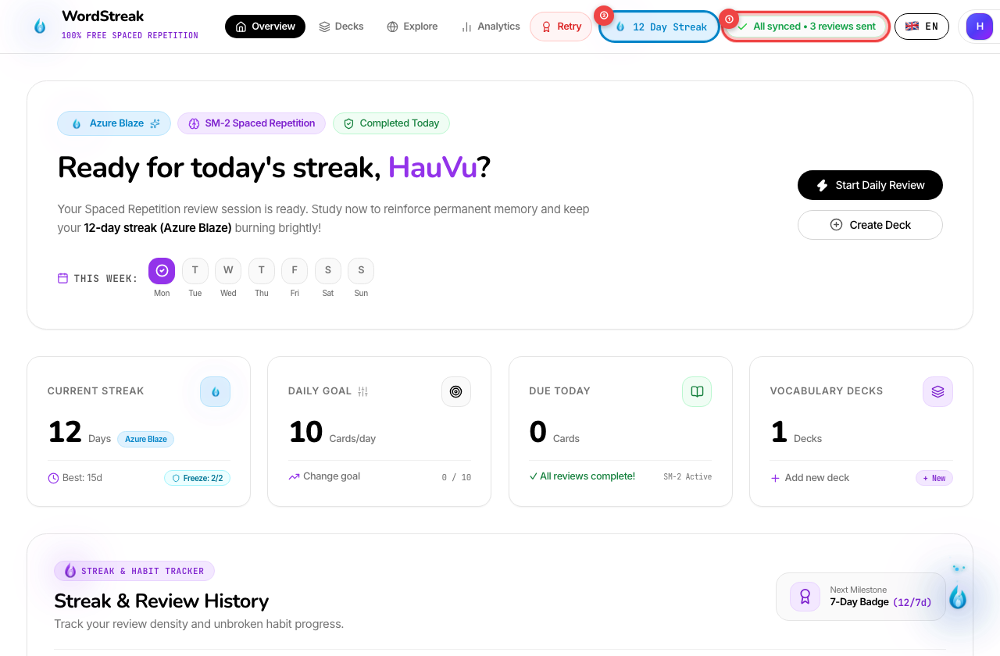
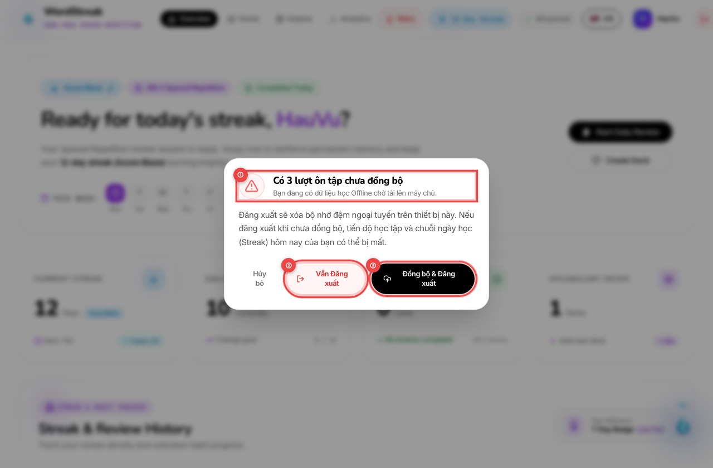

# 📖 Hướng dẫn Sử dụng: Ứng dụng Web Cấp tiến (PWA) & Chế độ Học Ngoại tuyến (Offline Study Mode)

> **Đối tượng độc giả:** Người học WordStreak  
> **Mã tính năng:** US-ECO-04 (`pwa-offline-mode`)  
> **Nền tảng hỗ trợ:** Máy tính (Desktop Chrome, Edge, Brave), Điện thoại di động & Máy tính bảng (iOS Safari, Android Chrome)  
> **Phiên bản:** 1.0.0  
> **Cập nhật lần cuối:** 2026-08-24

---

## 🎯 Giới thiệu Tính năng PWA & Học Từ Vựng Không Cần Mạng

Bạn đang ngồi trên máy bay, trên chuyến tàu xe buýt hầm ngầm không có sóng 4G/Wi-Fi, hoặc chỉ đơn giản muốn tiết kiệm dung lượng mạng? **Chế độ Học Ngoại Tuyến (Offline Mode)** và **Ứng dụng Web Cấp tiến (Progressive Web App - PWA)** của WordStreak mang đến trải nghiệm học tập không gián đoạn:

- 📱 **Cài đặt 1-Chạm lên Màn hình chính:** Mở WordStreak như một ứng dụng Native độc lập, toàn màn hình, tải tức thì không giật lag.
- 💾 **Tải trước Bộ từ (Offline Precache):** Lưu trọn vẹn thẻ từ vựng và câu ví dụ vào thiết bị để học mọi lúc mọi nơi.
- 🔊 **Giọng đọc phát âm Offline (Web Speech TTS):** Tự động phát âm chuẩn xác ngay cả khi không có kết nối Internet.
- 🔄 **Tự động Đồng bộ & Bảo vệ Chuỗi ngày (Streak Protection):** Mọi lượt lật thẻ, chấm điểm Spaced Repetition (SM-2) được ghi nhận chính xác theo thời gian thực và tự động tải lên máy chủ ngay khi có mạng trở lại.
- 🛡️ **Cảnh báo Thông minh khi Đăng xuất (Logout Guard):** Bảo vệ an toàn tuyệt đối, ngăn ngừa mất dữ liệu ôn tập chưa kịp đồng bộ.

---

## 🚀 Hướng dẫn Sử dụng Chi tiết từng Bước

### Bước 1: Cài đặt WordStreak lên Màn hình chính (PWA Installation)

Khi bạn truy cập WordStreak trên trình duyệt máy tính hoặc điện thoại, thanh thông báo mời cài đặt ứng dụng sẽ xuất hiện nổi ở góc dưới màn hình:

1. **Tạm ẩn thông báo ①:** Nếu bạn chưa muốn cài đặt ngay, bấm **"Tạm ẩn 7 ngày"** để ẩn thanh thông báo trong vòng 1 tuần.
2. **Cài đặt Ứng dụng ②:** Bấm nút **"Cài đặt Ứng dụng"** (hoặc _Install App_) để hệ thống tự động thêm biểu tượng WordStreak vào màn hình Desktop hoặc App Launcher.
3. **Hướng dẫn Cài đặt Thủ công trên Thiết bị Di động:**
   - **Trên iOS (iPhone/iPad - Safari):** Bấm nút **Chia sẻ** (biểu tượng hình vuông có mũi tên trỏ lên ở đáy trình duyệt) $\rightarrow$ Cuộn xuống và chọn **"Thêm vào MH chính" (Add to Home Screen)** $\rightarrow$ Bấm **Thêm (Add)**.
   - **Trên Android (Google Chrome):** Bấm biểu tượng **3 chấm dọc ⋮** ở góc trên bên phải $\rightarrow$ Chọn **"Cài đặt ứng dụng" (Install app)** hoặc **"Thêm vào Màn hình chính"**.
   - **Trên Máy tính (Chrome / Edge / Brave):** Bấm biểu tượng máy tính/mũi tên tải xuống trên thanh địa chỉ URL $\rightarrow$ Chọn **Cài đặt**.

---

### Bước 2: Tải trước Bộ từ vựng để Học Ngoại tuyến (Save Deck Offline)

Trước khi chuẩn bị đi xa hoặc vào khu vực không có sóng Internet, bạn chỉ cần tải trước bộ từ yêu thích của mình:

1. Mở trang **Chi tiết Bộ từ vựng** (ví dụ: _Oxford 3000™ Essential Vocabulary_).
2. Tại khu vực thanh công cụ thao tác nhanh, bấm vào nút **"Lưu ngoại tuyến" (Save Offline) ①**.
3. Hệ thống sẽ tự động tải toàn bộ câu hỏi, giải nghĩa, phiên âm và dữ liệu phát âm của bộ từ lưu vào bộ nhớ an toàn trên thiết bị của bạn.
4. Sau khi hoàn tất, nút sẽ chuyển sang trạng thái **"Offline Ready" (Đã sẵn sàng ngoại tuyến)** kèm biểu tượng dấu tích xanh `✔`.
5. Khi bạn không còn nhu cầu học offline bộ từ này, chỉ cần di chuột qua nút và bấm **"Remove offline" (Xóa ngoại tuyến)** để giải phóng dung lượng bộ nhớ.

---

### Bước 3: Nhận biết Trạng thái Ngoại tuyến trên Thanh điều hướng (Navbar)

Dù bạn đang ở Bảng điều khiển (Dashboard) hay trang Ôn tập, hệ thống luôn tự động phát hiện mạng và hiển thị trạng thái kết nối trực quan:

1. **Huy hiệu Chế độ Ngoại tuyến ①:** Khi thiết bị mất kết nối Wi-Fi/4G, huy hiệu màu đen tinh tế với biểu tượng cột sóng gạch chéo màu vàng sẽ xuất hiện:
   - **`Offline`:** Đang ở chế độ ngoại tuyến, sẵn sàng học các bộ từ đã tải.
   - **`Offline • 3 queued`:** Cho biết bạn đã hoàn thành 3 lượt ôn tập thẻ nhớ offline và hệ thống đã lưu trữ cục bộ an toàn, sẵn sàng gửi lên máy chủ khi có mạng.

---

### Bước 4: Trải nghiệm Học Thẻ Ghi Nhớ Flashcard & Giọng Đọc Dự Phòng (Web Speech TTS)

Bắt đầu phiên ôn tập Spaced Repetition (SM-2) ngay cả khi không có một vạch sóng mạng nào:

1. **Nội dung Thẻ Từ Vựng ①:** Hiển thị từ vựng tiếng Anh, phiên âm quốc tế IPA và câu ví dụ mẫu như bình thường.
2. **Nút Phát Âm Giọng Đọc Dự Phòng (TTS) ②:**
   - Khi không có mạng, nếu file âm thanh gốc chưa được tải về, WordStreak tự động kích hoạt **Bộ máy Đọc Giọng nói Tự nhiên (Web Speech Synthesis)** của thiết bị.
   - Biểu tượng nhãn `[TTS Offline]` sẽ xuất hiện bên cạnh để bạn nhận biết giọng đọc đang được phát âm từ động cơ ngoại tuyến của trình duyệt.
   - Nhấn phím `R` hoặc bấm vào icon Loa để nghe phát âm chuẩn Anh - Mỹ bất kỳ lúc nào.
3. **Thanh Chấm Điểm Ghi Nhớ (SRS Rating) ③:**
   - Nhấn phím cách `Space` để lật xem nghĩa tiếng Việt và mẹo ghi nhớ.
   - Bấm các phím số `1`, `2`, `3`, `4` tương ứng với các mức độ: _Quên (Again)_, _Khó (Hard)_, _Nhớ tốt (Good)_, hoặc _Dễ (Easy)_.
   - Mọi kết quả đánh giá sẽ được ghi vào hàng đợi ngoại tuyến lập tức mà không gặp bất kỳ độ trễ nào.

---

### Bước 5: Tự động Đồng bộ khi Có Mạng Trở lại & Giữ Vững Chuỗi Ngày Học (Streak)

Ngay khi điện thoại hoặc máy tính của bạn bắt được Wi-Fi hoặc bật lại 4G:

1. **Huy hiệu Tự động Đồng bộ ①:**
   - Hệ thống tự động nhận diện kết nối Internet trong tích tắc mà bạn không cần tải lại trang.
   - Huy hiệu chuyển sang `Syncing...` (Đang đồng bộ) $\rightarrow$ `All synced • 3 reviews sent` (Đã đồng bộ thành công tất cả lượt học) kèm dấu tích xanh `✔`.
   - Nếu muốn ép đồng bộ thủ công ngay lập tức, bạn có thể click trực tiếp vào nút `Sync (3)`.
2. **Bảo vệ Chuỗi Ngày Học (Daily Streak) ②:**
   - WordStreak lưu trữ mốc thời gian thực (`timestamp`) của từng lượt học offline.
   - Dù bạn học lúc 22:00 khi đang ngồi trên máy bay và sáng hôm sau mới kết nối Wi-Fi, hệ thống vẫn ghi nhận chính xác chuỗi ngày học cho ngày hôm trước, **đảm bảo ngọn lửa Streak của bạn không bao giờ bị tắt oan uổng!**

---

### Bước 6: Cảnh báo Bảo mật khi Đăng Xuất trên Thiết bị Dùng Chung (Logout Warning)

Nếu bạn sử dụng máy tính công cộng (ở trường học, thư viện, quán net) và bấm Đăng xuất khi còn dữ liệu học offline chưa kịp gửi lên máy chủ:

1. **Hộp thoại Cảnh báo Dữ liệu Chưa Đồng bộ ①:** Hiển thị rõ số lượng lượt ôn tập đang nằm trong bộ nhớ máy chưa được tải lên (ví dụ: _"Có 3 lượt ôn tập chưa đồng bộ"_).
2. **Vẫn Đăng xuất ②:** Bấm nút này nếu bạn chấp nhận xóa sạch bộ nhớ đệm trên thiết bị công cộng này (lưu ý: tiến độ của 3 lượt học vừa rồi sẽ không được gửi lên tài khoản).
3. **Đồng bộ & Đăng xuất ③:** Bấm nút này (khi máy đã có mạng) để ứng dụng gửi hết dữ liệu học lên máy chủ an toàn trước khi kết thúc phiên đăng xuất.

---

## 💡 Mẹo Học Ngoại Tuyến Hiệu Quả Nhất

1. **Thói quen "Tải trước khi lên đường":** Trước mỗi chuyến du lịch, bay xa hoặc về quê, hãy mở danh sách Bộ từ của bạn và bấm **"Lưu ngoại tuyến"** cho 2–3 bộ từ trọng tâm.
2. **Khởi chạy từ Màn hình chính:** Sau khi cài đặt PWA, hãy mở WordStreak từ icon trên màn hình chính thay vì gõ URL trong trình duyệt để có không gian học toàn màn hình (không bị che bởi thanh địa chỉ URL).
3. **Phím tắt ôn tập siêu tốc:** Sử dụng trọn bộ phím tắt khi học offline:
   - `Space`: Lật thẻ ghi nhớ.
   - `R`: Nghe lại phát âm từ vựng.
   - `1` / `2` / `3` / `4`: Đánh giá mức độ nhớ từ vựng.
4. **Kiểm tra huy hiệu All Synced:** Trước khi tắt máy hoặc chuyển sang thiết bị khác, hãy liếc nhìn góc trên cùng bên phải để chắc chắn huy hiệu đang hiển thị màu xanh `All synced`.

---

## ❓ Câu hỏi Thường Gặp (FAQ)

- **Q: Ứng dụng PWA có chiếm nhiều dung lượng trên điện thoại của tôi không?**  
  **A:** Hoàn toàn không! WordStreak PWA chỉ chiếm khoảng **15 – 30 MB** bộ nhớ, nhẹ hơn từ 10 đến 20 lần so với các ứng dụng Native thông thường trên App Store / Google Play Store.

- **Q: Tôi học offline cả tuần rồi mới kết nối Wi-Fi thì có bị mất Chuỗi ngày (Streak) không?**  
  **A:** Không hề! WordStreak lưu trữ mốc thời gian chính xác của từng ngày bạn học trên máy. Khi có mạng, hệ thống sẽ gửi toàn bộ lịch sử lên và khôi phục chuỗi ngày học liên tục cho bạn đúng theo những ngày bạn đã chăm chỉ học tập.

- **Q: Giọng đọc TTS Offline có cần kết nối mạng không?**  
  **A:** Không cần mạng. Tính năng TTS (Text-to-Speech) sử dụng trực tiếp bộ engine giọng đọc tích hợp sẵn trong hệ điều hành máy tính/điện thoại của bạn (Apple iOS Siri Voice, Google Android Speech, Microsoft Windows Natural Voices) nên hoạt động 100% độc lập không cần Internet.

- **Q: Tôi có cần trả phí để sử dụng tính năng học Offline không?**  
  **A:** WordStreak là nền tảng học từ vựng **100% Miễn phí mãi mãi**. Mọi tính năng PWA, tải bộ từ offline và đồng bộ dữ liệu đều hoàn toàn miễn phí cho tất cả người học.
