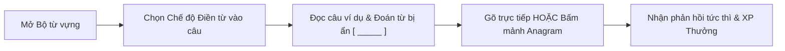
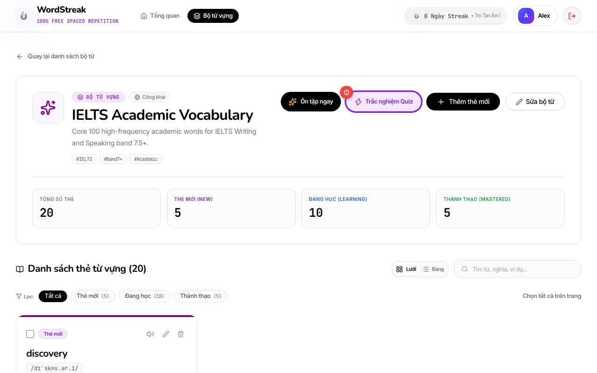
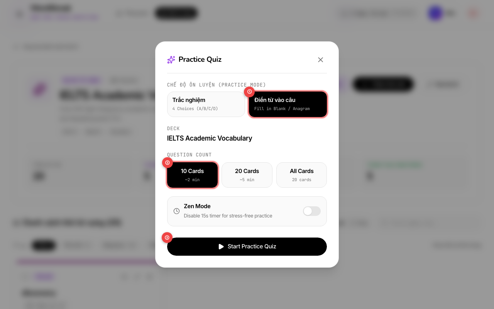
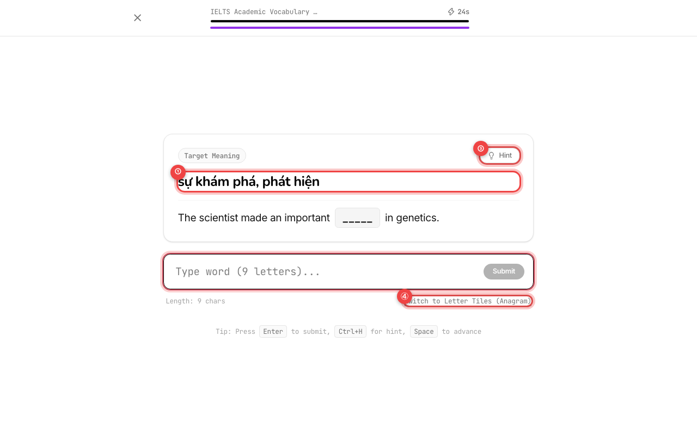
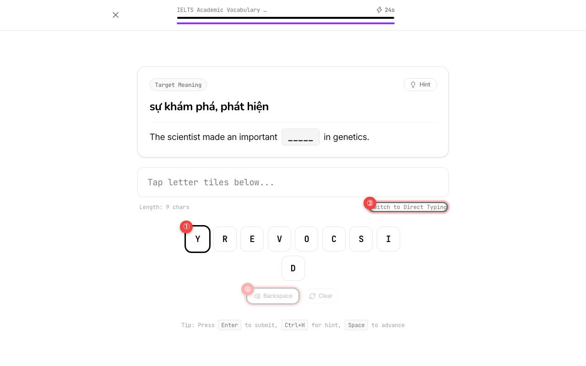
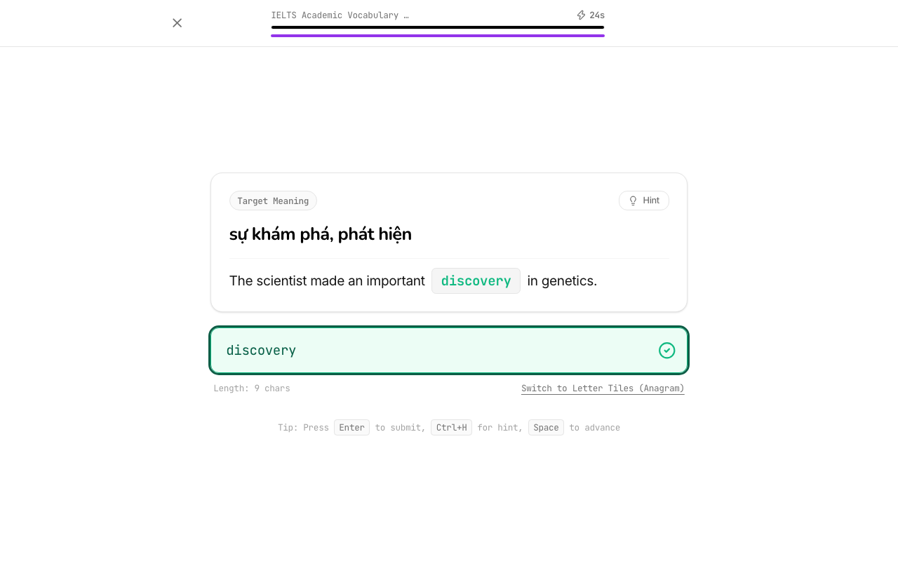
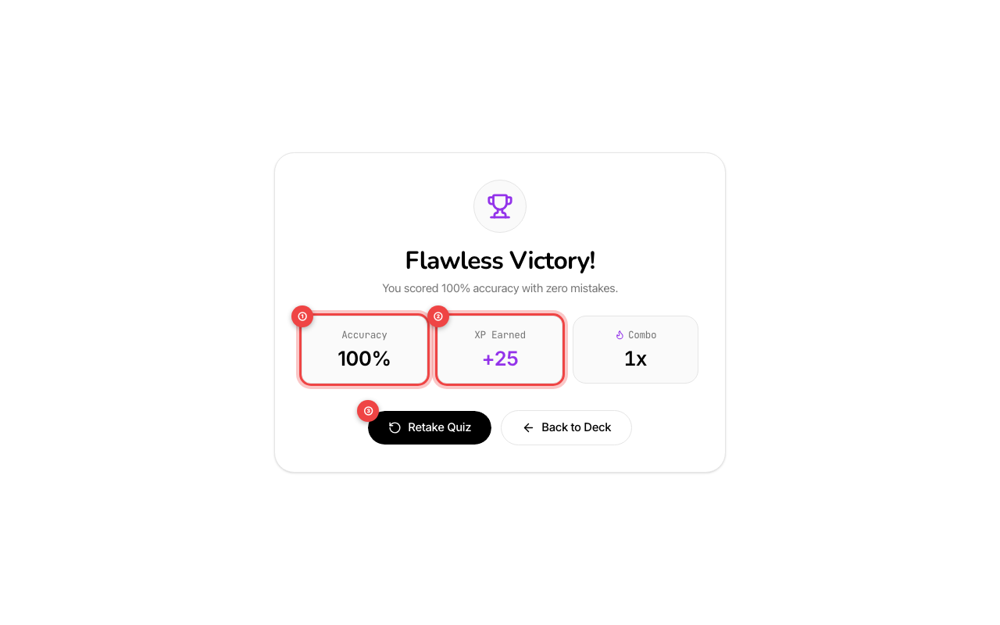

# Hướng dẫn Sử dụng: Luyện Điền từ vào câu ví dụ (Fill-in-the-blank Quiz)

> Cập nhật lần cuối: 2026-08-20 • Tính năng: Fill-in-the-blank Quiz Mode (US-QUIZ-02)

---

## 🎯 Tính năng này giúp gì cho bạn?

Bên cạnh chế độ Trắc nghiệm 4 đáp án và Flashcard lật thẻ SM-2, tính năng **Luyện Điền từ vào câu (Fill-in-the-blank Quiz)** giúp bạn nâng cao khả năng nhớ từ chủ động (Active Recall), rèn luyện kỹ năng viết chính tả chuẩn xác và ghi nhớ ngữ cảnh ngữ pháp thực tế trong câu tiếng Anh.

### Lợi ích nổi bật:

- ✍️ **Luyện nhớ chính tả & ngữ cảnh**: Thử thách bạn tự sản sinh ra từ vựng (production recall) thay vì chỉ nhận diện thụ động.
- 🧩 **2 Chế độ nhập liệu linh hoạt**:
  - **Gõ bàn phím trực tiếp**: Tự động focus, kiểm tra tức thì khi nhấn `Enter`.
  - **Mảnh ghép chữ cái xáo trộn (Anagram Mode)**: Bấm/chạm các mảnh chữ cái dễ dàng trên điện thoại mà không cần mở bàn phím ảo.
- 💡 **Gợi ý thông minh (Progressive Hint)**: Bấm nút Gợi ý (hoặc nhấn `Ctrl+H`) để mở chữ cái đầu tiên và phiên âm IPA khi gặp từ khó.
- 🛡️ **Hỗ trợ biến thể ngữ pháp**: Hệ thống chấp nhận cả dạng từ gốc và dạng biến thể thì/danh từ số nhiều trong câu ví dụ (ví dụ: _acquire_ hoặc _acquired_).
- 🏆 **Tích lũy XP & Combo ngọn lửa**: Nhận +10 XP cho mỗi câu đúng, +15 XP thưởng tốc độ khi trả lời nhanh dưới 8 giây và nhân hệ số Combo!

---

## 📖 Hướng dẫn từng bước với Hình ảnh Thực tế

### Bước 1: Mở Bộ từ vựng & Bấm nút "Trắc nghiệm Quiz"

1. Truy cập vào trang chi tiết bộ từ vựng bạn muốn luyện tập (`/decks/:id`).
2. **① Nút "Trắc nghiệm Quiz"** (khoanh đỏ ①): Bấm vào nút màu tím có biểu tượng tia sét trên thanh công cụ đầu trang (cạnh nút _Ôn tập ngay_).

---

### Bước 2: Chọn Chế độ "Điền từ vào câu"

Trong cửa sổ cấu hình **Practice Quiz**:

- **① Tab "Điền từ vào câu"** (khoanh đỏ ①): Chọn tab này để chuyển sang chế độ điền từ / ghép chữ cái xáo trộn.
- **② Chọn số lượng câu** (khoanh đỏ ②): Chọn gói luyện tập phù hợp (**10 Cards**, **20 Cards** hoặc **All Cards**).
- **③ Bắt đầu luyện tập** (khoanh đỏ ③): Bấm nút **"Start Practice Quiz"** để vào bài làm ngay. Bạn cũng có thể gạt công tắc **Zen Mode** nếu muốn học thư giãn không giới hạn thời gian 25 giây.

---

### Bước 3: Đọc câu ví dụ & Nhập từ cần điền (Chế độ Gõ trực tiếp)

Màn hình làm bài hiển thị:

- **① Nghĩa tiếng Việt & Câu ngữ cảnh** (khoanh đỏ ①): Đọc nghĩa tiếng Việt của từ mục tiêu và quan sát vị trí từ bị che trong câu ví dụ (`The scientist made an important [ _____ ] in genetics`).
- **② Nút Gợi ý (Hint)** (khoanh đỏ ③): Nếu chưa nhớ ra từ, bấm nút **Hint** (hoặc nhấn `Ctrl+H` / `Cmd+H`) để hệ thống gợi ý chữ cái đầu tiên và phiên âm IPA.
- **③ Ô nhập từ vựng** (khoanh đỏ ②): Gõ từ vựng qua bàn phím máy tính rồi nhấn phím `Enter` hoặc nút `Submit`.
- **④ Chuyển sang Mảnh ghép chữ cái** (khoanh đỏ ④): Bấm dòng chữ _"Switch to Letter Tiles (Anagram)"_ nếu bạn muốn chọn chữ cái xáo trộn thay vì gõ tay.

---

### Bước 4: Chế độ Mảnh ghép Chữ cái Xáo trộn (Anagram Mode)

- **① Các mảnh chữ cái ngẫu nhiên** (khoanh đỏ ①): Chạm hoặc bấm vào từng chữ cái theo đúng thứ tự chính tả của từ vựng.
- **② Nút Xóa & Làm lại** (khoanh đỏ ②):
  - Bấm **Backspace** (khoanh đỏ ②) để xóa chữ cái vừa chọn gần nhất.
  - Bấm **Clear** để xóa toàn bộ và chọn lại từ đầu.
- **③ Quay lại chế độ gõ** (khoanh đỏ ③): Bấm _"Switch to Direct Typing"_ bất kỳ lúc nào để chuyển lại bàn phím thông thường.

---

### Bước 5: Nhận Phản hồi Tức thì & Xem Đáp án Đúng

- **Khi trả lời đúng** (khoanh đỏ ①):
  - Ô nhập sáng **viền xanh lá** kèm biểu tượng tích xanh `✓`.
  - Vị trí che trong câu lập tức được điền từ đúng với màu xanh nổi bật.
  - Chuỗi Combo ngọn lửa tăng lên.
  - Sau 1.2 giây hệ thống sẽ tự động chuyển sang câu tiếp theo (hoặc nhấn `Space` / `Enter` để chuyển ngay lập tức).
- **Khi trả lời sai hoặc Hết giờ**:
  - Ô nhập rung và viền chuyển màu đỏ.
  - Đáp án chính xác sẽ hiển thị rõ ràng ngay bên dưới để bạn học và sửa lỗi kịp thời.

---

### Bước 6: Màn hình Tổng kết & Điểm thưởng XP

Sau khi hoàn thành câu hỏi cuối cùng:

- **① Tỷ lệ chính xác (Accuracy)** (khoanh đỏ ①): Hiển thị phần trăm câu bạn đã điền đúng.
- **② Điểm kinh nghiệm (XP Earned)** (khoanh đỏ ②): Tổng số điểm XP bạn kiếm được (bao gồm điểm cơ bản + thưởng tốc độ).
- **③ Làm lại / Quay về** (khoanh đỏ ③):
  - Bấm **"Retake Quiz"** để làm lại bài luyện tập mới.
  - Bấm **"Back to Deck"** để quay về trang quản lý bộ từ.

---

## ⚡ Cơ chế Tính Điểm & Phần thưởng XP

WordStreak áp dụng công thức tính điểm Gamification khuyến khích cả **độ chính xác** lẫn **tốc độ phản xạ**:

$$\text{XP Nhận Được} = \text{Làm tròn}\Big( (\text{Điểm cơ bản} + \text{Thưởng tốc độ}) \times \text{Hệ số Combo} \Big)$$

| Thành phần                      | Điều kiện đạt được                            | Giá trị XP       |
| :------------------------------ | :-------------------------------------------- | :--------------- |
| **Điểm cơ bản (Base XP)**       | Điền đúng từ vựng                             | **+10 XP** / câu |
| **Thưởng tốc độ (Speed Bonus)** | Hoàn thành đúng trong vòng **$\le$ 8.0 giây** | **+15 XP** / câu |
| **Combo Multiplier: Cấp 1**     | Chuỗi đúng liên tiếp từ **3 đến 4 câu**       | **x1.2** tổng XP |
| **Combo Multiplier: Cấp 2**     | Chuỗi đúng liên tiếp từ **5 câu trở lên**     | **x1.5** tổng XP |

---

## ⌨️ Bảng Tra cứu Phím tắt Nhanh

| Phím tắt                      | Thao tác tương ứng                                           |
| :---------------------------- | :----------------------------------------------------------- |
| **`Enter`**                   | Gửi câu trả lời / Bỏ qua thời gian chờ để sang câu tiếp theo |
| **`Space`**                   | Bỏ qua thời gian chờ 1.2s khi có kết quả để sang câu kế tiếp |
| **`Ctrl+H`** hoặc **`Cmd+H`** | Bật gợi ý chữ cái đầu & phiên âm IPA                         |
| **`Esc`** hoặc Nút **`✕`**    | Thoát khỏi bài luyện tập và trở về trang Deck                |

---

## 💡 Mẹo & Chiến lược Học hiệu quả (Pro Tips)

1. **Tận dụng chế độ Anagram khi học trên thiết bị di động**:
   - Khi học trên điện thoại hoặc máy tính bảng, hãy dùng chế độ **Letter Tiles (Anagram)** để chạm nhanh các mảnh chữ cái mà không bị bàn phím ảo che khuất câu ví dụ.
2. **Dùng Hint có chọn lọc**:
   - Chỉ dùng gợi ý khi thật sự không nhớ ra từ để rèn luyện tối đa vùng nhớ sâu trong não bộ.
3. **Đọc to cả câu sau khi điền đúng**:
   - Khi câu ví dụ hiện ra từ hoàn chỉnh, hãy đọc to cả câu tiếng Anh để ghi nhớ ngữ điệu và cấu trúc ngữ pháp.

---

## ❓ Câu hỏi thường gặp (FAQ)

### Q1: Nếu bộ từ có những thẻ chưa có câu ví dụ thì có luyện được không?

**Đáp:** **Được!** Đối với các thẻ chưa có câu ví dụ, hệ thống sẽ tự động tạo câu hỏi gợi ý dạng `"Complete the word: [Nghĩa tiếng Việt]"` kèm số lượng ký tự để bạn vẫn luyện được 100% các từ trong bộ từ.

### Q2: Chế độ Điền từ có ảnh hưởng đến lịch ôn tập Spaced Repetition (SM-2) không?

**Đáp:** **Không.** Đây là chế độ Luyện tập tự do (Practice Mode) độc lập. Bạn có thể luyện nhiều lần tùy thích mà không làm thay đổi chu kỳ nhớ của thẻ flashcard.

### Q3: Hệ thống có phân biệt chữ hoa và chữ thường khi nhập không?

**Đáp:** **Không.** Bạn có thể gõ chữ hoa hoặc chữ thường tùy ý (ví dụ: `discovery`, `Discovery` hay `DISCOVERY` đều được chấp nhận).
