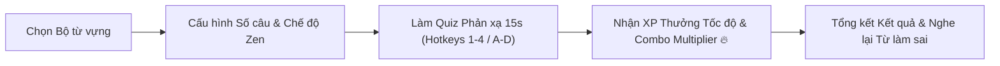

# Hướng dẫn Sử dụng: Luyện Trắc nghiệm Từ vựng Nhanh (Multiple Choice Quiz)

> Cập nhật lần cuối: 2026-08-20 • Tính năng: Multiple Choice Quiz Mode (US-QUIZ-01)

---

## 🎯 Tính năng này giúp gì cho bạn?

Bên cạnh phương pháp lật thẻ truyền thống (Spaced Repetition SM-2), tính năng **Luyện Trắc nghiệm Nhanh (Multiple Choice Quiz)** mang đến trải nghiệm học tập phản xạ cao độ, giúp bạn kiểm tra và củng cố vốn từ vựng một cách hào hứng, trực quan và không bị nhàm chán.

### Lợi ích nổi bật:

- ⚡ **Rèn phản xạ nhận diện 2 chiều**: 50% câu hỏi tiếng Anh $\rightarrow$ tiếng Việt và 50% câu hỏi tiếng Việt $\rightarrow$ tiếng Anh kèm ngữ cảnh câu thực tế.
- ⏱️ **Đồng hồ đếm ngược 15s**: Tạo cảm giác thử thách kích thích tư duy nhanh nhạy (hoặc bật **Zen Mode** để luyện tập thư giãn không giới hạn thời gian).
- ⌨️ **Tối ưu bàn phím 100%**: Sử dụng phím `1` - `4` hoặc `A` - `D` để chọn đáp án tức thì, phím `Space` để chuyển nhanh câu tiếp theo mà không cần chạm chuột.
- 🏆 **Hệ thống Gamification cuốn hút**: Kiếm điểm kinh nghiệm (XP), nhận Speed Bonus khi trả lời dưới 5 giây và nhân hệ số Combo Multiplier lên tới `1.5x` khi duy trì chuỗi đúng liên tiếp!
- 🎧 **Ôn lại từ vựng chưa nhớ ngay tại chỗ**: Màn hình tổng kết liệt kê chi tiết các từ bạn trả lời sai kèm nút phát âm bản xứ để nghe và sửa lỗi ngay lập tức.

---

## 📖 Hướng dẫn từng bước

### Bước 1: Mở Bộ từ vựng & Bấm nút "Trắc nghiệm Quiz"

1. Truy cập vào bộ từ vựng bạn muốn luyện tập trên thanh điều hướng hoặc từ trang **Decks**.
2. Trên thanh công cụ đầu trang (cạnh nút _Ôn tập ngay_), bấm vào nút **"Trắc nghiệm Quiz"** (có biểu tượng lấp lánh tím ✨).

> [!NOTE]
> **Điều kiện số lượng thẻ**: Để tạo được bài trắc nghiệm 4 đáp án hợp lý, tài khoản của bạn cần có tối thiểu **4 thẻ từ vựng**. Nếu bộ từ hiện tại có ít hơn 4 thẻ, hệ thống sẽ tự động lấy thêm đáp án gây nhiễu từ các bộ từ khác của bạn.

---

### Bước 2: Tùy chỉnh Cấu hình Phiên làm bài (Quiz Setup)

Khi bấm vào nút trắc nghiệm, cửa sổ cấu hình **Practice Quiz** sẽ xuất hiện cho phép bạn điều chỉnh theo nhu cầu học tập:

| Tùy chọn               | Mô tả                                    | Phù hợp với ai?                                                        |
| :--------------------- | :--------------------------------------- | :--------------------------------------------------------------------- |
| **10 Cards** (~2 phút) | 10 câu hỏi ngẫu nhiên rút từ bộ từ.      | Người bận rộn, cần ôn nhanh trong giờ giải lao.                        |
| **20 Cards** (~5 phút) | 20 câu hỏi thử thách phản xạ chuyên sâu. | Phiên học tiêu chuẩn hàng ngày.                                        |
| **All Cards**          | Toàn bộ từ vựng có trong bộ từ hiện tại. | Ôn tập tổng lực trước các kỳ thi hoặc kiểm tra cuối tuần.              |
| **Zen Mode** (Bật/Tắt) | Tắt hoàn toàn đồng hồ đếm ngược 15 giây. | Người mới bắt đầu học từ khó, muốn suy nghĩ kỹ không áp lực thời gian. |

> [!TIP]
> **Khi nào nên bật Zen Mode?**  
> Khi bạn vừa thêm một danh sách từ vựng chuyên ngành hoặc từ mới hoàn toàn, hãy gạt bật **Zen Mode** để thong thả phân tích câu ví dụ và phiên âm. Khi đã quen mặt chữ, hãy tắt Zen Mode để rèn luyện phản xạ tốc độ cao!

Sau khi cấu hình xong, bấm nút **"Start Practice Quiz"** để bắt đầu.

---

### Bước 3: Trải nghiệm Giao diện Quiz & Thao tác Bàn phím

Màn hình làm bài được thiết kế tối giản, trực quan giúp bạn tập trung cao nhất:

1. **Thanh tiến độ & Đồng hồ (Header)**:
   - Hiển thị thứ tự câu hỏi (ví dụ: _Question 3 of 10_).
   - Thanh đếm ngược 15 giây (sẽ chuyển màu đỏ và nhấp nháy khi còn dưới 5 giây để cảnh báo).
   - **Huy hiệu Chuỗi Combo (Flame Badge)**: Xuất hiện ngọn lửa tím `2x`, `3x`, `5x`... khi bạn trả lời đúng liên tiếp nhiều câu.
2. **Thẻ câu hỏi trung tâm (Question Card)**:
   - **Dạng Anh $\rightarrow$ Việt**: Hiển thị từ tiếng Anh in đậm, phiên âm IPA quốc tế và biểu tượng Loa 🔊 để nghe phát âm chuẩn bản xứ.
   - **Dạng Việt $\rightarrow$ Anh**: Hiển thị nghĩa tiếng Việt cùng **câu ví dụ ngữ cảnh có ẩn từ** dạng điền vào chỗ trống (`"She signed the ______ yesterday."`).
3. **4 Lựa chọn trả lời (Option Buttons)**:
   - Mỗi lựa chọn được gắn nhãn phím tắt tương ứng (`1` / `A`, `2` / `B`, `3` / `C`, `4` / `D`).

---

### Bước 4: Nhận Phản hồi Tức thì & Chuyển câu Siêu tốc

- **Khi chọn đúng (Correct)**:
  - Nút bạn chọn lập tức sáng **màu xanh lá** kèm biểu tượng dấu tích `✓`.
  - Chuỗi Combo tăng lên +1.
  - Sau 1 giây, hệ thống sẽ tự động chuyển sang câu tiếp theo.
- **Khi chọn sai (Incorrect) hoặc Hết giờ (Timeout)**:
  - Nút bạn chọn chuyển sang **màu đỏ** có dấu `✗`.
  - Đáp án chính xác sẽ sáng **màu xanh lá** để bạn nhận biết ngay lỗi sai.
  - Chuỗi Combo bị đặt lại về 0.

> [!TIP]
> **Bí kíp Tăng tốc (Pro Fast-Forward)**:  
> Bạn không cần đợi hết 1.0 giây chuyển cảnh! Ngay khi vừa bấm chọn đáp án, nhấn phím **`Space` (Phím cách)** để bỏ qua thời gian chờ và chuyển ngay lập tức sang câu tiếp theo.

---

### Bước 5: Màn hình Kết quả & Ôn lại Từ làm sai (Results Screen)

Sau khi hoàn thành câu hỏi cuối cùng, hệ thống sẽ chuyển đến màn hình vinh danh:

- **Danh hiệu thành tích**:
  - 🏆 **Flawless Victory!** (Chính xác tuyệt đối 100% không mắc lỗi).
  - 🌟 **Great Practice Session!** (Độ chính xác $\ge 70\%$).
  - 👍 **Practice Complete!** (Hoàn thành phiên làm bài).
- **3 Chỉ số quan trọng**:
  - **Accuracy**: Tỉ lệ phần trăm câu trả lời đúng.
  - **XP Earned**: Tổng điểm kinh nghiệm kiếm được từ phiên này.
  - **Combo**: Chuỗi trả lời đúng liên tiếp dài nhất bạn đạt được.
- **Mục "Words to Review" (Từ vựng cần xem lại)**:
  - Tự động gom tất cả các từ bạn đã trả lời sai hoặc bị hết giờ.
  - Hiển thị đầy đủ: Từ vựng tiếng Anh, phiên âm, giải nghĩa tiếng Việt và **nút Loa 🔊 để bấm nghe lại phát âm**.
- **Các nút hành động**:
  - **Retake Quiz**: Làm lại bài trắc nghiệm với bộ từ này ngay lập tức.
  - **Back to Deck**: Quay trở lại trang quản lý bộ từ.

---

## ⚡ Cơ chế Tính Điểm & Phần thưởng XP

WordStreak áp dụng công thức tính điểm Gamification thông minh nhằm khuyến khích cả **độ chính xác** lẫn **tốc độ phản xạ**:

$$\text{XP Nhận Được} = \text{Làm tròn}\Big( (\text{Điểm cơ bản} + \text{Thưởng tốc độ}) \times \text{Hệ số Combo} \Big)$$

### Bảng chi tiết thành phần điểm:

| Thành phần                      | Điều kiện đạt được                         | Giá trị XP              |
| :------------------------------ | :----------------------------------------- | :---------------------- |
| **Điểm cơ bản (Base XP)**       | Trả lời đúng câu hỏi                       | **+10 XP** / câu        |
| **Thưởng tốc độ (Speed Bonus)** | Trả lời đúng trong vòng **$\le$ 5.0 giây** | **+5 XP** / câu         |
| **Combo Multiplier: Cấp 1**     | Chuỗi đúng liên tiếp từ **3 đến 4 câu**    | **x1.2** tổng XP câu đó |
| **Combo Multiplier: Cấp 2**     | Chuỗi đúng liên tiếp từ **5 câu trở lên**  | **x1.5** tổng XP câu đó |

### Ví dụ minh họa tính điểm thực tế:

|  Câu số   | Thời gian trả lời | Đúng/Sai | Chuỗi Combo | Cách tính XP                                     | XP Nhận được |
| :-------: | :---------------: | :------: | :---------: | :----------------------------------------------- | :----------: |
| **Câu 1** |       3.2s        |   Đúng   |      1      | $(10 \text{ base} + 5 \text{ speed}) \times 1.0$ |  **+15 XP**  |
| **Câu 2** |       6.5s        |   Đúng   |      2      | $(10 \text{ base} + 0) \times 1.0$               |  **+10 XP**  |
| **Câu 3** |       2.1s        |   Đúng   |      3      | $(10 \text{ base} + 5 \text{ speed}) \times 1.2$ |  **+18 XP**  |
| **Câu 4** |       1.8s        |   Đúng   |      4      | $(10 \text{ base} + 5 \text{ speed}) \times 1.2$ |  **+18 XP**  |
| **Câu 5** |       4.0s        |   Đúng   |      5      | $(10 \text{ base} + 5 \text{ speed}) \times 1.5$ |  **+23 XP**  |
| **Câu 6** |       8.0s        |   Sai    |  0 (Reset)  | Sai không có điểm                                |   **0 XP**   |

> [!IMPORTANT]
> **Cơ chế Chống Gian lận (Anti-Spam)**:  
> Để đảm bảo tính công bằng của bảng xếp hạng, nếu hệ thống phát hiện phiên làm bài từ 5 câu trở lên có tổng thời gian hoàn thành dưới 3.0 giây (dấu hiệu dùng tool click tự động), điểm XP của phiên đó sẽ bị đặt về `0 XP`.

---

## ⌨️ Bảng Tra cứu Phím tắt Nhanh (Keyboard Shortcuts)

Tập thói quen dùng phím tắt sẽ giúp bạn hoàn thành bài trắc nghiệm với tốc độ nhanh gấp 3 lần:

| Phím tắt                   | Thao tác tương ứng                                   | Ghi chú                              |
| :------------------------- | :--------------------------------------------------- | :----------------------------------- |
| **`1`** hoặc **`A`**       | Chọn Đáp án A (Lựa chọn thứ 1)                       | Không phân biệt chữ hoa / chữ thường |
| **`2`** hoặc **`B`**       | Chọn Đáp án B (Lựa chọn thứ 2)                       | Không phân biệt chữ hoa / chữ thường |
| **`3`** hoặc **`C`**       | Chọn Đáp án C (Lựa chọn thứ 3)                       | Không phân biệt chữ hoa / chữ thường |
| **`4`** hoặc **`D`**       | Chọn Đáp án D (Lựa chọn thứ 4)                       | Không phân biệt chữ hoa / chữ thường |
| **`Space` (Phím cách)**    | Bỏ qua hiệu ứng chờ $\rightarrow$ Sang câu tiếp theo | Hoạt động ngay khi vừa chọn đáp án   |
| **`Esc`** hoặc **Nút `✕`** | Thoát khỏi bài trắc nghiệm                           | Trở về trang chi tiết bộ từ          |

---

## 💡 Mẹo & Chiến lược Học hiệu quả (Pro Tips)

1. **Kết hợp linh hoạt giữa SRS Review và Quiz Mode**:
   - Dùng **SRS Review (Flashcard)** vào đầu ngày để học từ mới và ghi nhớ sâu theo thuật toán lặp lại ngắt quãng.
   - Dùng **Quiz Mode (Trắc nghiệm)** vào cuối ngày hoặc trước khi đi ngủ để kiểm tra phản xạ nhanh và kiếm thêm XP đua top bảng xếp hạng.
2. **Quan sát câu ví dụ trong câu hỏi Việt $\rightarrow$ Anh**:
   - Khi gặp câu hỏi Việt $\rightarrow$ Anh, đừng chỉ nhìn nghĩa tiếng Việt. Hãy đọc nhanh câu ví dụ đi kèm để hiểu ngữ cảnh sử dụng thực tế của từ đó trong câu.
3. **Luôn bật loa hoặc đeo tai nghe**:
   - Nghe phát âm chuẩn của từ ở mỗi câu hỏi tiếng Anh sẽ giúp kết nối hình ảnh chữ viết với âm thanh trong não bộ, hỗ trợ cực tốt cho kỹ năng Nghe (Listening) TOEIC/IELTS.
4. **Tận dụng danh sách "Words to Review" sau bài thi**:
   - Đừng vội thoát ra ngay sau khi làm xong! Hãy dành 30 giây bấm nghe lại từng từ trong danh sách từ làm sai ở cuối trang kết quả để khắc phục triệt để lỗ hổng từ vựng.

---

## ❓ Câu hỏi thường gặp (FAQ)

### Q1: Điểm số trong bài Trắc nghiệm có làm thay đổi lịch ôn tập SM-2 của thẻ không?

**Đáp:** **Không.** Multiple Choice Quiz là chế độ **Luyện tập tự do (Practice Mode)** độc lập. Bạn có thể làm lại nhiều lần tùy thích để rèn phản xạ mà không làm ảnh hưởng đến chu kỳ lặp lại ngắt quãng (Interval/Ease Factor) của thuật toán SuperMemo-2.

### Q2: Tại sao câu hỏi lại xuất hiện cả từ của bộ từ khác?

**Đáp:** Khi bộ từ vựng hiện tại của bạn có ít hơn 4 thẻ, hệ thống sẽ tự động lấy thêm các từ khác trong tài khoản của bạn làm "đáp án nhiễu" (distractors) để đảm bảo luôn có đủ 4 phương án lựa chọn phong phú cho mỗi câu hỏi.

### Q3: Nếu đang làm dở mà tôi bấm nút Thoát (Exit) thì sao?

**Đáp:** Bạn có thể bấm nút `✕` góc trên bên trái bất cứ lúc nào để quay về trang Deck. Phiên làm bài chưa hoàn tất sẽ không ghi nhận điểm XP lên hệ thống.

### Q4: Điểm XP kiếm được từ Quiz có cộng vào chuỗi Streak ngọn lửa hàng ngày không?

**Đáp:** Có! Điểm XP bạn tích lũy từ các bài Quiz được cộng trực tiếp vào tổng điểm tài khoản của bạn và đóng góp vào tiến độ học tập trong ngày.
