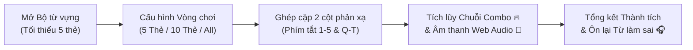
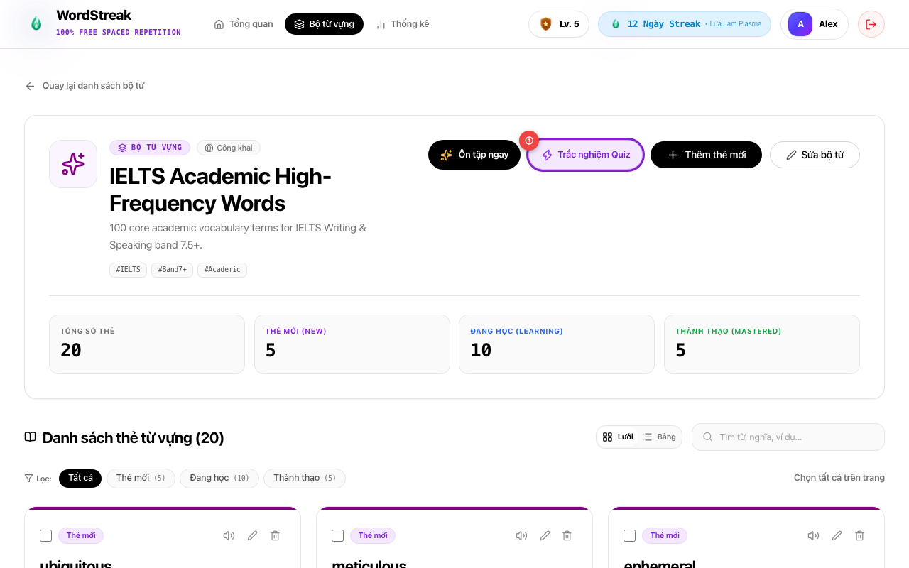
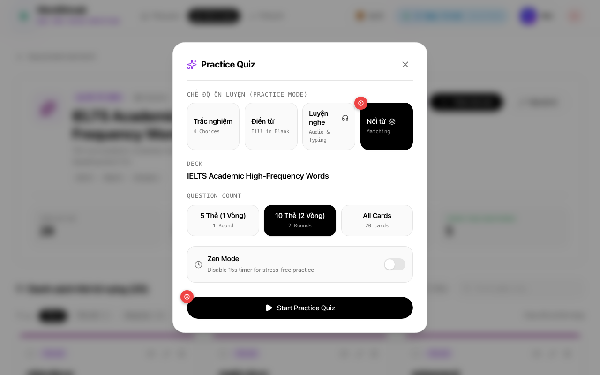
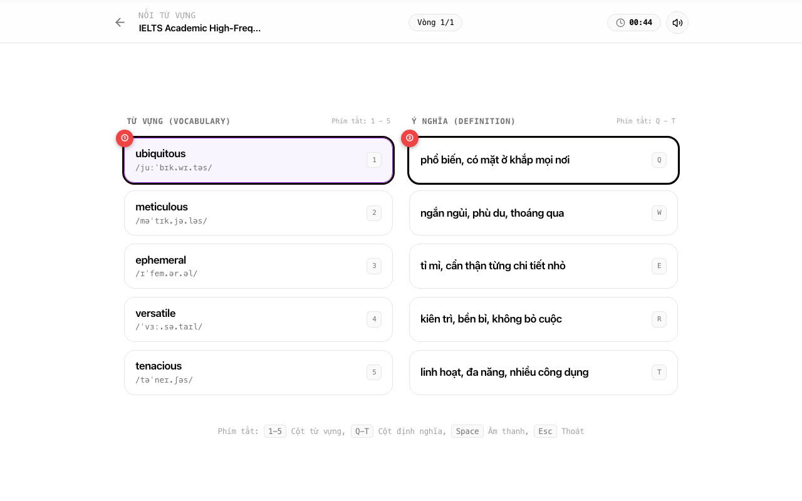
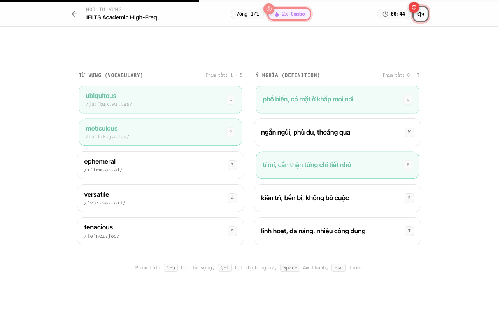
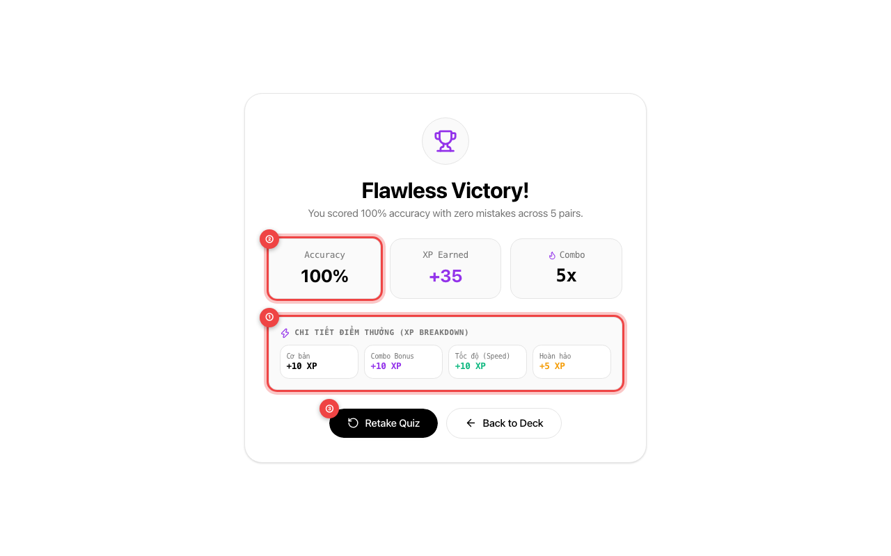

# 🧩 Hướng Dẫn Sử Dụng: Chế Độ Nối Từ Vựng (Word Matching Game)

> Cập nhật lần cuối: 2026-08-21 • Tính năng: Word Matching Practice Mode (US-QUIZ-04)

---

## 🎯 Tính năng này giúp gì cho bạn?

Bên cạnh phương pháp lật thẻ truyền thống (**Spaced Repetition Flashcards**) và trắc nghiệm 4 lựa chọn, chế độ **Nối Từ Vựng (Word Matching Game)** mang đến trải nghiệm học tập dạng mini-game tương tác cao, giúp bạn rèn luyện khả năng phản xạ từ vựng hai chiều siêu tốc.

Thay vì chỉ nhìn một từ đơn lẻ, bạn sẽ thử thách não bộ liên kết nhanh giữa **Từ vựng tiếng Anh (kèm phiên âm chuẩn & âm thanh phát âm)** ở cột bên trái và **Nghĩa tiếng Việt tương ứng** ở cột bên phải.

### 🌟 Lợi ích nổi bật:

- ⚡ **Rèn phản xạ liên kết 2 chiều**: Tăng tốc độ nhận diện từ ngữ và ngữ nghĩa tức thì mà không cần dịch thầm trong đầu.
- 🎮 **Cấu trúc vòng 5 cặp từ (5-Card Round Chunking)**: Mỗi vòng gồm đúng 5 cặp từ được tráo ngẫu nhiên độc lập bằng thuật toán Fisher-Yates, tạo cảm giác chinh phục từng chặng ngắn gọn, cuốn hút và không gây quá tải não bộ.
- ⌨️ **Trải nghiệm gõ phím 100% không chạm chuột**: Sử dụng phím `1`–`5` cho cột Từ vựng bên trái và `Q`–`T` (hoặc `6`–`0`) cho cột Ý nghĩa bên phải. Thao tác 2 tay siêu tốc như một game thủ chuyên nghiệp!
- 🔥 **Cơ chế nhân điểm Combo & Thưởng hoàn hảo**: Tăng hệ số nhân điểm lên đến **`2.0x`** khi duy trì chuỗi ghép đúng liên tiếp, cộng thêm **Speed Bonus (+10 XP)** và **Perfect Round Bonus (+5 XP)**.
- 🔊 **Âm thanh tổng hợp sống động (Web Audio Synthesizer)**: Hệ thống âm thanh độc quyền tạo sóng âm trực tiếp trong trình duyệt (Success Chime thanh thoát, Mismatch Buzz cảnh báo nhẹ, Combo Ding cao độ), hoàn toàn không phụ thuộc tốc độ mạng.
- 🎧 **Màn hình tổng kết & Ôn tập từ sai tức thì**: Liệt kê chi tiết những từ bạn đã ghép nhầm kèm số lần lỗi và nút Loa 🔊 để nghe lại phát âm chuẩn bản xứ.
- 🛡️ **Tự do luyện tập không lo ảnh hưởng lịch học**: Chế độ Nối từ hoạt động hoàn toàn độc lập với chu kỳ thuật toán SuperMemo-2 (SM-2), giúp bạn thoải mái luyện phản xạ mọi lúc.

---

## 📖 Hướng Dẫn Từng Bước (Kèm Ảnh Chụp Màn Hình Thực Tế)

### Bước 1: Mở Bộ từ vựng & Khởi động chế độ Luyện tập

Truy cập vào trang chi tiết của bộ từ vựng bạn muốn ôn tập (ví dụ: bộ từ _IELTS Academic High-Frequency Words_).

- **① Nút "Trắc nghiệm Quiz"**: Nhấp vào nút **Trắc nghiệm Quiz** (có biểu tượng tia sét tím ⚡) trên thanh công cụ đầu trang để mở cửa sổ thiết lập bài luyện tập.

> [!NOTE]
> **Yêu cầu số lượng thẻ tối thiểu**: Để tạo một phiên nối từ hoàn chỉnh, bộ từ vựng của bạn cần có **tối thiểu 5 thẻ**. Nếu bộ thẻ có ít hơn 5 từ, hệ thống sẽ nhắc bạn thêm thẻ trước khi bắt đầu.

---

### Bước 2: Chọn Chế độ "Nối từ" & Thiết lập Phiên chơi

Cửa sổ popup **Practice Quiz** sẽ xuất hiện, cho phép bạn lựa chọn hình thức và thời lượng luyện tập theo nhu cầu:

- **① Tab Chế độ "Nối từ" (Matching)**: Nhấp vào ô **Nối từ** (có biểu tượng xếp lớp 🗂️) để chuyển sang chế độ ghép thẻ 2 cột.
- **② Nút "Start Practice Quiz"**: Sau khi chọn số lượng thẻ mong muốn (**5 Thẻ / 1 Vòng**, **10 Thẻ / 2 Vòng** hoặc **Tất cả các thẻ**), nhấp vào nút **Start Practice Quiz** màu đen để bắt đầu trận đấu ngay lập tức.

> [!TIP]
> **Tùy chọn Zen Mode**: Nếu bạn muốn thong thả suy nghĩ và không thích áp lực thời gian, hãy bật công tắc **Zen Mode** để tắt đồng hồ đếm ngược 45 giây.

---

### Bước 3: Ghép Cặp Thẻ Trên Bàn Chơi 2 Cột

Bàn chơi hiển thị 2 cột cân xứng: Cột bên trái là **Từ vựng tiếng Anh (kèm phiên âm IPA)**, cột bên phải là **Định nghĩa tiếng Việt**.

- **① Thẻ Từ vựng Tiếng Anh (Cột A)**: Nhấp chuột hoặc bấm phím số tương ứng (ví dụ: phím `1` để chọn từ _ubiquitous_). Thẻ được chọn sẽ sáng viền tím nổi bật.
- **② Thẻ Ý nghĩa Tiếng Việt (Cột B)**: Nhấp chuột hoặc bấm phím chữ tương ứng (ví dụ: phím `Q` cho nghĩa _phổ biến, có mặt ở khắp mọi nơi_) để hoàn tất ghép cặp.

#### Quy tắc tương tác linh hoạt:

- **Ghép 2 chiều tự do**: Bạn có thể chọn thẻ tiếng Anh trước rồi chọn nghĩa tiếng Việt sau, hoặc chọn nghĩa tiếng Việt trước rồi chọn từ tiếng Anh sau. Cả 2 cách đều hoàn toàn hợp lệ!
- **Đổi lựa chọn**: Nếu muốn đổi ý, chỉ cần nhấp lại vào chính thẻ đó để hủy chọn, hoặc nhấp sang một thẻ khác trong cùng cột.

---

### Bước 4: Duy trì Chuỗi Combo & Điều khiển Âm thanh

Khi bạn ghép đúng liên tiếp nhiều cặp từ mà không mắc lỗi, hệ thống sẽ kích hoạt chuỗi ngọn lửa **Combo Streak** và phát âm thanh khích lệ:

- **① Huy hiệu Chuỗi Combo (🔥 Flame Combo Badge)**: Hiển thị ngay trên thanh tiến độ khi bạn đạt từ 2 cặp đúng liên tiếp trở lên (ví dụ: `2x Combo`, `3x Combo`), giúp nhân hệ số điểm thưởng XP cuối bài.
- **② Nút Âm thanh (Sound Mute Toggle)**: Nhấp vào biểu tượng Loa ở góc trên bên phải (hoặc nhấn phím **`Space`**) để bật hoặc tắt âm thanh tổng hợp bất cứ lúc nào.

> [!NOTE]
> **Trạng thái Thẻ & Phản hồi trực quan**:
>
> - 🟢 **Ghép Đúng (MATCHED)**: Viền xanh lá mờ, chuông reo thanh thoát, thẻ tự động khóa tương tác và chuỗi Combo tăng thêm +1.
> - 🔴 **Ghép Sai (MISMATCH)**: Viền đỏ rung nhẹ (`shake`), âm buzz trầm cảnh báo nhẹ. Thẻ sẽ tự động nhả chọn sau 0.4 giây để bạn thử lại ngay mà không bị phạt khóa màn hình.

---

### Bước 5: Tổng Kết Thành Tích & Ôn Lại Từ Vựng Làm Sai

Khi hoàn thành toàn bộ các vòng đấu, màn hình tổng kết vinh danh thành tích **Results Summary** sẽ xuất hiện:

- **① Bảng Chi tiết Điểm Thưởng (XP Breakdown)**: Hiển thị minh bạch từng nguồn điểm bạn kiếm được trong phiên: **Điểm cơ bản (Base XP)**, **Thưởng chuỗi (Combo Bonus)**, **Thưởng tốc độ (Speed Bonus +10 XP)** và **Thưởng hoàn hảo (Perfect Bonus +5 XP)**.
- **② Chỉ số Độ chính xác (Accuracy %)**: Thống kê tỷ lệ phần trăm số cặp bạn ghép đúng ngay lần thử đầu tiên.
- **③ Nút "Retake Quiz" (Ôn lại bài)**: Nhấp vào nút này để bắt đầu lại ngay một phiên nối từ mới với bộ thẻ để tiếp tục phá kỷ lục thời gian!

---

## ⌨️ Bảng Phím Tắt Nhanh (Keyboard Shortcuts)

Luyện thói quen phối hợp 2 tay trên bàn phím sẽ giúp bạn quét sạch bảng từ vựng trong chưa đầy 10 giây:

| Phím tắt                                    | Vị trí / Cột       | Thao tác tương ứng                        | Ghi chú                        |
| :------------------------------------------ | :----------------- | :---------------------------------------- | :----------------------------- |
| **`1`**, **`2`**, **`3`**, **`4`**, **`5`** | Cột trái (Từ vựng) | Chọn thẻ Từ vựng thứ 1 đến 5              | Dùng ngón tay trái             |
| **`Q`**, **`W`**, **`E`**, **`R`**, **`T`** | Cột phải (Ý nghĩa) | Chọn thẻ Ý nghĩa thứ 1 đến 5              | Không phân biệt hoa / thường   |
| **`6`**, **`7`**, **`8`**, **`9`**, **`0`** | Cột phải (Ý nghĩa) | Chọn thẻ Ý nghĩa thứ 1 đến 5 (Dãy số phụ) | Lựa chọn thay thế cho phím chữ |
| **`Space` (Phím cách)**                     | Toàn màn hình      | Bật / Tắt âm thanh (Mute / Unmute)        | Lưu tự động vào trình duyệt    |
| **`Enter`** hoặc **`Space`**                | Thẻ đang Focus     | Kích hoạt chọn thẻ đang được focus        | Dành cho điều hướng trợ năng   |
| **`Esc` (Escape)**                          | Toàn màn hình      | Thoát khỏi bài chơi về trang Deck         | Đóng modal / Dừng trận đấu     |

> [!TIP]
> **Tư thế phím Pro Player**: Đặt bàn tay trái ở khu vực phím `1 - 5` và bàn tay phải ở khu vực phím `Q - T` (hoặc cụm phím số bên phải). Bạn có thể bấm liên hoàn cặp `1` $\rightarrow$ `W`, `2` $\rightarrow$ `Q`, `3` $\rightarrow$ `E` mà không cần di chuyển chuột một milimet nào!

---

## 🔥 Cơ Chế Tính Điểm Combo & Điểm Thưởng XP

Hệ thống tính điểm Gamification của WordStreak được thiết kế để khen thưởng xứng đáng cho người học vừa **chính xác**, vừa **nhanh nhạy**:

$$\text{Tổng XP Nhận Được} = \text{Base XP} + \text{Combo Bonus} + \text{Speed Bonus} + \text{Perfect Bonus}$$

### 1. Chi tiết từng loại điểm thưởng:

| Thành phần điểm                     | Điều kiện đạt được                                             | Giá trị thưởng           |
| :---------------------------------- | :------------------------------------------------------------- | :----------------------- |
| **Điểm cơ bản (Base XP)**           | Ghép đúng mỗi cặp từ                                           | **+2 XP** / cặp          |
| **Combo Multiplier Cấp 1**          | Chuỗi đúng liên tiếp từ **3 đến 4 cặp** (đúng ngay lần đầu)    | **x1.2** (+0.4 XP / cặp) |
| **Combo Multiplier Cấp 2**          | Chuỗi đúng liên tiếp từ **5 đến 9 cặp** (đúng ngay lần đầu)    | **x1.5** (+1.0 XP / cặp) |
| **Combo Multiplier Cấp 3**          | Chuỗi đúng liên tiếp từ **10 cặp trở lên** (đúng ngay lần đầu) | **x2.0** (+2.0 XP / cặp) |
| **Thưởng Tốc độ (Speed Bonus)**     | Hoàn thành toàn bộ vòng $\le 15$ giây/vòng & không mắc lỗi     | **+10 XP** / vòng        |
| **Thưởng Hoàn hảo (Perfect Bonus)** | Hoàn thành toàn bộ vòng với độ chính xác 100% (0 lỗi)          | **+5 XP** / vòng         |

### 2. Bảng minh họa kịch bản tính điểm thực tế (Phiên 1 Vòng - 5 Thẻ):

|     Cặp số     |                               Lần thử                                | Chuỗi Combo | Hệ số nhân |       XP Cơ bản       | XP Combo cộng thêm |
| :------------: | :------------------------------------------------------------------: | :---------: | :--------: | :-------------------: | :----------------: |
|   **Cặp 1**    |                             Lần 1 (Đúng)                             |      1      |    1.0x    |         +2 XP         |      +0.0 XP       |
|   **Cặp 2**    |                             Lần 1 (Đúng)                             |      2      |    1.0x    |         +2 XP         |      +0.0 XP       |
|   **Cặp 3**    |                             Lần 1 (Đúng)                             |      3      |    1.2x    |         +2 XP         |      +0.4 XP       |
|   **Cặp 4**    |                             Lần 1 (Đúng)                             |      4      |    1.2x    |         +2 XP         |      +0.4 XP       |
|   **Cặp 5**    |                             Lần 1 (Đúng)                             |      5      |    1.5x    |         +2 XP         |      +1.0 XP       |
| **Cộng thêm:** | **Tốc độ ($\le 15$s)**: **+10 XP** • **Hoàn hảo (0 lỗi)**: **+5 XP** |             |            | **Tổng cộng: +35 XP** |

> [!IMPORTANT]
>
> - **Giới hạn XP hàng ngày (Daily Practice Cap)**: Tổng số điểm kinh nghiệm bạn có thể tích lũy từ các chế độ Practice (Trắc nghiệm, Điền từ, Luyện nghe, Nối từ) tối đa là **500 XP / ngày**, nhằm khuyến khích bạn cân bằng thời gian học tập và nghỉ ngơi khoa học.
> - **Hệ thống Chống Gian Lận (Anti-Bot Velocity)**: Nếu phát hiện thời gian ghép trung bình dưới 200ms/cặp hoặc tổng thời gian dưới 1.5s/vòng (dấu hiệu click tự động), điểm XP của phiên đó sẽ tự động bị đặt về `0 XP`.

---

## 🔊 Hiệu Ứng Âm Thanh (Web Audio Synthesizer)

WordStreak sử dụng công nghệ **Web Audio Synthesizer** hiện đại — trực tiếp tạo ra các nốt nhạc điện tử trong trẻo từ bộ tạo dao động (Oscillator) của trình duyệt mà không cần tải bất kỳ file audio nặng nề nào:

- 🔔 **Success Chime (Nối Đúng)**: Nốt `D5` (587 Hz) lướt êm dịu lên nốt `A5` (880 Hz) trong 120 mili-giây, mang lại cảm giác nhẹ nhàng, kích thích sự hứng khởi.
- ⚠️ **Mismatch Buzz (Nối Sai)**: Nốt sóng răng cưa trầm ấm từ `180 Hz` trượt về `120 Hz` trong 180 mili-giây, cảnh báo tinh tế mà không gây chói tai hay khó chịu.
- 🌟 **Combo Ding (Chuỗi Liên Hoàn)**: Nốt `C6` ngân vang (1046.5 Hz) thanh thoát, báo hiệu bạn đang duy trì ngọn lửa chuỗi combo xuất sắc.

### Cách bật / tắt âm thanh:

1. **Cách 1**: Bấm vào biểu tượng Loa (🔊 / 🔇) ở góc trên bên phải thanh tiến độ.
2. **Cách 2**: Nhấn phím **`Space` (Phím cách)** trên bàn phím bất kỳ lúc nào trong trận đấu.
3. Lựa chọn của bạn sẽ được lưu tự động trong máy và áp dụng cho các lần chơi tiếp theo.

---

## 💡 Mẹo Luyện Tập Đạt Điểm Tối Đa (Pro Tips)

1. **Quét mắt toàn diện 5 cặp trước khi bấm**:
   - Khi vòng đấu vừa mở ra, hãy dành 2–3 giây nhìn lướt qua toàn bộ 5 từ tiếng Anh và 5 nghĩa tiếng Việt. Xác định trước 2–3 cặp bạn chắc chắn nhất để bấm liên hoàn!
2. **Phối hợp nhịp nhàng 2 tay qua bàn phím**:
   - Thay vì dùng chuột rê qua lại giữa hai cột, hãy đặt tay trái ở phím `1–5` và tay phải ở phím `Q–T`. Tốc độ ghép thẻ của bạn sẽ tăng gấp 3 lần, dễ dàng giật trọn **+10 XP Speed Bonus**.
3. **Nghe phát âm để củng cố trí nhớ âm thanh**:
   - Khi gặp từ mới hoặc từ khó, hãy bấm biểu tượng Loa 🔊 trên thẻ để nghe cách người bản xứ nhấn trọng âm. Việc kết hợp nhìn chữ và nghe âm thanh sẽ giúp bạn ghi nhớ từ vựng lâu hơn 60%.
4. **Không bỏ qua mục "Words to Review" cuối bài**:
   - Khi hoàn thành bài thi, nếu có từ ghép sai, hãy bấm nghe lại phát âm và đọc lại nghĩa của từ đó trong bảng tổng kết để lấp ngay lỗ hổng kiến thức.

---

## ❓ Câu Hỏi Thường Gặp (FAQ)

### Q1: Bộ từ vựng cần bao nhiêu thẻ để có thể chơi chế độ Nối từ?

**Trả lời:** Bộ thẻ của bạn cần có **tối thiểu 5 thẻ từ vựng**. Nếu bộ thẻ có ít hơn 5 từ, hệ thống sẽ hiển thị thông báo nhắc nhở bạn thêm thẻ hoặc chuyển sang chế độ ôn tập khác.

### Q2: Chế độ Nối từ có làm thay đổi chu kỳ lặp lại ngắt quãng (SM-2 Spaced Repetition) của thẻ không?

**Trả lời:** **Hoàn toàn không.** Word Matching Game là chế độ luyện tập phản xạ độc lập (Practice Mode). Việc bạn chơi nhiều lần hay thử lại không ảnh hưởng đến thuật toán SuperMemo-2, khoảng cách ngày ôn (Interval) hay hệ số ghi nhớ (Ease Factor) của thẻ.

### Q3: Nếu tôi ghép sai một cặp thì điểm số có bị trừ không?

**Trả lời:** Bạn **không bị trừ điểm**, nhưng chuỗi Combo Streak hiện tại sẽ bị đặt lại về 0, và bạn sẽ không nhận được điểm thưởng hoàn hảo (Perfect Round Bonus) của vòng đó. Bạn có thể tiếp tục thử lại ghép cặp đó cho đến khi hoàn thành vòng chơi.

### Q4: Điểm XP kiếm được từ Nối từ có tính vào chuỗi Streak hàng ngày không?

**Trả lời:** **Có!** Mọi điểm XP bạn kiếm được từ chế độ Nối từ đều được cộng trực tiếp vào tổng điểm kinh nghiệm của tài khoản và duy trì chuỗi ngọn lửa học tập hàng ngày (Daily Streak) của bạn.

### Q5: Tại sao tôi không nghe thấy âm thanh khi bấm ghép thẻ?

**Trả lời:** Hãy kiểm tra 2 điều sau:

1. Biểu tượng Loa ở góc trên bên phải màn hình có đang bị gạch chéo đỏ (🔇) không? Nếu có, hãy nhấn phím **`Space`** hoặc nhấp vào biểu tượng để bật lại âm thanh.
2. Trình duyệt web của bạn có đang tắt tiếng tab WordStreak không, hoặc kiểm tra âm lượng loa ngoài của thiết bị.

---

Chúc bạn có những phút giây vừa học vừa chơi thật hào hứng và nhanh chóng làm chủ kho từ vựng cùng **WordStreak Word Matching Game**! 🚀
