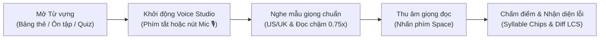
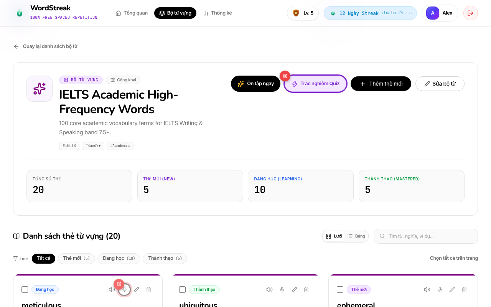
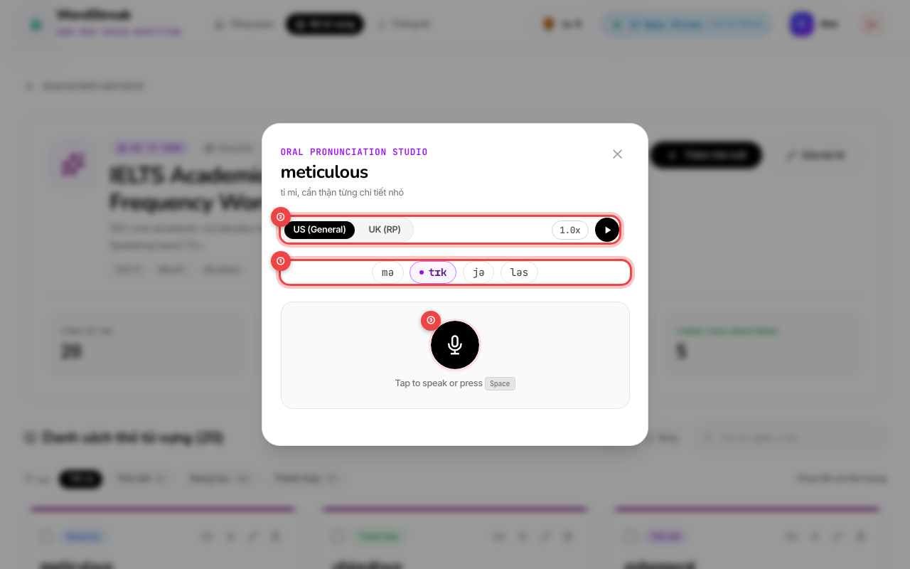
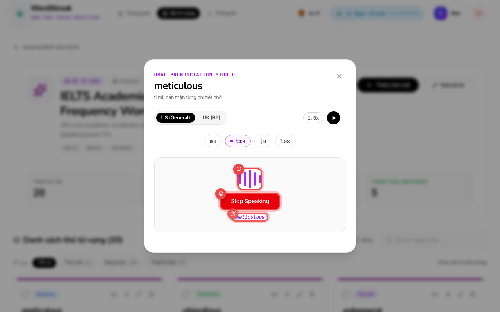
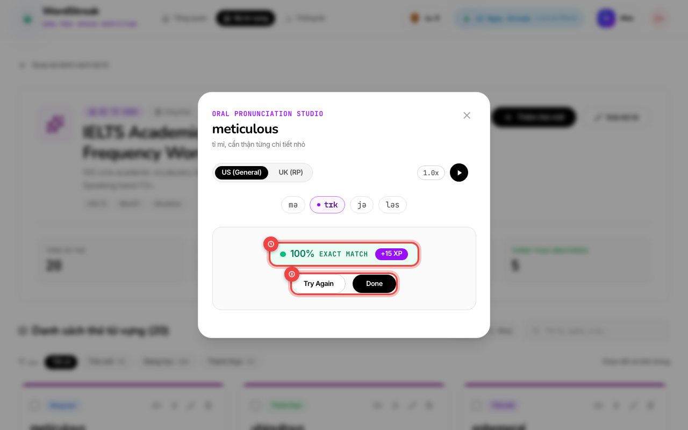
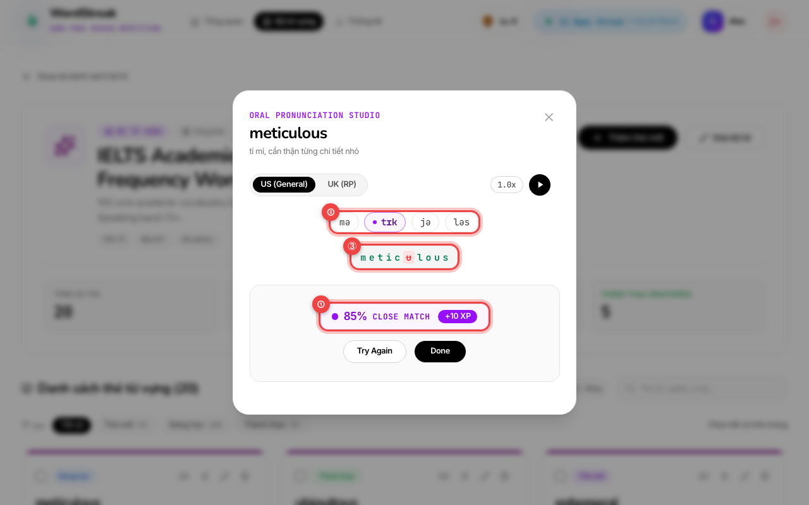
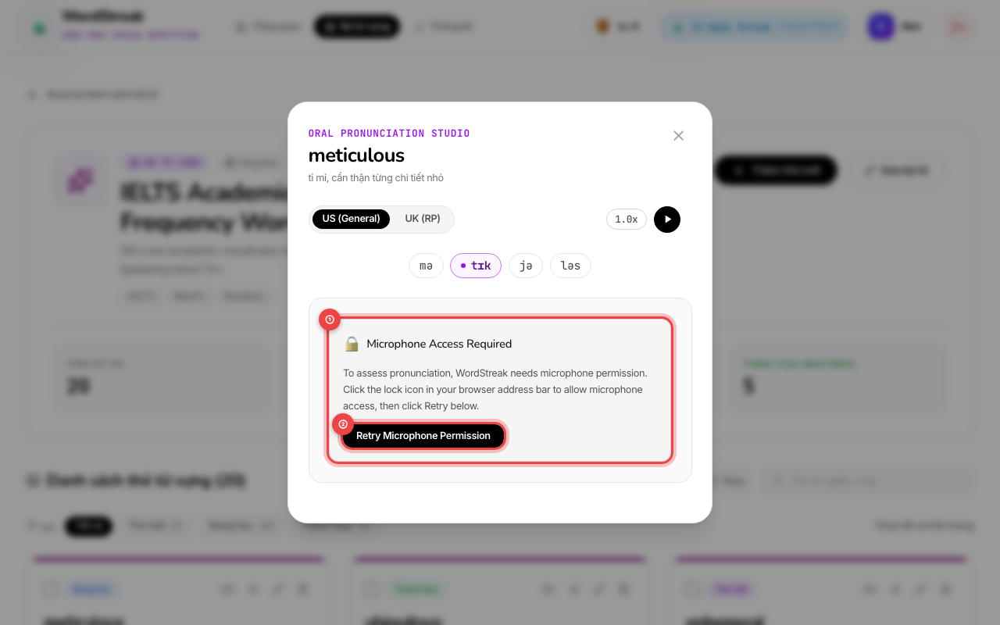

# 🎙️ Hướng Dẫn Sử Dụng: Luyện Phát Âm & Nhận Diện Giọng Nói (Speech Recognition & Pronunciation Studio)

> Cập nhật lần cuối: 2026-08-21 • Tính năng: Oral Pronunciation Assessment & Voice Studio (`US-VOICE-01`)

---

## 🎯 Tính năng này giúp gì cho bạn?

Khi học từ vựng tiếng Anh, nhiều người học thường gặp tình trạng **"biết mặt chữ, hiểu nghĩa nhưng phát âm ngập ngừng hoặc sai trọng âm"**.

**Phòng Thu Luyện Phát Âm (Voice Studio)** của WordStreak mang đến trải nghiệm luyện nói trực quan và tương tác thông minh ngay trong trình duyệt:

### 🌟 Lợi ích nổi bật:

- 🎙️ **Đánh giá phát âm tức thì (Real-time Speech Recognition)**: Công nghệ nhận diện giọng nói tự nhiên giúp bạn kiểm tra độ chuẩn xác của từng từ vựng mà không cần chờ đợi.
- 🎯 **Phân tầng thang điểm trực quan (3-Tier Scoring)**:
  - 🟢 **Exact Match (100% - Ngọc lục bảo)**: Phát âm chuẩn xác tuyệt đối, nhận trọn vẹn **+15 XP**.
  - 🟣 **Close Match (80% - 99% - Tím hoàng gia)**: Phát âm gần đúng, nhận **+10 XP** khích lệ.
  - 🟠 **Needs Practice (< 80% - Hổ phách)**: Nhắc nhở luyện tập lại các âm chưa chuẩn.
- 🧩 **Tách âm tiết & Trọng âm quốc tế (IPA Syllable Chips)**: Hiển thị từng âm tiết rõ ràng kèm dấu trọng âm chính (`ˈ`) và trọng âm phụ (`ˌ`). Bạn có thể nhấp vào từng âm tiết để nghe phát âm riêng lẻ!
- 🔍 **So khớp lỗi chi tiết (Character Diff Visualizer)**: Hiển thị trực quan từng ký tự phát âm đúng (xanh lá), âm bị thiếu (gạch đỏ) hoặc phát âm sai (nền đỏ).
- 🌐 **Lựa chọn chất giọng bản xứ & Chế độ đọc chậm**: Dễ dàng chuyển đổi giữa **US (General American)** và **UK (British RP)**, cùng nút bật phát âm chậm **0.75x Slow Playback** giữ nguyên cao độ âm thanh.
- ⌨️ **Hỗ trợ phím tắt 100% không cần chạm chuột**: Dùng phím `Space` để thu âm/dừng, phím `R` để nghe lại, phím `S` để đổi tốc độ, và phím `Escape` để đóng cửa sổ.

---

## 📖 Hướng Dẫn Từng Bước (Kèm Ảnh Chụp Màn Hình Thực Tế)

### Bước 1: Khởi động Phòng thu Voice Studio

Bạn có thể mở cửa sổ **Voice Studio** từ 3 vị trí thuận tiện trong WordStreak:

1. **Từ Bảng Thẻ Từ Vựng / Danh sách Thẻ (`/decks/:id`)**:
   - **① Biểu tượng Micro (🎙️)**: Nhấp vào biểu tượng micro tròn ở cột thao tác bên cạnh mỗi từ vựng để mở ngay Voice Studio cho từ đó.
2. **Từ Thanh Công Cụ Luyện Tập**:
   - **② Nút "Trắc nghiệm Quiz" (⚡)**: Mở hộp thoại thiết lập bài trắc nghiệm và chọn tab **Luyện phát âm (Pronunciation)**.
3. **Từ Phiên Ôn Tập Thẻ Ghi Nhớ (Flashcard Spaced Repetition)**:
   - Trong lúc lật thẻ ôn tập (`/reviews/session`), nhấp vào nút **Luyện phát âm** bên dưới thẻ để luyện nói ngay trước khi chấm điểm ghi nhớ.

---

### Bước 2: Khám phá Giao diện Voice Studio & Nghe Phát Âm Mẫu

Khi cửa sổ popup **Oral Pronunciation Studio** hiện ra, bạn sẽ thấy đầy đủ công cụ hỗ trợ phát âm trước khi bắt đầu thu âm:

- **① Các Thẻ Âm Tiết Tương Tác (Phonetic Syllable Chips)**:
  - Phiên âm chuẩn IPA được chia nhỏ thành từng âm tiết độc lập (ví dụ: `mə`, `ˈtɪk`, `jə`, `ləs`).
  - Dấu chấm tím tròn thể hiện **Trọng âm chính (Primary Stress `ˈ`)** — âm tiết cần đọc to, rõ và cao giọng hơn.
  - Dấu chấm xám thể hiện **Trọng âm phụ (Secondary Stress `ˌ`)**.
  - _Mẹo nhỏ_: Bạn có thể nhấp chuột trực tiếp vào bất kỳ thẻ âm tiết nào để nghe máy đọc riêng âm tiết đó!
- **② Bộ Chọn Giọng Đọc & Tốc Độ Phát Âm (Accent & Speed Controls)**:
  - **US (General)**: Giọng tiếng Anh - Mỹ chuẩn phổ thông.
  - **UK (RP)**: Giọng tiếng Anh - Anh chuẩn Received Pronunciation.
  - **Nút `0.75x (Slow)`** (hoặc phím tắt **`S`**): Giảm tốc độ phát âm còn 75% nhưng giữ nguyên cao độ tự nhiên, giúp bạn nghe rõ từng âm đuôi (ending sounds) khó.
  - **Nút Play Audio (▶)** (hoặc phím tắt **`R`**): Nhấp để nghe lại phát âm mẫu chuẩn bản xứ.
- **③ Nút Thu Âm Giọng Nói (Microphone Recording Button)**:
  - Nút tròn màu đen lớn ở giữa màn hình. Bạn có thể **nhấp chuột vào nút** hoặc nhấn phím **`Space`** trên bàn phím để bắt đầu thu âm.

---

### Bước 3: Thu Âm & Quan Sát Sóng Âm Trực Tiếp

Sau khi bấm thu âm, trình duyệt sẽ lắng nghe giọng nói của bạn:

- **① Sóng Âm Động Trực Quan (Live Acoustic Soundwave)**:
  - 5 cột sóng âm màu tím sẽ dao động lên xuống theo âm lượng giọng nói thực tế của bạn.
  - Nếu sóng âm không dao động, hãy kiểm tra lại microphone hoặc tăng âm lượng thu âm trên máy tính.
- **② Nút Dừng Thu Âm ("Stop Speaking")**:
  - Nhấp vào nút màu đỏ (hoặc nhấn phím **`Space`**) ngay sau khi bạn nói xong từ vựng.
  - _Tự động nhận diện_: Hệ thống cũng có bộ đếm tự động dừng sau 2.5 giây nếu bạn giữ im lặng.
- **③ Văn Bản Nhận Diện Tạm Thời (Live Interim Transcript)**:
  - Hiển thị dòng chữ tím nhấp nháy mô phỏng những gì hệ thống vừa nghe được từ bạn.

---

### Bước 4: Nhận Kết Quả Phát Âm Chuẩn Tuyệt Đối (Exact Match 100%)

Nếu bạn phát âm chính xác và chuẩn ngữ điệu:

- **① Huy Hiệu Thang Điểm Tuyệt Đối (Emerald Badge 100%)**:
  - Viền xanh ngọc lục bảo rực rỡ với nhãn **Exact Match 100%**.
  - Tặng ngay **+15 XP** kinh nghiệm vào hồ sơ học tập của bạn!
  - Âm thanh hợp âm Chime du dương vang lên khích lệ sự chuẩn xác của bạn.
- **② Các Nút Thao Tác Tiếp Theo**:
  - **Try Again**: Thử nói lại từ vựng để nâng cao sự tự tin.
  - **Done** (hoặc nhấn **`Escape`**): Đóng cửa sổ và tiếp tục hành trình học tập.

---

### Bước 5: Xem Chi Tiết Lỗi Phát Âm & So Khớp Ký Tự (Close Match 80-99%)

Khi phát âm gần đúng hoặc bạn lỡ nuốt âm/đọc thiếu phụ âm:

- **① Huy Hiệu Gần Đúng (Violet Badge 80% - 99%)**:
  - Viền tím hoàng gia với nhãn **Close Match**. Bạn vẫn nhận được **+10 XP** cho nỗ lực nói tốt!
- **② Hướng Dẫn Âm Tiết (Syllable Breakdown)**:
  - Quan sát lại các âm tiết có dấu trọng âm để điều chỉnh độ nhấn nhá trong hơi thở.
- **③ Khung So Khớp Ký Tự (Character Accuracy Diff)**:
  - 🟢 **Màu xanh lá**: Các âm và chữ cái bạn đã phát âm chuẩn xác (ví dụ: `m`, `e`, `t`, `i`, `c`).
  - 🔴 **Gạch ngang màu đỏ**: Ký tự/âm bị phát âm thiếu hoặc bỏ quên (ví dụ: âm `u` bị nuốt mất).
  - 🟡 **Màu vàng hổ phách**: Ký tự phát âm dư thừa hoặc nhầm sang từ khác.

> [!TIP]
> **Bí quyết luyện tập:** Nhìn vào các chữ cái bị gạch đỏ, nhấp vào thẻ âm tiết tương ứng ở trên để nghe lại âm đó, sau đó nhấn **Try Again** (hoặc phím **`Space`**) để đọc lại một lần nữa!

---

### Bước 6: Khắc Phục Lỗi Cấp Quyền Microphone

Nếu trình duyệt chưa được cấp quyền truy cập Microphone:

- **① Biểu Ngữ Cảnh Báo Quyền Truy Cập (Microphone Access Required)**:
  - Hệ thống sẽ hiển thị biểu tượng ổ khóa 🔒 cùng hướng dẫn từng bước rõ ràng.
- **② Nút "Retry Microphone Permission"**:
  - Sau khi mở quyền trong cài đặt trình duyệt, chỉ cần nhấp vào nút này để kích hoạt lại mà không cần tải lại trang web.

---

## ⌨️ Bảng Tra Cứu Phím Tắt Tiện Lợi (Keyboard Shortcuts)

Để tối ưu hóa tốc độ luyện tập mà không cần rời tay khỏi bàn phím:

| Phím tắt                | Thao tác thực hiện                 | Mô tả chi tiết                                                       |
| :---------------------- | :--------------------------------- | :------------------------------------------------------------------- |
| **`Space`** (Phím Cách) | **Bắt đầu / Dừng thu âm**          | Nhấn lần 1 để mở mic, nhấn lần 2 để kết thúc thu âm và xem điểm      |
| **`R`**                 | **Phát lại âm thanh mẫu (Replay)** | Nghe lại phát âm chuẩn bản xứ của từ vựng hiện tại                   |
| **`S`**                 | **Chuyển tốc độ đọc (Speed)**      | Chuyển đổi qua lại giữa tốc độ chuẩn `1.0x` và đọc chậm `0.75x Slow` |
| **`Escape`**            | **Đóng Voice Studio**              | Đóng popup và quay lại màn hình học trước đó                         |
| **`Tab` / `Shift+Tab`** | **Điều hướng bàn phím**            | Di chuyển tiêu điểm an toàn giữa các nút và thẻ âm tiết              |

---

## ❓ Câu Hỏi Thường Gặp & Xử Lý Sự Cố (Troubleshooting FAQ)

### 1. Trình duyệt Google Chrome báo "Microphone permission denied", tôi phải làm sao?

> **Cách xử lý trên Chrome / Microsoft Edge:**
>
> 1. Nhấp vào biểu tượng **Ổ khóa (🔒)** hoặc biểu tượng **Cài đặt trang web** nằm ở bên trái thanh địa chỉ URL của trình duyệt (`wordstreak.app` hoặc `localhost`).
> 2. Tìm mục **Microphone (Micro)** và chuyển từ _Block (Chặn)_ sang _Allow (Cho phép)_.
> 3. Quay lại trang WordStreak và nhấp vào nút **Retry Microphone Permission**.

---

### 2. Trình duyệt Apple Safari trên macOS / iOS không nhận giọng nói?

> **Cách xử lý trên Safari:**
>
> 1. Mở menu **Safari** ở thanh công cụ góc trên bên trái màn hình > chọn **Settings for This Website... (Cài đặt cho trang web này...)**.
> 2. Ở dòng **Microphone**, chọn **Allow (Cho phép)**.
> 3. Trên iPhone / iPad: Mở **Cài đặt hệ thống (Settings)** > **Safari** > **Microphone** > chọn **Hỏi hoặc Cho phép**.

---

### 3. Tôi đang ở môi trường có tiếng ồn xung quanh thì nên luyện nói thế nào?

> **Mẹo thu âm trong môi trường nhiều tạp âm:**
>
> - Sử dụng tai nghe có micro tích hợp (như tai nghe điện thoại hoặc tai nghe chống ồn) để hướng mic sát vào khẩu hình miệng.
> - Nói rõ ràng, dứt khoát với âm lượng vừa phải, tránh thì thầm.
> - Sau khi phát âm xong từ vựng, nhấn ngay nút **Stop Speaking** (hoặc phím **`Space`**) để hệ thống đóng cổng thu âm và không thu lẫn tiếng ồn bên ngoài.

---

### 4. Tôi có bị giới hạn số lần thu âm hay bị trừ điểm khi đọc sai không?

> **Không!** WordStreak khuyến khích bạn thử thách và luyện nói không giới hạn.
>
> - Bạn có thể bấm **Try Again** bao nhiêu lần tùy thích cho đến khi đạt điểm 100%.
> - Điểm kinh nghiệm XP chỉ được cộng thưởng khi bạn hoàn thành bài, hoàn toàn không có cơ chế trừ điểm khi phát âm chưa chuẩn!
