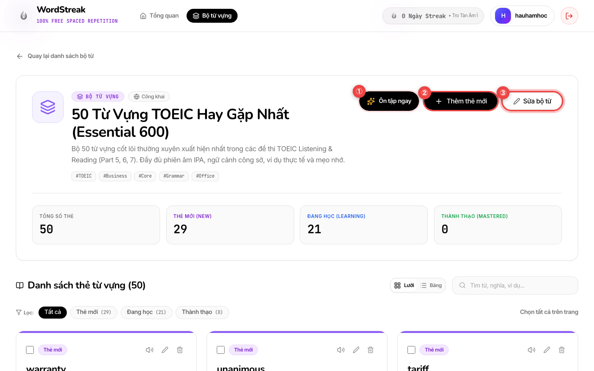
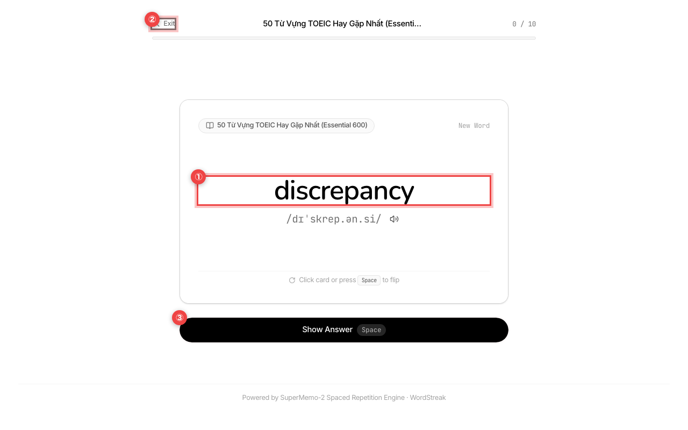
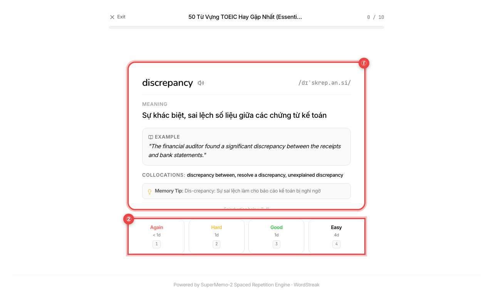
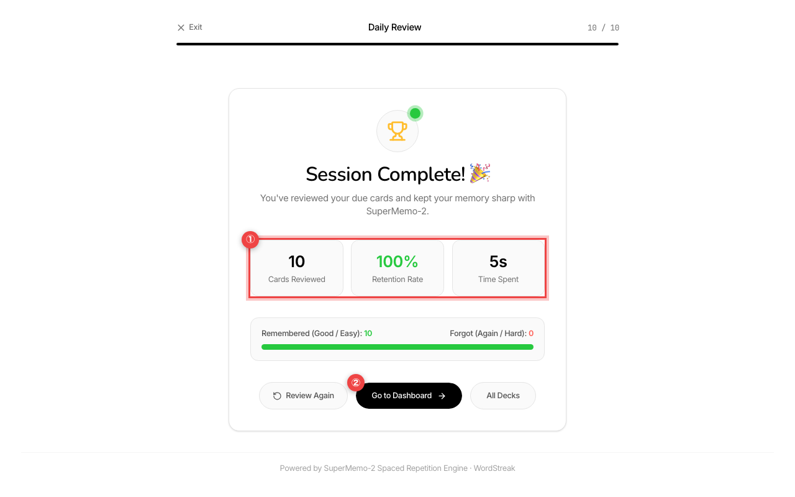

# Hướng dẫn Sử dụng: Ôn tập Từ vựng Thông minh (SuperMemo-2 SRS Review)

> Cập nhật lần cuối: 2026-08-20

## Tính năng này giúp gì cho bạn?

Khi học từ mới, chúng ta thường quên tới 70% sau vài ngày nếu không được nhắc lại đúng lúc. Thuật toán **Spaced Repetition (Lặp lại ngắt quãng SM-2)** tính toán chính xác thời điểm não bộ sắp quên để đưa từ đó vào danh sách ôn tập.

Tính năng **Ôn tập Thông minh (SRS Review)** giúp bạn:

- Tự động ưu tiên các từ đến hạn ôn tập trước khi chúng bị lãng quên.
- Giao diện **Lật thẻ Flashcard 3D** mượt mà, tối giản, tập trung tối đa vào việc nhớ từ.
- Thao tác siêu tốc bằng **Phím tắt bàn phím**: Dùng phím `Space` để lật mặt sau, phím `1`, `2`, `3`, `4` để tự đánh giá mức độ nhớ, và phím `R` để nghe phát âm.
- Cơ chế lặp lại ngay trong phiên đối với những từ bạn đánh giá **"Again" (Chưa nhớ)** cho đến khi bạn thuộc lòng.
- Bảng tổng kết kết quả phiên học hiển thị tỉ lệ ghi nhớ, số từ đã ôn và thời gian học tập.

---

## Hướng dẫn từng bước

### Bước 1: Bắt đầu Phiên Ôn tập từ Bộ từ vựng

- **① Nút "Ôn tập ngay" (Màu đen có biểu tượng sao vàng)**: Bấm nút này (khoanh đỏ ①) ở góc phải tiêu đề bộ từ để vào ngay phòng ôn tập flashcard với toàn bộ các từ đang đến hạn hoặc từ mới trong bộ từ.
- **② Nút "Thêm thẻ mới"**: Nằm cạnh nút ôn tập (khoanh đỏ ②), dùng khi bạn muốn bổ sung thêm từ vựng mới vào bộ từ.
- **③ Nút "Sửa bộ từ"**: Dùng để chỉnh sửa tên, mô tả hoặc biểu tượng của bộ từ (khoanh đỏ ③).

---

### Bước 2: Xem Mặt trước Thẻ Flashcard & Nghe phát âm

- **① Từ vựng tiếng Anh & Phiên âm IPA**: Hiển thị to, rõ ràng ở chính giữa màn hình (khoanh đỏ ①). Bấm biểu tượng chiếc loa 🔊 ngay bên cạnh (hoặc nhấn phím **`R`**) để nghe giọng đọc bản xứ chuẩn xác.
- **② Nút "Exit" (Thoát)**: Nằm ở góc trên bên trái thanh tiến độ (khoanh đỏ ②), cho phép bạn thoát phiên học bất kỳ lúc nào để trở về trang trước.
- **③ Nút "Show Answer" (Lật thẻ)**: Bấm nút màu đen **"Show Answer"** (khoanh đỏ ③) hoặc nhấn phím **`Space` (Phím cách)** trên bàn phím để lật thẻ sang mặt sau khi bạn đã suy nghĩ xong nghĩa.

---

### Bước 3: Xem Mặt sau & Đánh giá mức độ nhớ (4 Mức độ SM-2)

- **① Nghĩa tiếng Việt, Câu ví dụ thực tế & Mẹo nhớ**: Mặt sau (khoanh đỏ ①) hiển thị đầy đủ giải nghĩa tiếng Việt, câu ví dụ hoàn chỉnh trong ngữ cảnh công việc/TOEIC, các cụm từ đi kèm (Collocations) và mẹo ghi nhớ.
- **② 4 Nút đánh giá mức độ ghi nhớ**: Chọn 1 trong 4 nút ở dưới (khoanh đỏ ②) hoặc bấm phím số tương ứng:
  - **`1` - Again (Chưa nhớ)**: Bạn quên từ này. Thẻ sẽ được đưa về cuối hàng đợi của phiên học hôm nay để bạn ôn lại cho đến khi thuộc.
  - **`2` - Hard (Khó nhớ)**: Bạn phải mất nhiều thời gian mới nhớ ra. Hệ thống sẽ xếp lịch ôn lại vào ngày mai với tần suất ôn tập dày hơn.
  - **`3` - Good (Nhớ tốt)**: Bạn nhớ được từ sau một chút suy nghĩ. Khoảng cách ngày ôn sẽ tăng theo cấp số nhân (1 ngày $\rightarrow$ 6 ngày $\rightarrow$ vài tuần).
  - **`4` - Easy (Quá dễ)**: Bạn nhận ra ngay lập tức. Khoảng cách ôn tập sẽ tăng vọt giúp bạn tiết kiệm thời gian.

---

### Bước 4: Xem Bảng Tổng kết Phiên học (Session Complete)

- Khi hoàn thành toàn bộ thẻ cần ôn trong ngày, hệ thống sẽ hiển thị màn hình chúc mừng **Session Complete! 🎉**:
  - **① Các chỉ số thành tích**:
    - **Cards Reviewed**: Tổng số lượt thẻ bạn đã học trong phiên.
    - **Retention Rate**: Tỉ lệ phần trăm những từ bạn nhớ tốt (`Good` & `Easy`).
    - **Time Spent**: Tổng thời gian bạn đã tập trung ôn tập.
  - **② Nút hành động quay về**: Bấm nút **"Go to Dashboard"** (khoanh đỏ ②) để quay về trang chủ hoặc chọn **"Review Again"** / **"All Decks"** để tiếp tục học.

---

## 💡 Mẹo học nhanh bằng Bàn phím

| Phím tắt    | Tác dụng                                           |
| :---------- | :------------------------------------------------- |
| **`Space`** | Lật mặt trước / mặt sau của thẻ Flashcard          |
| **`1`**     | Đánh giá **Again** (Chưa nhớ - lặp lại cuối phiên) |
| **`2`**     | Đánh giá **Hard** (Khó nhớ)                        |
| **`3`**     | Đánh giá **Good** (Nhớ tốt)                        |
| **`4`**     | Đánh giá **Easy** (Quá dễ)                         |
| **`R`**     | Nghe phát âm từ vựng bản xứ                        |
| **`Esc`**   | Thoát phiên ôn tập về trang trước                  |

---

## ❓ Câu hỏi thường gặp (FAQ)

- **Hỏi: Thẻ tôi đánh giá "Again" sẽ đi đâu?**  
  **Đáp:** Thẻ đó sẽ được tự động xếp vào cuối phiên học hiện tại để bạn ôn lại ngay lập tức cho đến khi nhớ. Sau đó, thuật toán SM-2 sẽ đặt lịch để bạn ôn lại vào ngày mai.

- **Hỏi: Tôi có thể ôn tập toàn bộ từ cùng lúc mà không cần vào từng bộ từ không?**  
  **Đáp:** Có! Trên màn hình chính **Dashboard**, chỉ cần bấm nút **"Start Review"** tại biểu ngữ Ngọn lửa Streak. Hệ thống sẽ tự động tổng hợp tất cả các thẻ đến hạn từ mọi bộ từ của bạn thành một phiên học duy nhất.
