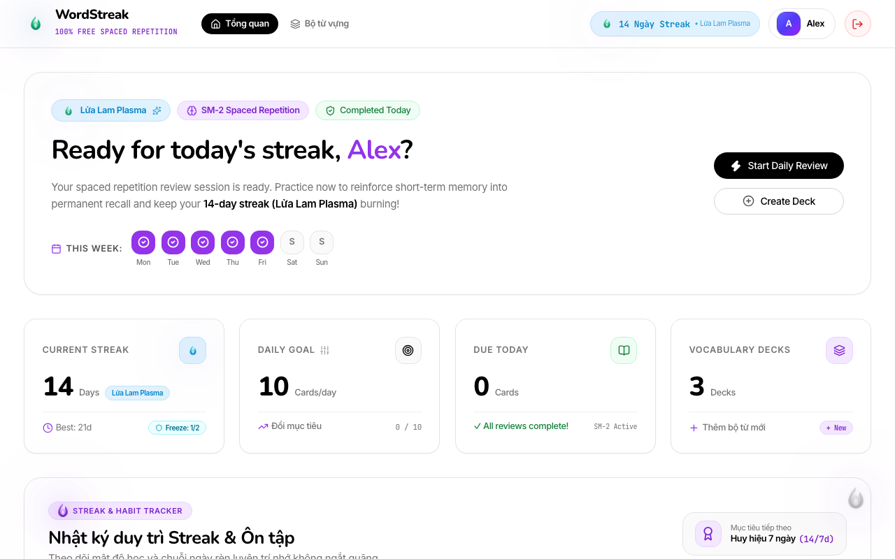
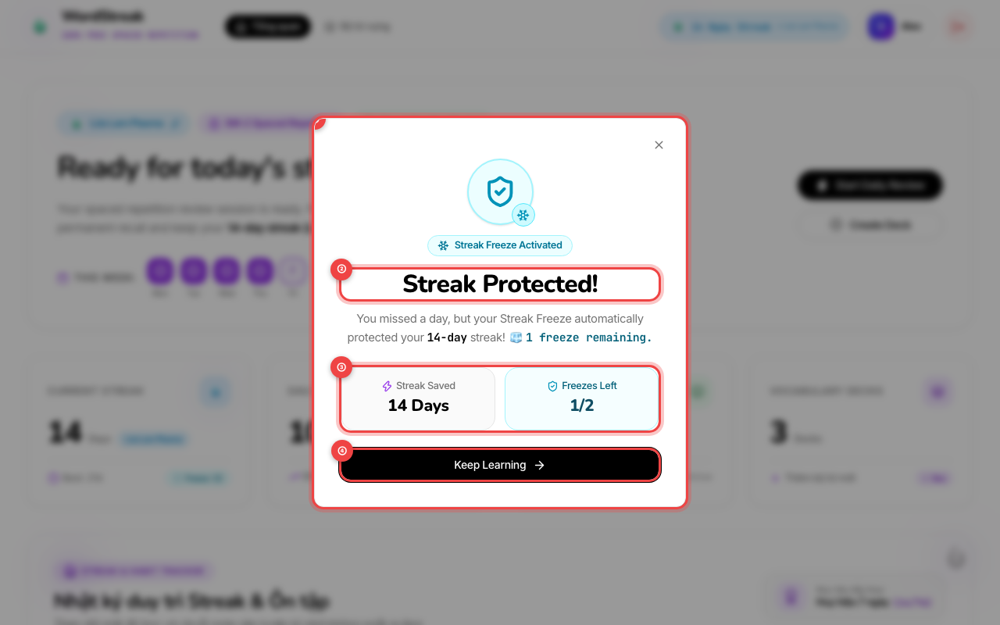
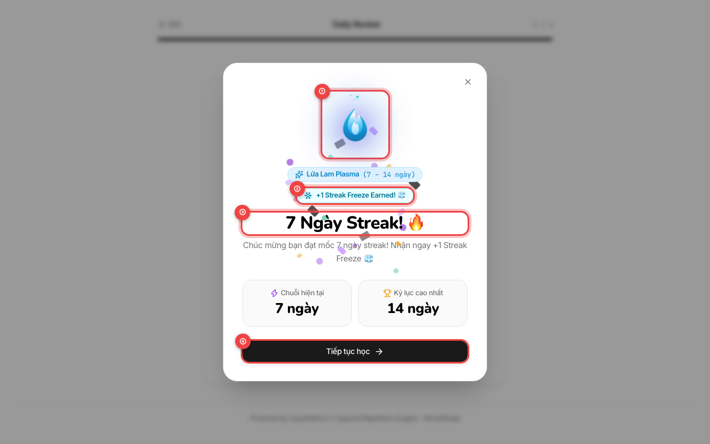

# 🧊 Streak Freeze: Bảo vệ chuỗi ngày học của bạn

> **Đối tượng người dùng:** Người học WordStreak (Miễn phí trọn đời)  
> **Tính năng:** Khiên Đóng Băng Chuỗi Ngày Học (Streak Freeze Protection - US-GAME-02)  
> **Phiên bản:** 1.0.0  
> **Cập nhật lần cuối:** 2026-08-21

---

## 🎯 1. Giới thiệu Streak Freeze là gì và cơ chế hoạt động tự động

Trong hành trình xây dựng thói quen học từ vựng tiếng Anh mỗi ngày, sẽ có những ngày bạn gặp sự cố bất khả kháng: đi công tác, lịch trình bận rộn, mất kết nối internet, hoặc đơn giản là một ngày mệt mỏi quên mở ứng dụng.

Trước đây, việc bỏ lỡ một ngày có thể khiến chuỗi ngày học tập chăm chỉ (Streak) bị quay về 0, dễ gây cảm giác hụt hẫng và nản lòng.

**Streak Freeze (Khiên Đóng Băng)** ra đời như một vị cứu tinh bảo vệ thành quả của bạn:

- **Tự động kích hoạt (Auto-Protection):** Bạn không cần phải nhớ bấm nút "kích hoạt" trước khi đi ngủ hay làm thêm bất kỳ thao tác phức tạp nào. Hệ thống sẽ tự động phát hiện ngày bạn vắng mặt và bung khiên bảo vệ chuỗi ngay khi cần thiết.
- **Bảo toàn ngọn lửa nguyên vẹn:** Chuỗi ngày liên tiếp và cấp bậc ngọn lửa (Flame Mascot) của bạn được giữ nguyên trạng thái tốt nhất.
- **Có sẵn ngay từ ngày đầu:** Mỗi tài khoản WordStreak khi tạo mới đều được tặng sẵn **1 lượt Streak Freeze miễn phí** để bạn yên tâm bắt đầu hành trình.
- **Sức chứa tối đa:** Bạn có thể tích lũy tối đa **2 lượt khiên đóng băng** cùng lúc (`2/2 🧊`).

---

## 🔍 2. Cách xem số lượng khiên đóng băng còn lại trên Bảng điều khiển (Badge 🧊)

Bạn có thể dễ dàng kiểm tra số lượng khiên đóng băng khả dụng của mình ngay trên Bảng điều khiển (Dashboard):


- `①` **Khung Thống Kê Chuỗi Ngày (Streak Status):** Hiển thị số ngày học liên tiếp hiện tại (ví dụ: _14 Days_) cùng biểu tượng ngọn lửa linh vật đại diện cho cấp độ của bạn.
- `②` **Huy Hiệu Khiên Đóng Băng (Frost Shield Badge):** Nằm ở góc dưới bên phải thẻ trạng thái với biểu tượng chiếc khiên và bông tuyết băng giá kèm tỉ lệ `1/2 🧊` (hoặc `2/2 🧊`, `0/2 🧊`). Con số này cho bạn biết chính xác mình còn bao nhiêu lượt cứu chuỗi dự phòng.

---

### Xem nhanh hướng dẫn quy tắc bảo vệ qua gợi ý (Tooltip)

Khi bạn rê chuột (hover) hoặc chạm vào huy hiệu `1/2 🧊`, một hộp thoại hướng dẫn nhanh sẽ hiện ra:



- `①` **Hộp giải thích trực quan:** Nhắc nhở bạn: _"Streak Freeze: Tự động bảo vệ chuỗi ngày nếu bạn quên học 1 ngày. Tối đa lưu trữ 2 khiên đóng băng."_

---

## 🛡️ 3. Cơ chế tự động cứu chuỗi khi quên học 1 ngày

Khi cuộc sống bận rộn khiến bạn không thể hoàn thành bài học trước 23:59:

```
[Ngày hôm kia: Học tốt 🔥] ➔ [Hôm qua: Quên học ❌] ➔ [Hôm nay: Mở ứng dụng 🧊 Chuỗi được cứu!]
```

1. **Nhận diện tự động:** Khi bạn quay trở lại WordStreak vào ngày hôm sau, hệ thống kiểm tra và phát hiện ngày hôm qua chưa có hoạt động học tập.
2. **Kích hoạt khiên đóng băng:** Nếu bạn còn ít nhất 1 lượt Freeze, hệ thống sẽ tự động tiêu thụ 1 khiên đóng băng để "đóng băng" ngày bị lỡ.
3. **Giữ nguyên chuỗi:** Chuỗi ngày của bạn hoàn toàn không bị đứt đoạn, cấp bậc ngọn lửa tiếp tục cháy rực rỡ và số khiên sẽ giảm đi 1 lượt (ví dụ từ `2/2 🧊` xuống `1/2 🧊`).
4. **Nếu bỏ lỡ 2 ngày liên tiếp:** Nếu bạn sở hữu đủ 2 khiên (`2/2 🧊`), hệ thống sẽ tiêu thụ cả 2 khiên để bảo vệ chuỗi trọn vẹn suốt 48 giờ vắng mặt!

> [!NOTE]
> Nếu bạn vắng mặt nhiều ngày liên tiếp vượt quá số lượng khiên hiện có (ví dụ nghỉ 3 ngày mà chỉ có 1 khiên), chuỗi sẽ được đặt lại về ngày bắt đầu để đảm bảo tính công bằng và giúp bạn xây dựng lại thói quen mới từ đầu mà không làm mất số khiên của bạn vô ích.

---

## 🎉 4. Thông báo chúc mừng khi chuỗi được bảo vệ (Streak Protected Modal)

Ngay khi bạn mở lại WordStreak sau ngày bị bỏ lỡ, một cửa sổ thông báo đặc biệt sẽ xuất hiện để chào mừng bạn quay trở lại:



- `①` **Biểu Tượng Khiên Băng Quyền Năng:** Chiếc khiên phát sáng xanh lục bảo với bông tuyết xoay động, biểu thị chuỗi học tập đã được giải cứu thành công.
- `②` **Thông Điệp Chuỗi An Toàn:** Giải thích chi tiết rằng dù bạn đã lỡ 1 ngày hôm qua, khiên đóng băng đã kích hoạt kịp thời để giữ vững chuỗi ngày.
- `③` **Bảng Thống Kê Nhanh:**
  - **Streak Saved:** Số ngày chuỗi vừa được cứu (ví dụ: _14 Days_).
  - **Freezes Left:** Số lượng khiên đóng băng còn lại trong kho dự trữ của bạn (ví dụ: _1/2_).
- `④` **Nút Tiếp Tục Học (Keep Learning):** Nhấn phím `Enter`, `Escape` hoặc nhấp chuột vào nút **Keep Learning** để bắt đầu ngay phiên ôn tập thẻ hôm nay và thắp sáng ngọn lửa!

---

## 🎁 5. Cách tích lũy thêm Streak Freeze

Làm thế nào để nạp đầy lại kho khiên băng (`2/2 🧊`) sau khi đã sử dụng? WordStreak mang đến các cách hoàn toàn miễn phí thông qua chính sự kiên trì học tập của bạn:



### 1. Thưởng Mốc Kiên Trì 7 Ngày (7-Day Milestone)

Khi bạn duy trì chuỗi học tập liên tục đạt mốc **7 ngày**, màn hình vinh danh ngọn lửa sẽ nổ pháo hoa hạt giấy rực rỡ và tự động trao tặng thêm **+1 Streak Freeze** `②` vào kho của bạn (nếu kho chưa đầy 2/2).

### 2. Thưởng Mốc Kiên Trì 30 Ngày (30-Day Milestone)

Chinh phục cột mốc vàng **30 ngày liên tục**, bạn sẽ nhận thêm **+1 Streak Freeze** cùng cấp bậc linh vật tối thượng _Cosmic Nova_!

### 3. Tự Động Nạp Định Kỳ (Monthly Free Refill)

Nếu chẳng may bạn dùng hết khiên và bị đứt chuỗi, đừng lo lắng! Hệ thống luôn duy trì tặng sẵn 1 lượt đóng băng khởi đầu cho mỗi chuỗi học tập mới để bạn không bao giờ cảm thấy đơn độc.

---

## 💡 6. Mẹo duy trì chuỗi học tập bền vững

Để giữ chuỗi ngày luôn dài vô tận và kho khiên luôn đầy ắp `2/2 🧊`, hãy áp dụng những bí quyết học tập sau:

> [!TIP]
> **1. Quy tắc 2 phút "Micro-learning" mỗi sáng:**  
> Đừng đợi đến cuối ngày khi đã mệt nhoài. Hãy dành 2 phút ngay khi thức dậy để lướt qua 5–10 thẻ Flashcard nhanh. Ngay khi hoàn thành thẻ đầu tiên, chuỗi ngày của bạn đã được bảo đảm 100% an toàn cho cả ngày hôm đó!

> [!TIP]
> **2. Luôn giữ "kho dự phòng" ở mức 2/2:**  
> Hãy xem 2 chiếc khiên đóng băng như bảo hiểm an tâm cho những chuyến du lịch hoặc kỳ thi đột xuất. Cố gắng đạt mốc 7 ngày sớm nhất để nạp đầy 2 khiên.

> [!TIP]
> **3. Tận dụng tiện ích Luyện Trắc Nghiệm (Quiz):**  
> Nếu cảm thấy phiên ôn tập SM-2 hôm nay dài, bạn có thể chuyển sang làm một bài **Quiz Trắc nghiệm 5 câu** hoặc **Điền từ vào câu** để vừa đổi gió vui vẻ vừa ghi nhận ngày học thành công.

> [!TIP]
> **4. Tự động nhận diện múi giờ:**  
> Dù bạn đi du lịch hay công tác nước ngoài, WordStreak tự động căn chỉnh theo giờ trên thiết bị của bạn. Không cần cài đặt lại tài khoản hay lo lắng việc lệch múi giờ quốc tế.

---

## ❓ Câu hỏi Thường Gặp (FAQ)

- **Hỏi: Tôi có cần bấm nút nào để bật khiên đóng băng trước khi đi ngủ không?**  
  **Đáp:** Không! Cơ chế Streak Freeze trong WordStreak là **hoàn toàn tự động (100% Auto-Shield)**. Bạn chỉ cần tập trung học tập, hệ thống sẽ tự lo phần bảo vệ.

- **Hỏi: Nếu tôi còn 2 khiên và quên học 2 ngày liên tiếp thì chuỗi có mất không?**  
  **Đáp:** Không hề! Hệ thống sẽ tự động dùng 2 khiên cho 2 ngày đó. Đến ngày thứ 3 bạn vào học thì chuỗi vẫn được giữ nguyên vẹn.

- **Hỏi: Tôi có thể mua thêm khiên đóng băng bằng tiền thật không?**  
  **Đáp:** Tuyệt đối không. WordStreak là ứng dụng học từ vựng **100% Miễn phí trọn đời**, không bán tính năng bằng tiền thật. Cách duy nhất để nhận khiên là thông qua nỗ lực học tập kiên trì của chính bạn!
