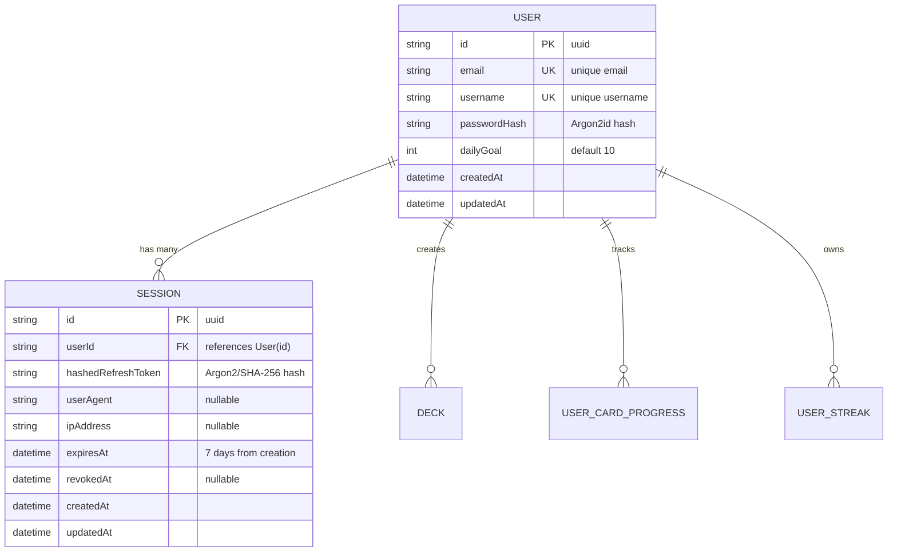
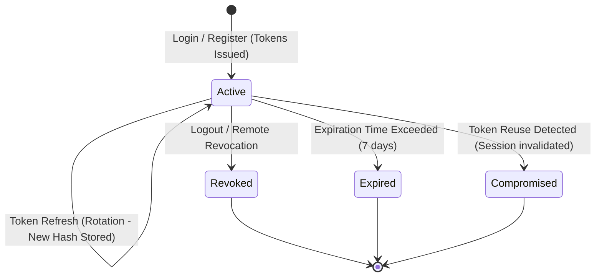

# Data Model: User Authentication and Multi-Session Management

**Feature**: `001-user-auth` | **Date**: 2026-08-14

## Entity Relationships

## Schema Details

### 1. User Model (`users` table)

| Field          | Type     | Attributes             | Description                           |
| -------------- | -------- | ---------------------- | ------------------------------------- |
| `id`           | String   | `@id @default(uuid())` | Unique user identifier                |
| `email`        | String   | `@unique`              | Case-insensitive unique email address |
| `username`     | String   | `@unique`              | Unique public display name            |
| `passwordHash` | String   | -                      | Secure Argon2id password hash         |
| `dailyGoal`    | Int      | `@default(10)`         | Daily target words to review          |
| `createdAt`    | DateTime | `@default(now())`      | Account creation timestamp            |
| `updatedAt`    | DateTime | `@updatedAt`           | Last modification timestamp           |

### 2. Session Model (`sessions` table)

| Field                | Type      | Attributes             | Description                                   |
| -------------------- | --------- | ---------------------- | --------------------------------------------- |
| `id`                 | String    | `@id @default(uuid())` | Unique session identifier                     |
| `userId`             | String    | `@db.Uuid`             | Foreign key referencing `User(id)`            |
| `hashedRefreshToken` | String    | -                      | Hashed token for rotation validation          |
| `userAgent`          | String?   | nullable               | Client User-Agent string                      |
| `ipAddress`          | String?   | nullable               | Client remote IP address                      |
| `expiresAt`          | DateTime  | -                      | Session expiration date                       |
| `revokedAt`          | DateTime? | nullable               | Timestamp when session was revoked/logged out |
| `createdAt`          | DateTime  | `@default(now())`      | Session creation timestamp                    |
| `updatedAt`          | DateTime  | `@updatedAt`           | Session update timestamp                      |

**Indexes**:

- `@@index([userId])` for rapid session lookups by user.
- `@@index([expiresAt])` for background expired-session cleanup.

## State Transitions

### Session Lifecycle

## Validation Rules

- **Email**: Must conform to RFC 5322 format, lowercase normalized, maximum 255 characters.
- **Username**: Alphanumeric + underscores, length between 3 and 30 characters.
- **Password**: Minimum 8 characters, maximum 100 characters, containing at least 1 uppercase letter and 1 numeric digit.
