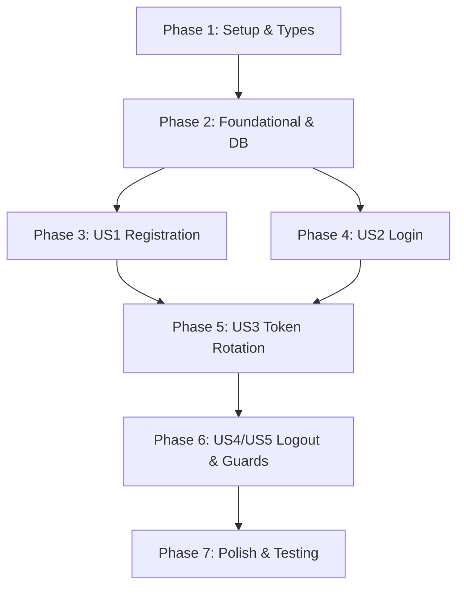

# Tasks: User Authentication and Multi-Session Management

**Input**: Design documents from `/specs/001-user-auth/`
**Prerequisites**: plan.md, spec.md, research.md, data-model.md, contracts/auth.json, quickstart.md

## Format: `- [ ] [ID] [P?] [Story] Description with file path`

- **[P]**: Can run in parallel (different files, no dependencies)
- **[Story]**: Which user story this task belongs to (US1, US2, US3, US4, US5)
- Include exact file paths in descriptions

---

## Phase 1: Setup (Shared Infrastructure & Dependencies)

**Purpose**: Dependency installation and shared contract definitions

- [x] T001 Install backend dependencies (`@nestjs/passport`, `@nestjs/jwt`, `passport`, `passport-jwt`, `argon2`, `cookie-parser`, `class-validator`, `class-transformer` and dev types) in `apps/api/package.json`
- [x] T002 Install frontend dependencies (`axios`, `zustand`, `react-hook-form`, `@hookform/resolvers`, `zod`, `lucide-react`, `react-router-dom`) in `apps/web/package.json`
- [x] T003 [P] Define shared auth interfaces, DTOs, and API responses in `packages/shared-types/src/auth.ts` and export from `packages/shared-types/src/index.ts`
- [x] T004 Build shared package via `pnpm --filter @wordstreak/shared-types build`

---

## Phase 2: Foundational (Database & Core Services)

**Purpose**: Core infrastructure that MUST be complete before user stories can be implemented

- [x] T005 Update Prisma schema with `User` modifications and `Session` model in `apps/api/prisma/schema.prisma`
- [x] T006 [P] Create PrismaService and PrismaModule in `apps/api/src/modules/prisma/prisma.service.ts` and `apps/api/src/modules/prisma/prisma.module.ts`
- [x] T007 [P] Create Argon2 password hashing utility in `apps/api/src/modules/auth/utils/password.util.ts`
- [x] T008 [P] Create UsersService and UsersModule in `apps/api/src/modules/users/users.service.ts` and `apps/api/src/modules/users/users.module.ts`
- [x] T009 Configure cookie-parser middleware and global ValidationPipe in `apps/api/src/main.ts`

**Checkpoint**: Foundation ready - Database schema, UsersService, and password utilities in place.

---

## Phase 3: User Story 1 - New User Registration (Priority: P1) 🎯 MVP

**Goal**: Enable visitors to register a new account with email, username, and password

**Independent Test**: Register a new user via API and web UI, confirming account creation in DB and automatic token issuance.

- [x] T010 [P] [US1] Create RegisterDto with class-validator rules in `apps/api/src/modules/auth/dto/register.dto.ts`
- [x] T011 [US1] Implement registration logic, password hashing, and token issuance in `apps/api/src/modules/auth/auth.service.ts`
- [x] T012 [US1] Implement POST `/auth/register` endpoint setting HttpOnly refresh cookie in `apps/api/src/modules/auth/auth.controller.ts`
- [x] T013 [P] [US1] Create accessible Button and Input UI components in `apps/web/src/components/ui/Button.tsx` and `apps/web/src/components/ui/Input.tsx`
- [x] T014 [US1] Implement RegisterForm component with Zod validation and React Hook Form in `apps/web/src/components/auth/RegisterForm.tsx`
- [x] T015 [US1] Create RegisterPage in `apps/web/src/pages/RegisterPage.tsx`

**Checkpoint**: User registration functional on both backend and frontend.

---

## Phase 4: User Story 2 - User Login & Session Persistence (Priority: P1)

**Goal**: Enable registered users to log in, persist tokens, and maintain auth state

**Independent Test**: Log in with credentials, check Zustand state updates, and verify authenticated session persistence.

- [x] T016 [P] [US2] Create LoginDto with class-validator rules in `apps/api/src/modules/auth/dto/login.dto.ts`
- [x] T017 [US2] Implement credential verification and session record generation in `apps/api/src/modules/auth/auth.service.ts`
- [x] T018 [US2] Implement POST `/auth/login` endpoint in `apps/api/src/modules/auth/auth.controller.ts`
- [x] T019 [P] [US2] Create Zustand store `useAuthStore` managing user state and access token in `apps/web/src/store/useAuthStore.ts`
- [x] T020 [US2] Implement LoginForm component with Zod validation and React Hook Form in `apps/web/src/components/auth/LoginForm.tsx`
- [x] T021 [US2] Create LoginPage in `apps/web/src/pages/LoginPage.tsx`

**Checkpoint**: Login workflow complete and verified.

---

## Phase 5: User Story 3 - Multi-Device Session Management & Token Rotation (Priority: P2)

**Goal**: Maintain independent sessions per device and rotate refresh tokens securely

**Independent Test**: Call `/auth/refresh` from client, verify new access token issued, refresh token cookie rotated, and previous token invalidated.

- [x] T022 [US3] Implement JwtStrategy extracting Bearer tokens and validating payload in `apps/api/src/modules/auth/strategies/jwt.strategy.ts`
- [x] T023 [US3] Implement token rotation, session validation, and reuse detection in `apps/api/src/modules/auth/auth.service.ts`
- [x] T024 [US3] Implement POST `/auth/refresh` endpoint in `apps/api/src/modules/auth/auth.controller.ts`
- [x] T025 [US3] Implement Axios API client with 401 refresh interceptor and promise mutex in `apps/web/src/api/axios.ts` and `apps/web/src/api/auth.api.ts`

**Checkpoint**: Multi-device token rotation and Axios auto-refresh verified.

---

## Phase 6: User Story 4 & 5 - Logout, User Profile & Route Protection (Priority: P3)

**Goal**: Safe logout session revocation, current user profile fetching, and client-side route guards

**Independent Test**: Navigate to protected dashboard while logged out (redirects to login); log out from dashboard (revokes session and clears cookie).

- [x] T026 [P] [US4] Implement session revocation in `apps/api/src/modules/auth/auth.service.ts` and POST `/auth/logout` endpoint in `apps/api/src/modules/auth/auth.controller.ts`
- [x] T027 [P] [US5] Implement GET `/auth/me` endpoint and CurrentUser decorator in `apps/api/src/modules/auth/auth.controller.ts` and `apps/api/src/common/decorators/current-user.decorator.ts`
- [x] T028 [US5] Implement ProtectedRoute wrapper component in `apps/web/src/components/auth/ProtectedRoute.tsx`
- [x] T029 [US5] Setup React Router routing with ProtectedRoute and Dashboard in `apps/web/src/App.tsx` and `apps/web/src/pages/DashboardPage.tsx`

**Checkpoint**: Full end-to-end auth loop complete with route protection.

---

## Phase 7: Polish, Quality & Automated Testing

**Purpose**: Test coverage, linting verification, and quickstart validation

- [x] T030 [P] Write unit tests for AuthService and PasswordUtil in `apps/api/src/modules/auth/auth.service.spec.ts`
- [x] T031 [P] Write unit tests for Auth API client and Zustand store in `apps/web/src/store/__tests__/useAuthStore.test.ts`
- [x] T032 Verify linting, type-checking, and build across all workspaces (`pnpm lint`, `pnpm build`)

---

## Dependencies & Execution Order

### Implementation Strategy

1. **MVP First**: Setup (Phase 1) + Foundational (Phase 2) + Registration (Phase 3) + Login (Phase 4).
2. **Incremental Polish**: Add Token Rotation (Phase 5) + Guards/Logout (Phase 6) + Tests (Phase 7).
