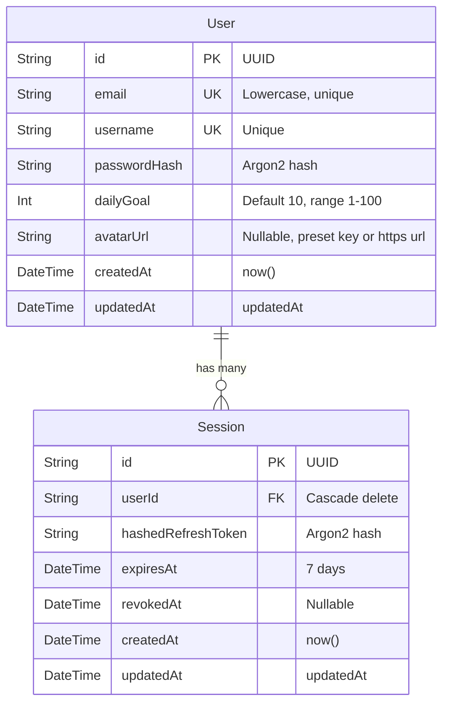

# Data Model: User Profile & Daily Goal Settings

**Feature**: `002-user-profile-settings`  
**Date**: 2026-08-17

---

## 1. Entity Definitions



---

## 2. Field Schema Detail

### `User` Table (`users`)

| Field          | Type          | Attributes             | Description                                       |
| :------------- | :------------ | :--------------------- | :------------------------------------------------ |
| `id`           | String (UUID) | `@id @default(uuid())` | Primary key                                       |
| `email`        | String        | `@unique`              | Lowercase email address                           |
| `username`     | String        | `@unique`              | Unique username                                   |
| `passwordHash` | String        |                        | Argon2 encrypted password                         |
| `dailyGoal`    | Int           | `@default(10)`         | Daily target vocabulary cards (1–100)             |
| `avatarUrl`    | String?       | Optional / Nullable    | Preset avatar id (`preset:cosmos-1`) or HTTPS URL |
| `createdAt`    | DateTime      | `@default(now())`      | Registration timestamp                            |
| `updatedAt`    | DateTime      | `@updatedAt`           | Last modification timestamp                       |

---

## 3. Data Transfer Objects (DTOs)

### `UpdateProfileDto`

```typescript
export class UpdateProfileDto {
  @IsOptional()
  @IsInt()
  @Min(1)
  @Max(100)
  dailyGoal?: number;

  @IsOptional()
  @IsString()
  @MaxLength(500)
  @Matches(/^(preset:[a-z0-9-]+|https?:\/\/.+)$/, {
    message: "avatarUrl must be a valid preset identifier or HTTP(S) URL",
  })
  avatarUrl?: string;
}
```

### `ChangePasswordDto`

```typescript
export class ChangePasswordDto {
  @IsString()
  @IsNotEmpty()
  currentPassword: string;

  @IsString()
  @MinLength(8)
  @Matches(/^(?=.*[A-Za-z])(?=.*\d).+$/, {
    message: "Password must contain at least 1 letter and 1 number",
  })
  newPassword: string;
}
```

### `UserProfileResponseDto`

```typescript
export interface UserProfileResponse {
  id: string;
  email: string;
  username: string;
  dailyGoal: number;
  avatarUrl: string | null;
  createdAt: string;
  updatedAt: string;
}
```
